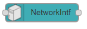
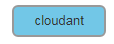
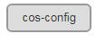
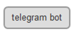
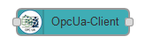

# [Node-RED українською](https://pupenasan.github.io/NodeREDGuidUKR/)

За редакцією **Олександра Пупени**

## Про репозиторій

Репозиторій створений з метою спрощення вивчення Node-RED спільнотою українських розробників, науковців та студентів. 

Для розвитку спільноти Node-RED створені групи, де Ви можете задати свої питання або пропозиції:

- [WhatsApp](https://chat.whatsapp.com/GsssUomlOVQ9eULjj4iHZv)
- [Facebook](https://www.facebook.com/groups/noderedua)
- [LinkedIn](https://www.linkedin.com/groups/9258482/)
- [Telegram](https://t.me/+Uoed3poKzclkY2Ji)

Ця сторінка зроблена на базі [репозиторію GitHub](https://github.com/pupenasan/NodeREDGuidUKR), тому ви можете також зробити коментар, створивши [Issue](https://github.com/pupenasan/NodeREDGuidUKR/issues) в репозиторії (звичайно, якщо Ви зареєстровані на GitHub). Якщо Ви не зареєстровані в системі GitHub і не вмієте ним користуватися, то можете пройти майстер-клас за [цим посиланням](https://pupenasan.github.io/Git4All/events/workshop1.html) 

## Додаткові розділи

- [Збірник задач з використанням Node-RED](exercise/README.md).  Node-RED краще не вивчати а одразу використовувати для вирішення конкретної задачі. У цьому розділі Ви можете знайти перелік задач та розв'язків з використанням Node-RED.  

- [Готові рішення](flows/README.md). У цьому розділі можна знайти певні готові рішення якихось кейсів з описом їх роботи. 
- [Статті](articles/README.md). У цьому розділі можна знайти перекладені або авторські статті в тему використання Node-RED
- [Кращі практики](bestpractices/README.md) У цьому розділі наведені паттерни і кращі практики при використанні Node-RED

## Курси

Вашій увазі пропонуються також відкриті курси з використанням Node-RED, в яких Ви можете познайомитися з різноманітними технологіями, які використовуються разом з Node-RED для вирішення різноманітних задач:

- [Програмна інженерія в системах управління](https://pupenasan.github.io/ProgIngContrSystems/)
- [Технології індустрії 4.0](https://pupenasan.github.io/TI40/)

Також є платні (онлайн та офлайн) та безкоштовні (онлайн) [курси](courses/README.md) за різними програмами. 

## Довідник з Node-RED

### Зміст

1. [Загальні основи користування Node-RED та основні компоненти](base/README.md)  

2. [Розширення](extention/README.md)  

3. [Dashboard (node-red-dashboard) та сумісні з ним вузли](Dashboard/README.md)  

4. [Вбудовані вузли для роботи з файлами](files/README.md)  

5. [Базові операції з файлами: бібліотека fs-ops](fs_ops/README.md)  

6. [Бібліотека MODBUS](modbus/README.md) 

7. [Бібліотека MQTT](mqtt/README.md)  

8. [Бібліотека HTTP](http/README.md)  

9. [Бібліотека WebSocket](websocket/README.md)  

10. [Бібліотека PARSING](parsing/README.md)  

11. [Робота з JSONata](jsonata/README.md)  

12. [Бібліотека Storage Cloudant](storage_cloudant/README.md)  

13. [Бібліотека Storage COS (node-red-contrib-cos)](storage_cos/README.md)  

14. [Робота з Watson IoT Device/Gateway (node-red-contrib-ibm-watson-iot)](watson_iot_device_gateway/README.md)  

15. [Бібліотека IBM IoT APP (node-red-contrib-scx-ibmiotapp)](ibm_iot_app/README.md)  

16. [Бібліотека OPC UA (node-red-contrib-opcua)](opcua/README.md)  

17. [Робота з Базами даних SQL](dbase/README.md)  

18. [Робота з ОС](systems/README.md)  

19. [Взаємодія з сервісами Google](google/README.md)  

20. [Боти](bots/README.md)  

21. [TCP та UDP](tcp/README.md)

22. [Протоколи S7](s7/README.md)

23. [InfluxDB](influx/README.md)

24. [uibuilder - альтернатива Dashboard](uibuilder/README.md)

25. [FTP](ftp/README.md)

У полі примітка вказується дата останньої редакції розділу довідника, або "to do" - для відсутнього опису. 

### Стандартна комплектація

#### Загальні (common)

|          Вузол          | Призначення                                                  | Примітка |
| :---------------------: | ------------------------------------------------------------ | -------- |
|    | [Inject](base/1_4_1.md#inject-ініціювання-повідомлення) для ініціювання потоку (відправки повідомлення) користувачем, автоматично при запуску, періодично або за розкладом. | 07.2020  |
|     | [Debug](base/1_4_1.md#debug-вивести-на-відлагодження) використовуватися для відображення повідомлень на бічній панелі Debug у редакторі. | 07.2020  |
|  | [Complete](base/1_4_1.md#complete) запускає потік, коли інший вузол завершує оброблення повідомлення. | 07.2020  |
|     | [Catch](base/1_4_1.md#catch-обробник-помилок) ловить помилки виконання інших вузлів у тому самому потоці (вкладці) і формує повідомлення з інформацією про них. | 07.2020  |
|    | [Status](base/1_4_1.md#status-стан-вузлу) показує стан (status message) вказаних або усіх вузлів в потоці. | 07.2020  |
|   | [Link in](base/1_4_1.md#link-in-та-link-out-посилання) вхідне з'єднання з іншого потоку | 07.2020  |
|  | [Link out](base/1_4_1.md#link-in-та-link-out-посилання) вихідне з'єднання до іншого потоку | 07.2020  |
|   | [Comment](base/1_4_1.md#comment) для добавлення коментарів в потік. | 07.2020  |
|   | [Unknown](base/1_4_1.md#unknown-невідомий) вузол невідомого типу для встановленого Node-RED | 07.2020  |

#### Функціональні (function)

| Вузол                   | Призначення                                                  | Примітка |
| ----------------------- | ------------------------------------------------------------ | -------- |
|  | [Function](base/1_5.md) дозволяє виконувати код JavaScript для обробки повідомлень, що передаються через нього. | 07.2020  |
|    | [Switch](base/1_4_1.md#switch-перемикач-повідомлення) дозволяє передавати повідомлення до різних гілок потоку, оцінюючи набір правил для кожного повідомлення | 07.2020  |
|    | [Change](base/1_4_1.md#change-зміна-повідомлення-в-потоці) для зміни властивостей повідомлення та контекстів (потоку і глобального) без необхідності вдаватися до вузла Function | 07.2020  |
|     | [Range](base/1_4_1.md#range-масштабування) масштабує числові значення відповідно до вказаних вхідних та вихідних діапазонів | 07.2020  |
|  | [Template](base/1_4_1.md#template-шаблон) використовується для створення тексту з властивостей повідомлення з використанням означеного шаблону Mustache | 07.2020  |
|     | [Delay](base/1_4_1.md#delay-затримка) робить затримку для кожного повідомлення, що проходить через вузол, або обмежує швидкість, з якою вони можуть пройти. | 07.2020  |
|   | [Trigger](base/1_4_1.md#trigger) відправляє повідомлення з вказаним інтервалом | 07.2020  |
|      | [Exec](base/1_4_1.md#exec-запуск-команди) запускає системну команду. | 07.2020  |
|       | [Rbe](base/1_4_1.md#rbe-гістерезис-нечутливість) пропускає повідомлення лише у випадку зміни корисного навантаження | 07.2020  |

#### Мережні (network)

| Вузол                             | Призначення                                                  | Примітка |
| --------------------------------- | ------------------------------------------------------------ | -------- |
|             | [Mqtt in](mqtt/mqttin.md) - підключається до брокера MQTT та підписується на повідомлення з зазначеної теми | 2019     |
|            | [Mqtt out](mqtt/mqttout.md) підключається до брокера MQTT та публікує повідомлення | 2019     |
|         | [Mqtt-broker](mqtt/mqttbroker.md) конфігураційний вузол для Mqtt-broker | 2019     |
|             | [Http-in](http/httpin.md) HTTP-сервер - обробка вхідного повідомлення | 2019     |
|       | [Http response](http/httpresponse.md) HTTP-сервер - формування вихідного повідомлення | 2019     |
|        | [Http request](http/httprequests.md) робота з клієнтськими запитами до HTTP-серверів | 07.2020  |
|          | [Http proxy](http/httpproxy.md) параметри конфігурації для HTTP-проксі | 07.2020  |
|          | [Tls-config](http/tlscfg.md) конфігураційні опції для TLS підключень | 07.2020  |
|        | [Websocket in](websocket/websocketin.md) вхідний вузол WebSocket | 2019     |
|       | [Websocket out ](websocket/websocketout.md) вихідний вузол WebSocket | 2019     |
|  | [Websocket-listener](websocket/README.md#websocket-listener) для налаштування серверного ресурсу WebSocket | 2019     |
|    | [Websocket-client](websocket/README.md#websocket-client) для налаштування з’єднання клієнтського вузлу WebSocket | 2019     |
|              | [TCP in](tcp/tcp-in.md) забезпечує отримання вхідних даних з порта TCP | 07.2020  |
|             | [TCP out](tcp/tcp-out.md) забезпечує відправлення вихідного повідомлення на TCP-порт. | 07.2020  |
|         | [TCP request](tcp/tcp-request.md) для відправки клієнтського запиту TCP та очікування відповіді | 07.2020  |
|              | [UDP in](tcp/udp-in.md) для отримання повідомлень по UDP     | 07.2020  |
|             | [UPD out](tcp/udp-out.md) для відправки повідомлень по UDP   | 07.2020  |

#### Послідовності (sequence)

| Вузол                | Призначення                                                  | Примітка |
| -------------------- | ------------------------------------------------------------ | -------- |
|  | [Split](base/1_6.md#split) розділює одне повідомлення в послідовність повідомлень. | 07.2020  |
|   | [Join](base/1_6.md#join) об'єднує послідовність повідомлень у єдине повідомлення | 07.2020  |
|   | [Sort](base/1_6.md#sort) сортує масив або послідовність повідомлень на основі значення властивості або результату вираження JSONata | 07.2020  |
|  | [Batch](base/1_6.md#batch) створює нові послідовності згрупованих повідомлень з отриманих. | 07.2020  |

#### Парсери (parser) 

| Вузол               | Призначення                                                  | Примітка |
| ------------------- | ------------------------------------------------------------ | -------- |
|   | [CSV](parsing/csv.md) перетворює рядки, відформатовані CSV в об’єкти JavaScript та навпаки | 07.2020  |
|  | [HTML](parsing/html.md) витягує елементи з HTML-документа, що міститься у вказаній властивості `msg`  за допомогою селекторів CSS | 07.2020  |
|  | [JSON](parsing/json.md) перетворює рядки JSON в об’єкти JavaScript та в зворотному напрямку | 07.2020  |
|   | [XML](parsing/xml.md) перетворює рядок XML в об’єкт JavaScript та в зворотному напрямку напрямку. | 07.2020  |
|  | [YAML](parsing/yaml.md) перетворює рядок, відформатований в форматі YAML у об'єкт JavaScript та в зворотному напрямку | 07.2020  |

#### Сховища (storage) 

| Вузол                  | Призначення                                                  | Примітка |
| ------------------------------- | ------------------------------------------------------------ | -------- |
|     | [File](files/fileout.md) записує дані у файл, додавши його до кінця або замінюючи існуючий вміст | 07.2020  |
|  | [File in](files/filein.md) читає вміст файлу у вигляді рядку або бінарного буферу | 07.2020  |
|    | [Watch](files/watch.md) відслідковує зміни в каталозі або у файлі. | 07.2020  |
|     | [Tail](files/tail.md) стежить за тим, що було додано у вказаний файл | 07.2020  |

#### Dashboard

| Вузол                          | Призначення                                                  | Примітка  |
| ------------------------------ | ------------------------------------------------------------ | --------- |
|        | [Button](Dashboard/Button.md) додає до інтерфейсу користувача кнопку | 2019      |
|      | [Dropdown](Dashboard/Dropdown.md) додає до інтерфейсу користувача спадне меню вибору | 2019      |
|        | [Switch](Dashboard/Switch.md) додає до інтерфейсу користувача перемикач. | 2019      |
|        | [Slider](Dashboard/Slider.md) додає до інтерфейсу користувача віджет повзунка. | 2019      |
|       | [Numeric](Dashboard/Numeric.md) додає до інтерфейсу користувача віджет зміни числового значення кнопками «більше» та «менше». | 2019      |
|    | [Text input](Dashboard/Text_input.md) додає до інтерфейсу користувача поле введення тексту, електронної пошти або вибору кольорів. | 2019      |
|   | [Date picker](Dashboard/Date_picker.md) додає до інтерфейсу користувача віджет вибору дати. | 2019      |
|  | [Color picker](Dashboard/Colour_picker.md) додає до інтерфейсу користувача панель вибору кольору. | 2019      |
|          | [Form](Dashboard/Form.md) додає до інтерфейсу користувача форму (кілька полів введення). | 2019      |
|          | [Text](Dashboard/Text.md) додає до інтерфейсу користувача поле для виведення тексту. | 2019      |
|         | [Gauge](Dashboard/Gauge.md) додає до інтерфейсу користувача віджет приладового показчика | 2019      |
|         | [Chart](Dashboard/Chart.md) додає до інтерфейсу користувача діаграму з відображенням значень, що надходять на вхід у вигляді різного типу діаграм | 2019      |
|         | [Audio](Dashboard/Audio_out.md) відтворює аудіо або текст в мову (text to speech TTS). | 2019      |
|         | [Notification](Dashboard/Show_notification.md) показує `msg.payload` як спливаюче сповіщення або діалогове повідомлення з кнопками OK/Cancel | 2019      |
|    | [Ui control](Dashboard/Ui_control.md) дозволяє динамічно керувати Dashboard. | 2019      |
|      | [Template](Dashboard/Template.md) шаблонний віджет (template widget) може містити будь-які дійсні директиви html та Angular/Angular-Material. | 2019      |
|          | [Link](Dashboard/config.md#link-посилання)                   | **to do** |
|        | [Spacer](Dashboard/config.md#spacer-пустий-простір)          | **to do** |
|           | [Tab](Dashboard/config.md#tab-закладка)                      | **to do** |
|          | [Base](Dashboard/config.md#base-база-UI)                     | **to do** |
|         | [Group](Dashboard/config.md#group-група)                     | **to do** |

Додаткові вузли:

| Вузол                       | Призначення                                                  | Примітка |
| --------------------------- | ------------------------------------------------------------ | -------- |
|  | [SVG graphics](Dashboard/ui_svg.md) для розміщення графіки SVG на сторінках Node-RED dashboard | 05.2021  |
|                             | [Table](Dashboard/ui_table.md) UI widget node for Node-RED Dashboard | 05.2021  |
|                             |                                                              |          |

Альтернатива:

| Вузол | Призначення                                               | Примітка |
| ----- | --------------------------------------------------------- | -------- |
|       | [uibuilder - альтернатива Dashboard](uibuilder/README.md) |          |
|       |                                                           |          |
|       |                                                           |          |

#### Базові операції з файлами: бібліотека fs-ops 

| Вузол                          | Призначення                                                  | Примітка |
| ------------------------------ | ------------------------------------------------------------ | -------- |
|    | [Access](fs_ops/) перевірка наявності та доступності файлу або каталогу | to do    |
|      | [Copy](fs_ops/) копіювання або посилання на файли            | to do    |
|    | [Delete](fs_ops/) видалення файлів або каталогів             | to do    |
|       | [Dir](fs_ops/dir.md) показує список файлів в каталозі файлової системи хоста. | 2019     |
|     | [Mkdir](fs_ops/) створює новий каталог                       | to do    |
|  | [Mktmpdir](fs_ops/) створює новий каталог із випадковим унікальним ім\'ям | to do    |
|      | [Move](fs_ops/move.md) переміщує або перейменовує файли в локальній файловій системі | 2019     |
|      | [Size](fs_ops/) отримання розміру файлу або каталогу в байтах | to do    |
|     | [Stats](fs_ops/) повертає статистику файлу в хостовій файловій системі | to do    |
|      | [Type](fs_ops/) визначає тип файлу - звичайний, каталог, символ або спеціальний | to do    |
|      | [Link](fs_ops/) визначає, чи є файл посиланням і повертає файл, на який він посилається. | to do    |

### Dashboard 2.0

[Про Dashboard2.0](Dashboard2_0/README.md)

### Робота з ОС

#### Operating Systems (node-red-contrib-os)

| Вузол                     | Призначення                                                  | Примітка |
| ------------------------- | ------------------------------------------------------------ | -------- |
|          | [OS](systems/os.md#os) отримання інформації про операційну систему | 2019     |
|      | [Drives](systems/os.md#drives) інформація про жорсткі диски  | 2019     |
|      | [Uptime](systems/os.md#uptime) повертає системний час роботи в секундах | 2019     |
|        | [CPUs](systems/os.md#cpus) повертає масив об'єктів, що містить інформацію про кожен встановлений процесор/ядро | 2019     |
|     | [Loadavg](systems/os.md#loadavg) повертає масив, що містить середнє значення для завантаження | 2019     |
|      | [Memory](systems/os.md#memory) дає інформацію про пам'ять    | 2019     |
|  | [NetworkIntf](systems/os.md#networkintf) дає список мережних інтерфейсів у системі | 2019     |

#### Моніторинг використання ресурсів CPU (node-red-contrib-cpu)

| Вузол              | Призначення                                                  | Примітка |
| ------------------ | ------------------------------------------------------------ | -------- |
|  | [CPU](systems/cpu.md) моніторить використання CPU, базується на [Node.js OS Library](https://nodejs.org/api/os.html). | 2019     |

### Промислові та комп'ютерні мережі

#### Modbus

##### node-red-contrib-modbustcp

| Вузол                           | Призначення                                                  | Примітка |
| ------------------------------- | ------------------------------------------------------------ | -------- |
|    | [Read](modbus/modbustcp_read.md) підключається до Modbus TCP server для зчитування змінних з вказаною періодичністю | 2019     |
|   | [Write](modbus/modbustcp_write.md) підключається до TCP server для запису `msg.payload` в coil або register | 2019     |
|  | [Server](modbus/modbustcp_server.md) для вказівки серверу, з якого буде відбуватися читання/запис | 2019     |

### Інтегрування з хмарними сервісами та застосунками

#### Storage IBM Cloudant (node-red-node-cf-cloudant)

| Вузол                       | Призначення                                                  | Примітка |
| --------------------------- | ------------------------------------------------------------ | -------- |
|      | [Cloudant config](storage_cloudant) для налаштування серверу та бази даних | to do    |
|   | [Cloudant in](storage_cloudant/cloudantin.md) дає отримати документи з IBM Cloudant | 2019     |
|  | [Cloudant out](storage_cloudant/cloudantout.md) дає можливість зберегти в документ IBM Cloudant | 2019     |

#### Storage IBM COS (node-red-contrib-cos)

| Вузол                     | Призначення                                                  | Примітка |
| ------------------------- | ------------------------------------------------------------ | -------- |
|  | [Cos config](storage_cos/cosconfig.md) конфігурування сховища IBM COS | 2019     |
|     | [Cos get](storage_cos/cosget.md) отримати об’єкт з IBM COS   | 2019     |
|     | [Cos put](storage_cos/cosput.md) зберегти об’єкт в IBM COS   | 2019     |
|     | [Cos del](storage_cos/cosdel.md) видалення об’єкту з COS     | 2019     |
|     | [Cos qry](storage_cos/cosqry.md) запит на отримання списку об’єктів COS | 2019     |

#### IBM Watson IoT Device/Gateway (node-red-contrib-ibm-watson-iot)

| Вузол                            | Призначення                                                  | Примітка |
| -------------------------------- | ------------------------------------------------------------ | -------- |
|  | [Wiotp credentionals](watson_iot_device_gateway/wiotp_credentionals.md) конфігураційний вузол означення повноважень доступу | 2019     |
|           | [Wiotp in](watson_iot_device_gateway/wiotp_in.md) вхід команди для IoT | 2019     |
|          | [Wiotp out](watson_iot_device_gateway/wiotp_out.md) вихід повідомлення від IoT | 2019     |

#### IBM IoT APP (node-red-contrib-scx-ibmiotapp)

| Вузол                     | Призначення                                                  | Примітка |
| ------------------------- | ------------------------------------------------------------ | -------- |
|      | [Ibmiot config](ibm_iot_app/ibmiot_config.md) точка доступу до API | 2019     |
|   | [Ibmiot in](ibm_iot_app/ibmiot_in.md) отримання подій від Watson IoT Platform | 2019     |
|  | [Ibmiot out](ibm_iot_app/ibmiot_out.md) надсилання команд на Watson IoT Platform | 2019     |

#### Читання та запис Google Sheet (node-red-contrib-google-sheets)

| Вузол                 | Призначення                                                  | Примітка |
| --------------------- | ------------------------------------------------------------ | -------- |
|   | [Gauth](google/googlesheet.md) для налаштування доступу до Google sheets | 2020     |
|  | [GSheet](google/googlesheet.md)                              | 2020     |

#### Вузол для роботи з Google API (node-red-contrib-google)

| Вузол                      | Призначення                                                  | Примітка |
| -------------------------- | ------------------------------------------------------------ | -------- |
|  | [Google conn](google/googleapi.md) вузол конфігурації, створений для підтримки зв’язку з сервісами Google API | To do    |
|       | [Google ](google/googleapi.md) забезпечує можливість виклику будь-якого методу будь-якого API, відкритого через офіційний клієнт `Node.js` Google | To do    |

#### Бібліотека для роботи з Telegram-ботом (node-red-contrib-telegrambot)

| Вузол                            | Призначення                                                  | Примітка |
| -------------------------------- | ------------------------------------------------------------ | -------- |
|       | [Telegram bot](bots/telegrambot.md#конфігураційний-вузол) вузол конфігурації, який спілкується з сервером Telegram | 2020     |
|  | [Telegram receiver](bots/telegrambot.md#receiver) отримує всі повідомлення з чату. | 2020     |
|   | [Telegram command](bots/telegrambot.md#command) для ініціювання передачі message при отриманні заданої команди | 2020     |
|     | [Telegram event](bots/telegrambot.md#event) отримує події від бота | 2020     |
|    | [Telegram sender](bots/telegrambot.md#sender) відправляє повідомлення в чат | 2020     |
|     | [Telegram reply](bots/telegrambot.md#reply) чекає відповіді на вказане повідомлення | 2020     |

#### Інтеграція з Proficloud від Phoenix Contact 

| Вузол                                                        | Призначення                                                  | Примітка |
| ------------------------------------------------------------ | ------------------------------------------------------------ | -------- |
|  | [Phoenix Device](phoenixcontact/README.md) для роботи з Profi Cloud | 2022     |
|                                                              |                                                              |          |
|                                                              |                                                              |          |

#### Робота з поштою

| Вузол | Призначення                                | Примітка |
| ----- | ------------------------------------------ | -------- |
|       | [node-red-node-email](email/node_email.md) | 2023     |
|       |                                            |          |
|       |                                            |          |

#### Сервіси погоди

| Вузол | Призначення                                               | Примітка |
| ----- | --------------------------------------------------------- | -------- |
|       | [node-red-node-openweathermap](weather/openweathermap.md) | 2023     |
|       |                                                           |          |
|       |                                                           |          |

### Платформи IoT

| Ббліотека | Призначення                          | Примітка |
| --------- | ------------------------------------ | -------- |
| blynkiot  | [blynkiot](iotplatforms/blynkiot.md) | 2023     |
|           |                                      |          |
|           |                                      |          |
|           |                                      |          |
|           |                                      |          |
|           |                                      |          |

### Бібліотеки OPC UA 

#### node-red-contrib-opcua

| Вузол                         | Призначення                                                  | Примітка |
| ----------------------------- | ------------------------------------------------------------ | -------- |
|  | [OPCUA Endpoint](opcua/opcua_endpoint.md) налаштовується кінцева точка (Endpoint) до серверу OPC UA | 2020     |
|      | [OPCUA Item](opcua/opcua_item.md) означує OPC UA item, тип і значення у зручному вигляді | 2020     |
|    | [OPCUA Client](opcua/opcua_client.md) призначений для взаємодії з Server, з’єднаним з вказаною кінцевою точкою | 2020     |
|   | [OPCUA Browser](opcua/)                                      | To Do    |
|    | [OPCUA Server](opcua/opcua_server.md) створює  OPC UA server зі своїми змінними, структурами об’єктів і методами | 2020     |
|     | [OPCUA Event](opcua/opcua_event.md) означує події OPC UA, які будуть підписані з сервера. | 2020     |

#### node-red-contrib-iiot-opcua

| Вузол | Призначення | Примітка |
| ----- | ----------- | -------- |
|       |             | 2022     |

### Робота з Базами даних SQL

[Робота з Базами даних SQL](dbase/README.md)

| Вузол | Призначення                                                 | Примітка |
| ----- | ----------------------------------------------------------- | -------- |
|       | [node-red-contrib-sqldbs](dbase/sqldbs.md)                  | 2020     |
|       | [node-red-contrib-mysql](dbase/mysql.md)                    | 2020     |
|       | [node-red-contrib-stackhero-mysql](dbase/stackheromysql.md) | 2023     |

### Робота з базами даних NoSQL

| Вузол | Призначення                                                  | Примітка |
| ----- | ------------------------------------------------------------ | -------- |
|       | [node-red-node-mongodb](dbase/mongodb.md) для роботи з MongoDB | 2023     |
|       | [node-red-contrib-mongodb4](dbase/mongodb4.md) для роботи з MongoDB | 2023     |
|       | [Бібліотека node-red-contrib-influxdb](dbase/influx.md) для роботи з Influx |          |

### Утиліти роботи з редактором 

| Вузол                                                        | Призначення                                                  | Примітка |
| ------------------------------------------------------------ | ------------------------------------------------------------ | -------- |
|  | Камера [node-red-contrib-browser-utils](browseutils/README.md) Браузер робить знімок камерою за замовчуванням, коли натискається кнопка поруч із вузлом. Вузол виводить його як буфер PNG. | 2023     |
|  | Мікрофон [node-red-contrib-browser-utils](browseutils/README.md)  Браузер починає запис після натискання кнопки поруч із вузлом і припиняє його, коли кнопку натискає знову. Вузол виводить його як буфер WAV. | 2023     |
|  | Вибір файлу через браузер [node-red-contrib-browser-utils](browseutils/README.md) | 2023     |
|                                                              |                                                              |          |

### Робота з Web-браузером

| Вузол | Призначення                                                  | Примітка |
| ----- | ------------------------------------------------------------ | -------- |
|       | [node-red-contrib-simple-webdriver](webclient/node-red-contrib-simple-webdriver.md) | 2023     |
|       | [node-red-contrib-simple-webdriver](webclient/node-red-contrib-simple-webdriver.md) | 2023     |
|       | [node-red-contrib-simple-webdriver](webclient/node-red-contrib-simple-webdriver.md) | 2023     |

### Робота з зображенням та відео

| Вузол | Призначення                                     | Примітка |
| ----- | ----------------------------------------------- | -------- |
|       | [node-red-contrib-image-tools](image/README.md) | 2023     |
|       |                                                 | 2023     |
|       |                                                 | 2023     |

### Бібліотеки для автентифікації та кіберзахисту

| Вузол | Призначення                                           | Примітка |
| ----- | ----------------------------------------------------- | -------- |
|       | [node-red-contrib-oauth2](security/contrib_oauth2.md) | 2023     |
|       |                                                       | 2023     |
|       |                                                       | 2023     |

### Бібліотеки для ідентифікації речей

| Вузол                                                        | Призначення                                                  | Примітка |
| ------------------------------------------------------------ | ------------------------------------------------------------ | -------- |
|                                                              | [загальна](labels/README.md)                                 | 2023     |
|  | [node-red-contrib-qrcode-generator](labels/qrcodegenerator.md) | 2023     |
|                                                              |                                                              | 2023     |

