# Революціонізуйте свій DOOH

**керування системою Інтернету речей за допомогою Low-Code/No-Code платформи UBOS: приклад із ізраїльського стартапу**

**Це переклад статті про рішення на базі патформи Ubos, оригінал доступний за [посиланням](https://www.ubos.tech/portfolio/revolutionize-your-dooh-iot-system-management-with-uboss-low-code-no-code-platform-a-case-study-with-israeli-based-startup/)**

UBOS у співпраці з ізраїльським стартапом створили MVP (Minimum viable product, прототип) для системи DOOH (Digital-Out-Of-Home), яка допомагає видавцям реклами, власникам Екрана та творцям реклами ефективно керувати всіма своїми операціями. Ця інноваційна платформа допомагає керувати всіма операціями, відображаючи рекламу на екрані, збираючи показники про пристрої, керуючи CPM і показники ефективності реклами на основі алгоритмів машинного зору AI (бібліотека YOLOv5, YOLOv8).

Наше партнерство з ізраїльським стартапом привело до створення MVP, який включає в себе передову технологію для створення найсучаснішої системи DOOH. Платформа керує всіма операціями, включаючи керування пристроями Edge, запуск штучного інтелекту для машинного зору, виявлення об’єктів і обчислення ефективності реклами.

Ми також створили адмінпанель для керування парком пристроїв у режимі реального часу. Ця панель дозволяє оновлювати пристрій, керувати всіма операціями на пристрої та гарантувати, що все працює безперебійно. Завдяки нашій платформі ви можете бути в курсі всіх операцій, пов’язаних із вашою системою DOOH, гарантуючи, що вона завжди забезпечує найкращу продуктивність.

> - ### Клієнт
>
>    Роздрібний бізнес
>
> - ### Час розроблення
>
>    5 місяців
>
> - ### Особливості
>
>     – Реєстрація пристрою та керування версіями
>     – Кілька хмарних середовищ
>     – Інтеграція Google BigQuery
>     – Робочі процеси розгортання Cloud to Ground, A/B тестування для пристроїв IoT
>
> - ### Операції на пристрої Nvidia Jetson
>
>     – Агрегація/потік даних датчиків у реальному часі
>     – Конвеєр моделей ML
>     – Vision AI / Розпізнавання об’єктів
>     – Потокове відео / RTSP
>     – Управління бек-офісом
>     – Маркування даних

## Керування пристроями Edge і парком пристроїв

Було створено карту в реальному часі, яка відображала розташування всіх пристроїв у системі DOOH з індикаторами стану, версією системи та журналами Grafana

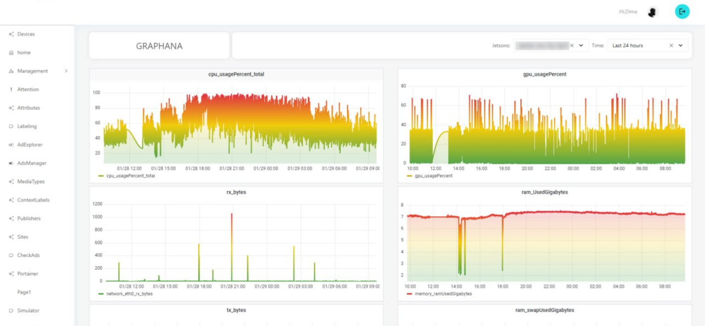

рис. Grafana Metrics

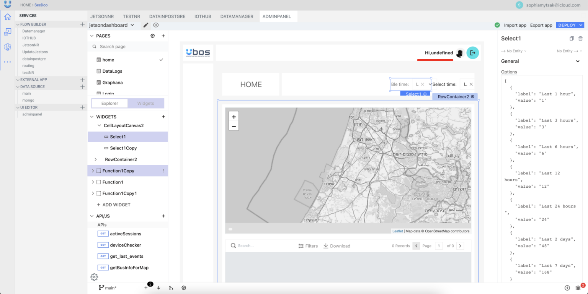

рис. UBOS Editor

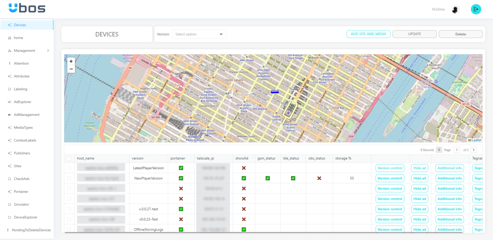

рис. Admin Panel View

рис. Device Version History

У системі DOOH у якості пристрою Edge використовувалася NVIDIA Jetson. Завдяки платформі UBOS Jetson можна було легко зареєструвати та відстежувати, а також реалізовано контроль версій для безперебійного оновлення та керування. Здатність платформи інтегруватися з кількома хмарними середовищами та підтримувати Google BigQuery дозволила ефективно й результативно обробляти дані на Jetson.

Крім того, UBOS створив і керував службою Node-Red, яка була розгорнута на пристрої NVIDIA Jetson Edge. Ця служба відповідала за керування всіма операціями всередині пристрою, включаючи підключення до апаратних компонентів і керування периферійними пристроями, такими як сканери BLE, GPS і акселерометр.

## Ad Explorer | Показники продуктивності

Відображає статус усіх запущених оголошень, надаючи користувачам детальну статистику на основі машинного зору та сканера BLE

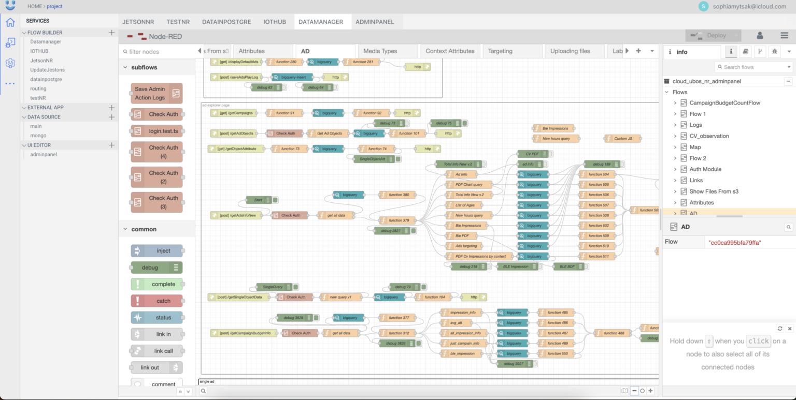

рис. UBOS Flow builder

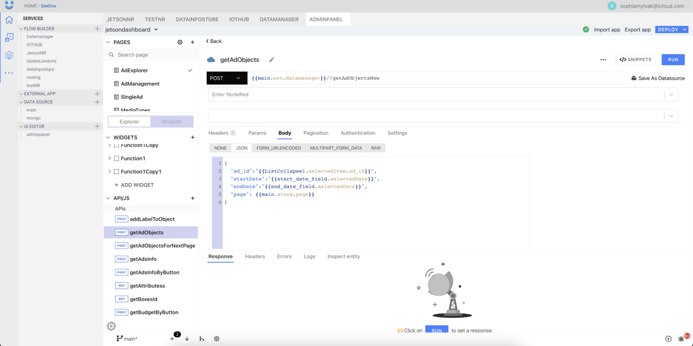

рис. API Builder

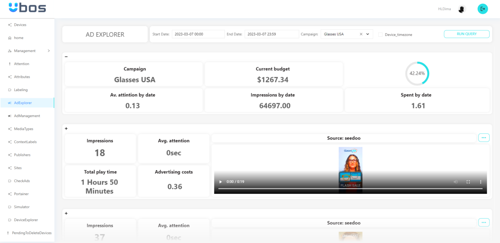

рис. Ad Explorer

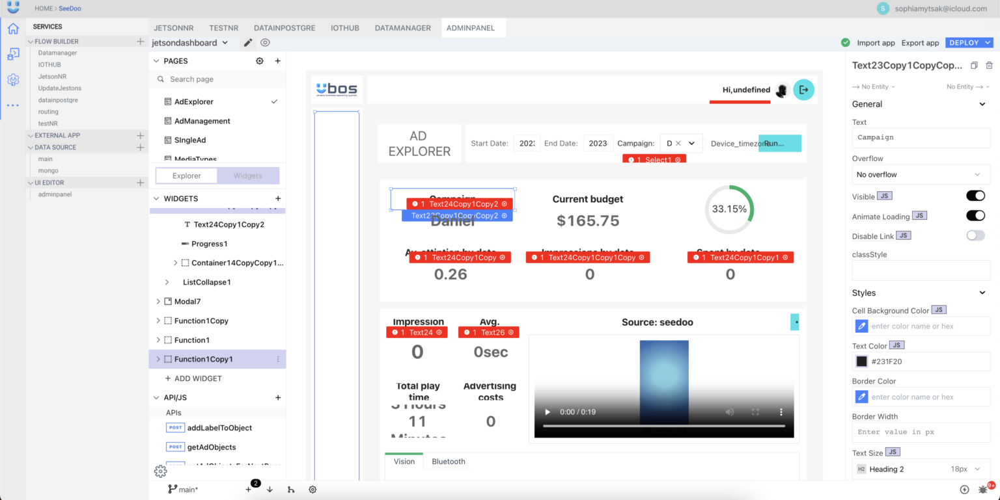

рис. Ad Explorer UBOS Editor

Платформа розроблення застосунків з низьким кодом/без коду UBOS дозволяє легко створити MVP для вашого бізнесу. За допомогою нашої платформи ви можете зосередитися на своїх основних компетенціях, а ми подбаємо про решту. Наша платформа розроблена, щоб допомогти вам швидко створити MVP для вашого бізнесу, не потребуючи досвіду програмування.

Отже, якщо ви хочете створити MVP для свого бізнесу, шукайте не далі, ніж UBOS. Ми тут, щоб допомогти вам на кожному кроці, і ми гарантуємо, що наша платформа забезпечить результати, необхідні для успіху.

## Менеджер створення реклами

Інструмент дозволяв користувачам переглядати та керувати списком усіх своїх оголошень, а також легко створювати нові оголошення. Завдяки таким функціям, як завантаження медіафайлів і конфігурація метаданих, Ads Manager надав користувачам можливість налаштовувати та пристосовувати свої рекламні кампанії до своїх конкретних потреб.

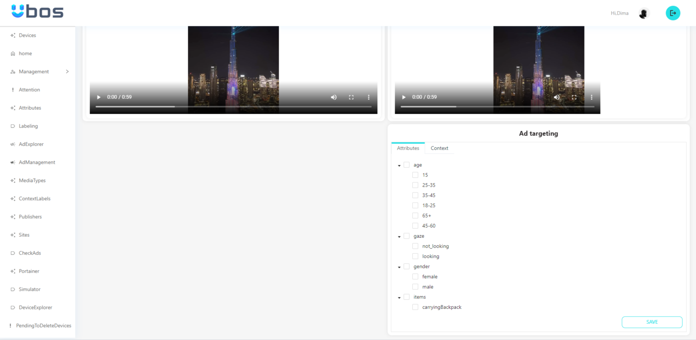

рис. Configure Targeting

рис. List of Ads

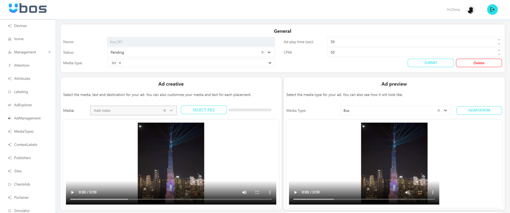

рис. Edit Single Ad

## Керуйте типами медіа та місцями розміщення оголошення

За допомогою функції типів медіа користувачі можуть керувати всіма доступними типами екранів і положеннями, де можуть відображатися оголошення. Завдяки функціям розміщення оголошення користувачі можуть легко відстежувати вільний рекламний простір і приймати обґрунтовані рішення про те, де розміщувати (Site) свої оголошення.

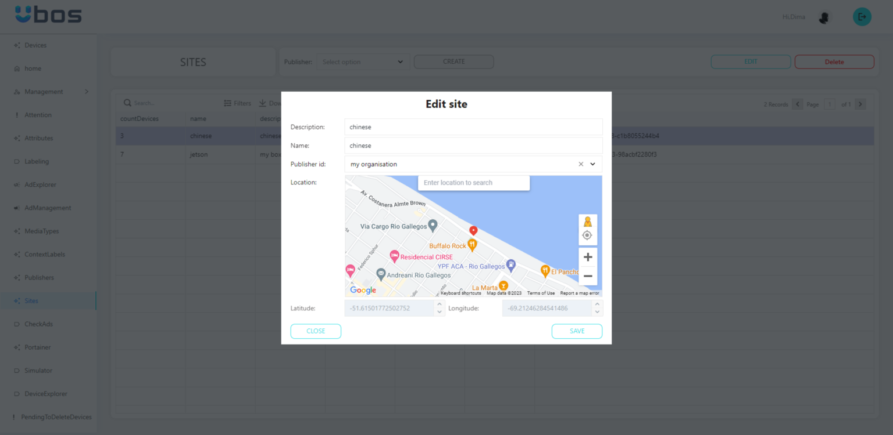

рис. Create new Site

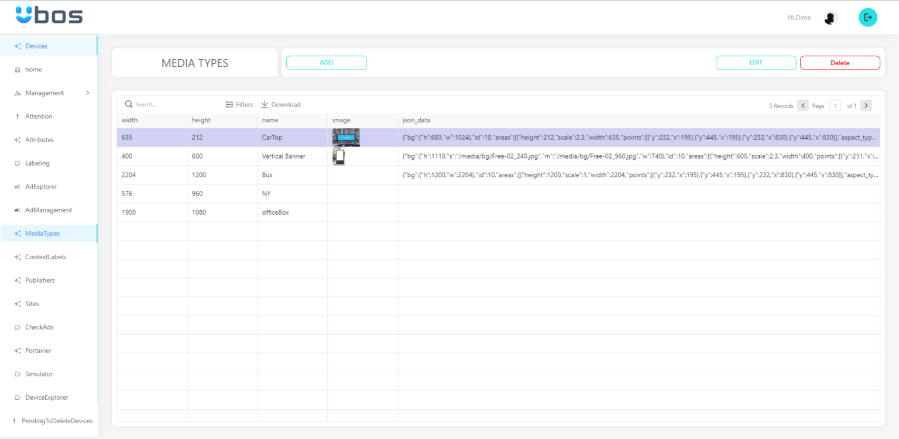

рис. Media Types

рис. Configure Single Media Type

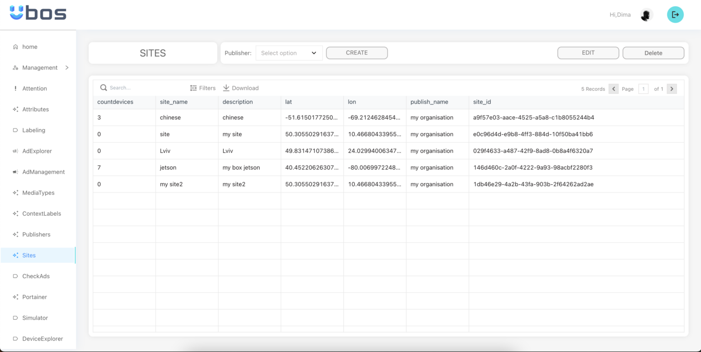

рис. Sites list and location

## Візуалізація даних, зібраних периферійним пристроєм (BLE, камера)

Розширений інструмент аналітики під назвою Attention дозволяє користувачам легко візуалізувати дані, зібрані периферійним BLE і камерою периферійного пристрою.

За допомогою Attention користувачі можуть отримати глибше уявлення про ефективність своїх рекламних кампаній і відповідно скорегувати свою стратегію.

Візуалізуючи такі дані, як моделі відвідувачів і демографічні показники клієнтів, користувачі можуть приймати більш обґрунтовані рішення про те, де розміщувати свої оголошення та які типи оголошень показувати.

Зручний інтерфейс Attention дозволяє користувачам легко переглядати та аналізувати дані, навіть якщо вони мають обмежені технічні знання.

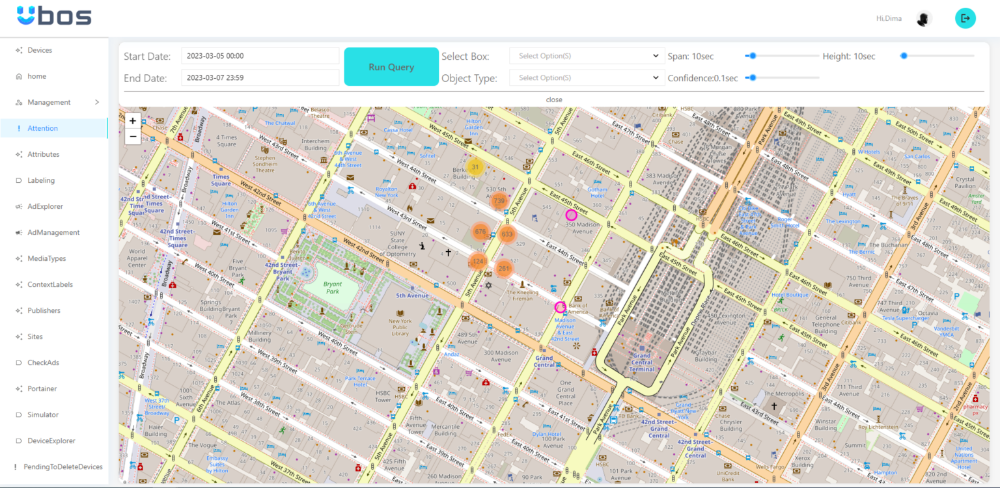

рис. BLE Points Aggregated

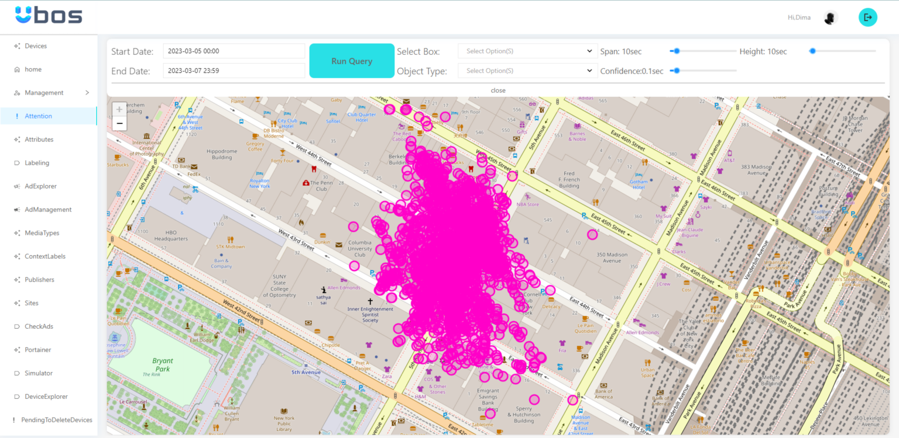

рис. BLE Points

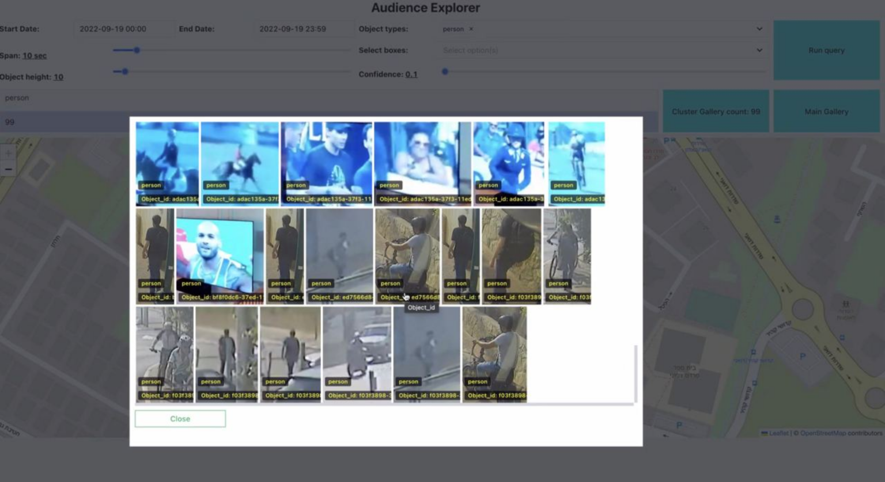

рис. Vision AI | Object Recognition

рис. BLE Points Aggregated

## Отримайте уявлення про продуктивність пристрою за допомогою програми Device Explorer

За допомогою Device Explorer користувачі можуть переглядати статистику з точки зору пристрою, включаючи час показу реклами, покази та список реклами, яка була показана. Ці дані можна використовувати для оптимізації розміщення реклами та підвищення загальної ефективності рекламних кампаній.

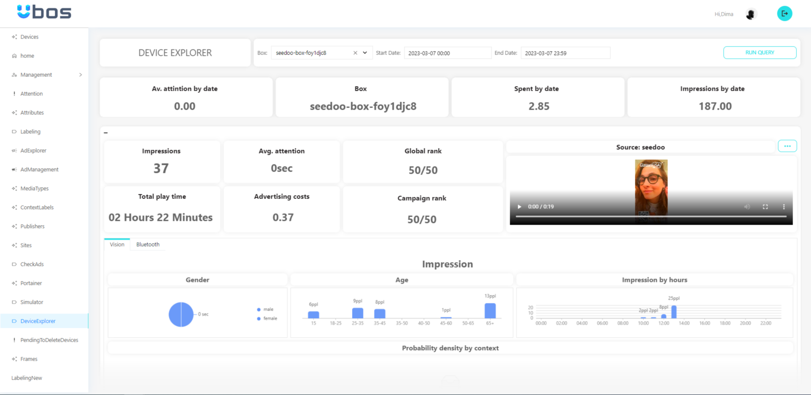

рис. Device Vision data

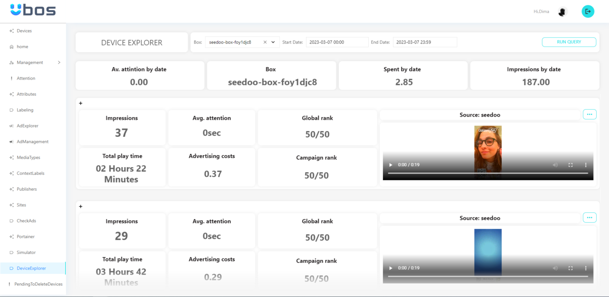

рис. List of devices/screens

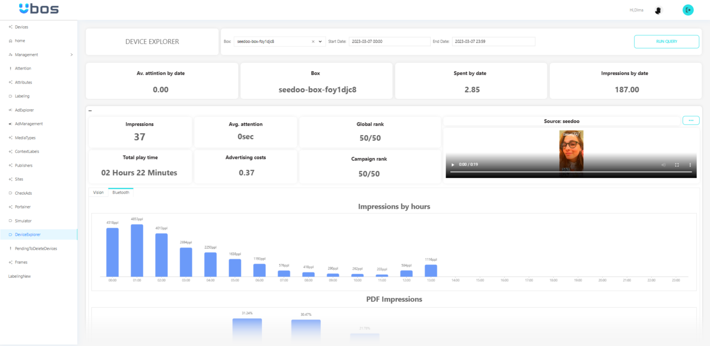

рис. Device BLE metrics

## Керуйте дозволами користувача з легкістю

Потужна функція керування дозволами користувача, яка дозволяє адміністраторам контролювати доступ до різноманітних функцій, модулів і функцій у системі

Адміністратори можуть легко встановлювати дозволи користувача та призначати ролі, гарантуючи, що кожен користувач має доступ до належного рівня функціональності відповідно до його ролі та обов’язків.

Ця функція особливо корисна для великих організацій із кількома командами чи відділами, де важливо переконатися, що доступ до конфіденційних даних має лише авторизований персонал.

Менеджер дозволів — це зручний інструмент, який полегшує керування дозволами та ролями з інтуїтивно зрозумілим інтерфейсом, який вимагає мінімальних технічних знань.

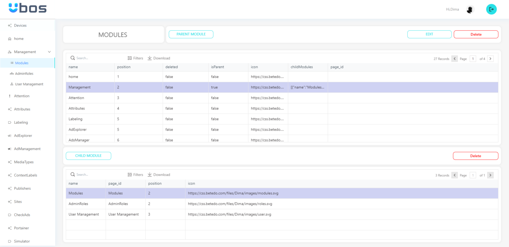

рис. Modules & Roles List

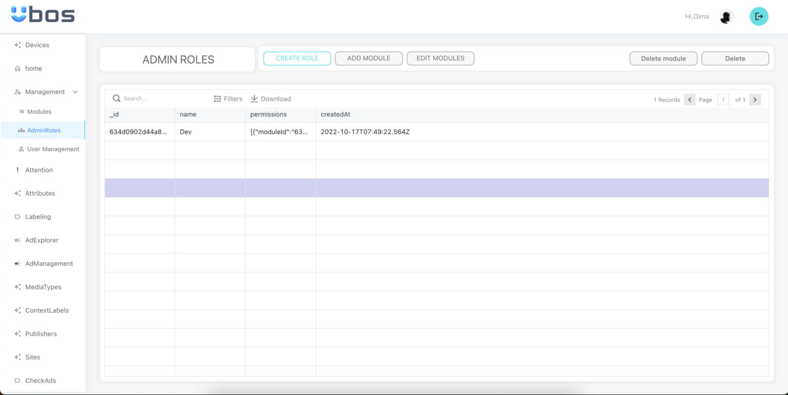

рис. Users

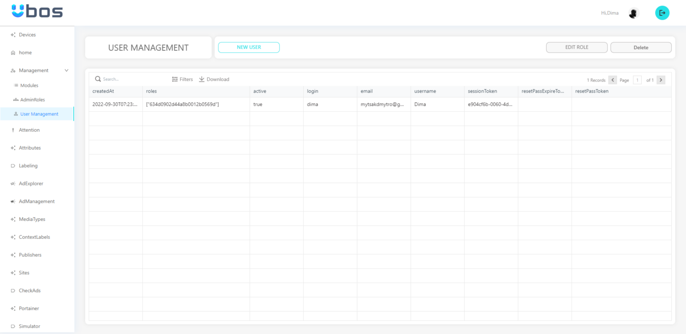

рис. Admins

## Підвищте точність ШІ за допомогою маркування зображень і керування атрибутами

Система містить потужну функцію для маркування зображень і керування атрибутами, що дозволяє користувачам підвищити точність виявлення та аналізу об’єктів на основі штучного інтелекту.

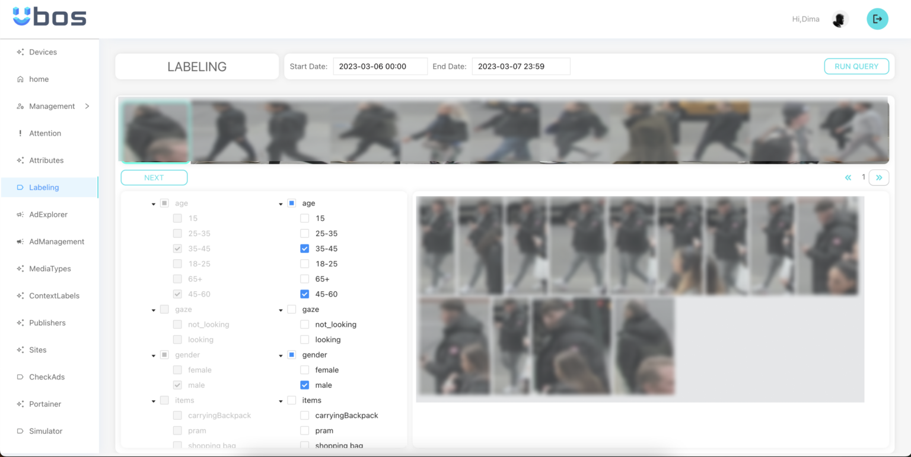

рис. Labeling

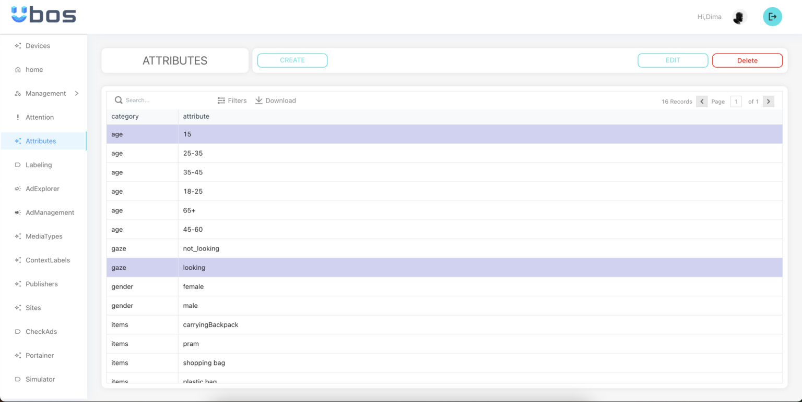

рис. Attributes

## IoT Hub і Edge Device Flows

IoT Hub дозволяє збирати дані з усіх підключених пристроїв Edge, які потім зберігаються в базі даних Google BigQuery для легкого доступу та аналізу.

Менеджер рекламних екранів також є ключовою функцією платформи, що дозволяє відображати рекламу, а також реєструвати перегляди реклами та можливість запитувати нові реклами з маршрутизатора реклами.

Крім того, платформа включає службу NodeRed, яка працює на стороні пристрою, керуючи серверами протоколу потокової передачі в реальному часі (RTSP), комп’ютерним баченням і виявленням об’єктів за допомогою CV/Yolo ML, даних GSM і периферійних пристроїв BLE.

Також включено прослуховувач необроблених журналів та інтеграцію з Telegram, що дозволяє надсилати сповіщення у разі будь-яких проблем або аномалій.

рис. Ad screen manager

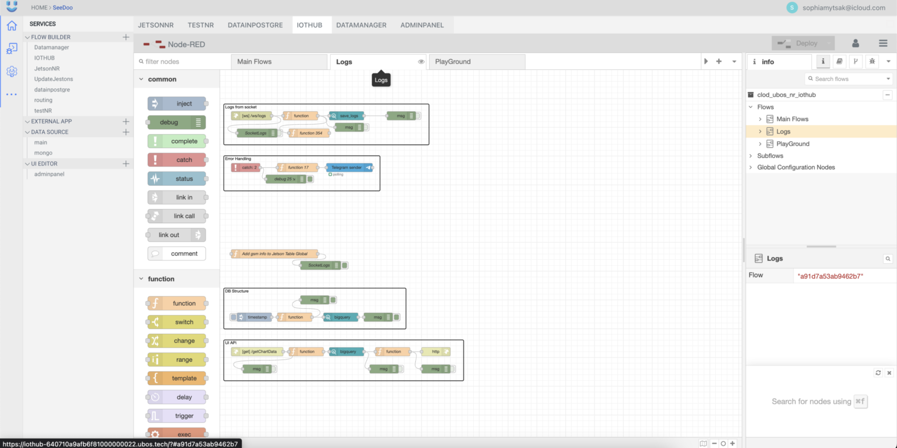

рис. Warning Notification | Telegram Bot

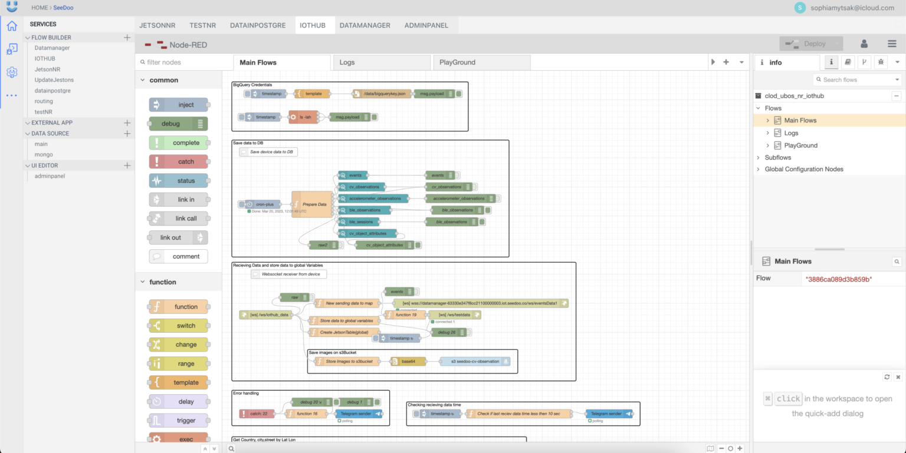

рис. Data stream from Edge Device to BigQuery

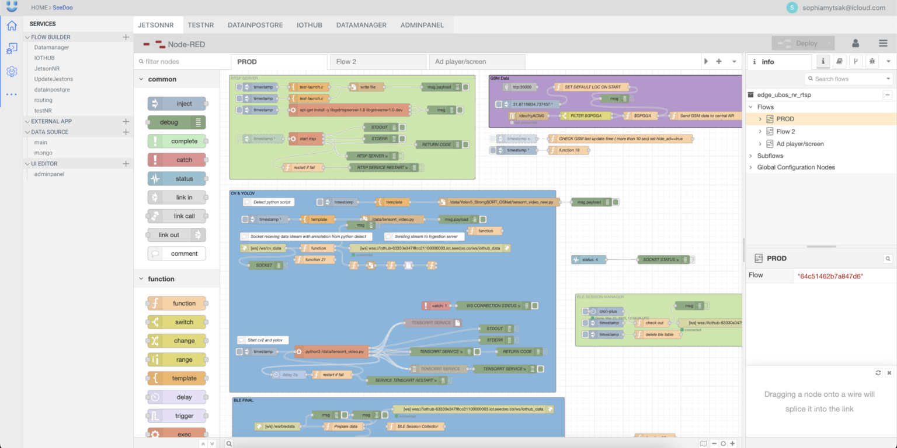

рис. RTSP, CV2/YOLO, GSM

## Візуалізація та пристрій даних Unity3D

Візуалізація даних Unity3D базується на даних пристроїв Edge, зібраних у режимі реального часу. Ця функція надає користувачам захоплюючий інтерактивний спосіб досліджувати та аналізувати дані, зібрані з їхніх пристроїв Edge. За допомогою Unity3D користувачі можуть легко створювати та налаштовувати тривимірні візуалізації, які допомагають їм отримати розуміння своїх даних.

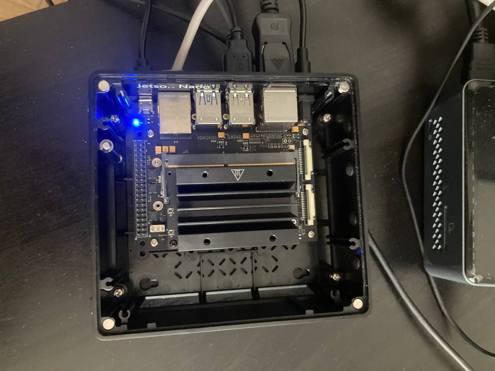

рис. Nvidia Jetson

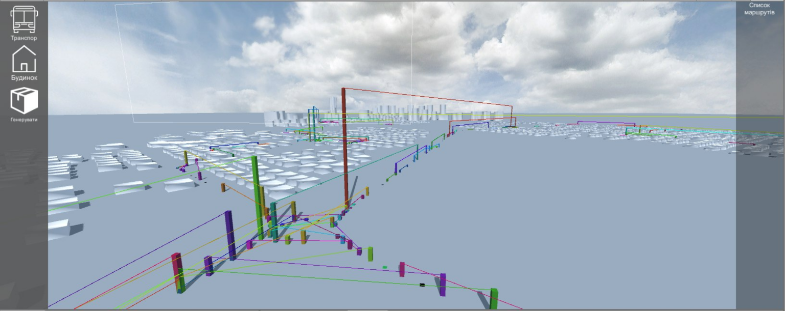

рис. Unity3D

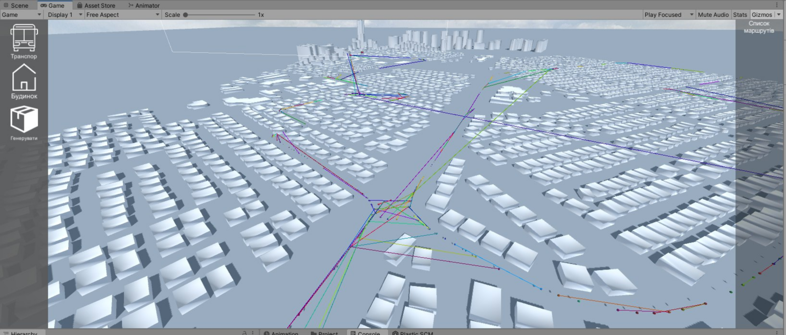

рис. Unity3D

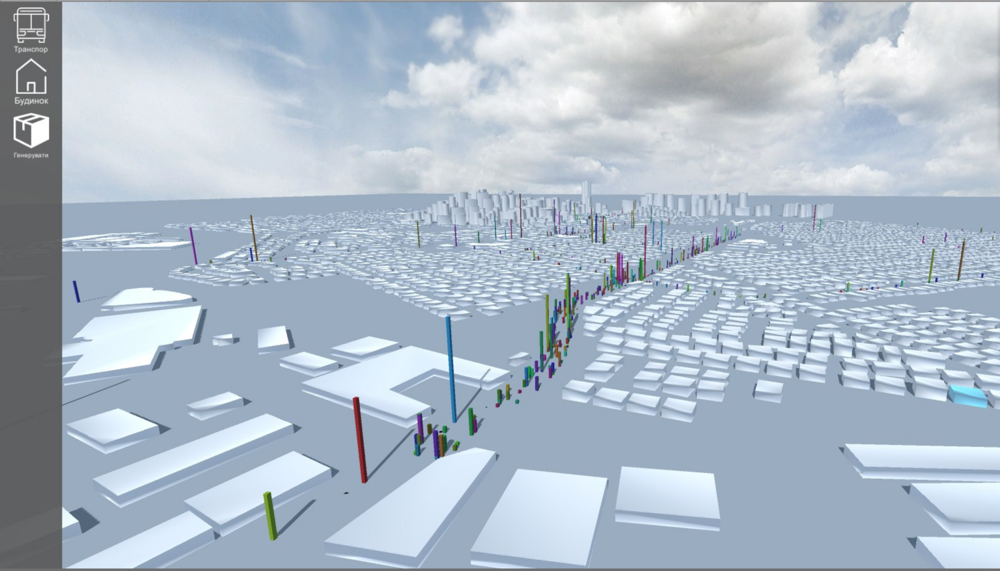

рис. Unit3D City & BLE data