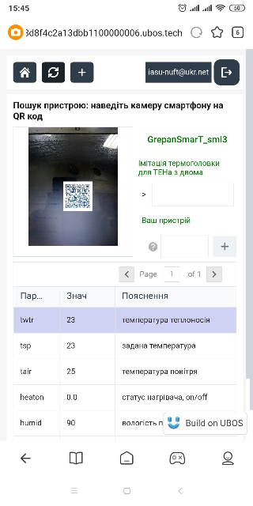
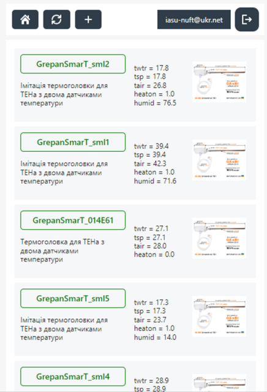
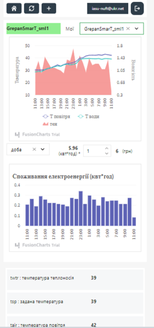
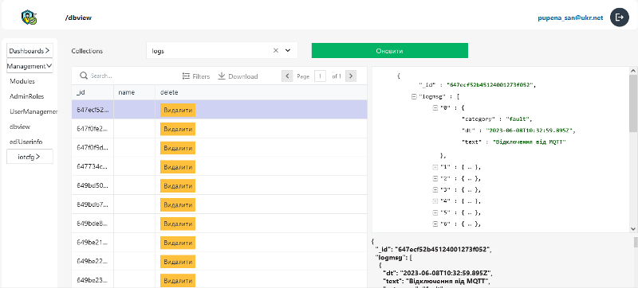
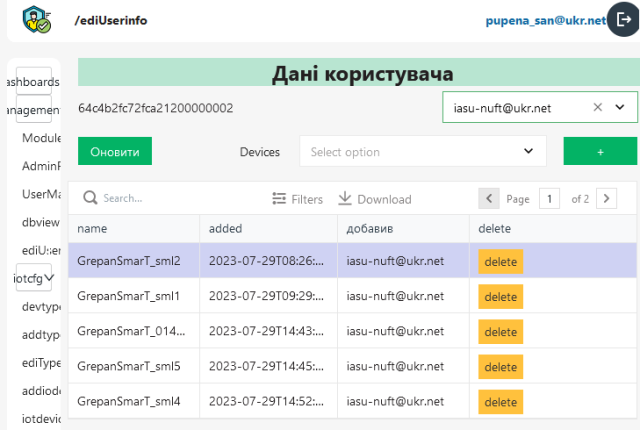
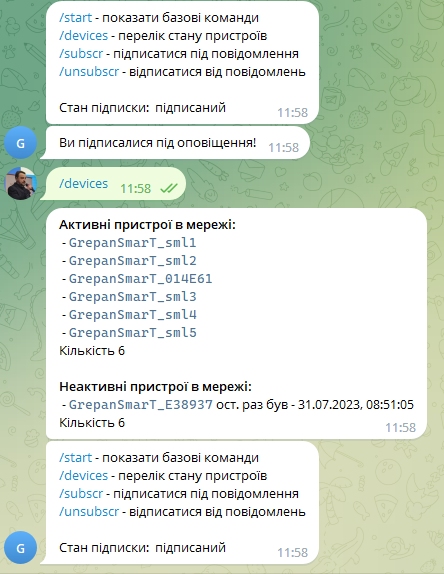
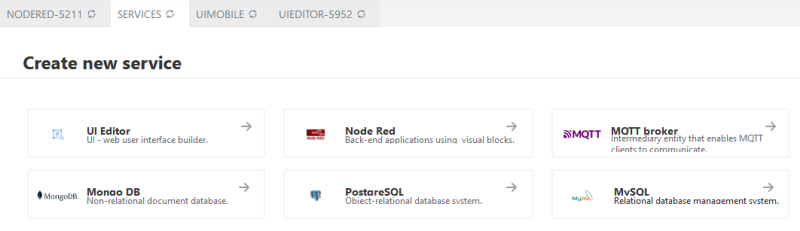

[Статті](README.md)

# Розробка платформи на базі Low/No-Code інструментів

[Олександр Пупена](https://github.com/pupenasan) 31.07.2023

Декілька місяців тому я вирішив спробувати створити власними силами свою IoT платформу (IoT - Interent of Things, Інтернет речей). Це начебто і не моя справа, як спеціаліста з автоматизації, - створювати платформи. Однак платформа була не єдиною і мабуть не основною ціллю, я хотів пройти шлях розроблення чогось потрібного ринку IoT та IIoT (Industrial IoT) з використанням Low/No-Code інструментів щоб:

- зрозуміти як працюють IoT платформи зсередини (хоча звісно усі вони дуже різні), щоб за необхідності грамотно сформувати технічні вимоги ІТ спеціалістам   
- повчитися технологіям, які до цього за певних причин "проходили поряд" біля мене 
- отримати додаткові навики Low/No-Code, щоб розробляти інші індивідуальні рішення для IIoT
- мати в корзині власних рішень цілу IoT платформу :)    

Тут, на щастя, з'явився замовник, якому якраз це і потрібно було. Сьогодні (31.07.23) я презентував йому альфа-версію, і презентація пройшла успішно. Звісно не без косяків, але на те вона і "альфа". У цій статті я вирішив зробити підсумки за весь цей час, так як у своїх постах на каналах практично нічого про проєкт не говорив. Платформа ще сира, але з технічної точки зору багато чого для мене стало новим і принаймні для себе хотів би це зафіксувати.

## Про IoT платформу: точка зору кінцевого користувача

Перш за все, треба розказати про те, що тут я називаю **IoT платформо**ю. На даний момент це SaaS (хмарний застосунок як сервіс), який надає можливість підключення IoT пристроїв конкретного типу через MQTT з можливістю віддаленого контролю та керування (керування поки не реалізовано) через WEB-браузер, що адаптований під мобільні пристрої. З точки зору кінцевого користувача, на даний момент платформа надає такі можливості:

- підключення пристрою до платформи з самостійною реєстрацією; з технічної точки зору це робиться через MQTT, і з боку пристрою я нічого не розробляв, це розробка іншого спеціаліста; 
- пошук пристрою по QR-коду:
  - з будь-якого застосунку сканера QR-коду користувач заходить на сторінку пристрою
  - на сторінці пошуку пристрою інформація автоматично відображається про сканований пристрій

рис.1. Перегляд пристрою по QR-коду

- добавлення пристрою до свого списку з попередньою перевіркою по секретному коду
- перегляд пристроїв в своєму списку (головна сторінка) з відображенням основної інформації  

рис.2. Головна сторінка користувача зі списком пристроїв

- відображення інформації по виділеному пристрою, наразі:
  - графіків параметрів за різні проміжки часу
  - загальними споживанням електроенергії пристрою за звітний час з перерахунком в грошовий еквівалент  
  - журналу подій 

рис.3. Інформація про пристрій

Додатково реалізована:

- самостійна реєстрація користувача на платформі з підтвердженням через пошту
- авторизація користувача  

Звісно, це не весь запланований функціонал, це тільки перші кроки. У майбутньому планується наростити.   

## Про IoT платформу: точка зору адміністратора

Найбільше всього роботи пішло на розроблення основи платформи. Про це я напишу трохи нижче, тут лише зауважу, що для IoT платформи розроблено два інтерфейси: один для кінцевого користувача, який я описав вище, а інший - для адміністратора системи. Наразі "адмінка" надає такі можливості:

- створення, видалення та адміністрування користувачів 
- адміністрування користувацьких модулів системи: кому до чого можна доступатися в системі
- перегляд та редагування бази даних
- перегляд та редагування (добавлення/видалення) пристроїв для користувача
- створення та редагування типів пристроїв, в яких означується її поведінка
- створення та редагування пристроїв: тип, значення полів, створення QR-кодів, секретні коди доступу
- діагностичне вікно контролю MQTT повідомлень 

рис.4. перегляд та редагування бази даних

рис.5. перегляд та редагування пристроїв для користувача

рис.6. Керування пристроями

У доповнення до цього до платформи підключений Телеграм-бот, який наразі сповіщає адмінів про стан пристроїв.

рис.7. Телеграм бот для адміністраторів

Знову ж таки, планується нарощувати і тут функціональність. Це така собі "стартова позиція". 

## Чому "Платформа"?

Аксакали в темі IoT скажуть що це зовсім не платформа, а кінцеве рішення SaaS. Наразі це так і є, але в основі стоять механізми, які нададуть можливість розробникам самостійно розробляти свої типи пристроїв і підключати їх. Звісно, це буде не в межах цього проекту, бо тут це і не потребується. Тим не менше, при розробленні прототипу мене цікавило на скільки це можливо, тому я випробував певні механізми і вони показали свою працездатність. Тут поки зарано розповідати про все, поки скажу що типи означуються через JSONata, і цю ідею я піддивився у IBM Clouds IoT. 

Тому, наразі це дійсно не платформа, але я вирощую її саме в цьому напрямку :) .  

## Платформа на платформі: Low/No-Code інструментарій UBOS.tech

Прийшов час заглянути під капот. Це все реалізовано на дуже крутій (без перебільшення) LoCode/No-Code платформі  , яку розробили і підтримує українська компанія **[UBOS.tech](https://ubos.tech/)**. Я надзвичайно вдячний долі і розробникам UBOS.tech що у мене з'явилася така можливість! Подяки ще будуть нижче, зараз опишу трохи про платформу і що наразі там використовується.

Отже це хмарна платформа, яка надає можливість легко розгортати та поєднувати усі необхідні для розроблення Веб-застосунків сервіси:

- Node-RED для оброблення логіки керування
- UI Editor (перероблений Appsmith) для створення інтерфейсу користувача
- сервіси БД: MongoDB, MySQL, PostgreeSQL
- інші сервіси: MQTT Broker та інші, які вам потрібні під замовлення 

рис.8. Доступні типи сервісів на UBOS.tech станом на 31.07.2023

Кількість сервісів означується потребами і звісно впливають на витрати. Типи сервісів планується розширювати в наступних версіях. На скільки мені відомо, в майбутньому добавиться InfluxDB, а пізніше можливо Grafana.

Створення сервісів відбувається дуже легко - добавив, назвав і дав змінні середовища за необхідності. Далі все робиться відповідно до правил роботи з сервісами. У Node-RED все як зазвичай, нічого особливого - і це добре. UI editor розроблений на основі Appsmith і має багато додаткових можливостей. Хоча, на скільки мені відомо під капотом це вже не зовсім Appsmith, але не буду розповідати, бо можливо це комерційна таємниця :). Наприклад, там є віджет, куди можна вписувати свою логіку на базі React. Ну а з базами даних нічого особливого. Хоча, як на мене, варто б було добавити можливість прив'язки до них консолі для адміністрування.      

      

рис.9. Середовище розроблення UBOS.tech

## Здобутки в компетентностях та досвід     

Як я вже писав на початку, за проект взявся для того щоб "покачати мускули". Такий пул технологій та рішень за такий короткий час я рідко освоював. Тут перерахую тезисно:

- **Node-RED**. Звісно з самим Node-RED я працював вже давно. Але при використанні імпортованих блоків коду, наданих мені командою технарів UBOS.tech, я познайомився з чимось новим, зокрема:
  - встановлення модулів Node.js у вузлах `functions`
  - використання лінків-викликів
  - має бути щось третє, але я забув що :)
- **MongoDB**. До цього тільки грався з цією СКБД, завдяки доступності хмарного MongoDB Atlas. Завдяки цьому проекту ця СКБД стала для мене базовою для вирішення всіх завдань, пов'язаних з базами даних. Я навчився використовувати базові сервіси зміни даних в документах, агрегації (навіть для цього маленький курс пройшов на MongoDB), робити з даними часових рядів (Time Series). Тепер це моя улюблена СКБД :) 
- **Авторизація**. Модуль авторизації для Node-RED та UI люб'язно надали технарі з команди UBOS.tech. Я описував його трохи [тут](../ubos/auth/README.md). Це для мене був ще той виклик. До цього я довго шукав яким чином реалізувати механізми автентифікації в Node-RED. А тут вже готове рішення, яке дозволяє створювати та керувати користувачами та їх можливостями а також їм самим реєструватися в системі. По цьому модулю я планував зробити кілька навчальних статей, щоб пояснити, як працюють окремі механізми. Але поки тільки почав цим займатися - написав кілька статей в тему у цьому ж розділі репозиторію. Тут багато чого для мене було нового, не буду перераховувати. 
- **UI та Appsmith**. Для мене UI builder став найбільшим відкриттям (я б сказав, перевідкриттям). Наявність окремого редактору інтерфейсу користувача на UBOS.tech робить цю платформу самодостатньою. Наприклад, у Node-RED Dasboard, який для цього призначений, є купа недоліків, про які самі розробники неодноразово писали. У той же час наразі повноцінної альтернативи для Node-RED йому немає. Моє перше знайомство з UI Builder (ще минулого року) було не дуже вдалим. Я намагався його використовувати як пряму альтернативу Dashboard, а там не було добре знайомих мені віджетів. Тому колегам з UBOS.tech я висказав своє "фє" і сказав що воно не годиться для IoT рішень. Як виявилося, вже цього року (на другому підході) просто треба було заглянути в документацію (документація це дуже важливо, особливо коли вона є ;-) ). Коли я дізнався що в основі стоїть [Appsmith](https://www.appsmith.com/) , то на їх сайті знайшов відповіді на багато своїх запитань, а також велику кількість прикладів від спільноти. Варто відмітити, що при розробленні тут також сильно допомогла команда UBOS.tech. Вони допомогли зробити кілька віджетів, зокрема з трендами та QR-кодом, розібратися з деякими тонкощами в реалізації клієнтського API.

Щодо отриманого досвіду, наведу кілька цікавих моментів:

- Коли UI стало сильно тормозити, було вирішено виділити під нього більше ресурсів. Після створення нового сервісу з явно більшими ресурсами все почало літати. Стало працювати набагато приємніше як з точки зору розробки, так і використання.
- Одним з переломних моментів було рішення розділити UI для адмінки і кінцевого користувача на два різні застосунки. Останнє я навіть думав писати на HTML5, але добре що передумав в сторону використання UI Builder, а то б писав до сих пір :)     

Стовідсотково щось ще забув написати. Але основні технології та здобутки перерахував. Крім того, я багато часу витратив на розроблення структури платформи. Я вже трохи втомив вас писаниною, тому залишу це на окрему статтю. Тим більше, що тут тільки зачатки.      

## Резюме: що далі?

Підсумовуючи, варто зазначити, що це тільки початок. Я сподіваюсь і планую, що даний MVP дійде до стадії використання кінцевим споживачем. Паралельно є в планах запустити інший проект, але вже з більш універсальними механізмами, що буде більш схожим на платформу. Слід також зазначити, що "платформенність" рішення зробило реалізацію складніше на кілька порядків. Після великої кількості проведених робіт, будь яке індивідуальне рішення під потреби замовника виглядатимуть набагато простіше. Універсальність при високій функціональності - це ще та задачка.

Використання Low/No-Code для розроблення WEB-застосунків, це як використання програм PLC та SCADA при розробленні програмної частини в системах автоматизації технологічних процесів. Перевірено на власному досвіді - це під силу інженерам-програмістам систем керування. Тут не стільки треба вчити інструменти, як технології. Так що, зберемося з силами, і розробимо курси. Звісно платформу розробляти це не завдання авоматників, але індивідуальні рішення IIoT для конкретного підприємства - чому б і ні, якщо є такі інструменти?!  

## Подяки

Перш за все дякую команді  [UBOS.tech](https://ubos.tech/) за надану можливість попрацювати на безкоштовній основі з їх сервісами а також за потужну технічну підтримку (для мене виділили окремий канал підтримки). Завдяки команді UBOS.tech я багато чому навчився і, взагалі, отримав можливість зануритися у світ Low/No-Code. До знайомства з їх платформою я користувався інструментами стеку IIoT: Node-RED, InfluxDB, Grafana і думав що Low/No-Code то для IoTників і автоматників. Зараз я розумію, що той же Node-RED має значно ширшу область застосування. UBOS.tech є співзасновником спільноти [FlowMates](https://flowmates.org/), мета якої "розвивати low/no-code культуру, аби організації  могли створювати та розгортати користувацькі додатки та інше програмне  забезпечення, необхідне для диджиталізації внутрішніх бізнес-процесів,  без глибоких знань у галузі програмування". Саме вони надали мені можливість потусити на їх івентах, за що вдячний і  UBOS.tech і іншим співзасновникам FlowMates. 

По друге, дякую замовнику, який погодився "почекати", поки я виділяв крихти часу на розроблення за залишковим принципом. Є багато інших пріоритетних завдань, тому за цей період я виділяв для цього проекту невеликі кванти часу. Зараз, коли вже видно якісь результати, працювати психологічно стало легше. 

Ну і підписуйтеся на мої канали в:

- [Linkedin](https://www.linkedin.com/in/oleksandr-pupena-67aa0b33/)
- [Facebook](https://www.facebook.com/fieldbusbook)
- [YouTube](https://www.youtube.com/c/OleksandrPupena)
- Телеграм <https://t.me/+7n6AhGnkEuM1MmJi>