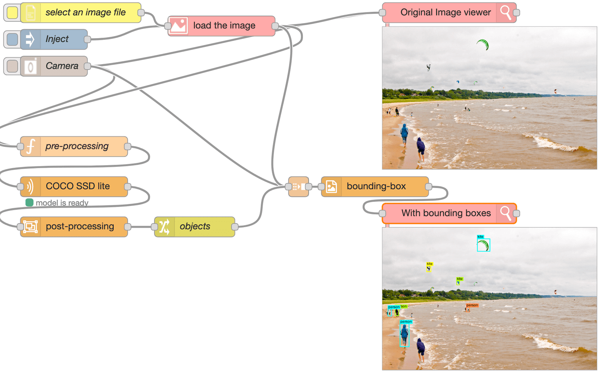
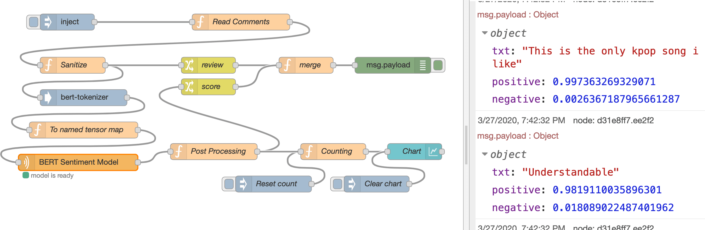
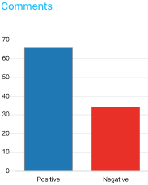
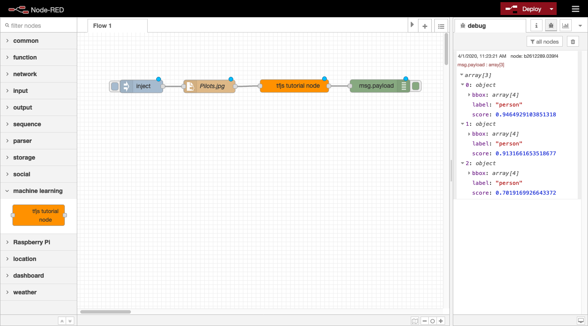
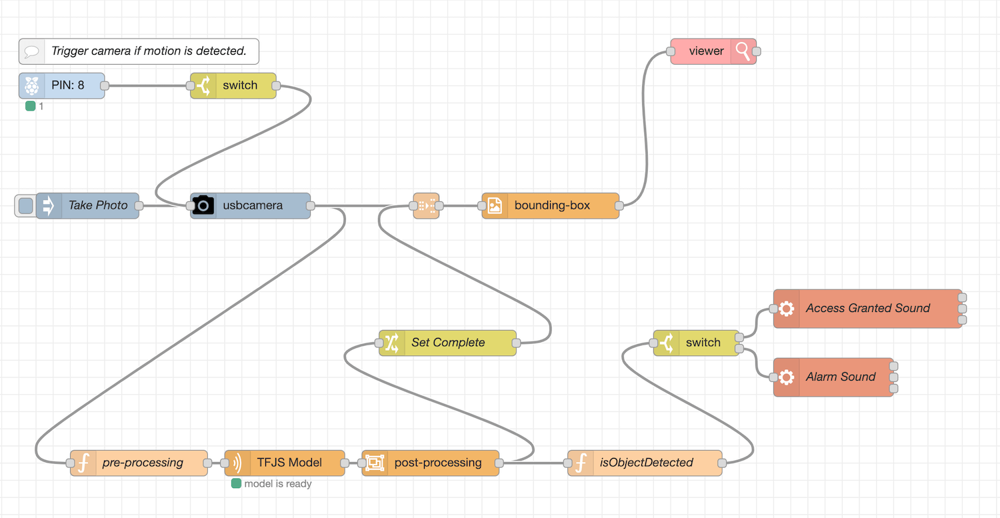
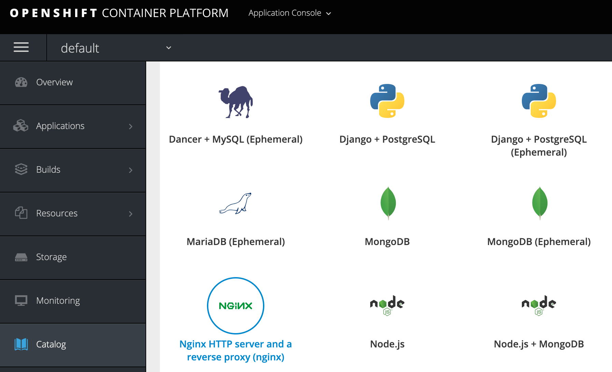
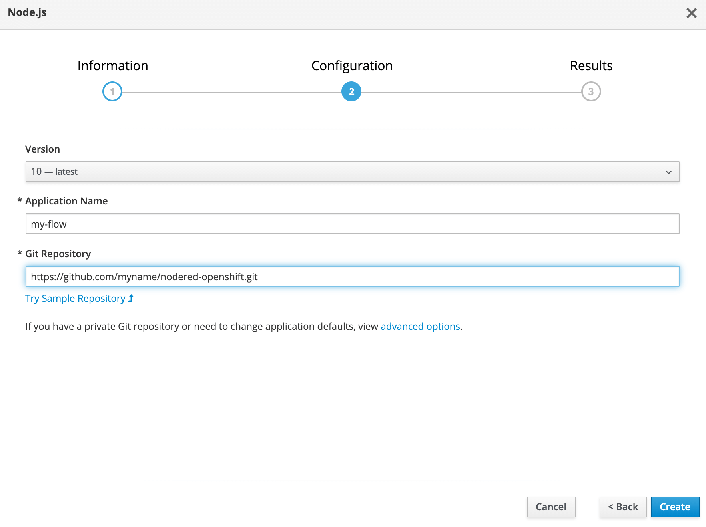
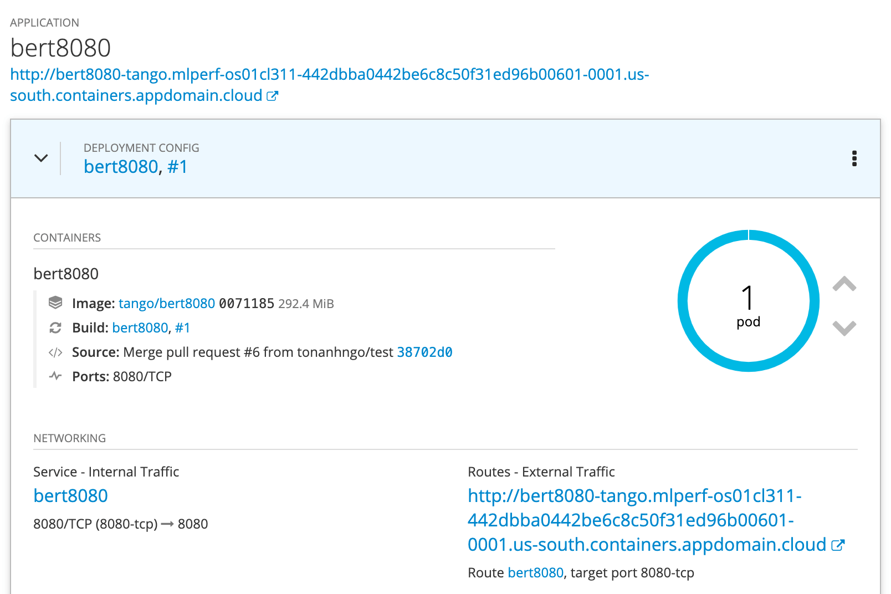

[Статті](README.md)

# Створення вузлу машинного навчання для Node-RED за допомогою TensorFlow.js

By [va barbosa](https://developer.ibm.com/profiles/va), Ton A Ngo, Paul Van Eck, [Yi-Hong Wang](https://developer.ibm.com/profiles/yh.wang), [Ted Chang](https://developer.ibm.com/profiles/htchang)
Published 27 травня 2020 р.

Ця стаття перекладена та адаптована з ориігнальної статті [Build a machine learning node for Node-RED using TensorFlow.js](https://developer.ibm.com/tutorials/building-a-machine-learning-node-for-node-red-using-tensorflowjs/) 

Зниження бар’єрів для входу на територію штучного інтелекту (ШІ) є метою, до якої постійно прагнуть. Зроблення штучного інтелекту більш доступним не тільки збільшить кількість людей, які фактично використовують штучний інтелект, але й сприятиме поширенню та прийняттю штучного інтелекту в багатьох різних галузях. Світ машинного навчання спочатку може бути страшним, але є кілька підходів, які спрощують увесь процес розробки додатків зі штучним інтелектом. Одним із таких підходів є поєднання використання TensorFlow.js із Node-RED. У цьому посібнику показано, як використовувати цей підхід для створення програм Node-RED із підтримкою штучного інтелекту в різних середовищах.

У той час як Node-RED забезпечує середовище розробки, включення машинного навчання у ваші програми є ще одним ключовим компонентом. [TensorFlow.js](https://www.tensorflow.org/js) заповнює цю прогалину. Відповідні екосистеми Node.js роблять інтеграцію двох технологій легкою, де вузол TensorFlow.js Node-RED можна легко створити, упакувати та завантажити в npm для спільного використання.

TensorFlow.js також надає перевагу запуску моделей безпосередньо на пристрої без взаємодії із зовнішнім сервером або хмарою. Це полегшує більшість проблем із безпекою даних або підключенням до Інтернету. Крім того, із зростаючою доступністю вузлів TensorFlow.js Node-RED, наданих спільнотою, можна реалізувати кілька різних програм штучного інтелекту, не написавши жодного рядка коду.

У цьому посібнику ми висвітлюємо:

- Використання загальнодоступних пакетів TensorFlow.js Node-RED
- Створення власних пакетів TensorFlow.js Node-RED
- Увімкнення TensorFlow.js на пристроях IoT
- Розгортання Node-RED у хмарних середовищах

# Передумови

Щоб дотримуватися цього посібника, ви повинні мати:

- Базові знання:
   - [Node.js](https://developer.ibm.com/learningpaths/get-started-nodejs/)
   - [Node-RED](https://developer.ibm.com/videos/node-red-essentials/)
- Знайомство з [концепціями ШІ та машинного навчання](https://developer.ibm.com/learningpaths/learning-path-machine-learning-for-developers/)
- Ноутбук або робоча станція з найновішою версією Linux®, MacOS або Windows™ із:
   - Встановленим [Node.js](https://developer.ibm.com/tutorials/learn-nodejs-installing-node-nvm-and-vscode/)
   - Встановленим [VS Code](https://developer.ibm.com/tutorials/learn-nodejs-installing-node-nvm-and-vscode/#install-vs-code)
   - Встановленим [Node-RED](https://nodered.org/docs/getting-started/)

# Кроки

## Використання наявних вузлів TensorFlow.js Node-RED

Для зручності ми реалізували кілька часто використовуваних функцій як спеціальні вузли Node-RED. Ми коротко пояснюємо їх використання з прикладами потоків, щоб допомогти вам швидко почати роботу з TensorFlow.js Node-RED. Зауважте, що для більшості цих користувацьких вузлів потрібен `@tensorflow/tfjs-node` як однорангова залежність, тому переконайтеся, що він встановлений у середовищі вузла Node-RED перед встановленням цих користувацьких пакетів вузлів.

### Спеціальні вузли

- [`node-red-contrib-tf-function`](https://flows.nodered.org/node/node-red-contrib-tf-function)  імітує основну функцію Node-RED [`Function`](https://nodered.org/docs/user-guide/writing-functions), а також включає змінну TensorFlow.js (`tf`) у глобальний контекст.
- [`node-red-contrib-tf-model`](https://flows.nodered.org/node/node-red-contrib-tf-model) завантажує моделі TensorFlow і виконує висновок. Наразі цей вузол підтримує лише веб-формати моделі JSON, але незабаром буде додано підтримку `SavedModel`.
- [`node-red-contrib-post-object-detection`](https://flows.nodered.org/node/node-red-contrib-post-object-detection)
   - `post-object-detection` обробляє вихід моделі Object Detection.
   - `bbox-image` позначає вихідне зображення обмежувальними рамками.
- [`node-red-contrib-bert-tokenizer`](https://flows.nodered.org/node/node-red-contrib-bert-tokenizer) перетворює текст у функції введення для моделі BERT.

### Приклад потоків

#### Виявлення об'єктів

Потік [Object detection](https://github.com/yhwang/node-red-contrib-tf-model/tree/master/examples/object-detection) розпізнає об’єкти на зображенні та позначає об’єкти обмежувальними рамками. Зображення можна завантажити з вбудованої камери, файлової системи або шляхом введення зображення за замовчуванням. Переконайтеся, що для всіх цих вхідних вузлів встановлено пакет [`node-red-contrib-browser-utils`](https://www.npmjs.com/package/node-red-contrib-browser-utils). Цей потік використовує три користувацькі вузли, згадані вище (`tf-function`, `tf-model` і `post-object-detection`).

Завантажене зображення передається у вузол `pre-processing` як `msg.payload`. Об’єкт `msg` — це об’єкт JavaScript, який використовується для передачі повідомлень між вузлами. За домовленістю він має властивість payload, що містить вихідні дані попереднього вузла. Вузол функції `pre-processing` є прикладом [`tf-function`](https://flows.nodered.org/node/node-red-contrib-tf-model), яка безпосередньо викликає [`tf.node.decodeImage`](https://js.tensorflow.org/api_node/latest/#node.decodeImage) із попередньо визначеною змінною `tf`. Вузол створює представлення зображення Tensor4D як корисне навантаження, а потім передає його вузлу `COCO SSD lite`, який є екземпляром спеціального вузлу [`tf-model`](https://flows.nodered.org/node/node-red-contrib-tf-model) . Це завантажує COCO-SSD lite `model.json` із зовнішньої URL-адреси та запускає висновок на моделі.

Результат моделі проходить через вузол `post-process`, який повертає масив об’єктів, що містить властивості `bbox`, `className` і `score`. Вузол `objects` поєднує додаткову властивість `complete`, яка має значення `true`, до `msg` з об'єктом зображення. Потім вузол [`bounding-box`](https://flows.nodered.org/node/node-red-contrib-post-object-detection)  малює обмежувальні рамки на вхідному зображенні та відображає його у браузері.



#### Аналіз настроїв BERT

Приклад потоку [Аналіз настрою BERT](https://github.com/yhwang/node-red-contrib-tf-model/tree/master/examples/bert-sentiment-analysis) використовує модель настрою BERT для класифікації коментарів відео YouTube і наносить результати на графік. На додаток до вузлів `tf-function` і `tf-model`, ми використовуємо ще один спеціальний вузол, [`bert-tokenizer`](https://flows.nodered.org/node/node-red-contrib-bert-tokenizer), щоб перетворити текст у тензори введення. Для цього потоку необхідні інші пакети: [`node-red-dashboard`](https://www.npmjs.com/package/node-red-dashboard) і [`youtube-comments-stream`](https://www.npmjs.com/package/youtube-comments-stream). Зауважте, що завантажену тут модель `BERT sentiment model` конвертовано з [`MAX-Text-Sentiment-Classifier`](https://github.com/IBM/MAX-Text-Sentiment-Classifier/tree/master/) SavedModel, який приймає іменовану тензорну карту як вхідні дані, як показано в наступному коді.

```json
{
    input_ids_1 : tensor([1,128], "int32"),
    segment_ids_1 : tensor([1,128], "int32"),
    input_mask_1 : tensor([1,128],"int32")
}
```

Модель повертає результат softmax, що представляє ймовірність того, що вхідні дані є як позитивними, так і негативними в тензорному масиві. Потім потік підраховує кількість позитивних і негативних коментарів і виводить кількість у вузол гістограми. Цей вузол гістограми належить до пакета [node-red-dashboard](https://flows.nodered.org/node/node-red-dashboard), який дозволяє користувачам створювати інформаційні панелі даних і віджети в реальному часі. Доступ до інформаційної панелі можна отримати з кінцевої точки `/ui/` (наприклад, `http://localhost:1880/ui/`).

 

**Note:** For the `Read Comments` function node to work, ensure you have the following code in your Node-RED [settings.js](https://nodered.org/docs/user-guide/runtime/configuration) file.

```js
functionGlobalContext: {
  commentsStream:require('youtube-comments-stream')
},
```

## Створення спеціального вузла TensorFlow.js Node-RED

У попередньому розділі цього посібника ви запустили попередньо упаковані вузли TensorFlow.js Node-RED. Ці вузли дозволяють швидко розпочати роботу, щоб виконувати багато завдань машинного навчання, маючи лише базові знання про модель, TensorFlow.js і Node-RED.

Незважаючи на те, що ці вузли корисні, вони стосуються лише деяких випадків використання. Якщо ваш варіант використання не охоплений існуючими вузлами, ви можете створити власний спеціальний вузол. Повна документація щодо створення спеціального вузла Node-RED надається [в іншому місці](https://nodered.org/docs/creating-nodes/) і тут не повторюється, але в наступних кроках показано достатньо деталей, щоб підкреслити, як інтегрувати API TensorFlow.js. Ваш вузол імпортує бібліотеку TensorFlow.js для Node.js, завантажує веб-модель TensorFlow.js і виконує висновок на моделі.

Для узгодженості ми використовуємо та розширюємо модель COCO-SSD, про яку ви дізналися в першому посібнику [An introduction to AI in Node.js](https://developer.ibm.com/tutorials/an-introduction-to-ai-in-nodejs/) у цій [серії](https://developer.ibm.com/series/learning-path-get-started-with-ai-in-nodejs/). Ми створимо спеціальний вузол Node-RED для виявлення об’єктів за допомогою моделі COCO-SSD TensorFlow.js.

### Компоненти вузла Node-RED

Вузол Node-RED — це пакет модуля/npm Node.js, який складається з трьох основних файлів.

- [файл JavaScript](https://nodered.org/docs/creating-nodes/node-js), який означує поведінку вузла

- [HTML-файл](https://nodered.org/docs/creating-nodes/node-html), що містить властивості вузла, діалогове вікно редагування та текст довідки
- Файл [`package.json`](https://nodered.org/docs/creating-nodes/packaging#packagejson), який описує метадані модуля Node.js

Файл JavaScript – це те місце, куди ви обернете свій код TensorFlow.js. Він завантажить модель TensorFlow.js і запустить прогноз. Після того, як усі файли об’єднано та встановлено, настроюваний вузол відображається в редакторі, готовий до підключення до потоку та розгортання.

### Ініціалізуйте настроюваний модуль вузла

По-перше, ви повинні налаштувати середовище розробки Node-RED. Ви розробляєте спеціальний вузол і запускаєте Node-RED із цього середовища, щоб уникнути можливого конфлікту з іншими спеціальними вузлами, а також необхідності інсталювати спеціальний вузол у вашому глобальному середовищі Node-RED під час розробки.

From a terminal window:

1) Створіть новий каталог проекту Node-RED і перейдіть у цей новий каталог.

```shell
 mkdir nodered-dev
 cd nodered-dev
```

Ініціалізуйте пакет npm для проекту та дайте відповіді на запитання (наприклад, **package name** `nodered-dev`).

```shell
 npm init
```

Установіть залежності `node-red` і `@tensorflow/tfjs-node`.

```shell
 npm install node-red @tensorflow/tfjs-node
```

Відредагуйте щойно створений файл `package.json` за допомогою VS Code або вашої улюбленої IDE.

Додайте сценарій `start`, який використовується для запуску Node-RED.

```json
 {
   "name": "nodered-dev",
   ...
   "scripts": {
     "start": "node-red"
   }
   ...
 }
```

Коли папка проекту Node-RED буде готова, ви можете розпочати власний вузол.

2) Створіть каталог у новому каталозі проекту Node-RED для спеціального вузла та перейдіть у цей каталог.

```shell
 mkdir node-red-contrib-tfjs-tutorial
 cd node-red-contrib-tfjs-tutorial
```

> **Примітка**: якщо ви вирішите використовувати **node-red** у назві свого вузла, рекомендується додати до нього префікс `node-red-contrib-`, щоб відрізнити його від вузлів, які підтримує Node-RED проект .

Ініціалізуйте пакет npm для спеціального вузла та дайте відповіді на запитання (наприклад, **package name** `node-red-contrib-tfjs-tutorial`).

```shell
 npm init
```

Відредагуйте щойно створений файл `package.json` за допомогою VS Code або вашої улюбленої IDE.

Додайте розділ `node-red`, який повідомляє середовищу виконання файли вузлів, що містяться в модулі, а також додайте розділ `peerDependecies` для модуля `@tensorflow/tfjs-node`.

```json
 {
   "name": "node-red-contrib-tfjs-tutorial",
   ...
   "peerDependencies": {
     "@tensorflow/tfjs-node": "^1.7.2"
   },
   "node-red": {
     "nodes": {
       "tfjs-tutorial-node": "index.js"
     }
   }
 }
```

Файл `package.json` — це стандартний файл пакета модуля Node.js, єдина відмінність — доданий розділ `node-red`. Після ініціалізації та налаштування файлу `package.json` наступним кроком є означення поведінки вузла.

### Опишіть зовнішній вигляд спеціального вузла

Зовнішній вигляд вузла визначається у файлі HTML за допомогою трьох тегів `script`. Файл реєструє вузол у редакторі Node-RED і містить шаблон для діалогового вікна редагування вузла та текст довідки.

У каталозі вашого вузла:

1. Створіть новий файл HTML (тобто `index.html`) і відкрийте його в середовищі IDE.

2. Додайте код для визначення шаблону для діалогового вікна редагування вузла. Класи значків із [Font Awesome 4.7](https://fontawesome.com/v4.7.0/icons/) (наприклад, `fa-tag`) доступні для використання в шаблоні. `<div class="form-row">` слід використовувати для розмітки кожного рядка діалогового вікна. Кожна властивість, яка передається вузлу, повинна мати ідентифікатор у форматі `node-input-<propertyname>`.

```html
 <script type="text/html" data-template-name="tfjs-tutorial-node">
   <div class="form-row">
     <label for="node-input-name"><i class="fa fa-tag"></i> Name</label>
     <input type="text" id="node-input-name" placeholder="Name">
   </div>
   <div class="form-row">
     <label for="node-input-name"><i class="fa fa-globe"></i> Model Url</label>
     <input type="text" id="node-input-modelUrl" placeholder="https://modelurl/model.json">
   </div>
   <div class="form-row">
     <label for="node-input-name">Is a TFHub model url?</label>
     <input type="checkbox" id="node-input-fromHub" checked>
   </div>
 </script>
```

Додайте код для реєстрації вузла в редакторі. `category` означує, до якої групи помістити вузол у вікні палітри редактора. `Входи` і `виходи` описують, скільки входів і виходів містить вузол. `defaults` встановлює значення за замовчуванням для параметрів, які використовуються вузлом і визначені в шаблоні.

```html
 <script type="text/javascript">
   RED.nodes.registerType('tfjs-tutorial-node', {
     category: 'machine learning',
     defaults: {
       name: { value: 'tfjs tutorial node' },
       modelUrl: { value: 'https://tfhub.dev/tensorflow/tfjs-model/ssdlite_mobilenet_v2/1/default/1' },
       fromHub: { value: 'checked' }
     },
     inputs: 1,
     outputs: 1,
     paletteLabel: 'tfjs tutorial node',
     color: '#ff9100',
     label: function() {
       return this.name || 'tfjs tutorial node';
     }
   });
 </script>
```

Додайте текст довідки для вузла. Це з’являється, коли користувач переглядає інформаційну панель вузла.

```html
 <script type="text/html" data-help-name="tfjs-tutorial-node">
   <p>A TensorFlow.js node to run prediction using the Coco SSD model for object detection.</p>
   <p>Provide a <strong>Model URL</strong> and indicate whether the URL points to a TFHub hosted model.</p>
   <p>The node accepts an image buffer and outputs a JSON prediction object with detected objects and their bounding box and confidence score.</p>
 </script>
```

### Означте власну поведінку вузла

Далі означте поведінку вузла (у функції, яку потрібно зареєструвати в середовищі виконання). Функція викликається кожного разу, коли створюється новий екземпляр вузла, і йому передаються властивості, встановлені в редакторі потоку та діалоговому вікні редагування. Функція має викликати `RED.nodes.createNode`, щоб ініціалізувати функції, спільні для всіх вузлів.

Ця функція вузла загорнута в модуль Node.js. Модуль експортує функцію, яка викликається, коли середовище виконання завантажує вузол під час запуску. Експортованій функції передається один аргумент, який забезпечує доступ модуля до API середовища виконання Node-RED.

У каталозі вашого вузла:

1. Відкрийте файл `index.js` у вашому IDE.

2. Додайте наступний код у щойно створений файл JavaScript, щоб створити функцію вузла, зареєструвати функцію вузла та експортувати вузол.

```javascript
 // export the node module
 module.exports = function(RED) {
   // define the node's behavior
   function TfjsTutorialNode(config) {
     // initialize the features
     RED.nodes.createNode(this, config);

     // register a listener to get called whenever a message arrives at the node
     node.on('input', function (msg) {
       // handle incoming message
     });
   }

   // register the node with the runtime
   RED.nodes.registerType('tfjs-tutorial-node', TfjsTutorialNode);
 }
```

Створіть новий файл JavaScript (тобто `tfjs-tutorial-util.js`) і відкрийте його в середовищі IDE. Цей файл використовує більшу частину коду, написаного в попередньому посібнику (для завантаження моделі, попередньої обробки вхідних даних і обробки вихідних даних). Щоб дізнатися більше про код, відвідайте [перший навчальний посібник](https://developer.ibm.com/tutorials/an-introduction-to-ai-in-nodejs/) у цій серії.

Додайте код до цього нового файлу, щоб завантажити бібліотеку tfjs-node і попередньо обробити вхідні дані. Код також посилається на файл `labels.js`. Цей файл містить зіставлення міток об’єктів із значенням індексу/ідентифікатором, які повертає модель. Ви можете знайти файл `labels.js` [тут](https://github.com/pvaneck/ai-in-nodejs/blob/master/building-a-machine-learning-node-for-node-red-using-tensorflow.js/nodered-dev/node-red-contrib-tfjs-tutorial/labels.js).

```javascript
 const tf = require('@tensorflow/tfjs-node');
 const labels = require('./labels.js');

 // load COCO-SSD graph model from TensorFlow Hub
 const loadModel = async function (modelUrl, fromTFHub) {
   console.log(`loading model from ${modelUrl}`);

   if (fromTFHub) {
     model = await tf.loadGraphModel(modelUrl, {fromTFHub: true});
   } else {
     model = await tf.loadGraphModel(modelUrl);
   }

   return model;
 }

 // convert image to Tensor
 const processInput = function (imageBuffer) {
   console.log(`preprocessing image`);

   const uint8array = new Uint8Array(imageBuffer);

   return tf.node.decodeImage(uint8array, 3).expandDims();
 }
```

Продовжуйте редагувати файл, щоб додати код для обробки вихідних даних передбачення моделі та експортувати функції.

```javascript
 const maxNumBoxes = 5;

 // process the model output into a friendly JSON format
 const processOutput = function (prediction, height, width) {
   console.log('processOutput');

   const [maxScores, classes] = extractClassesAndMaxScores(prediction[0]);
   const indexes = calculateNMS(prediction[1], maxScores);

   return createJSONresponse(prediction[1].dataSync(), maxScores, indexes, classes, height, width);
 }

 // determine the classes and max scores from the prediction
 const extractClassesAndMaxScores = function (predictionScores) {
   console.log('calculating classes & max scores');

   const scores = predictionScores.dataSync();
   const numBoxesFound = predictionScores.shape[1];
   const numClassesFound = predictionScores.shape[2];

   const maxScores = [];
   const classes = [];

   // for each bounding box returned
   for (let i = 0; i < numBoxesFound; i++) {
     let maxScore = -1;
     let classIndex = -1;

     // find the class with the highest score
     for (let j = 0; j < numClassesFound; j++) {
       if (scores[i * numClassesFound + j] > maxScore) {
         maxScore = scores[i * numClassesFound + j];
         classIndex = j;
       }
     }

     maxScores[i] = maxScore;
     classes[i] = classIndex;
   }

   return [maxScores, classes];
 }

 // perform non maximum suppression of bounding boxes
 const calculateNMS = function (outputBoxes, maxScores) {
   console.log('calculating box indexes');

   const boxes = tf.tensor2d(outputBoxes.dataSync(), [outputBoxes.shape[1], outputBoxes.shape[3]]);
   const indexTensor = tf.image.nonMaxSuppression(boxes, maxScores, maxNumBoxes, 0.5, 0.5);

   return indexTensor.dataSync();
 }

 // create JSON object with bounding boxes and label
 const createJSONresponse = function (boxes, scores, indexes, classes, height, width) {
   console.log('create JSON output');

   const count = indexes.length;
   const objects = [];

   for (let i = 0; i < count; i++) {
     const bbox = [];

     for (let j = 0; j < 4; j++) {
       bbox[j] = boxes[indexes[i] * 4 + j];
     }

     const minY = bbox[0] * height;
     const minX = bbox[1] * width;
     const maxY = bbox[2] * height;
     const maxX = bbox[3] * width;

     objects.push({
       bbox: [minX, minY, maxX, maxY],
       label: labels[classes[indexes[i]]],
       score: scores[indexes[i]]
     });
   }

   return objects;
 }

 module.exports = {
   loadModel: loadModel,
   processInput: processInput,
   processOutput: processOutput
 }
```

Оновіть файл `index.js` та імпортуйте файл `tfjs-tutorial-util.js`, завантажте модель і запустіть передбачення, коли отримано вхідне повідомлення.

```javascript
 // export the node module
 module.exports = function(RED) {
   // import helper module
   const tfmodel = require('tfjs-tutorial-util.js');

   // load the model
   async function loadModel (config, node) {
     node.model = await tfmodel.loadModel(config.modelUrl, config.fromHub);
   }

   // define the node's behavior
   function TfjsTutorialNode(config) {
     // initialize the features
     RED.nodes.createNode(this, config);
     const node = this

     loadModel(config, node)

     // register a listener to get called whenever a message arrives at the node
     node.on('input', function (msg) {
       // preprocess the incoming image
       const inputTensor = processInput(msg.payload);
       // get image/input shape
       const height = inputTensor.shape[1];
       const width = inputTensor.shape[2];

       // get the prediction
       node.model
         .executeAsync(inputTensor)
         .then(prediction => {
           msg.payload = tfmodel.processOutput(prediction, height, width);
           // send the prediction out
           node.send(msg);
         });
     });
   }

   // register the node with the runtime
   RED.nodes.registerType('tfjs-tutorial-node', TfjsTutorialNode);
 }
```

### Test your custom node

With your custom node's behavior and appearance defined, the node is  ready to be installed, added to a flow, and tested. You can test your  node while developing it by linking it to your local Node-RED  environment. This lets you continue development of your node and have  changes picked up just by restarting Node-RED.

From a terminal window:

1. Go to your Node-RED project directory (that is, `nodered-dev`).

2. Install your custom `node-red-contrib-tfjs-tutorial` node.

   ```shell
    npm install node-red-contrib-tfjs-tutorial
   ```

Launch Node-RED.

```shell
 npm start
```

1. In the Palette window, you should find your custom node (that is, `tfjs tutorial node`) that you can use to create a flow that passes an image buffer to the custom node. For example, you can connect a `File in` node configured to a local image file (and output set to a Buffer object).

2. Deploy and run the flow to see the output from the custom node.

    

**Note**: If you have an existing Node-RED environment  and want to install the local Node-RED custom node into that  environment, then use the [`yalc`](https://www.npmjs.com/package/yalc) package. Yalc is the recommended way of working with local packages without publishing anything to a remote registry.

```bash
# Install.
npm i -g yalc

# In the custom node directory (i.e. node-red-contrib-tfjs-tutorial/), run the following.
yalc publish

# In Node-RED environment directory, add the custom node as a dependency.
yalc add node-red-contrib-tfjs-tutorial
```

You can find the complete custom node (`tfjs tutorial node`) in [this repository](https://github.com/pvaneck/ai-in-nodejs/tree/master/building-a-machine-learning-node-for-node-red-using-tensorflow.js/nodered-dev/node-red-contrib-tfjs-tutorial). Learn more about creating custom Node-RED nodes in the [Node-RED documentation](https://nodered.org/docs/creating-nodes/).

## Запустіть Node-RED з TensorFlow.js на пристроях IoT

Зараз багато edge пристроїв мають достатню апаратну обчислювальну потужність для запуску Node-RED, а деякі пристрої оснащені потужними графічними процесорами (GPU) і підходять для додатків машинного навчання. Версія Node.js TensorFlow.js дозволяє інтегрувати власну спільну бібліотеку TensorFlow і використовувати всю потужність кількох пристроїв.

Залежно від специфікації обладнання вашого пристрою доступні два варіанти: прискорення CPU або GPU . Обидва варіанти покладаються на той самий фундаментальний компонент, спільні бібліотеки TensorFlow. Однак на периферійних пристроях наразі є деякі застереження щодо TensorFlow.js, які ми обговоримо нижче.

### Отримання спільної бібліотеки TensorFlow

Коли ви встановлюєте пакет `@tensorflow/tfjs-node`, він встановлює відповідну спільну бібліотеку TensorFlow на основі архітектури CPU на вашому пристрої. Наразі TensorFlow.js підтримує такі основні конфігурації серверів: Ubuntu на x86_64, MacOS X на x86_64 та Win 7 або вище на x86_64. Щоб дізнатися більше про підтримувані платформи, перегляньте [цей документ](https://github.com/tensorflow/tfjs/tree/master/tfjs-node#installing). Якщо ви спробуєте встановити пакет npm на непідтримуваній платформі, ви отримаєте таке повідомлення про помилку.

```
UnhandledPromiseRejectionWarning: Error: Unsupported system: cpu-linux-arm64
```

У цьому випадку пакет npm не було встановлено повністю. Бібліотеки JavaScript *встановлено*, але рідні спільні бібліотеки та прив’язка Node.js відсутні. У наступних розділах ми надаємо інструкції, щоб увімкнути власну підтримку спільної бібліотеки TensorFlow для цих архітектур:

- ARM32 - armv71
- ARM64 з графічним процесором Nvidia - aarch64

### CPU approach - on Raspberry Pi

32-розрядна архітектура ARM зазвичай використовується в периферійних пристроях, а найпопулярнішим пристроєм є Raspberry Pi. Хоча Raspberry Pi 4 використовує 64-розрядний Cortex-A72 (ARM v8), ОС Raspbian Buster є 32-розрядним. `@tensorflow/tfjs-node` до версії 1.4.0 підтримував 32-розрядну версію ARM. Однак цю підтримку не було продовжено після версії 1.4.0. Щоб вирішити цю проблему з версіями після v1.4.0, ви можете встановити підтримувану спільнотою 32-розрядну двійкову збірку спільної бібліотеки TensorFlow.

1. Install the prerequisites.

   ```
   sudo apt update && sudo apt install python2 build-essential
   ```

You need tools and compilers from these packages to build the Node.js binding.

Locate the `@tensorflow/tfjs-node` package. Usually, it's under `node_modules/@tensorflow/tfjs-node` with the directory where you run the `npm install` command. In this case, it's where you create the Node-RED project.

Switch to `@tensorflow/tfjs-node` package's directory.

```
cd node_modules/@tensorflow/tfjs-node
```

You must provide a file named `custom-binary.json` under the `scripts` directory with the following contents.

```
{
  "tf-lib": "https://s3.us.cloud-object-storage.appdomain.cloud/tfjs-cos/libtensorflow-cpu-linux-arm-1.15.0.tar.gz"
}
```

The URL in the previous code points to the precompiled TensorFlow shared  libraries, which are v1.15.0 and for ARM 32-bit architecture.

Run the following command to fetch the prebuilt shared libraries and build the Node.js binding.

```
npm install
```

Now, the `@tensorflow/tfjs-node` package is using native TensorFlow shared libraries.

**Note:** At the time of writing this tutorial, the latest version of `@tensorflow/tfjs-node` is v1.7.1 and still depends on TensorFlow v1.15.0. You can check the `LIBTENSORFLOW_VERSION` variable in the `scripts/deps-constants.js` file to see which TensorFlow version is needed. `@tensorflow/tfjs-node` packages from v1.4.0 to v1.7.1 depend on TensorFlow v1.15.0.

### GPU approach - on Jetson Nano

The Jetson Nano is a small, powerful computer for embedded  applications and AI IoT. Provided by NVIDIA, it is designed to run  multiple neural networks in parallel using a Quad-core ARM A57 CPU and  128-core Maxwell GPU. By using the NVIDIA JetPack SDK, you can boot the  device into Ubuntu 18.04 with the proper GPU driver, CUDA, and cuDNN  libraries. To fully utilize its GPU for model computation, you can use  the following instructions, which link the TensorFlow.js to the native  TensorFlow shared libraries.

1. Locate the `@tensorflow/tfjs-node` package. Usually, it's under `node_modules/@tensorflow/tfjs-node` within the directory where you run the `npm install` command. In this case, it's where you create the Node-RED project.

2. Switch to the `@tensorflow/tfjs-node` package's directory.

   ```
   cd node_modules/@tensorflow/tfjs-node
   ```

You must provide a file named `custom-binary.json` under the `scripts` directory with the following content.

```
{
  "tf-lib": "https://s3.us.cloud-object-storage.appdomain.cloud/tfjs-cos/libtensorflow-gpu-linux-arm64-1.15.0.tar.gz"
}
```

The URL in the previous code points to the precompiled TensorFlow shared  libraries, which are v1.15.0, ARM 64-bit, and linked to CUDA libraries.

Run the following command to fetch the prebuilt shared libraries and build the Node.js binding.

```
npm install
```

You can find the Node.js binding, `tfjs_binding.node`, under the `lib` directory.

```
find lib -name tfjs_binding.node
```

Now, the `@tensorflow/tfjs-node` is using the Node.js binding to run model computation on the CPU and GPU.

### Outline for building TensorFlow shared libraries

If your devices are not supported by TensorFlow.js and you can't find any precompiled TensorFlow shared libraries provided in the open source community, you have only one option: build the shared library yourself. The following instructions are the general outline for doing this.

1. Determine which TensorFlow version is needed by the TensorFlow.js version you use. You need to check the `scripts/deps-constants.js` file inside the `@tensorflow/tfjs-node` npm package. In that file, you would see the following lines of code.

   ```
   /** Version of the libtensorflow shared library to depend on. */
   const LIBTENSORFLOW_VERSION = '1.15.0';
   ```

Here, this means you need TensorFlow v1.15.0.

Build the TensorFlow shared library from source.

Before building shared libraries, you must install the build tool, Bazel. You can check the [documentation](https://docs.bazel.build/versions/master/install.html) to install Bazel. However, you might not find a prebuilt package for  your architecture and platform. If this is the case, then you must build the Bazel from source, or [bootstrap bazel](https://docs.bazel.build/versions/master/install-compile-source.html#bootstrap-bazel).

TensorFlow provides a [detailed document](https://www.tensorflow.org/install/source) to build the TensorFlow pip package from source. The procedures for  building shared library packages are the same except for one difference, change the build target to `//tensorflow/tools/lib_package:libtensorflow`. After getting the source code from the GitHub repository, be sure to  check out the tag with the specific version that is needed by your  version of TensorFlow.js.

After you finish the build, it produces a `bazel-bin/tensorflow/tools/lib_package/libtensorflow.tar.gz` file that needs to be manually unpacked to the `deps` directory of the `@tensorflow/tfjs-node` package.

```
tar xf bazel-bin/tensorflow/tools/lib_package/libtensorflow.tar.gz -C <path-to-my-project>/node_modules/@tensorflow/tfjs-node/deps
```

Build the Node.js binding to link to the shared libraries. Change to the directory of the `@tensorflow/tfjs-node` package, and run the following command to build the Node.js binding.

```
cd path-to-my-project/node_modules/@tensorflow/tfjs-node
npm run build-addon-from-source
```

You can find the Node.js binding, `tfjs_binding.node`, under the `lib` directory.

```
find lib -name tfjs_binding.node
```

Step 2  is usually the most challenging and time consuming. For example,  building Bazel and the TensorFlow shared library would take  approximately 24 hours on the Jetson Nano. You might need to tweak some  toolchain settings to successfully build the shared library package.

TensorFlow.js with native TensorFlow integration gives you increased  performance with the added hardware acceleration, but it can take quite a bit of work to enable. You should attempt to find prebuilt binaries,  and save building it from scratch as a last resort.

### Example AI-IoT flow

The example flows mentioned earlier can also be run on IoT devices.  However, many devices like the Raspberry Pi can allow for additional  functions by using sensors. An example flow can be found [here](https://s3.us.cloud-object-storage.appdomain.cloud/developer/default/tutorials/building-a-machine-learning-node-for-node-red-using-tensorflowjs/static/raspberrypi-flow.json).



This flow is similar to the object detection flow that used the  TensorFlow.js custom nodes above. However, some additional nodes to  support attached peripherals and sensors were also added into the flow.  This flow expects that the Raspberry Pi has a USB camera, a 3.5 mm jack  speaker, and a GPIO motion sensor (for example, HC-SR501 PIR Motion  Sensor) attached.

Here, if the sensor detects motion, the output will be 1, and this will trigger the [`usbcamera`](https://flows.nodered.org/node/node-red-contrib-usbcamera) node to take a snapshot and send the image to the `tf-function`, `tf-model`, and `post-object-detection` nodes for object detection. A function node uses JavaScript to check  whether any of the detected classes is a class of interest. If so, a  specific audio clip is played through the connected speaker. Learn more  about running this type of flow through the [Developing a Machine Learning IoT App with Node-RED and TensorFlow.js](https://github.com/IBM/node-red-tensorflowjs) code pattern.

## Deploy Node-RED with TensorFlow.js in the cloud

Ви навчилися використовувати апаратні можливості пристроїв IoT для TensorFlow.js із Node-RED. Далі ви розглянете, як розгорнути ці потоки Node-RED у хмарі через контейнер. Це особливо корисно в корпоративному середовищі, де потік працює як частина більшої системи мікросервісів. Хмарне розгортання дає змогу використовувати всі доступні можливості хмарної автоматизації, такі як масштабування, висока доступність і поточне оновлення. Хоча хмарне розгортання потоку Node-RED не залежить від глибокого навчання, можливість вбудовувати глибоке навчання може створити багато нових хмарних програм.

Оскільки потік є самодостатнім, контейнеризація потоку є здебільшого вправою з упаковки, щоб відповідати вимогам конкретного хмарного середовища. У наступних розділах описано кілька методів створення образів контейнерів і їх запуску в різних середовищах.

### Deploy a Node-RED container

You can directly deploy a [Node-RED Docker image](https://hub.docker.com/r/nodered/node-red) from Docker Hub. This runs a Node-RED session with the editor enabled  so that you can start creating and running a flow. Note that running on a cloud would require attaching a persistent storage volume so that the  flow can persist if the container restarts. If you are running the  container on Docker locally on your workstation, simply mount a local  directory to the container to save the flow. To create your own custom  image, refer to the [GitHub repository](https://github.com/node-red/node-red-docker) for more details.

### Build a custom image containing a flow

This [tutorial](https://developer.ibm.com/learningpaths/develop-containerized-node-red-apps/) gives detailed instructions for packaging your flow in a container  image for deployment. The Dockerfile provided there creates a  lightweight image that excludes the toolchain for building the image.  After your image is ready, you can deploy it on any container  orchestration system such as Kubernetes.

### Deploy a flow on OpenShift

[OpenShift](https://www.openshift.com/) is built on top of Kubernetes and provides additional functions for managing your  containers. The OpenShift catalog does include support for Node.js,  which allows easy deployment of your Node-RED flow, as described below.

When you select Node.js in the catalog, the dialog window asks for a  Git repository URL that should contain the typical Node.js artifacts  (choosing `Advanced Options` allows for more selection). When you deploy the app, OpenShift builds a new image that contains the source from your Git repository in the  directory `/opt/app-root/src/`. Then, it launches the image in a new pod and invokes `npm run start` in the pod.

Therefore, to package the Git repository per OpenShift's expectation, you need to gather together four files.

1. `flow.json`:  This is created by Node-RED to save the graph describing your flow. It is saved when you deploy the flow in the editor. The file is usually  named after the host name of the system, and its location is indicated  in the `userDir` attribute, typically, `~/.node-red`.

2. `flow_cred.json`:  This is created by Node-RED to separately save the encrypted  credentials from your flow. It is saved when you deploy the flow in the  editor. The file location is indicated in the `userDir` attribute, typically, `~/.node-red`.

3. `settings.js`:  This contains the various options for the node-RED runtime. You can copy the default file created by Node-RED in the `~/.node-red/settings.js` file. Edit this file to change the default settings (uncomment the  attributes as needed). For deployment in a container, you should  consider modifying the following attributes:

   - **userDir**: Set to the working directory in the pod. You might want to set to `/opt/app-root/src/`, where your Git sources will reside in the OpenShift container.
   - **credentialSecret**: Set to any string to encrypt or decrypt your credential in the `flow_cred.json` file. Make sure the same encryption string is used in the container as  when you edit the flow in the Node-RED editor. Otherwise, the container  will fail to decrypt the credentials.
   - **httpRoot**: Set to **false** to run in headless mode. That is, the editor is disabled so that the flow cannot be modified.

4. `package.json`:  Create this file and specify the dependencies, which include the  Node-RED package along with any packages for the deep learning models  and preprocessing. For the `start` target in `scripts`, specify the following command to start Node-RED using your customized `settings.js` file:

   ```
    node-red --settings settings.js flow.json
   ```

See an example [here](https://s3.us.cloud-object-storage.appdomain.cloud/developer/default/tutorials/building-a-machine-learning-node-for-node-red-using-tensorflowjs/static/package-sample.json).

To deploy using the OpenShift web console, click **Catalog**, and then click **Node.js**.



In the dialog box for `Git Repository`, enter the URL for your Git repository, and then click **Create**.



OpenShift builds a custom image containing the Git source, then  creates the pod to run the Node-RED flow along with the service and  route to access the pod. If Node-RED is configured to run in headless  mode, the service and route can be ignored. You can scale the number of  container instances by clicking the up/down icon. If you need to make a  change to the flow, you can automate the update to the container by  setting a webhook between the OpenShift app and the Git repository. When a new pull request is merged in the Git repository, OpenShift receives a notification, rebuilds the image, and relaunches the pods.



Because a cloud deployment automates many operations, you can improve the performance by giving consideration to how the models are loaded in the flow. Nodes in the flow that embed a model download the model files each time the pod is launched. This includes the first time the flow is deployed, when the pod crashes and is redeployed automatically, and  when the pods are scaled-up manually or by autoscaling. Many models are  small (approximately 50 MB), but some models can be very large (the  large BERT model is approximately 450 MB), so repeated downloading can  impact performance. In this case, it can be advantageous to embed the  model in the container image. You can build a custom container image and copy the model into the image by following the instructions in this [tutorial](https://developer.ibm.com/learningpaths/develop-containerized-node-red-apps/). The reference to the model in the Node-RED node can then point to the local copy in the model.

The Node-RED package [`tf-model`](https://www.npmjs.com/package/node-red-contrib-tf-model) provides additional flexibility in caching a model and checking if a  new version is available. When used in the local workstation, `tf-model` typically keeps the cache in the `~/.node-red/tf-model` directory. The cache directory uses the hash of the model URL as the directory name.

```
ls -l tf-model
total 8
drwxr-xr-x  108 user  staff  3456 Mar 24 10:24 684586768
-rw-r--r--    1 user  staff   246 Mar 23 16:49 models.json
```

You can replicate the cache directory in the container image and use the normal URL for the model. When `tf-model` starts, it checks the local cache and the model URL. If a new version is available, `tf-model` downloads the new version. Otherwise, it automatically loads from the cache and avoids re-downloading the model.

# Summary

The first two tutorials in this [series](https://developer.ibm.com/series/learning-path-get-started-with-ai-in-nodejs/) showed how to develop deep learning models in JavaScript and how to  easily embed them in your code. In this tutorial, we took it a step  further and looked at Node-RED and how it can be used as a graphical  tool to interactively wire together a complex AI app in Node.js. The  large collection of community-based packages now includes support for  deep learning models, opening up new possibilities for all users. You  learned how to build your own TensorFlow.js Node-RED node, how to use  TensorFlow.js on IoT devices, and how to deploy Node-RED flows in  containers on a cloud. Your Node.js AI application can now run at the  edge to process large volumes of data or in an enterprise environment  together with other microservices.

Look for the next tutorial, where we will go into techniques to  monitor and optimize the performance of your JavaScript AI application.

## Video

<iframe src="https://www.youtube.com/embed/bOdlPwWej98" width="560" height="315"></iframe>

