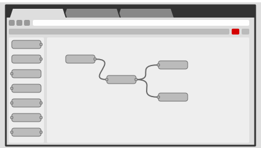
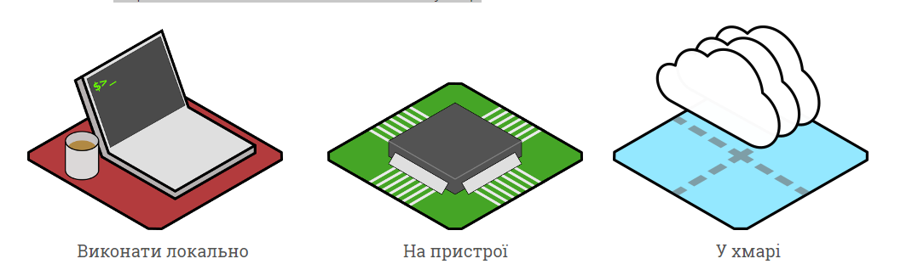
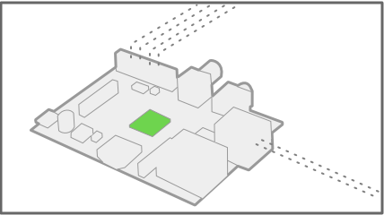
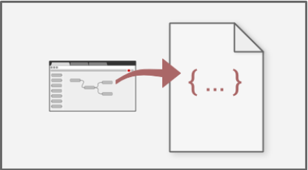

| [На головну](../)  | [ < Розділ > ](README.md)      |
| --------------------------------------------- | ------------------------------ |
|                                               | [Редактор NODE-RED ->](1_2.md) |

## Про NODE-RED 

**Node-RED** - це інструмент для візуального програмування потоком даних, розроблений працівниками компанії IBM для поєднання різноманітних пристроїв, API та онлайн-сервісів як складових частин Інтернету речей. Node-RED дає можливість програмувати об’єднані апаратні пристрої, API та сервіси онлайн новими способами, інколи навіть не використовуючи текстові мови програмування. 

### Редагування потоку на основі браузера

Редактор Node-RED базується на браузері, який дозволяє легко об’єднувати в потоки вузли з широкого набору палітри, які можуть бути розгорнуті для виконання лише одним клацанням миші. 

Node-RED дає змогу працювати з браузерним редактором потоків даних як окремими вузлами з різним функціоналом, що уможливлюють створення JavaScript-функцій. Причому можна використовувати як базові вузли, якими одразу забезпечений Node-RED, так і встановлювати вузли з додатковим функціоналом з репозиторію NPM або ж навіть створити свій власний вузол з унікальним функціоналом. 

Програми або ж їхні частини, розроблені за допомогою Node-RED, можуть бути збережені та поширені для вільного використання. Саме середовище побудовано на основі Node.js. Потоки, створені за допомогою Node-RED, зберігаються у вигляді JSON. За ініціативою IBM у 2016 році Node-RED став відкритим програмним забезпеченням (open-source) як частина проекту JS Foundation.

Легке середовище виконання (runtime) побудоване на Node.js, в повній мірі використовуючи перевагу його подіє-орієнтованої не блокуючої моделі. Це робить його ідеальним для роботи на краю (Edge) мережі на недорогих апаратних засобах, таких як Raspberry Pi, а також у хмарі.

Діапазон вузлів палітри легко розширити додаванням великої кількості модулів (сотні тисяч) зі сховища Node  щоб отримати нові можливості.

Потоки, створені в Node-RED, зберігаються за допомогою JSON, що дозволяє легко імпортувати та експортувати їх для спільного використання з іншими.

Онлайн-бібліотека потоків (flow) дозволяє вам поділитися своїми найкращими потоками з усім світом.

[Редактор NODE-RED ->](1_2.md) 