| [На головну](../)  | [Розділ](README.md)  |
| --------------------------------------------- | -------------------- |
| [<- Про NODE-RED](1_1.md)                     | [Проекти ->](1_3.md) |

## Редактор NODE-RED 

[Джерело](https://nodered.org/docs/user-guide/editor/)

Редактор складається з таких 4 компонентів (рис.1.1):

-   у верхній частині міститься заголовок, що містить кнопку розгортання, головне меню, і якщо користувач пройшов автентифікацію, меню користувача.

-   ліворуч знаходиться **палітра (palette),** яка містить вузли доступні для використання

-   посередині знаходиться основна **робоча область(workspace)**, в якій створюються потоки

-   праворуч знаходиться бічна панель (**sidebar**)

Компоненти редактора

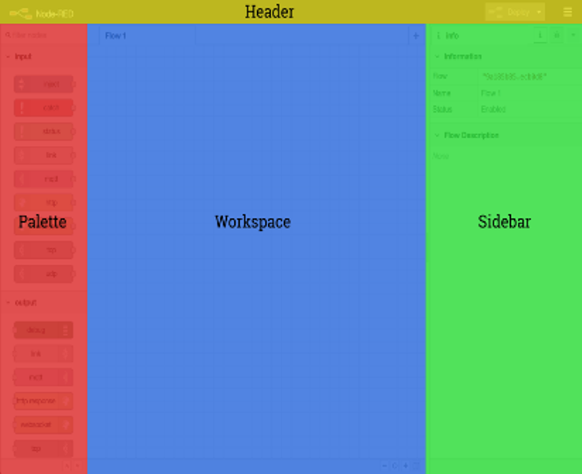

рис.1.1.Вікно редактора Node-RED

### Робоча область

Основна **робоча область** (**workspace**) - це місце, де розробляються потоки (flow) шляхом перетягування з палітри і з'єднання між собою вузлів (nodes). Робоча область має ряд вкладок вздовж вершини - по одній для кожного потоку і будь-яких підпотоків, що були відкриті (рис.1.2).

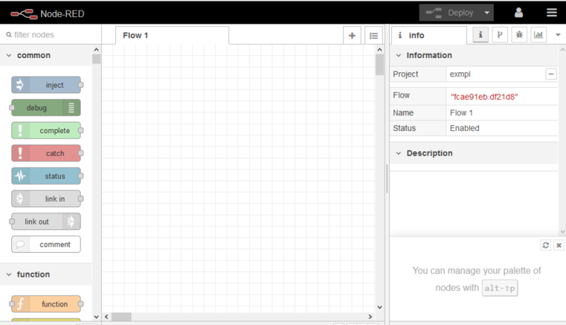

рис.1.2. Робоча область Node-RED

#### Інструменти перегляду 

Нижній колонтитул містить кнопки для збільшення/зменшення та відновлення стандартного рівня масштабування. Він також містить кнопку перемикання для навігатора перегляду (рис.1.3).

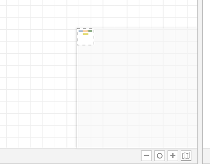

Рис.1.3. Hобоча область нижнього колонтитула з активним навігатором перегляду.

Навігатор перегляду забезпечує зменшений вигляд всієї робочої області, виділяючи ту зону, яку необхідно відобразити. Цю зону можна перетягнути всередині навігатора, щоб швидко перейти до інших частин робочої області. Це також корисно для пошуку вузлів, які були \"втрачені\" на інших краях робочого середовища.

#### Налаштування вигляду

Вигляд робочої області можна налаштувати за допомогою вкладки \" View' в діалоговому вікні \" User Settings \" (рис.1.4)

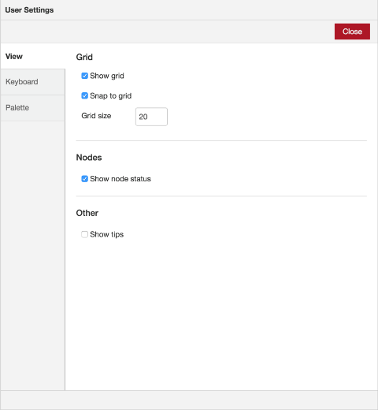

Рис.1.4. вкладка «User Settings»

#### Потоки ([Flows](https://nodered.org/docs/user-guide/editor/workspace/flows))

Усі програма складається з об'єднання вузлів -- **потоків**. Потоки розробляються в межах вкладок браузера з певною назвою (рис.1.5). Вкладки також називаються потоками, хоч на ній може бути кілька наборів об'єднаних вузлів. Потоки (вкладки) можуть називатися однаково, хоч це вносить плутанину.

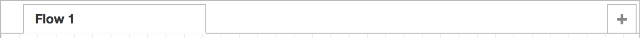

Рис.1.5. Вкладки потоку

Примітка. Термін "потік" також використовується для неофіційного опису одного набору підключених вузлів. Таким чином, потік (вкладка) може містити кілька потоків (набори з'єднаних вузлів).

Щоб додати новий потік натисніть кнопку `+` що знаходиться на верхній панелі (рис.1.5)

Щоб змінити властивості потоку двічі натисніть на його вкладці у верхній панелі. Відкриється діалогове вікно Flow Properties (рис.1.6).

Рис.1.6. Редагування властивостей потоку

У діалоговому вікні може бути встановлена назва (name) та опис (description) потоку. Для форматування опису може використовувати синтаксис [Markdown](https://pupenasan.github.io/ProgIngContrSystems/%D0%9B%D0%B5%D0%BA%D1%86/MarkDown.html). Опис з\'явиться у бічній панелі. Для відключення або включення потоків можна використовувати властивість Enable. Відключені потоки моужть редагуватися, але не виконуються. 

Щоб видалити потік, натисніть кнопку «Delete» у діалоговому вікні Flow Properties.

Повний перелік потоків доступний через кнопку переліку.

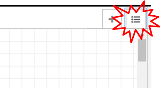

#### Вузли (Nodes)

**Вузли** можуть бути додані до робочої області такими шляхами:

-   Перетягуванням їх з [палітри](#палітра-palette),

-   Використовуючи діалогове вікно швидкого додавання

-   Імпортуючи з бібліотеки чи буферу обміну.

Вузли з'єднуються один з одним за допомогою з'єднань через їхні порти. Вузол може мати не більше одного вхідного порту, але багато вихідних. Порт може мати мітку (label), що буде показуватися при наведенні курсору (рис.1.7). У вузлі можуть бути вказані спеціальні мітки, наприклад, вузол Switch (перемикач) показує правило що відповідає даному порту. Мітки можна налаштувати в діалоговому вікні редагування вузла.

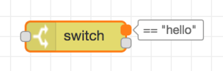

рис.1.7. Мітки порту вузла

Деякі вузли відображають статусне повідомлення або піктограми біля вузла. Це використовується для позначення стану вузла в режимі виконання. Наприклад, вузли можуть вказувати на те, чи підключені вони в даний час (статус «connected» на рис.1.8).

Рис.1.8. Елементи вузлів

Якщо вузол має які-небудь зміни, що не були розгорнуті в режимі виконання, це буде відображено синім кружком над ним. Якщо є помилки у конфігурації, то буде відображатися червоний трикутник (рис.1.8).

Деякі вузли містять кнопку з лівого або правого боку. Вони служать для взаємодії з вузлом в редакторі. Вузли Inject і Debug є єдиними основними вузлами, які мають такі кнопки (див. рис.1.8)

##### Діалог швидкого додавання

Діалогове вікно швидкого додавання - це простий спосіб додати вузол до робочої області, без необхідності перетягувати її з палітри. Діалогове вікно відкривається шляхом утримування  Ctrl (або Command) разом з натисканням (лівий клік миші) в робочі області (рис.1.9).

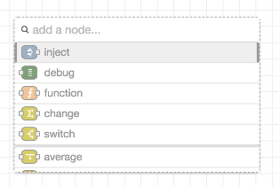

Рис.1.9. Діалогове вікно швидкого додавання

У діалоговому вікні міститься повний список всіх вузлів, доступних для додавання. Тут показуються п\'ять основних вузлів сервера у верхній частині списку, а потім всі нещодавно додані вузли та, нарешті, повний алфавітний список решти вузлів.

Як і в основній палітрі, у діалоговому вікні можна швидко знаходити вузол або відфільтрувати список.

##### Редагування конфігурації вузла

Конфігурація вузла може бути відредагована подвійним кліком по вузлу чи натисканням клавіші Enter коли вузол в робочій області має фокус. Якщо вибрано декілька вузлів, редагуватися почне *перший* з них.

Діалогове вікно редагування вузла має три окремих розділи: властивості (properties), опис (Description) та зовнішній вигляд (Appearance) .  

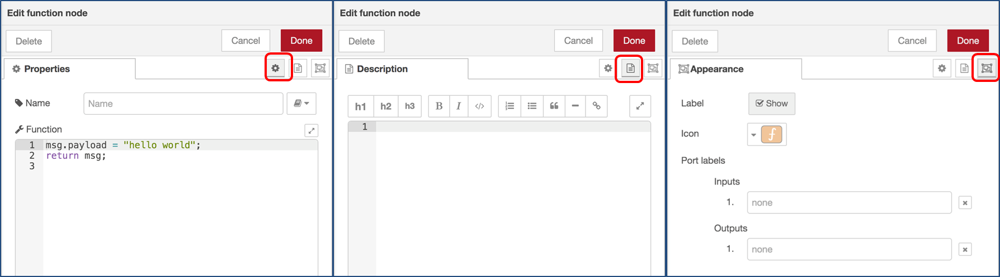

рис.1.10 Діалог редагування вузла.

У розділі властивостей (properties) відображається форма редагування (рис.1.10 ліворуч), специфічна для конкретного типу вузла. 

У розділі опису (Description) вноситься документація по конкретному екземпляру вузла у форматі Markdown. Ця документація буде видима на інформаційному вікні правої бокової панелі, коли вузол буде видимий. 

У розділі зовнішнього вигляду (Appearance) налаштовуються відображення вузла, зокрема необхідність відображення назви вузла та іконка, а також позначення його входів та виходів.

При натисканні на піктограму бачимо засіб вибору значків вузла, який можна використовувати для вибору іконки вузла зі списку всіх доступних іконок.

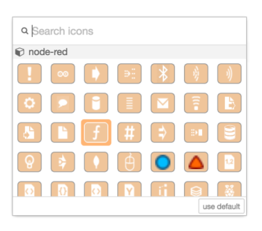

рис.1.11 Набір іконок для вузла

Кожен вузол може бути відключений/включений опцією "Enable". Якщо вузол відключено, він не буде створений в середовищі виконання при розгортанні.

##### Конфігураційні вузли

**Конфігураційні вузли** (**config Node**) - це спеціальний тип вузла, що містить конфігурацію багаторазової доступності, що може бути розподілена між звичайними вузлами потоку.

Наприклад, вузли «MQTT In» і «MQTT Out» використовують конфігураційний вузол «MQTT Broker» для представлення спільного підключення до брокера MQTT. Конфігураційні вузли додаються через діалогове вікно редагування вузла, що вимагає вузол конфігурації (рис.1.12). У ньому буде поле для вибору з наявних вузлів конфігурації потрібного типу або додати новий екземпляр.

рис.1.12.Додавання вузла конфігурації

Натиснувши кнопку поруч із полем вибору, відкриється діалогове вікно редагування для вибраного вузла або додається новий екземпляр (рис.1.13).

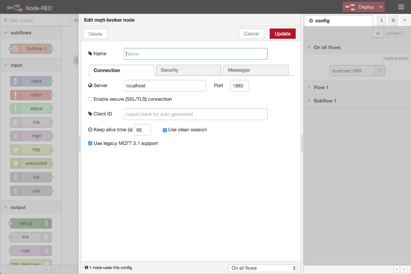.

рис.1.13.Вікно редагування вузла конфігурації

У діалоговому вікні редагування конфігураційного вузла є лише розділи властивостей та опису вузла, оскільки вузол конфігурації не має піктограм або портів для встановлення міток. У нижній частині діалогового вікна вказується, скільки вузлів використовує цей конфігураційний вузол. Вона також містить поле вибору для означення області застосування конфігураційного вузла. Обсяг визначає те, який поточний вузол конфігурації доступний. За замовчуванням він доступний для всіх потоків, але вікно вибору може бути використане для того, щоб зробити його локальним лише для одного потоку. 

Для керування всіма конфігураційними вузлами може використовуватись [бічна панель конфігурації вузлів](#конфігураційні-вузли-configuration-nodes)

#### З'єднання (Wires)

Вузли з'єднують разом, шляхом натискання на ліву кнопку миші по порту вузла, перетягуючи так званий дріт до кінцевого вузла та відпускаючи кнопку миші (рис.1.14).

рис.1.14. Формування з'єднання між вузлами.

Альтернативно можна створити з'єднання шляхом утримання клавіші Ctrl/Command і натискання/відпускання лівою кнопкою миші на порт вузла, а потім натиснув на пункт призначення. Якщо   Ctrl/Command залишається утримуваним, а безпосередньо провідний вузол призначення має вихідний порт, тоді з цього порту запускається новий дріт. Це дозволяє швидко з'єднуватися багатьом вузлам разом. Це також можна поєднати з діалогом швидкого додавання, яке спрацьовує  Ctrl / Command-Click   на робочому місці, для швидкої вставки нових вузлів і вони вже будуть підключені до попередніх вузлів потоку.

Якщо вузол із вхідним та вихідним портом перетягнений до середньої точки дроту, дріт прийме вигляд штрихової лінії. При відпусканні він автоматично вставляється в потік в цій точці (рис.1.15).

рис.1.15. Перемістіть вузол на з'єднання(дріт), щоб вставити його до потоку.

Щоб від\'єднати дріт від порту, виберіть дріт, натисніть на нього і потримайте клавішу Shift. Після цього дріт відключається від порту і може бути скинутий на інший порт. Якщо відпустити кнопку над робочою панеллю, дріт буде видалено. Якщо до порту є декілька дротів, підключених до нього і жоден з них не буде виділений, коли натискається   Shiftt  всі дроти почнуть рухатися.

Щоб видалити дріт, спочатку виберіть його, натиснувши на нього, а потім натисніть кнопку  delete

#### Групи (Groups)

*Починаючи з Node-RED 1.1.0*

Вузли можуть бути об'єднані разом, щоб утворити групу. Потім вони можуть бути переміщені або скопійовані як єдиний об’єкт у редакторі.

Групи можуть надати колір межі та фону, а також додаткову мітку.

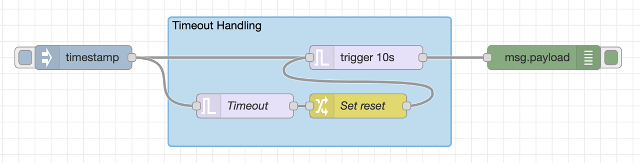

Щоб створити групу, виберіть вузли та виберіть у меню опцію "Groups -> Group selection".

Властивості групи можна відредагувати, двічі клацнувши на групі, або натиснувши `Enter` , коли робоча область має фокус і група обрана.

Налаштування вузлу має дві вкладки Properties (властивості) та Description (опис). У властивостях можна налаштувати кольори та ім'я групи.   

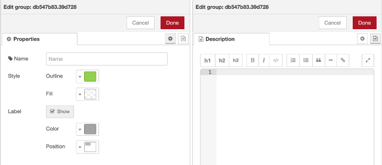

Вузли можна додати до наявної групи, перетягнувши їх у групу. Це працює лише для додавання одного вузла за раз.

Можна об'єднати кілька вибраних груп в єдину групу. Виберіть усі групи та вузли для об’єднання в одну групу. Потім виберіть у меню опцію "Групи -> Об'єднання вибраних".

Щоб розгрупувати вузли, виберіть групу, а потім виберіть у меню опцію "‘Groups -> Ungroup selection".

Щоб видалити вузол із групи, виберіть вузол, а потім виберіть у меню опцію "Groups -> Remove from group".

#### Під-потоки (Subflows)

**Під-потоки** - це сукупність вузлів, які згортаються в єдиний вузол у робочій області. Вони можуть бути використані для зменшення певної візуальної складності потоку або для об'єднання групи вузлів, що використовується в різних місцях. Після створення, під-потік додається до палітри доступних вузлів. Потім окремі екземпляри під-потоку можна додати до робочої області, як і будь-який інший вузол. Під-потік не може існувати сам собою без жодних вузлів, він повинен містити їх прямо або опосередковано.

##### Створення та видалення під-потоків

Під-потік можна створити, вибравши в меню пункт 'Subflow -\> Create subflow' Це створить порожній під-потік і відкриває його у робочій області.

Також можна перетворити поточний вибір вузлів на підрівень, вибравши в меню пункт 'Subflow -\> Selection to Subflow'. Ці вузли будуть переміщені в новий під-потік і замінені на його екземпляр у потоці (рис.1.16).

рис.1.16.Створення під-потоку

Це можливо тільки в тому випадку, якщо вхідні з'єднання підключені до одного вузла, - тому що результуючий під-потік вузла сам може мати не більше одного входу (рис.117).

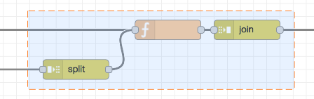

рис.1.17. Недійсний вибір для під-потоку

Для видалення під-потоку та всіх його екземплярів може бути використана кнопка 'delete subflow' на панелі інструментів під-потоку.

##### Редагування під-потоку

Існує два способи відкрити під-потік для редагування його вмісту: двічі клацнути на вузол у палітрі або натиснути кнопку 'Edit flow template' у діалоговому вікні редагування вузла (рис. 1.18)

Рис.1.18. *Редагування під-потоку*

Під-потік відкривається в робочій області як нова вкладка. На відміну від звичайних вкладок потоку, вкладки під-потоків можуть бути закриті, щоб приховати їх.

##### Входи & Виходи та властивості

Входи та виходи під-потоку представлені сірими квадратними вузлами, які можуть бути підключені до потоку. Панель інструментів надає можливість додавання та видалення цих вузлів. Як і в звичайних потоках у вузлів, може бути не більше одного вводу та багато виходів, за необхідності.

Додатково до під-потоку можна добавити вихід `status` що може бути використаний ля оновлення статусу підпотоку.

Кнопка 'edit properties' відкриває вікно властивостей під-потоку (рис.1.19). Як і у діалоговому вікні властивостей потоку, тут можна вказати назву, відображення та опис під-потоку. Можна також встановити категорію під-потоку, або шляхом вибору з однієї з існуючих категорій або додати нову.

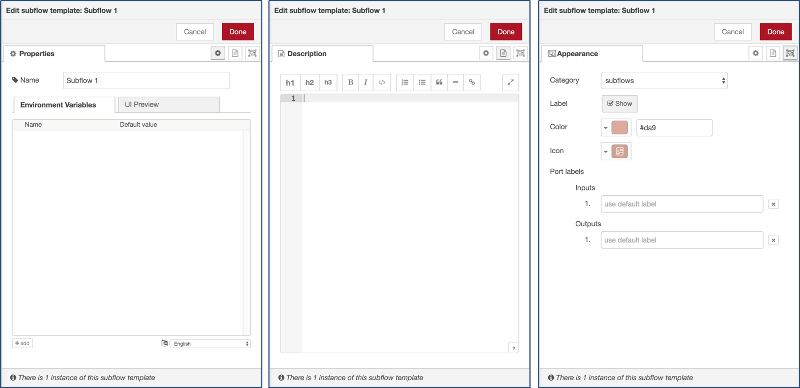

рис.1.19. Вікно редагування властивостей під-потоку

Вкладка "Properties" діалогового вікна редагування може використовуватися для означення набору властивостей, які потім можна налаштувати для кожного екземпляру підпотоку. Потім властивості піддаються впливу змінних середовища в підпотоці.

Кожен запис у таблиці властивостей можна розширити, щоб налаштувати його відображення під час редагування екземпляру підпотоку. На вкладці "UI Preview" подано попередній перегляд того, як вони виглядатимуть.

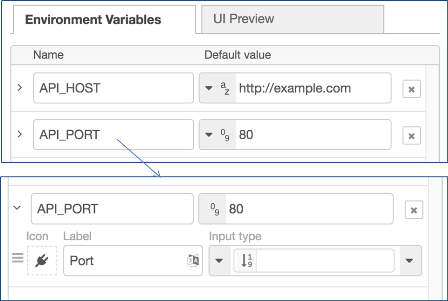

На вкладці Appearance можна:

- вказати категорію палітри, де буде відображатися підпотік
- вибрати, чи відображатиметься мітка вузла

- змінити колір вузла
- змінити піктограму вузла
- надати спеціальні мітки для портів.

Кнопку "delete subflow" на панелі інструментів підпотоку можна використовувати для видалення підпотоку та *всіх* його екземплярів.

#### Вибір вузлів та потоків

Вузол вибирається при натисканні на ньому. Це призведе до скасування вибору будь-якого іншого елемента. Бічна панель інформації буде оновлюватися, щоб відобразити властивості вузла та текст довідки для його типу. Якщо  при натисканні на вузол тримається Ctrl  або Command , він буде доданий до поточного вибору (або видалений, якщо він вже був обраний). Якщо при натисканні на вузол утримується Shift , він вибере цей вузол та всі інші вузли, до якого той підключений. Дріт (з'єднання) вибирається при натисканні на ньому. На відміну від вузлів, можна вибрати лише одне з'єднання за один раз.

Для вибору кількох вузлів може використовуватися інструмент «ласо» (рис.1.20). Він активується за допомогою перетягування одночасно з натисканням в робочій області. Його не можна використовувати для вибору з'єднання.

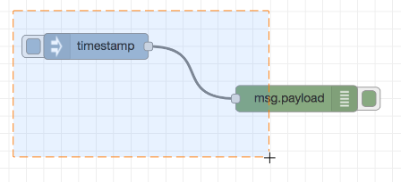

рис. 1.20.Вибір декількох вузлів за допомогою lasso

Щоб вибрати всі вузли потоку переконайтеся що робоча область має фокус, а потім натисніть Ctrl/Command-a.

Всі вузли та з'єднання, що попали в виділення підтримують копіювання/вирізання/вставка. Зверніть увагу, що дії використовують внутрішній буфер обміну, а не системний.

Вибрати декілька потоків у редакторі можна, натиснувши клавішу  `Ctrl/Command`  при натисканні на її вкладку. Після вибору їх можна видалити, скопіювати або експортувати так само, як і будь-які інші вибрані вузли.

Редактор підтримує стандартні дії копіювання/вирізання/вставки. Зверніть увагу, що вони використовують внутрішній буфер обміну, а не системний буфер обміну.

#### Імпорт та експорт потоків

Потоки можна імпортувати та експортувати з редактора, використовуючи формат JSON, що дозволяє дуже легко обмінюватися потоками з іншими редакторами.

Діалогове вікно Імпорту можна використовувати для імпорту потоку за допомогою таких методів:

- вставлення в потік JSON потоку безпосередньо,
- завантаження файлу потоку з JSON,
- вибір локальної бібліотеки потоків,
- вибір потоків прикладів, передбачених встановленими вузлами.

У всіх випадках діалогове вікно пропонує можливість імпортувати вузли до поточного потоку або створити для них новий потік.

Щоб імпортувати потік, відкрийте діалогове вікно «Import»-\> "Clipboard", вставте json та натисніть «Import to Current flow». Кнопка 'Import' активна лише тоді, коли у діалогове вікно вставлений правильний JSON. У діалоговому вікні також є можливість імпортувати вузли в поточний потік або створити для них новий потік (рис.1.21)

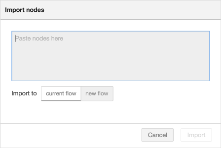

рис. 1.21.Діалог імпорту 

Діалогове вікно "Експорт" можна використовувати для копіювання потоку json з редактора такими методами:

- копіювання JSON в буфер обміну системи,
- завантаження JSON у вигляді файлу,
- збереження його в локальній бібліотеці потоків.

Він може експортувати або вибрані вузли, поточний потік (включаючи його вузол вкладки), або повну конфігурацію потоку.

Він пропонує можливість експортувати компактний або відформатований JSON. Компактний варіант генерує один рядок JSON без пробілів. Відформатований варіант JSON відформатований у декілька рядків із повним відступом - що може бути простішим для читання.

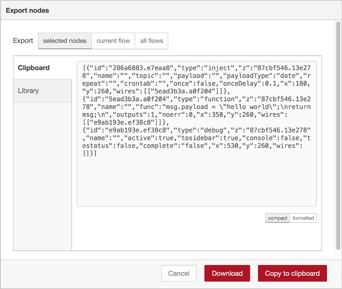

рис.1.22. Діалог Export 

#### Пошук потоків

Для пошуку вузлів усередині робочої області, включаючи конфігураційні вузли, може використовуватися діалогове вікно пошуку в інформаційній панелі. Редактор індексує всі властивості вузлів, тому його можна використовувати для пошуку вузла за його ідентифікатором, типом, ім\'ям або будь-якою іншою властивістю. Вибір вузла у списку результатів покаже той вузол у редакторі (рис.1.24).

рис.1.24 Діалог пошуку

Синатаксис пошуку навеений за [цим посиланням](https://nodered.org/docs/user-guide/editor/workspace/search#search-syntax).

### Палітра (Palette)

Палітра містить всі вузли, які встановлені та доступні для використання. Вони організовані в декілька категорій починаючи зверху з inputs, outputs та functions (рис.1.25). Якщо є під-потоки, вони з\'являються у категорії у верхній частині палітри. Категорії можна розширити або згорнути, натиснувши заголовок. Кнопки  та    в нижній частині палітри можуть бути використані для згортання або розширення всіх категорій.

Над палітрою є поле для введення, яке можна використовувати для фільтрації списку вузлів.

рис.1.25. Палітра вузлів

Для встановлення нових вузлів до палітри може використовуватися **менеджер палітри** (Palette Manager). Доступ до нього можна отримати за вкладкою Palette tab в User Settings dialog (рис.1.26).

рис.1.26. Palette Manager - Nodes tab

Менеджер палітри має дві вкладки:

-   список Nodes (рис.1.26) - список вузлів, які вже встановлені у середовищі виконання

-   список Install (рис.1.27) - список вузлів доступних до встановлювання

Кожен запис у списку Nodes list відображає назву та версію модуля, а також список окремих типів вузлів, які надає модуль. Параметри надаються для видалення, відключення або оновлення кожного модуля. Якщо вузол в даний час використовується в потоці, модуль неможливо видалити чи деактивувати в палітрі. Вкладка Install може використовуватись для пошуку доступних модулів та їх встановлення.

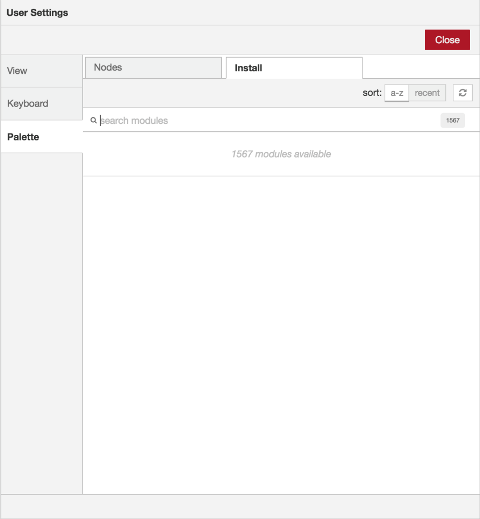

рис. 1.27. Palette Manager -- вкладка Install

Щоб знайти модуль, введіть його ім\'я на панелі пошуку. Результати пошуку показують деталі модулів, в тому числі, коли востаннє було оновлено, і посилання на його документацію. Його можна встановити, натиснувши кнопку 'install'.

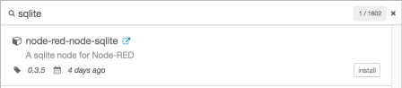

рис.1.28. Palette Manager -- Install module details

### Бічна панель (Sidebar)

Панель відкриється якщо натиснути на значок в заголовку бічної панелі або вибравши їх з випадаючого списку(рис.1.29).

- Information -- переглянути інформацію про вузли та їх допомогу
- Debug -- перегляд повідомлень, переданих вузлам Debug 
- Configuration Nodes -- керування конфігураційними вузлами 
- Context data -- перегляд вмісту контекстів

Деякі вузли додають власні панелі бічної панелі, наприклад **node-red-dashboard**

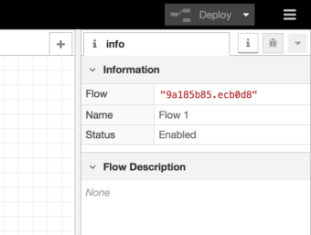

рис.1.29. Editor Sidebar

Можна змінити розмір бічної панелі, перетягнувши її край робочої області. Якщо край перетягнути близько до правого краю, бічна панель буде прихована. Це може бути показано знову, вибравши опцію 'Show sidebar' в меню View menu, чи через комбінацію Ctrl/⌘-Space.

#### Інформація (Information)

Починаючи з Node-RED 1.1.0 на цій бічній панелі відображається інформація про потоки. Сюди входить контурний вигляд усіх потоків та вузлів, а також деталі поточного вибору. Через цю вкладку можна керувати debug та inject.

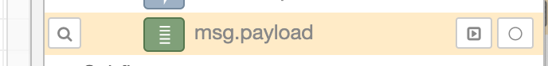

На бічній панелі Information відображається більше інформації про поточний вибраний вузол, зокрема:

-   Перелік його властивостей

-   Текст довідки до вузла

Якщо нічого не вибрано, він відображає опис поточного потоку, який можна редагувати в Flow Properties edit dialog.

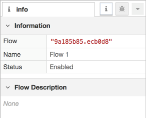

рис.1.30. Information Sidebar

#### Help

У попередніх версіях Node-RED текст довідки для обраного на даний момент вузла відображався на бічній панелі Інформація. Введена у Node-RED 1.1.0, бічна панель довідки забезпечує доступ до вмісту довідки для всіх вузлів редактора - не лише поточного вибору. У верхньому розділі міститься повний вміст, який можна перемикати за допомогою кнопки.

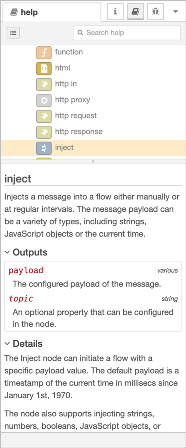

#### Debug messages

На бічній панелі  Debug (рис.1.31) відображаються повідомлення, передані вузлам Debug в потоці, а також певні повідомлення журналу середовища виконання (runtime).

рис.1.31.Вікно повідомлень.

Для отримання додаткової інформації про те, як використовувати бічну панель Debug та для розуміння структури повідомлень, прочитайте відповідний розділ даного посібника.

За замовчуванням бічна панель Debug відображає всі передані йому повідомлення. Повідомлення можна фільтрувати в панелі параметрів фільтрів, що відкривається відповідною кнопкою (рис.1.32).

рис.1.32. Параметри фільтра налагоджування

Панель містить 3 опції:

-   *all nodes* - відображає всі повідомлення

-   *selected nodes* - виберіть певні вузли відлагодження зі списку всіх доступних вузлів

-   *current flow* - відображає лише повідомлення з вузлів поточного потоку у робочій області

Бічна панель Debug може відображати лише 100 останніх повідомлень. Якщо бічна панель наразі показує фільтрований список повідомлень, приховані повідомлення входять до 100 обмежених. Бічна панель може бути очищена через певний час натисненням на кнопку. Якщо потік має вузли Debug, які створюють багато повідомлень (флуд), і не фільтруються з бічної панелі, то краще їх відключити, натиснувши їхню кнопку в робочій області.

Кнопка  в нижньому колонтитулі бічної панелі можна використовувати для відкриття окремого вікна веб-переглядача, що містить бічну панель Debug.

#### Конфігураційні вузли (Configuration nodes)

Бічна панель конфігураційних вузлів (Configuration nodes) надає список всіх конфігураційних вузлів в одному екрані. Кожен вузол показує його тип і мітку, а також підрахунок того, скільки вузлів поточного потоку використовує цей вузол конфігурації (рис.1.33).

Якщо конфігураційний вузол не використовується, він відображається пунктиром. Щоб показати лише невикористані вузли переглядач також можна фільтрувати, вибравши у заголовку фільтр \"unused \". У діалоговому вікні редагування подвійним кліком миші можна відкрити конфігураційний вузол.

рис. 1.33. Конфігураційні вузли бічної панелі

#### Бічна панель: Контекстні дані (Context data)

Бічна панель контексту відображає вміст сховища контекстних даних (рис.1.34). Щоб отримати додаткові відомості про використання контексту, прочитайте відповідний розділ довідника.

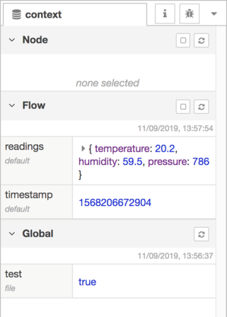

рис.1.34. бічна панель контекстних даних

Панель розділена на три частини, по одному для кожного типу контексту (рис.1.34). Розділ \'Node\' показує контекст поточного виділеного вузла. Він не відображає вміст автоматично, а вимагає, щоб користувач натиснув кнопку оновлення, щоб завантажити його. Розділ \'Flow\' показує контекст поточного потоку. Він автоматично оновлюється кожного разу, коли потік змінюється в основній робочій області. У розділі «Global» відображається глобальний контекст і завантажується кожного разу, коли завантажується редактор.

У розділах «Node » та «Flow » встановлено прапорець біля кнопки оновлення, щоб увімкнути автоматичне оновлення вмісту кожного разу, коли вибраний вузол чи потік змінюються.

Наведення миші на будь-яке ім'я властивості контексту покаже кнопку оновлення, яку можна використовувати для оновлення лише цього значення.

Наведення курсор на значення властивості контексту покаже кнопку для копіювання його вмісту в системний буфер обміну. Значення буде перетворене в JSON, тому не всі значення можна скопіювати.

[Проекти ->](1_3.md) 