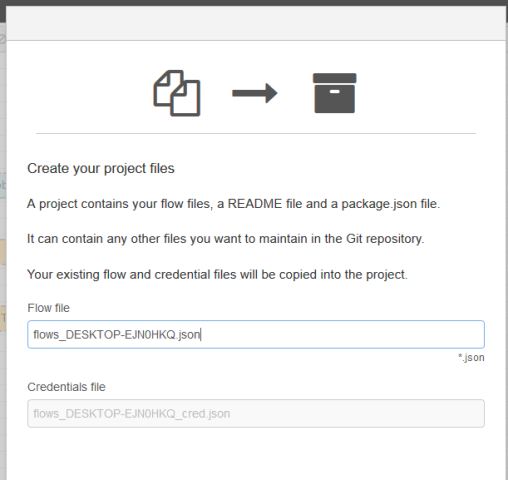
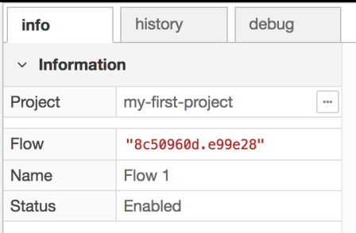
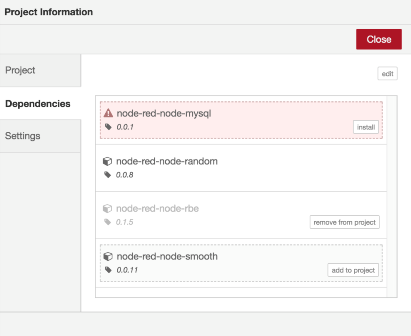
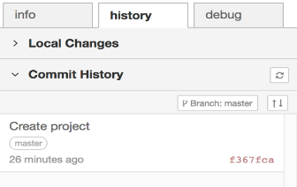

[<- На головну](../)  [Розділ](README.md)

## 1.3. Проекти (Projects)

### Представлення про проекти 

Проекти є одним із способів керування файлами потоку. Замість того, щоб трактувати свої потоки як просту пару файлів, вони представляють все необхідне для створення програми Node-RED що може бути розповсюджена. Проекти підтримуються репозиторієм Git, що означає, що усі файли повністю керовані версією та дозволяють розробникам використовувати знайомі робочі процеси для співпраці з іншими. У версії 0.18 функція проектів знаходиться в режимі попереднього перегляду. Це означає, що він повинен бути включений у файлі налаштувань.

Щоб увімкнути функцію проектів, відредагуйте свій файл settings.js  і додайте наступну опцію в блок module.exports , після чого перезапустіть Node-RED.

```
editorTheme: {
projects: {
	enabled: true
}
},
```

Файл settings.js  експортує *об\'єкти*  *JavaScript.* Для конфігурування Node-RED, ви повинні розуміти, як змінити об\'єкт JavaScript, додавши нові або змінюючи існуючі пари ключів / значень, такі як editorTheme що наведені вище. Ця функція залежить від наявності утиліт командного рядку git та ssh-keygen. Node-RED перевірить їх на запуск і повідомить вас, якщо вони відсутні.

### Створення першого проекту 

Коли ви відкриваєте редактор, то бачите екран привітання, який запрошує вас створити свій перший проект за допомогою ваших існуючих файлів потоку.

 

рис.1.35. Вікно помічника створення проектів

Це допоможе виконати наступні кроки.

1.  **Налаштуйте клієнт керування версіями**

Node-RED використовує інструмент з відкритим кодом Git для керування версіями. Він відстежує зміни ваших файлів проекту і дозволяє користуватися ними на дистанційних сховищах - репозиторіях (типу RDP). Коли ви здійснюєте певні зміни, Git записує хто вніс зміни з іменем користувача та електронною адресою. Ім\'я користувача може бути будь-яке.

Ви вже можете налаштувати свій Git-клієнт - в якому Node-RED буде повторно використовувати ці налаштування. Ви можете змінити ці налаштування в будь-який час за допомогою головного діалогу налаштувань Node-RED.

[Докладніше про налаштування Git-клієнта](https://help.github.com/articles/set-up-git/#setting-up-git) (GitHub)

2.  **Створіть свій проект**

Наступний крок дає змогу назвати ваш проект та надати йому опис.

3.  **Створіть файли проекту**

Node-RED автоматично перенесе ваші файли потоків у ваш проект. Ви можете перейменувати їх тут, якщо хочете.



4.  **Налаштування шифрування файлу облікових даних**

Так, як ви можете поділитися своїм проектом на публічних сайтах, таких як GitHub, в такому випадку дуже рекомендується шифрувати файл облікових даних Щоб його зашифрувати, потрібно вибрати ключ, який буде використовуватися для захисту файлу. Цей ключ не зберігається в межах проекту. Якщо хтось клонує ваш проект, вам потрібно буде надати їм ключ для розшифровки файлу облікових даних. Інакше їм доведеться відредагувати потоки, щоб надавати власні облікові дані.

Потім проект створюється у каталозі: \~/.node-red/projects/\<project-name\>.

### Робота з проектами 

Створивши свій проект, ви можете продовжувати користуватися редактором Node-RED, як і завжди. Є кілька нових частин редактора, які були додані для роботи з вашим проектом.

#### Доступ до налаштувань проекту 

Бічна панель інформації у верхній частині сторінки показує, з яким проектом ви працюєте. Біля назви проекту є кнопка, яка відкриває діалогове вікно Параметри проекту - Project Settings (рис.1.36)



рис.1.36. Параметри проекту

Ви також можете отримати доступ до нього через опцію в головному меню Projects -\> Project Settings 

Діалогове вікно має три вкладки:

-   Project - дозволяє редагувати файл README.md проекту..

-   Dependencies - керувати списком модулів вузлів, на які залежить ваш проект

-   Settings - керувати налаштуваннями проекту, включаючи GIT керування

Кожен проект має свій власний файл package.json, який містить список модулів вузлів, від яких залежить проект. Редактор Node-RED відстежує, які вузли ви використовуєте в потоці, і допомагає вам підтримувати цей список залежностей (рис.1.37).



рис.1.37.

На рис.1.37 поточний проект має три модулі, перераховані в його файлі package., кожен в різному стані:

-   node-red-node-mysql наразі не встановлено

-   node-red-node-random  використовується поточним потоком

-   node-red-node-rbe є в списку встановлених, але не використовується поточним потоком

-   node-red-node-smooth забезпечує вузол, який використовується поточним потоком, але цей модуль не вказаний як залежний.

Необхідно оновлювати список залежностей, якщо ви хочете поділитися проектом з іншими - так як це допоможе користувачам встановити необхідні модулі.

Вкладка параметрів проекту (project settings) дозволяє вам керувати файлами потоку, конфігурацією шифрування ваших облікових даних та налаштовувати локальні Git гілки та віддалені репозитарії.

#### Контроль версії 

До бічної панелі була додана нова вкладка history. Тут ви керуєте контролем над версією вашого проекту (рис.1.38). Вкладка має два розділи:

-   Local Changes - показує файли проекту, які змінилися, дозволяючи виставити і впорядковувати їх.

-   Commit History - список всіх коммітів у репозитарії, з інструментами для push коммітів до віддалених репозитаріїв.


рис.1.38. Вікно контролю версій.

Кожного разу, коли ви змінюєте файл проекту, наприклад, розгорнувши нову конфігурацію потоку, він буде перелічений в розділі 'Local files' Ви можете натиснути на назву файлу, щоб побачити, як відрізняється зміна. Коли ви наведете курсор миші на файл, ви побачите кнопку  «**+»** - натиснувши на яку він переміститься до списку 'Changes to commit'.

Коли ви встановите файли, з якими хочете працювати, натисніть кнопку commit введіть повідомлення та підтвердьте.

У розділі Commit History перелічено всі комміти у поточній гілці сховища (рис.1.39). Під час створення проекту Node-RED автоматично створює початковий набір файлів за замовчуванням для проекту.



рис.1.39. Вкладка Commit history

У верхній частині списку знаходиться кнопка 'Branch' що дозволяє вам перевірити/створити гілки в сховищі. Якщо у вашому репозитарії є налаштований дистанційний репозитарій, то є також кнопка, яка показує скільки новіших коммітів у вашому локальному репозитарію, порівняно з дистанційним. Це дозволяє вибрати дистанційне/відгалужене відстеження і натискання/перетягування змін до пульта дистанційного керування.

Це одна з областей, в якій редактор Node-RED намагається спростити дію користувачу і не надає весь набор опцій, що надає git. Наприклад, він не надає опцій для перебазування місцевих коммітів, або примусово не вносить зміни до дистанційного репозиторію. Та ви все ще можете робити ці речі, повернувшись до командного рядка.

#### Створення, відкривання, клонування проектів 

Після того, як ви створили свій перший проект, перенісши існуючі файли потоку, ви можете створити додаткові проекти.

Оберіть з меню Projects -\> New  відкривається діалогове вікно Projects

Є три доступних опції:

-   відкрити існуючий проект

-   створити новий проект

-   клонування репозитарію проекту

Node-RED може виконувати лише один проект в один момент часу. Відкриваючи інший проект, ви змінюєте запущені потоки. Переглядач 'open project' також дозволяє видаляти проекти: наведіть курсор на проект у списку та натисніть кнопку видалення. Ви не можете видалити активний проект.

Можна створити новий проект. Тут ті самі опції, що й в наборі екранів  'create your first project', але об'єднані в один.

Можна клонувати існуючий віддалений репозиторій. Ви можете використовувати http(s) або git/ssh url для сховища. Якщо репозитарій вимагає автентифікації, ви повинні пройти його тут

Для http url-адреси, не включають ім'я користувача і його пароль. Ви маєте надати їх окремо, коли з'явиться запит.

Для git/ssh, Node-RED запропонує список доступних SSH відкритих ключів. Цей список генерується скануванням \~/.ssh для файлів з розширенням .pub що мають відповідні файли приватних ключів. Це також дозволяє генерувати нові пари публічних / приватних ключів через вкладку 'Git config' вікна основних налаштувань. Ці файли зберігаються в \~/.node-red/projects/.sshkeys/. Якщо в вас увімкнений adminAuth файли визначаються для поточного входу в систему, тому їм не потрібно передавати облікові дані для дистанційного репозитарію.

# 
