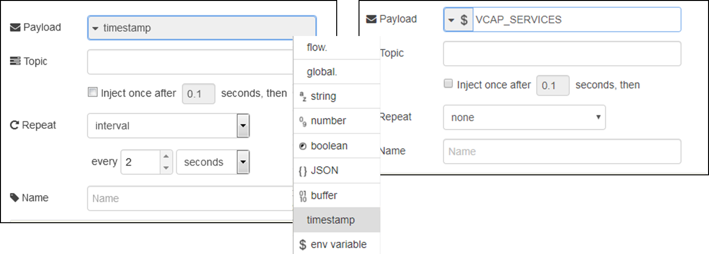
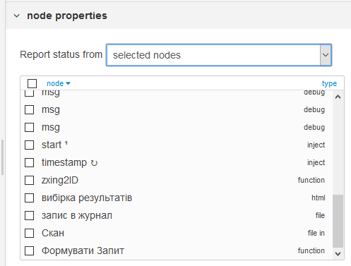
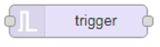
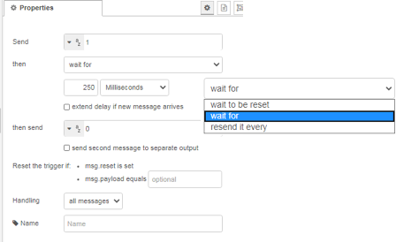
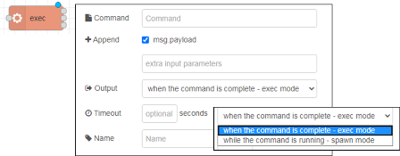
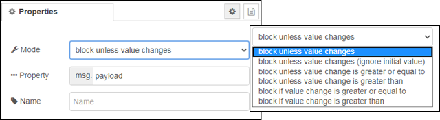

| [На головну](../)                   | [Розділ](README.md)                   |
| ----------------------------------- | ------------------------------------- |
| [<- Конфігурування безпеки](1_4.md) | [Робота з вузлом Function ->](1_5.md) |

## Основні вузли 

Палітра Node-RED включає стандартний набір вузлів, які є основними будівельними блоками для створення потоків. Цей розділ висвітлює основний набір, про який ви повинні знати. Ряд інших вузлів описано у відповідному розділі посібника

Всі вузли включають документацію, яку ви можете переглянути на вкладці Info бічної панелі коли вибираєте вузол.

### Inject (ініціювання повідомлення)

Вузол **Inject** може бути використаний для ручного запуску потоку, натиснувши кнопку вузла в редакторі. Він також може використовуватися для автоматичного запуску потоків через регулярні інтервали часу (рис.1.40).



рис.1.40. Налаштування вузла Inject

Повідомлення, надіслане вузлом Inject може мати набір атрибутів payload  (корисне навантаження) і topic (тема). Для payload можна встановити різні типи:

-   значення контексту потоку (flow context) або глобального контексту (global context)

-   рядок, число, логічне значення, Buffer або Object

-   відмітку часу (Timestamp) -- значення в мілісекундах з 1 січня 1970 року

-   \$env variable -- змінну середовища Node.js

### Debug (вивести на відлагодження)

Вузол Debug може ви використовуватися для відображення повідомлень на бічній панелі Debug у редакторі.

Бічна панель забезпечує структурований перегляд повідомлень, що надсилаються, що полегшує вивчення цього повідомлення. Поряд з кожним повідомленням бічна панель налагодження включає в себе інформацію про час надходження повідомлення та місце з якого вузлу воно надіслане. Натискання на ідентифікатор вихідного вузла покаже цей вузол у робочій області.

Кнопку на вузлі можна використовувати для ввімкнення або вимкнення його виходів. Рекомендується відключити або видалити будь-які вузли Debug, які не використовуються.

Цей вузол також може бути налаштований для відправлення всіх повідомлень до журналу середовища виконання, або для надсилання коротких (до 32 символів) повідомлень про статус налагоджуваного вузла.

### Function (функція)

Вузол Function дозволяє запускати код JavaScript для обробки повідомлень, які передаються через нього. Детальніше про використання вузла функцій розглянуто у відповідному розділі.

### Change (зміна повідомлення в потоці)

Вузол Change можна використовувати для зміни властивостей повідомлення та встановлення властивостей контексту без необхідності вдаватися до вузла Function. Кожен вузол може бути налаштований з декількома операціями, які застосовуються в такому порядку. Доступні операції:

-   **Set** - встановити властивість. Значення може бути з різними типами або може бути взяте з існуючого повідомлення або властивості контексту.

-   **Change** - пошук і заміна частин властивості повідомлення.

-   **Move** - перемістити або перейменувати властивість.

-   **Delete** -- видалити властивість.

При встановленні властивості це значення також може бути результатом виразу [JSONata](https://jsonata.org/) . JSONata - це декларативна мова запитів та перетворень для даних JSON. Детальніше про зміну повідомлення за допомогою цього вузла Ви можете [прочитати за посиланням](#_Зміна_властивостей_повідомлення).

### Switch (перемикач повідомлення)

Вузол Switch дозволяє передавати повідомлення до різних гілок потоку, оцінюючи набір правил для кожного повідомлення. Цей вузол налаштовано за допомогою властивості для перевірки - це може бути або властивість повідомлення (message property), або властивість контексту (context property).

Існує чотири типи правил:

-   **Value** - правила оцінюються для зконфігурованої властивості

-   **Sequence** - правила можуть бути використані для послідовності повідомлень, наприклад, ті, які створені вузлом Split

-   може бути надана JSONata **Expression**, який буде використаний для перевірки всього повідомлення і буде відповідати, якщо вираз повертає значення true .

-   **Otherwise** - правило може бути використане для відповідності, якщо жодне з попередніх правил не співпало.

Вузол переведе повідомлення на всі виходи, що відповідають правилам відповідності. Але він також може бути налаштований таким чином, щоб зупинити перевірку правил одразу, як знайдеться правило, що виконується.

### Template (шаблон)

Вузол Template може використовуватися для створення тексту за допомогою властивостей повідомлення для заповнення шаблону. Для формування результату він використовує шаблонну мову [Mustache](https://mustache.github.io/mustache.5.html) . Наприклад, шаблон:

```
This is the payload: {{payload}} !
```

замінить {{payload}} з значенням властивості повідомлення payload.

За замовчуванням, Mustache замінить певні символи своїми HTML-кодами. Щоб зупинити це, ви можете скористатися потрійними фіксаторами: {{{payload}}}. Mustache підтримують прості цикли у списках. Наприклад, якщо msg.payload містить масив імен, таких як: \[\"Nick\", \"Dave\", \"Claire\"\], то шаблон створить список HTML імен:

```
<ul>
{{#payload}}
  <li>{{.}}</li>
{{/payload}}
</ul>

<ul>
  <li>Nick</li>
  <li>Dave</li>
  <li>Claire</li>
</ul>
```

Вузол встановить налагоджене повідомлення або контекстну властивість за результатом шаблону. Якщо шаблон генерує дійсний вміст JSON або YAML, його можна налаштувати для аналізу результату на відповідний об\'єкт JavaScript.

Вузол Template може використовуватися для створення тексту за допомогою властивостей повідомлення для заповнення шаблону.

### Status (стан вузлу)

Показує про стан (status message) виділених вузлів з потоку. За замовчуванням вузол повідомляє про стан всіх вузлів на одній вкладці робочого простору. Він може бути налаштований для повідомлення про стан окремих вузлів (рис.1.41).



рис.1.41. Вибір вузла, для якого означується стан.

Цей вузол не генерує payload, він формує об'єкт status, з наступними властивостями:

-   text (string) -- статусний текст

-   source.type (string) -- тип вузла, що передає статус

-   source.id (string) -- id вузла, що передає статус

-   source.name (string) -- ім'я, якщо є, вузла що передає статус

### Link In та Link Out (Посилання) 


Створюють віртуальні з'єднання між потоками. Вузол може бути з\'єднаний з будь-яким посиланням у вузлі, який існує на будь-якій вкладці. Після підключення вони поводяться так, ніби вони з\'єднані між собою.

Провідники між вузлами зв\'язку відображаються тільки при виборі вузла зв\'язку. Якщо до інших вкладок є будь-які зв'язки, віртуальний вузол показує, який можна натиснути, щоб перейти до відповідної вкладки.

Link не можуть створюватися в/з підпотоків (subflows).

### Delay (затримка)

Роблять затримку для кожного повідомлення, що проходить через вузол, або обмежує швидкість, з якою вони можуть пройти. 


рис. Налаштування вузла Delay

Якщо налаштовано на затримку повідомлень (delay messages), інтервал затримки може бути фіксованим значенням, випадковим значенням у межах діапазону або динамічно заданим для кожного повідомлення. Кожне повідомлення затримується незалежно від будь-якого іншого повідомлення, залежно від часу його надходження.

Якщо налаштовано для обмеження швидкості повідомлень (rate limiting), їх доставка розподіляється на встановлений часовий період. Статус показує кількість повідомлень, які наразі знаходяться в черзі. При бажанні він може відкинути проміжні повідомлення по мірі їх надходження.

Обмеження швидкості може бути застосовано до всіх повідомлень або згрупувати їх відповідно до їх значення `msg.topic`. При групуванні проміжні повідомлення автоматично скидаються. На кожному часовому інтервалі вузол може або випустити останнє повідомлення для всіх тем, або випустити останнє повідомлення для наступної теми.

Властивості вхідних повідомлень можуть керувати вузлом:

- delay*number* - Встановлює затримку в мілісекундах, яку слід застосувати до повідомлення. Ця опція застосовується лише в тому випадку, якщо вузол налаштований так, щоб дозволити повідомлення заміняти налаштований інтервал затримки за замовчуванням.
- reset - Якщо в отриманому повідомленні для цієї властивості встановлено будь-яке значення, всі невідправлені повідомлення, утримувані вузлом, очищаються без надсилання.
- flush - Якщо отримане повідомлення має цю властивість встановлену у будь-яке значення, всі невідправлені повідомлення, утримувані вузлом, надсилаються негайно.

### Trigger

extended or reset. Якщо цей вузол спрацьовує, надсилається перше повідомлення, а потім друге через певний проміжок часу. Є кілька режимів роботи:

- wait for -- відправка двох повідомлень з вказаною затримкою 
- wait to be reset -- відправка одного повідомлення і блокування пересилання повідомлення, аж до повідомлення з властивістю скидання  
- resend it every -- відправка повідомлень з вказаною періодичністю  



Вхідне повідомлення може мати властивість `reset` , яке скидує тригер.

Цей вузол можна використовувати для створення тайм-ауту в потоці. За замовчуванням, коли він отримує повідомлення, він надсилає повідомлення із `payload` рівним `1`. Потім він чекає 250 мс, перш ніж надсилати друге повідомлення з `payload`  `0`. Це може бути використано, наприклад, для миготіння світлодіода, прикріпленого до штифта Raspberry Pi GPIO.

Корисні навантаження кожного відправленого повідомлення можуть бути налаштовані на різні значення, включаючи можливість нічого не надсилати. Наприклад, встановивши початкове повідомлення на *nothing*  та вибравши опцію для продовження таймера з кожним отриманим повідомленням, вузол буде виконувати функцію таймера watchdog ; тільки відправлення повідомлення, якщо нічого не було отримано протягом встановленого інтервалу.

Якщо встановлено тип *string*, вузол підтримує синтаксис шаблону mustache .

Якщо вузол отримає повідомлення із властивістю `reset`  або `payload` , що відповідає встановленому у вузлі, будь-який час очікування або повторення, що виконується, буде видалено, і повідомлення не запускається.

Статус вказує, що вузол активний. Якщо використовується декілька потоків, статус вказує кількість потоків, що утримуються.

### exec (запуск команди)

Запускає системну команду і повертає її вихід. Вузол можна налаштувати для очікування завершення команди, або надіслати повідомлення на вихід, коли команда його генерує. Команда, що виконується, може бути налаштована у вузлі або надана отриманим повідомленням .



###### Входи:

`payload` (*string*)- якщо налаштовано (опцією `msg.payload`), буде додано до виконаної команди. 

`kill` (*string*)-  тип сигналу для знищення процесу для надсилання до exec. Про типи сигналів для POSIX можна подивитися [за посиланням](https://uk.wikipedia.org/wiki/%D0%A1%D0%B8%D0%B3%D0%BD%D0%B0%D0%BB_(%D0%BE%D0%BF%D0%B5%D1%80%D0%B0%D1%86%D1%96%D0%B9%D0%BD%D1%96_%D1%81%D0%B8%D1%81%D1%82%D0%B5%D0%BC%D0%B8)). 

`pid` (*number* або *string*)- process ID існуючого процесу для його знищення.

###### Виходи:

1- Standard output

- `payload` - стндартний вихід команди

- `rc` (*object*) - тільки для режиму exec, копія коду повернення об'єкту, також доступний на виході 3 

2 - Standard error

- `payload` - стандартна помилка команди 

- `rc` (*object*) - тільки для режиму exec, копія коду повернення об'єкту, також доступний на виході 3 

3 - Return code

- payload (*object*) -- об'єкт, який містить код повернення, і має властивості  `message` та `signal` .

За замовчуванням вузол використовує системний виклик `exec`, який викликає команду, чекає її завершення і повертає результат. Наприклад, успішна команда повинна мати код повернення `{code: 0}`.

За бажанням можна використовувати режим `spawn`, який повертає вихід з `stdout` та `stderr` під час виконання команди, як правило, по одному рядку за раз. Після завершення він повертає об'єкт на 3-му виході. Наприклад, успішна команда повинна повернути `{code: 0}`.

Помилки можуть повернути додаткову інформацію на 3-му виході `msg.payload`, наприклад, рядок ` message`, `signal` string.

Команда, що виконується, означується всередині вузла, з можливістю додавання `msg.payload` та подальшим набором параметрів.

Команди або параметри з пробілами слід укладати в лапки - `"This is a single parameter"`

Повернене `payload`, як правило, є *string*, якщо тільки не виявлені символи, що не належать до UTF8, у цьому випадку це буде *buffer*.

Піктограма стану вузла та PID буде видима, поки вузол активний. Зміни в цьому можна прочитати вузлом `Status` .

Відправлення `msg.kill` знищить один активний процес. `msg.kill` має бути рядок, що містить тип сигналу, що надсилається, наприклад, ` SIGINT`, `SIGQUIT` або ` SIGHUP`. За замовчуванням `SIGTERM`, якщо встановлено порожній рядок.

Якщо у вузлі працює більше одного процесу, тоді також слід встановити `msg.pid` зі значенням PID, який потрібно знищити.

Якщо в полі `Timeout` вказане значення, тоді, якщо процес не завершився, коли минуло вказане число секунд, процес буде автоматично знищений

Порада: якщо ви запускаєте додаток Python, можливо, вам доведеться скористатися параметром `-u`, щоб зупинити завантаження виводу.

### rbe (гістерезис, нечутливість)

Звіт "Report by Exception" - передає дані лише у випадку зміни корисного навантаження. Він також може блокувати або ігнорувати, поки значення не зміниться на певну величину.



###### Входи:

`payload` (*number | string | (object)* -- у режимі RBE приймає числа, рядки та прості об'єкти. Інші режими повинні забезпечувати значення, що аналізується.

`topic` (*string*) --  якщо вказано, функція буде працювати на основі теми.

`reset`(*any*) -- якщо встановлено, очищає збережене значення для вказаного `msg.topic` або всіх тем, якщо `msg.topic` не вказано.

###### Виходи:

`payload`(*as per input*) --  якщо спрацьовує, вихід буде таким самим, як і вхід.

У режимі RBE цей вузол блокується, поки значення `msg.payload`, (або вибраної властивості) не буде відрізнятися від попереднього. Якщо потрібно, він може ігнорувати intial значення, щоб не надсилати нічого на початку.

У режимах зони нечутливості (Deadband) вхідне значення повинно містити проаналізоване число і блокуватися, якщо зміна не перевищує + або - значення нечутливості від попереднього значення.

Зона нечутливості також підтримує % - надсилається лише у випадку, якщо вхід відрізняється більш ніж на `x%` від початкового значення.

Режими Narrowband  блокує вихід, якщо зміна вхідного значення перевищує + або - розрив смуги від попереднього значення. Наприклад, корисно для ігнорування несправного датчика.

І Deadband  і Narrowband дозволяють порівнювати порівняно з попереднім дійсним вихідним значенням, ігноруючи, таким чином, будь-які значення поза діапазоном; або попереднє вхідне значення, яке скидає задану точку, дозволяючи таким чином поступовий дрейф (мертвий діапазон), або ступінчаста зміна (вузькосмугова).

**Примітка:** Це працює на основі `msg.topic`. Це означає, що один вузол rbe може обробляти декілька різних тем одночасно.

[Робота з вузлом Function ->](1_5.md) 