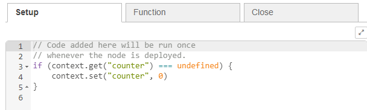

| [На головну](../)            | [Розділ](README.md)                  |
| ---------------------------- | ------------------------------------ |
| [<- Основні вузли](1_4_1.md) | [Робота з повідомленнями ->](1_6.md) |

## Робота з вузлом Function

[Джерело](https://nodered.org/docs/user-guide/writing-functions)

Вузол Function дозволяє виконувати код JavaScript для обробки повідомлень, що передаються через нього. Повідомлення передається у вигляді об\'єкта з назвою  `msg`. За замовченням він має властивість `msg.payload` що містить тіло повідомлення. Інші вузли можуть додавати до повідомлення власні властивості, які повинні бути описані у документації.

### Створення функцій

Код, введений у вузол Function -- це *тіло* функції. Найпростіша функція просто повертає повідомлення:

```js
return msg;
```

Якщо функція повертає `null`, тоді жодне повідомлення від вузла функції не передається далі, тобто потік на ньому закінчується. Повернений функцією об\'єкт-повідомлення не обов'язково повинен бути таким самим типом об\'єкту, який був переданий їй. Тобто функція може побудувати зовсім новий об\'єкт, перш ніж повертати його. Наприклад:

```js
var newMsg = { payload: msg.payload.length };
return newMsg;
```

**Зауважте**. Створюючи новий об\'єкт `msg`, повідомлення втрачає будь-які властивості того повідомлення, що було отримане на вході. Це призведе до руйнування деяких потоків, наприклад потік `HTTP In/Response` вимагає щоб властивості `msg.req` і `msg.res`  були збережені від кінця до кінця. Загалом, вузли Function *мали* б повертати об\'єкт-повідомлення, вносячи будь-які зміни до його властивостей.

### **Відправка повідомлень на декілька виходів**

Діалог редагування Function дозволяє змінити кількість виходів. Якщо є більше одного виходу, для відправки на ці виходи повідомлень треба використати масив. Це полегшує написання функції, яка відправляє повідомлення на різні виходи в залежності від певного стану. Наприклад, ця функція буде надсилати що-небудь на тему (topic) `banana` до другого виходу, а не до першого

```js
if (msg.topic === "banana") {
   return [ null, msg ];
} else {
   return [ msg, null ];
}
```

У наступному прикладі, оригінальне вхідне повідомлення передається на перший вихід, а на другий вихід передається повідомлення, яке містить довжину рядку payload:

```js
var newMsg = { payload: msg.payload.length };
return [msg, newMsg];
```

### **Відправка послідовності повідомлень** 

Функція може повертати на виході послідовність з декількох повідомлень, повернувши масив повідомлень у середині іншого масиву. Наступні за ним вузли отримуватимуть повідомлення один за одним у тому порядку, в якому вони були у вихідному масиві цього вузла.

У наступному прикладі, послідовність повідомлень  `msg1`, `msg2`, `msg3`  буде відправлена на перший вихід, а повідомлення `msg4`  буде відправлено на другий вихід.

```js
var msg1 = { payload:"first out of output 1" };
var msg2 = { payload:"second out of output 1" };
var msg3 = { payload:"third out of output 1" };
var msg4 = { payload:"only message from output 2" };
return [ [ msg1, msg2, msg3 ], msg4 ];
```

У наступному прикладі отримане корисне навантаження (payload) розбивається на окремі слова, і повертається повідомлення, що вміщує кожне слово.

```js
var outputMsgs = [];
var words = msg.payload.split(" ");
for (var w in words) {
    outputMsgs.push({payload:words[w]});
}
return [ outputMsgs ];
```

### **Асинхронна відправка повідомлень** 

Якщо функція повинна виконувати асинхронну дію (що не відразу повертає результат а потребує функцію зворотного виклику) що приймає участь у формуванні повідомлення, вона не може повернути повідомлення по завершенню обробки Function. Замість цього повинна використовуватися функція передачі повідомлень  `node.send()`. Наприклад:

```js
doSomeAsyncWork(msg, function(result) {
    msg.payload = result;
    node.send(msg);
});
return;
```

#### Починаючи з Node-RED 1.0 

Вузол функції буде клонувати кожен об’єкт повідомлення, який ви передаєте в `node.send`, щоб уникнути ненавмисної модифікації об’єктів повідомлень, які повторно використовуються у функції. До версії Node-RED 1.0 вузол функцій не клонував *перше* повідомлення, передане в `node.send`, а клонував тільки решту.

Функція може запитувати середовище виконання *не клонувати* перше повідомлення, передане в `node.send`, передаючи в якості другого аргументу функції `send` значення `false`. Зрозуміло, що це повідомлення містить щось, що не може бути клоноване інакше, або з міркувань продуктивності, щоб мінімізувати накладні витрати на надсилання повідомлень:

```javascript
node.send(msg,false);
```

#### Завершення з повідомленням (з Node-RED 1.0)

Якщо вузол Function виконує асинхронну роботу з повідомленням, середовище виконання не буде автоматично знати, коли воно закінчило обробляти повідомлення.

Щоб допомогти це зробити, вузол Function повинен викликати `node.done()` у відповідний час. Це дозволить виконувати належним чином відстеження повідомлень через систему.

```javascript
doSomeAsyncWork(msg, function(result) {
    msg.payload = result;
    node.send(msg);
    node.done();
});
return;
```

### Виконання коду при старті (з Node-RED 1.1) 

Починаючи версії 1.1.0, вузол Function забезпечує вкладку `Setup` , де ви можете надати код, який запускатиметься при кожному запуску вузла. Це можна використовувати для налаштування будь-якого стану, потрібного вузлу функцій. 

Наприклад, він може ініціалізувати значення в локальному контексті, які використовуватиме основна функція:

```javascript
if (context.get("counter") === undefined) {
    context.set("counter", 0)
}
```



Обробка Setup функції настройки може повернути Promise, якщо їй потрібно виконати асинхронну роботу до того, як основна функція може розпочати обробку повідомлень. Будь-які повідомлення, які надійдуть до завершення функції настройки, будуть вставлені в чергу і обробляться, коли вони будуть готові.

### Прибирання

Якщо ви використовуєте асинхронний код зворотного виклику у своїх функціях, коли потік повторно розгортається, вам знадобиться прибирати будь-які непотрібні запити або закривати будь-які з\'єднання. Ви можете зробити це, додавши обробник подій close

```js
node.on('close', function() {
    // tidy up any async code here - shutdown connections and so on.
});
```

Починаючи з Node-RED 1.1.0 цей код можна вписати в налаштуваннях закладки `Close`  вузла Функції.

### **Ведення журналу подій**

Якщо вузол повинен записувати щось в консоль, він може використовувати одну з наступних функцій:

```js
node.log("Something happened");
node.warn("Something happened you should know about");
node.error("Oh no, something bad happened");
```

Повідомлення `warn` і `error` також надсилаються на вкладку налагодження редактора потоку. Для більш тонкорівневих подій також доступні `node.trace()` і `node.debug()` . Якщо для цих рівнів не налаштоване ведення журналу, вони відображатися не будуть.

### **Обробка помилок**

Якщо функція виявляє помилку, вона припиняє поточний потік і нічого не повертає. Щоб запустити вузол `Catch` для обробки помилок на тій самій вкладці, функція повинна викликати `node.error` з оригінальним повідомленням в якості другого аргументу:

```js
node.error("hit an error", msg);
```

### **Зберігання даних в контекстних сховищах**

Крім об'єкту `msg` функція також може зберігати дані в контекстних сховищах. У вузлі Function є три заздалегідь визначені змінні, які можна використовувати для доступу до контексту:

-   `context` - локальний контекст вузла

-   `flow` - контекст потоку

-   `global`- глобальний контекст

**Зауважте**. Ці заздалегідь означені змінні є особливостями вузла Function. Якщо ви створюєте спеціальний вузол, прочитайте [Creating Nodes guide](https://nodered.org/docs/creating-nodes/context) для ознайомлення з тим, як отримати доступ до контексту.

Наступні приклади використовують контекст потоку `flow`, але аналогічно цей приклад застосовний і до `context`, і до `global`.

Існує два режими доступу до контексту: синхронний та асинхронний. Вбудовані контекстні сховища забезпечують обидва режими. Деякі сховища можуть надавати лише асинхронний доступ і вибивають помилку, якщо до них доступаються синхронно.

Щоб отримати значення з контексту використовується метод `get`:

```js
var myCount = flow.get("count");
```

Щоб встановити значення в контекст, використовується метод `set`:

```js
flow.set("count", 123);
```

У наведеному нижче прикладі зберігається лічильник кількості викликів функції:

```js
// ініціалізація змінної лічильника ‘count’ в 0, якщо її немає в контексті
// вузла
var count = context.get('count')||0;
count += 1;
// збереження значення store в контексті вузла під іменем ‘count’ 
context.set('count',count);
// зробити це частиною вихідного об’єкту  msg 
msg.count = count;
return msg;
```

#### Отримати/Встановити кілька значень 

Node-RED може отримати або встановити декілька значень за один раз:

```js
// Node-RED 0.19 або пізніше
var values = flow.get(["count", "colour", "temperature"]);
// values[0] це значення 'count'
// values[1] це значення 'colour'
// values[2] це значення 'temperature'

// Node-RED 0.19 або пізніше
flow.set(["count", "colour", "temperature"], [123, "red", "12.5"]);
```

У цьому випадку для будь-яких відсутніх значень буде встановлено значення null.

#### Асинхронний доступ до контексту 

Якщо для контекстного сховища потрібен асинхронний доступ, то функції `get` та `set` вимагають додаткового параметра функції зворотного виклику.

```js
// отримати одне значення
flow.get("count", function(err, myCount) { ... });

// отримати кілька значень
flow.get(["count", "colour"], function(err, count, colour) { ... })

// встановити одне значення
flow.set("count", 123, function(err) { ... })

// встановити кілька значень
flow.set(["count", "colour", [123, "red"], function(err) { ... })
```

Перший аргумент у функції зворотного виклику, `err`, встановлюється лише тоді, коли при доступі до контексту виникла помилка.

Приклад асинхронної версії наведеної вище функції підрахунку кількості викликів функції:

```js
context.get('count', function(err, count) {
    if (err) {
        node.error(err, msg);
    } else {
        // ініціалізація змінної лічильника ‘count’ в 0, якщо її 
		// немає в контексті вузла
        count = count || 0;
        count += 1;
        // збереження значення store в контексті вузла під іменем ‘count’
        context.set('count',count, function(err) {
            if (err) {
                node.error(err, msg);
            } else {
                // зробити це частиною вихідного об’єкту  msg
                msg.count = count;
                // відправити повідомлення
                node.send(msg);
            }
        });
    }
});
```

#### Кілька контекстних сховищ 

З версії 0.19 можна налаштувати кілька контекстних сховищ. Наприклад, можуть бути використані два типа сховищ, що базуються на `memory` і `file` .

Функції роботи з контекстом `get`/`set`  приймають необов\'язковий параметр (у прикладі це `storeName`) для ідентифікації сховища для використання.

```js
// отримати значення синхронно - sync
var myCount = flow.get("count", storeName);

// отримати значення асинхронно - async
flow.get("count", storeName, function(err, myCount) { ... });

// встановити значення синхронно - sync
flow.set("count", 123, storeName);

// встановити значення асинхронно - async
flow.set("count", 123, storeName, function(err) { ... })
```

#### Глобальний контекст

Коли Node-RED запускаються глобальний контекст може бути попередньо заповнений об\'єктами. Це означено в основному файлі *settings.js* властивістю `functionGlobalContext`.

Це може бути використано для [Завантаження додаткових модулів](#завантаження-додаткових-модулів) в межах вузла Function.

### Додавання статусу

Вузол Function також може забезпечити власне оформлення статусу таким же чином, як і інші вузли. Щоб встановити статус потрібно викликати `node.status` Наприклад:

```js
node.status({fill:"red", shape:"ring", text:"disconnected"});
node.status({fill:"green", shape:"dot", text:"connected"});
node.status({text:"Just text status"});
node.status({});   // для очищення статусу
```

Тоді будь-які оновлення статусу можуть також потрапляти до вузла Status.

### Завантаження додаткових модулів

У вузлі Function додаткові модулі не можуть бути завантажені безпосередньо. Вони повинні бути завантажені у вашому файлі *settings.js* і добавлені до властивості `functionGlobalContext`. Наприклад, вбудований модуль `os` може бути доступним для всіх функцій, додавши його до наступного файлу *settings.js* 

```js
functionGlobalContext: {
    osModule:require('os')
}
```

після чого на модуль можна посилатися в межах функції як  `global.get('osModule')`.

Модулі, завантажені з вашого файлу налаштувань, повинні бути встановлені в тому ж каталозі, що і файл налаштувань. Для більшості користувачів цей каталог буде в користувацькій директорії за замовчуванням - `~/.node-red`:

```js
cd ~/.node-red
npm install name_of_3rd_party_module
```


### Довідник API 

Наступні об\'єкти доступні в межах вузла Function.

`node`

-   node.id : ідентифікатор вузла Function -   *додано в 0,19*

-   node.name : назва функціонального вузла -   *додано в 0,19*

-   node.log(..) : [запис повідомлення](#ведення-журналу-подій)

-   node.warn(..) : [log a warning message](#ведення-журналу-подій)

-   node.error(..) : [log an error message](#ведення-журналу-подій)

-   node.debug(..) : [log a debug message](#ведення-журналу-подій)

-   node.trace(..) : [log a trace message](https://nodered.org/docs/writing-functions#logging-events)

-   node.on(..) : [register an event handler](#асинхронна-відправка-повідомлень )

-   node.status(..) : [update the node status](#додавання-статусу)

-   node.send(..) : [send a message](#асинхронна-відправка-повідомлень)

`context`

-   context.get(..) : отримати властивість контексту вузлу

-   context.set(..) : встановити властивість контексту вузлу

-   context.keys(..) : повертає список всіх ключів властивостей контексту вузлу

-   context.flow : такий же як flow

-   context.global : такий же як  global

`flow`

-   flow.get(..) : отримати властивість контексту потоку

-   flow.set(..) : встановити властивість контексту потоку

-   flow.keys(..) : повертає список усіх ключів властивостей контексту потоку

`global`

-   global.get(..) : отримати властивість глобального контекстну

-   global.set(..) : встановити властивість глобального контексту

-   global.keys(..) : повернути список усіх ключів властивостей глобального контексту

`RED`

-   `RED.util.cloneMessage(..)` : безпечно клонує об\'єкт повідомлення, щоб його можна було використовувати повторно

`env`

- `get(..)` : get an environment variable

Вузол Function також робить доступними наступні модулі та функції:

-   `Buffer` - модуль Node.js `Buffer` 

-   `console` - модуль Node.js `console`  (node.log є наперед визначеним методом ведення журналу)

-   `util` - модуль Node.js `util` 

-   `setTimeout/clearTimeout` - функція тайм-ауту javascript.

-   `setInterval/clearInterval` - функції інтервалу javascript.

Вузол Function автоматично очищує будь-які прострочені тайм-аути або таймери інтервалів, коли він зупиняється або повторно розгортається.

[Робота з повідомленнями ->](1_6.md) 

