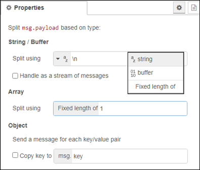
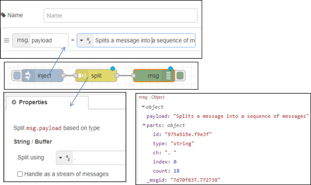
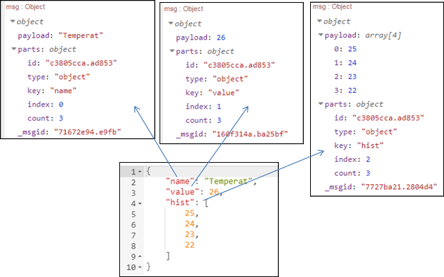
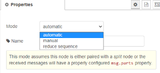
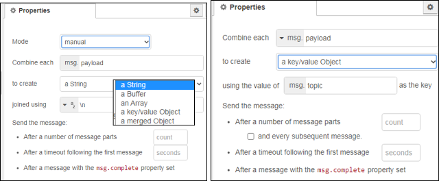
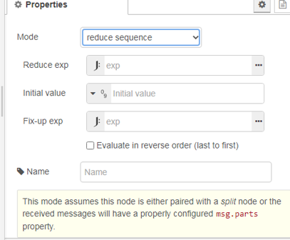
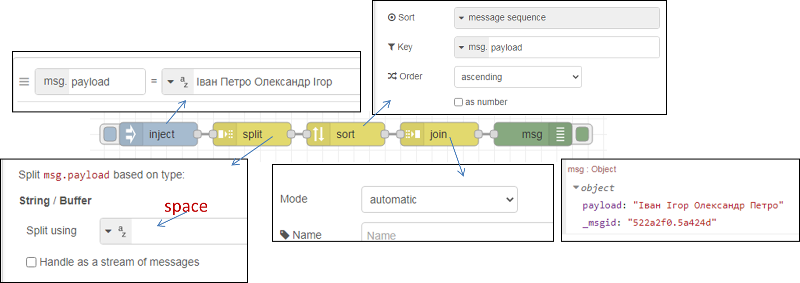

| [На головну](../)                     | [Розділ](README.md)              |
| ------------------------------------- | -------------------------------- |
| [<- Робота з вузлом Function](1_5.md) | [Робота з контекстом ->](1_7.md) |

## Робота з повідомленнями 

[Джерело](https://nodered.org/docs/user-guide/messages), [російськомовна версія](http://wikihandbk.com/wiki/Node-RED:%D0%A0%D1%83%D0%BA%D0%BE%D0%B2%D0%BE%D0%B4%D1%81%D1%82%D0%B2%D0%BE_%D0%BF%D0%BE%D0%BB%D1%8C%D0%B7%D0%BE%D0%B2%D0%B0%D1%82%D0%B5%D0%BB%D1%8F/%D0%A0%D0%B0%D0%B1%D0%BE%D1%82%D0%B0_%D1%81_%D1%81%D0%BE%D0%BE%D0%B1%D1%89%D0%B5%D0%BD%D0%B8%D1%8F%D0%BC%D0%B8)

Потік Node-RED працює, передаючи повідомлення між вузлами. Повідомлення є простими об\'єктами JavaScript, які можуть мати будь-який набір властивостей. Повідомлення, як правило, мають властивість `payload`, це властивість за умовчанням, з яким працюватиме більшість вузлів Node-RED також додає властивість, що називається `_msgid` - це ідентифікатор для повідомлення, яке може використовуватися для відстеження його проходження потоком

```js
{
"_msgid": "12345",
    "payload": "..."
}
```

Значенням властивості може бути будь-який дійсний тип JavaScript, наприклад

-   `Boolean` -- true, false
-   `Number` -- наприклад 0, 123.4
-   `String` -- \"hello\"
-   `Array` - \[1,2,3,4\]
-   `Object` - { \"a\": 1, \"b\": 2}
-   `Null`

[Докладніше про типи JavaScript](https://developer.mozilla.org/en-US/docs/Web/JavaScript/Data_structures) або з [лекції](https://pupenasan.github.io/ProgIngContrSystems/%D0%9B%D0%B5%D0%BA%D1%86/javascript.html)

### Розуміння структури повідомлень

Найпростіший спосіб зрозуміти структуру повідомлення - передати його в вузол `Debug` і переглянути його на бічній панелі Debug. За замовчуванням на вузлі Debug відображатиметься властивість `msg.payload` , але може бути налаштована для відображення будь-яка інша властивість або все повідомлення цілком. При відображенні масиву або об\'єкту бічна панель забезпечує структурований вигляд, який може використовуватися для вивчення повідомлення.

> {width="3.8854166666666665in" height="3.1354166666666665in"}

рис.1.42. Перегляд структури повідомлення на бічній панелі Debug

-   в самому верху він показує ім\'я властивості, яке було передано. Тут за замовчуванням використано `msg.payload` 
-   поруч із назвою є назва типу властивості - Object, String, Array ін..
-   потім він показує вміст властивості. Для масивів і об\'єктів властивість розкладається на рядки. Клацаючи по ньому, властивість розгорнеться, щоб показати більш детальну інформацію.

Коли ви наводите курсор миші на будь-який елемент, праворуч з\'являється набір кнопок:

-    :  копіює шлях до обраного елемента у буфер обміну. У цьому прикладі він буде копіювати `payload.Phone[2].type`. Це дозволяє швидко визначити, як отримати доступ до властивості на вузлі `Change` або `Function`.
-    :  копіює значення елемента у буфер обміну як рядок JSON. Зауважте, що бічна панель обробляє масиви та буфери певної довжини. Копіюючи значення такої властивості, буде скопійована урізана версія.
-    :  вибирає елемент таким чином, що він завжди відображається. Коли одне повідомлення одержується з того ж вузла відлагодження, його автоматично розширюють, щоб показати всі закріплені елементи.

> 

рис.1.43. Перегляд структури масивів та об'єктів в повідомленні

**JSON** ([JavaScript Object Notation](http://json.org/)) - це стандартний спосіб подання об\'єкта JavaScript у вигляді рядку. Він часто використовується у веб-API для повернення даних. Якщо властивість повідомлення містить рядок JSON, то перед тим, як отримувати доступ до його властивостей, його слід перетворити до еквівалентного об\'єкта JavaScript. Щоб визначити, чи властивість вміщує String чи Object, може бути використаний вузол Debug. Для здійснення цього перетворення Node-RED забезпечує вузол JSON .

### Зміна властивостей повідомлення 

Загальне завдання усіх вузлів в потоці - змінювати властивості повідомлення, яке проходить між вузлами. Наприклад, результатом роботи вузлу  `HTTP Request`  може бути об\'єкт з багатьма властивостями, з яких потрібні лише деякі.

Для модифікації повідомлення використовують два основні вузли -- [Function](base/1_5.md) та [Change](base/1_4_1.md#change-зміна-повідомлення-в-потоці) 

Вузол `Function` дозволяє запускати будь-який код JavaScript для обробки повідомлення. Це дає вам повну гнучкість в тому, що ви робите з повідомленням, але вимагає розуміння JavaScript і не є необхідним для багатьох простих випадків. 

Вузол `Change` забезпечує багато функціональних можливостей без необхідності писати код JavaScript. Він не тільки може змінювати властивості повідомлення, але також може отримати доступ до контексту потоку або глобального контексту.

Він забезпечує чотири основні операції:
-   `Set` - встановлення значення властивості,
-   `Change` - пошук та заміна частини властивості типу String
-   `Delete` -- видалення властивості
-   `Move` -- копіювання властивості.

Для операції `set` ви спочатку означуєте, яку властивість хочете встановити, тоді значення, яке ви хочете мати. Це значення може бути або жорстко закріплене, наприклад, рядок чи число, або це може бути взяте з іншого повідомлення або властивості контексту потоку або глобального контексту. Він також підтримує використання  [JSONata](http://jsonata.org/) для розрахунку нового значення.


рис.1.44. Встановлення властивості потоку з використанням вузу Change

Наприклад, за допомогою можливості вузлів `Debug` означати структуру повідомлень, ви можете вставити адресу необхідного атрибуту прямо в поле `to`, з вибраного списку `msg`. Тоді буде встановлено  `msg.payload` в значення `msg.payload.Phone[2].type`.

Інший приклад виразу  [JSONata](http://jsonata.org/) полягає в перетворенні температури, що зберігається в `msg.payload.temperature` з одиниць Фаренгейта до Цельсія та збереження результату у новій властивості повідомлення  `msg.payload.temperature_c`.


рис.1.45. Використання в вузі Change виразів JSONata

```js
{
    "payload": {
        "temperature": 90,
        "temperature_c": 32.22222
    }
}
```

Зауважте, що вирази *JSONata виглядають так само, як JavaScript, але мають деякі ключові відмінності.* Див [jsonata](../jsonata/README.md)  для додаткової інформації.

Детальніше про вузол Change читайте за [посиланням](base/1_4_1.md#change-зміна-повідомлення-в-потоці) 

### Послідовності повідомлень

**Послідовність повідомлень** - це впорядкована серія повідомлень, які певним чином пов\'язані між собою. Деякі вузли призначені для обробки таких послідовностей. Наприклад, вузол `Split` може перетворювати одне повідомлення, яке є масивом `payload` , у послідовність повідомлень, де кожне повідомлення містить payload що відповідає одному з елементів масиву.

Є кілька основних вузлів, які можуть працювати з послідовностями повідомлень.

#### Про `msg.parts`

Кожне повідомлення в послідовності має властивість `msg.parts`. Це об\'єкт, який містить інформацію про те, як повідомлення входить у послідовність. Він має такі властивості:

`msg.parts.id` -- унікальний ідентифікатор в  послідовності 

`msg.parts.index` -- позиція повідомлення в межах послідовності 

`msg.parts.count` - якщо відомо, загальна кількість повідомлень у послідовності 

*Примітка:* масив parts може містити додаткові метадані про послідовність. Наприклад,  вузол `split`  також надає інформацію, яка може бути використана  вузлом join  для повторного зібрання послідовності. Див  документацію для вузла split .

### Split

Розділює одне повідомлення в послідовність повідомлень. Конкретна поведінка вузла залежить від типу `msg.payload`.

-   `String/Buffer` - повідомлення розділяється за допомогою заданого символу (за замовчуванням: ` \n`) на буферні послідовності (байт-масиви) або рядки фіксованої довжини.
-   `Array` - повідомлення розділяється на окремі елементи масиву чи масиви фіксованої довжини
-   `Object` - повідомлення надсилається для кожної пари об\'єкта ключ/значення.



Вихідне повідомлення містить властивість:

`parts` (*object*) -- ця властивість містить інформацію про те, як повідомлення було відокремлено від оригінального. Якщо повідомлення проходить через вузол **join**, послідовність може бути зібрана в одне повідомлення. Властивість має такі властивості:

- `id` - ідентифікатор групи повідомлень
- `index` - позиція всередині групи 
- `count` - якщо відоме загальна кількість повідомлень в групі. Див `streaming mode` нижче
- `type` - тип повідомлення - string/array/object/buffer
- `ch` - для string або buffer, дані (наприклад рядок), що використовуються для розділення повідомлення як рядка або масиву байтів 
- `key` - для розділення об'єкту, ключ або властивість, з якого було створено це повідомлення. Вузол може бути налаштований також для копіювання цього значення в інші властивості повідомлення, такі як `msg.topic`. 
- `len` -- довжина кожного повідомлення при розділенні з використанням фіксованого значення довжини

На наступному прикладі показано, як використовуючи роздільник `. ` робляться перетворення тексту в кілька речень.  



На наступному рисунку показаний приклад розділення об'єкту заданого на вхід в форматі JSON.  




Вузол `Split` дозволяє легко створити потік, який виконує загальні дії по всій послідовності повідомлень перед тим, як використати вузол **join** , рекомбінуючи послідовність знову в одне повідомлення. Він використовує властивість `msg.parts` для відстеження окремих частин послідовності.

#### Streaming mode

Вузол також можна використовувати для поповнення потоку повідомлень. Наприклад, пристрій з послідовним інтерфейсом, який надсилає команди з символом переведення рядку, може доставити одне повідомлення з частковою командою в його кінці (що не завершується вказаною послідовністю). У режимі  'streaming mode' (`Handle as a stream of messages`) цей вузол розділить повідомлення та відправить кожен повний сегмент. Якщо в кінці є частковий сегмент, вузол буде тримати його і додавати його до наступного повідомлення, яке отримано.

Під час роботи в цьому режимі вузол не встановлює властивість `msg.parts.count`, оскільки він не знає, скільки повідомлень очікувати в потоці. Це означає, що його не можна використовувати з вузлом **join** в автоматичному режимі.

### Join

Об'єднує послідовність повідомлень у єдине повідомлення. 

Вузол забезпечує три режими роботи:

-   `Automatic` - спробує зробити зворотну дію, проведену попереднім вузлом Split
-   `Manual` - спосіб об'єднання повідомлень конфігурується 
-   `Reduce sequence ` - дозволяє виконувати вираз JSONata для кожного повідомлення в послідовності, а накопичений результат використати для створення одного повідомлення.



На вході в `payload` передаються зміст повідомлення, які треба об'єднати. 

Крім того вузол очікує об'єкт `parts` для режиму автоматичного об'єднання. Ці властивості формуються вузлом **split** але вони можуть бути створені або модифіковані іншими вузлами. Це має наступні властивості:

- `id` - ідентифікатор групи повідомлень 
- `index` - позиція всередині групи 

- `count` - якщо відоме загальна кількість повідомлень в групі. Див `streaming mode` нижче
- `type` - тип повідомлення - string/array/object/buffer
- `ch` - для string або buffer, дані (наприклад рядок), що використовуються для розділення повідомлення як рядка або масиву байтів 
- `key` - для розділення об'єкту, ключ або властивість, з якого було створено це повідомлення. Вузол може бути налаштований також для копіювання цього значення в інші властивості повідомлення, такі як `msg.topic`. 
- `len` -- довжина кожного повідомлення при розділенні з використанням фіксованого значення довжини

Вузол також очікує `complete `. Якщо ця властивість буде у вхідному повідомленні, вузол додасть корисне навантаження а тоді відправить сформоване вихідне повідомлення. Якщо необхідно просто завершити об'єднання без добавлення корисного навантаження, його треба просто видалити з керуючого повідомлення завершення (що має властивість `complete `)      

#### Automatic mode (автоматичний режим)

Автоматичний режим для визначення способу з'єднання послідовності використовує властивість `parts` вхідних повідомлень. Це дозволяє йому автоматично перевертати дію вузла **split** .

#### Manual mode (ручний режим)

У ручному режимі, вузол може приєднати послідовності повідомлень до декількох різних типів результатів:

- **string**  -- створюється приєднанням обраної властивості кожного повідомлення через вказану послідовність символів до єдиного рядка 
- **buffer** -- створюється приєднанням обраної властивості кожного повідомлення через вказану послідовність символів до єдиного буфера.
- **array**  -- створюється приєднанням обраної властивості кожного повідомлення до вихідного масиву.
- об’єкт **key/value object**  - створюється приєднанням обраної властивості кожного повідомлення з вказівкою ключа, під яким зберігається необхідне значення.
- **merged object** - створюється приєднанням обраної властивості кожного повідомлення в єдиний об'єкт.



Інші властивості вихідного повідомлення взяті з останнього повідомлення, отриманого до відправки результату.

`After a number of messages parts` Для того, щоб вказати скільки повідомлень слід отримати, перш ніж генерувати вихідне повідомлення, може бути встановлена властивість кількість повідомлень (*count*). Для виходів типу об'єкт, після досягнення цієї кількості, вузол може бути налаштований для надсилання повідомлення для кожного наступного отриманого повідомлення  (`for everysubsequent message`).

Можна також налаштувати час *timeout*, який буде визначати час від отримання першого повідомлення.

Якщо повідомлення отримано із встановленою властивістю **msg.complete**, вихідне повідомлення завершується та надсилається. Це скидає будь-яку кількість частин.

Якщо повідомлення отримано з встановленою властивістю **msg.reset**, частково наповнене повідомлення видаляється та не надсилається. Це скидає будь-яку кількість частин.

#### Reduce Sequence mode

Коли налаштовано Reduce Sequence mode, до кожного повідомлення в послідовності застосовується вираз, а результат накопичується для створення одного повідомлення.



- `Initial value` -- початкове значення накопиченої величини (`$A`).

- `Reduce expression` -- вираз JSONata, який викликається для кожного повідомлення в послідовності. Результат передається наступному виклику виразу у вигляді накопиченого значення. У виразі можуть використовуватися такі спеціальні змінні:
  - `$A`: накопичене значення,
  - `$I`: індекс повідомлення в послідовності,
  - `$N`: кількість повідомлень в послідовності

- `Fix-up expression` - необов'язковий вираз JSONata, який застосовується після того, як вираз було застосовано до всіх повідомлень у послідовності. У виразі можуть використовуватися такі спеціальні змінні:
  - `$A`: накопичене значення,
  - `$N`: кількість повідомлень в послідовності

За замовчуванням вираз зменшення застосовується в порядку, від першого до останнього повідомлення послідовності. Він необов'язково може застосовуватися у зворотному порядку.

**Приклад:** наступні параметри, з урахуванням послідовності числових значень, обчислюють середнє значення:

- **Reduce expression**: `$A+payload`
- **Initial value**: `0`
- **Fix-up expression**: `$A/$N`

#### Зберігання повідомлень

Цей вузол буде буферувати повідомлення всередині, щоб працювати через послідовності. Для обмеження кількості буферів вузлів повідомлень можна використовувати  налаштування середовища виконання `nodeMessageBufferMaxLength` 

### Sort

Сортує масив або послідовність повідомлень на основі значення властивості або результату вираження JSONata.


Якщо вузол налаштований для сортування властивості повідомлення (`Sort = msg`), вузол сортує дані масиву, на які вказує задана властивість повідомлення.

Якщо налаштовано для сортування послідовності повідомлень (`Sort = messge seqence`), вузол буде змінювати їх порядок.

Сортування може бути налаштоване:

- **ascending** - по зростанню 
- **descending** - по спаданню

Для чисел може бути вказане числове впорядкування `as number`.

Ключ сортування може бути:

- значенням елементу або виразом JSONata для сортування значення властивості, 
- властивістю повідомлення або виразом JSONata для сортування послідовності повідомлень.

When sorting a message sequence, the sort node relies on the received messages to have `msg.parts` set. The split node generates this property, but can be manually created. It has the following properties:

Під час сортування послідовності повідомлень вузол сортування покладається на отримані повідомлення, щоб встановити `msg.parts`. Вузол `split` генерує цю властивість, але її можна створити вручну. Він має такі властивості:

- `id` - ідентифікатор групи повідомлень 

- `index` - позиція всередині групи 

- `count` - загальна кількість повідомлень в групі. 

**Заувага:** Цей вузол зберігає всередині повідомлення для своєї роботи. Щоб запобігти несподіваному використанню великих обсягів пам'яті, можна вказати максимальну кількість повідомлень, що зберігаються. За замовчуванням кількість повідомлень не обмежується .

- `nodeMessageBufferMaxLength` property set in **settings.js**.

Нижче наведено приклад використання вузла `Sort`. На вхід потоку подається речення з переліком імен в невідсортованому порядку. Спочатку це речення ділиться на послідовність слів, які розділяються за критерієм символу пробілу. Далі ця послідовність сортується за збільшенням, після чого автоматично об'єднується.     



### Batch

{width="1.4791666666666667in" height="0.4270833333333333in"}Створює нові послідовності згрупованих повідомлень з отриманих. 


Вузол забезпечує три режими роботи:

-   `Number of messages` - групування повідомлень в послідовності заданої довжини. Параметр `overlap` (перекривання) вказує, скільки повідомлень в кінці однієї послідовності слід повторити на початку наступної послідовності.
-   `Concatenate Sequences` - створює послідовність повідомлень шляхом об\'єднання вхідних послідовностей. Кожна послідовність повинна мати властивість msg.topic  для визначення групи. Вузол налаштовується на список значень тем для ідентифікації порядку конкатенації послідовностей.
-   `Time interval` - групові повідомлення, що надходять у вказаний часовий інтервал. Якщо протягом вказаного інтервалу взагалі не надходить повідомлення, вузол може додатково надіслати порожнє повідомлення (`send empty message when no message arrives`).

**Заувага:** Цей вузол зберігає всередині повідомлення для своєї роботи. Щоб запобігти несподіваному використанню великих обсягів пам'яті, можна вказати максимальну кількість повідомлень, що зберігаються. За замовчуванням кількість повідомлень не обмежується .

Якщо повідомлення отримано із встановленою властивістю **msg.reset**, буферні повідомлення видаляються та не надсилаються.

[Робота з контекстом ->](1_7.md) 