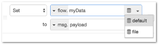

| [На головну](../)                    | [Розділ](README.md) |
| ------------------------------------ | ------------------- |
| [<- Робота з повідомленнями](1_6.md) |                     |

## Робота з контекстом 

[Джерело](https://nodered.org/docs/user-guide/context)

Node-RED забезпечує спосіб зберігання інформації, яка може бути розподілена між різними вузлами, без використання повідомлень, що проходять через потоки. Це називається **контекстом** (**context**).

### Область видимості

Область видимості конкретного значення контексту визначається від того, хто його надає. Існує три рівні контексту:

-   **Node** - видимий тільки для вузла, який встановлює значення
-   **Flow** - видимий для всіх вузлів на одному потоці (або вкладки у редакторі)
-   **Global** - видимий для всіх вузлів

Вибір області видимості для будь-якого конкретного значення залежить від того, як воно використовується. Якщо для доступу до значення потрібно лише один вузол, наприклад, вузол Function, то рівень контексту Node достатній.

Найчастіше контекст дозволяє розділяти певний стан між кількома вузлами. Наприклад, датчик може регулярно публікувати нові значення в одному потоці, і ви хочете створити окремий потік HTTP, щоб повернути останнє значення. Зберігаючи зчитане значення датчику в контексті, він потім доступний для повернення потоку HTTP.

Глобальний контекст Global може бути попередньо зконфігурований значеннями з використанням властивості `functionGlobalContext` в файлі налаштувань.

Для вузлів з під-потоку, контекст `flow` є областю під-потоку. Починаючи з Node-RED 0.20, вузли всередині підпотоку можуть отримати доступ до контексту батьківського потоку вказавши префікс `$parent.` до ключа контексту. Наприклад:

```javascript
var colour = flow.get("$parent.colour");
```

### Збереження контексту

За замовчуванням контекст зберігається лише в пам\'яті. Це означає, що його вміст очищується, коли Node-RED перезавантажується. З випуском версії 0.19 можна налаштувати Node-RED для збереження контекстних даних, щоб він став доступним і після перезавантаження. 

Для налаштування того, як будуть зберігатися контекстні дані в `settings.js` можна використовувати властивість `contextStorage`. Node-RED надає для цього два вбудовані модулі: `memory` та `localfilesystem`. Також можна створити плагіни для зберігання даних, щоб зберегти дані в іншому місці.

Щоб увімкнути сховище на базі файлів, можна використовувати наступні параметри:

```js
contextStorage: {
   default: {
       module: "localfilesystem"
   }
}
```

Це встановлює контекстне зберігання за замовчуванням як екземпляр плагіна `localfilesystem` з усіма його налаштуваннями за замовчуванням. Це означає:

- він буде зберігати дані контексту у файлах під `~/.node-red/context/`
- він зберігає в пам'яті значення і записує їх у файлову систему кожні 30 секунд.

*Примітка*: Залежно від того, коли ви встановили Node-RED, у вашому файлі `settings.js` може не бути прикладу запису для ` contextStorage`. Якщо це так, ви можете скопіювати приклад вище та додати його самостійно.

Можна налаштувати більше одного сховища, щоб деякі значення зберігалися у локальній файловій системі, а деякі зберігалися лише в пам'яті. Наприклад, для налаштування зберігання за замовчуванням лише в пам'яті та другого сховища для файлової системи можна використовувати наступні параметри:

```js
contextStorage: {
   default: "memoryOnly",
   memoryOnly: { module: 'memory' },
   file: { module: 'localfilesystem' }
}
```

У цьому прикладі властивість `default`  повідомляє Node-RED, яке сховище треба використовувати, якщо запит на доступ до контексту не вказує сховище.

*Примітка*: якщо ви вирішили налаштувати декілька сховищ локальної системи, вам слід встановити параметр `dir`, щоб вони використовували різні каталоги для зберігання даних. Докладні відомості про налаштування сховища доступні [тут](https://nodered.org/docs/api/context/store/localfilesystem#options)

Повна інформація про вбудовані модулі, які параметри конфігурації вони надають та як створити спеціальні модулі, розміщена на [api-сторінках](https://nodered.org/docs/api/context/).

### Використання контексту

Найпростішим способом встановити значення контексту є використання вузла Change. Наприклад, наступне правило вузлу Change зберігатиме значення  `msg.payload` в контексті потоку (flow) під ключем (назвою) `myData` (рис.1.46)


рис.1.46. Використання вузла Change для встановлення значення контексту потоку.

Різні вузли можуть безпосередньо отримати доступ до контексту. Наприклад, вузол Inject може бути налаштований для введення значення в контекст, а вузол Switch може маршрутизувати повідомлення на основі значення, збереженого в контексті. 

Якщо у вас налаштовано кілька контекстних сховищ, інтерфейс користувача дозволить вам вибрати, у якому сховищі має бути збережене значення.



Використання контексту у вузлі Function описана в розділі [Робота з контекстому у функціях](1_5.md#робота-з-контекстами).

Контекст можна остаточно видалити, використовуючи для вузол Change та правило `delete`.


### Налагодження

Для перегляду та видалення контексту вручну можна скористатися бічною панеллю редактора. Детальніше читайте [за посиланням](1_2.md#бічна-панель-контекстні-дані-context-data).