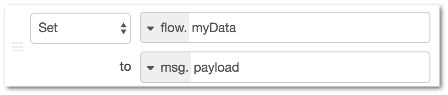

| [На головну](../) | [Розділ](README.md) |
| ----------------- | ------------------- |
|                   |                     |

## Робота з контекстом 

Node-RED забезпечує спосіб зберігання інформації, яка може бути розподілена між різними вузлами, без використання повідомлень, що проходять через потоки. Це називається контекстом (context).

Область видимості конкретного значення контексту визначається від того, хто його надає. Існує три рівні контексту:

-   Node - видимий тільки для вузла, який встановлює значення

-   Flow - видимий для всіх вузлів на одному потоці (або вкладки у редакторі)

-   Global - видимий для всіх вузлів

Вибір області видимості для будь-якого конкретного значення залежить від того, як воно використовується. Якщо для доступу до значення потрібно лише один вузол, наприклад, вузол Function, то рівень контексту Node достатній.

Найчастіше контекст дозволяє розділяти певний стан між кількома вузлами. Наприклад, датчик може регулярно публікувати нові значення в одному потоці, і ви хочете створити окремий потік HTTP, щоб повернути останнє значення. Зберігаючи зчитане значення датчику в контексті, він потім доступний для повернення потоку HTTP.

Глобальний контекст Global може бути попередньо зконфігурований значеннями з використанням властивості functionGlobalContext в файлі налаштувань.

Для вузлів з під-потоку, контекст \'flow\' є областю під-потоку. Вузли не мають доступу до контексту потоку, що містить вузол екземпляра під-потоку.

За замовчуванням контекст зберігається лише в пам\'яті. Це означає, що його вміст очищується, коли Node-RED перезавантажується. З випуском версії 0.19 можна налаштувати Node-RED для збереження контекстних даних, щоб він став доступним і після перезавантаження. Для налаштування того, як будуть зберігатися контекстні дані в settings.js можна використовувати властивість contextStorage. Наприклад, щоб увімкнути сховище на базі файлів, можна використовувати наступні параметри:

```js
contextStorage: {
   default: {
       module: "localfilesystem"
   }
}
```

Node-RED забезпечує два вбудованих модуля сховища: memory і localfilesystem. Також можливо створити власні плагіни сховища. Повна інформація про вбудовані модулі та способи створення користувацьких модулів доступна на [api pages](https://nodered.org/docs/api/context/).

Сховища можуть забезпечити як синхронний, так і асинхронний доступ. Синхронний доступ означає, що виклик для отримання даних з сховища негайно повертає значення. Асинхронний доступ означає, що функція виклику для отримання даних також повинен містити функцію зворотного виклику, яка викликається після того, як значення стало доступним. Вбудовані сховища  memory і file обидва пропонують синхронний доступ. Це означає, що існуючі (попередні до версії 0.19) потоки можуть використовувати ці сховища без будь-яких змін.

Найпростішим способом встановити значення контексту є використання вузла Change. Наприклад, наступне правило Change node зберігатиме значення  msg.payload в контексті потоку (flow) під ключем myData (рис.1.46)



рис.1.46. Використання вузла Change для встановлення значення контексту потоку.

Різні вузли можуть безпосередньо отримати доступ до контексту. Наприклад, вузол Inject може бути налаштований для введення значення в контекст, а вузол Switch може маршрутизувати повідомлення на основі значення, збереженого в контексті. Використання контексту у вузлі Function описана в розділі [Зберігання даних в контекстних сховищах](#_Зберігання_даних_в).

[Робота з повідомленнями  ->](1_6.md)  