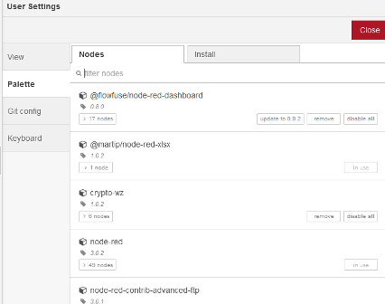
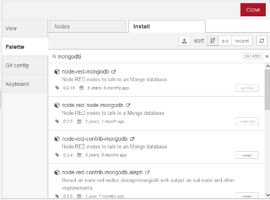
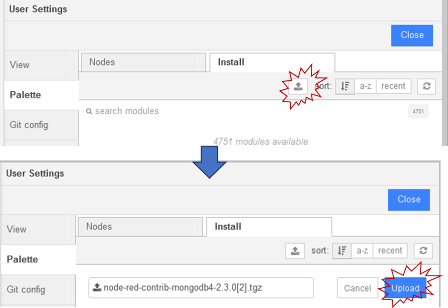

| [На головну](../) | [ < Розділ > ](README.md) |
| ----------------- | ------------------------- |
|                   |                           |

# Добавлення вузлів в палітру

[Довідка](https://nodered.org/docs/user-guide/runtime/adding-nodes)

Node-RED постачається з базовим набором вузлів, але є ще багато доступних вузлів в пакунках як від проекту Node-RED, так і від ширшої спільноти.  Ці вузли можна шукати в [бібліотеці Node-RED](http://flows.nodered.org).

### Встановлення через менеджер палітри в редакторі

Ви можете встановити вузли безпосередньо в редакторі, вибравши опцію [Менеджер палітри (Palette Manager)](https://nodered.org/docs/user-guide/editor/palette/manager) в головному меню. На вкладці «Nodes» перераховані всі модулі, які ви встановили. Він показує, які ви використовуєте та чи доступні оновлення для будь-якого з них. 



рис.1

Вкладка «Install» дозволяє шукати в каталозі доступні модулі вузлів і встановлювати їх.



рис.2.

### Встановлення за допомогою npm

Щоб установити модуль вузла з командного рядка, ви можете використати наступну команду з каталогу даних користувача (за замовчуванням `$HOME/.node-red`):

```
npm install <npm-package-name>
```

Потім вам потрібно буде перезапустити Node-RED, щоб він підключив нові вузли.

### Файл package.json

Під час першого запуску або створення нового проекту Node-RED створить початковий файл `package.json` у вашому каталозі користувача або каталозі проекту. Це дозволяє вам керувати вашими додатковими залежностями та випускати версії вашого проекту, використовуючи стандартні практики npm. Початкова версія – 0.0.1, але її слід відредагувати відповідно до вимог випуску (release) проекту.

`npm` автоматично додасть додаткові встановлені модулі до розділу залежностей файлу `package.json` у вашому каталозі користувача.

### Оновлення вузлів

Найпростіший спосіб перевірити наявність оновлень вузла — відкрити [Palette Manager](https://nodered.org/docs/user-guide/editor/palette/manager) у редакторі. Потім ви можете застосувати ці оновлення за потреби.

Ви також можете перевірити наявність оновлень з командного рядка за допомогою `npm`. У вашому каталозі користувача `~/.node-red` виконайте команду:

```
npm outdated
```

Це висвітлить будь-які модулі, які мають доступні оновлення. Щоб встановити останню версію будь-якого модуля, виконайте команду:

```
npm install <name-of-module>@latest
```

Який би підхід ви не вибрали, вам потрібно буде перезапустити Node-RED, щоб завантажити оновлення.

> *Примітка*: причина використання опції `--unsafe-perm` полягає в тому, що коли node-gyp намагається перекомпілювати будь-які рідні бібліотеки, він намагається зробити це як користувач "nobody", а потім не може отримати доступ до певних каталогів. Це призводить до того, що відповідні вузли (наприклад, послідовний порт) не встановлюються. Дозвіл доступу root під час інсталяції дає змогу правильно інсталювати вузли під час оновлення.

### Встановлення конкретних версій та своїх пакунків за допомогою менеджера палітри

Бувають ситуації, коли потрібно вставити потрібну версію бібліотеки, або коли потрібно завантажити власний пакунок для Node-RED, але при цьому командний рядок з можливістю запуску `npm` недоступний. Це характерно для хмарних реалізацій, що не надають доступу до консолі. У Node-RED у менеджері палітри є можливість завантаження пакунку через архівний файл `*.tar` як показано на рис.3 нижче.



рис.3.

Для того щоб завантажити пакунок потрібної версії з npm репозиторію, необхідно вказати цю версію в опції завантаження. Спочатку пакунок завантажується на станцію розробника, а потім з неї в місце розміщення Node-RED (це звісно може бути той саме комп'ютер). Для того щоб отримати лінк на це завантаження, в командному рядку будь якого комп'ютера зі встановленим npm треба набрати команду:

```
npm view пакунок@x.y.z dist.tarball
```

Ця команда використовується у Node Package Manager (npm) для перегляду URL архіву (tarball) збірки конкретної версії пакету. Вона дозволяє  отримати посилання на архів конкретної версії пакету, що може бути  використане для завантаження та встановлення пакету з цієї версії  безпосередньо з цього URL.

Наприклад для `node-red-contrib-mongodb4` версії 2.3.0 команда буде наступною:

```
npm view node-red-contrib-mongodb4@2.3.0 dist.tarball
```

Відповідь на команду буде десь в такому форматі:

```
npm view node-red-contrib-mongodb4@2.3.0 dist.tarball

https://registry.npmjs.org/node-red-contrib-mongodb4/-/node-red-contrib-mongodb4-2.3.0.tgz

npm notice
npm notice New major version of npm available! 9.5.0 -> 10.2.4
npm notice Changelog: https://github.com/npm/cli/releases/tag/v10.2.4
npm notice Run npm install -g npm@10.2.4 to update!
npm notice
```

Рядок що починається з `https` буде якраз тим, що використовується для завантаження. Вставивши його в браузері, завантажиться потрібна версія, яку далі можна завантажити через менеджер палітри (рис.3).    