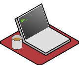
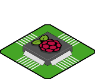
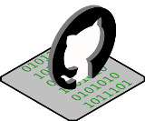
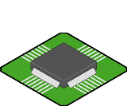

| [На головну](../) | [Розділ](README.md) |
| ----------------- | ------------------- |
|                   |                     |

## Як встановити та запустити

[Джерело](https://nodered.org/docs/getting-started/)

Нижче наведені посилання на посібники, які допоможуть Вам встановити і запустити Node-RED всього за кілька хвилин.

Виберіть, де ви хочете запустити Node-RED, чи на своєму локальному комп’ютері, пристрої, такі як Raspberry Pi, або в хмарі, і дотримуйтесь інструкцій, наведених нижче.

|                          Платформа                           | Пояснення                                                    |
| :----------------------------------------------------------: | ------------------------------------------------------------ |
| <br />[**Локальний запуск.**](https://nodered.org/docs/getting-started/local) | Встановлення Node-RED на локальний комп'ютер                 |
| <br />[**Raspberry Pi.**](https://nodered.org/docs/getting-started/raspberrypi) | Почніть використовувати наш сценарій установки "все в одному" для могутнього Raspberry Pi |
| <br />[**Docker.**](https://nodered.org/docs/getting-started/docker) | Запуск Node-RED з використанням Docker                       |
|  <br />[**Install from git.**](https://nodered.org/docs/getting-started/development) | Компілювання Node-RED з джерельного коду. Отримайте найновіший код розробки та почніть надавати внесок. |
| <br />[**BeagleBone Boards.**](https://nodered.org/docs/getting-started/beaglebone) | Запуск Node-RED на платах BeagleBone                         |
| <br />[**Android.**](https://nodered.org/docs/getting-started/android) | Трохи експериментально, але ви можете працювати на пристроях Android за допомогою Termux. |
| <br />[**IBM Cloud.**](https://nodered.org/docs/getting-started/ibmcloud) | Розгортання Node-RED з каталогу IBM Cloud за пару кліків     |
| <br />[**AWS.**](https://nodered.org/docs/getting-started/aws) | Почніть працювати на Elastic Beanstalk або EC2               |
| <br />[**Microsoft Azure.**](https://nodered.org/docs/getting-started/azure) | Запуск у екземплярі віртуальної машини Azure                 |


----

## Загальні принципи встановлення та запуску на локальній машині

[Джерело](https://nodered.org/docs/getting-started/local#running) 

Для встановлення Node-RED локально на ПК Ви повинні встановити [пітримувану версію Node.js](https://nodered.org/docs/faq/node-versions).

Щоб встановити Node-RED глобально, ви можете скористатися командою `npm`, що постачається з node.js:

```bash
sudo npm install -g --unsafe-perm node-red
```

Якщо ви використовуєте Windows, не запускайте команду з `sudo`. Більше інформації про встановлення Node-RED на Windows можна знайти [нижче](#встановлення-та-запуск-на-windows).

Більше інформації про встановлення Node-RED на Raspberry PI можна знайти [нижче](#встановлення-та-запуск-на-raspberry-pi).

Ця команда встановить Node-RED як глобальний модуль разом із залежностями.

Ви можете підтвердити, що це вдалося, якщо кінець виводу команди виглядає аналогічно наступному:

```bash
+ node-red@1.1.0
added 332 packages from 341 contributors in 18.494s
found 0 vulnerabilities
```

Після встановлення як глобальний модуль ви можете використовувати команду `node-red`, щоб запустити Node-RED у своєму терміналі. Ви можете використовувати `Ctrl-C` або закрити вікно терміналу, щоб зупинити Node-RED.

Якщо Node-RED інстальовано як глобальний пакунок npm, можна просто використати команду `node-red`:

```bash
$ node-red

Welcome to Node-RED
===================

30 Jun 23:43:39 - [info] Node-RED version: v1.1.0
30 Jun 23:43:39 - [info] Node.js  version: v10.21.0
30 Jun 23:43:39 - [info] Darwin 18.7.0 x64 LE
30 Jun 23:43:39 - [info] Loading palette nodes
30 Jun 23:43:44 - [warn] rpi-gpio : Raspberry Pi specific node set inactive
30 Jun 23:43:44 - [info] Settings file  : /Users/nol/.node-red/settings.js
30 Jun 23:43:44 - [info] HTTP Static    : /Users/nol/node-red/web
30 Jun 23:43:44 - [info] Context store  : 'default' [module=localfilesystem]
30 Jun 23:43:44 - [info] User directory : /Users/nol/.node-red
30 Jun 23:43:44 - [warn] Projects disabled : set editorTheme.projects.enabled=true to enable
30 Jun 23:43:44 - [info] Creating new flows file : flows_noltop.json
30 Jun 23:43:44 - [info] Starting flows
30 Jun 23:43:44 - [info] Started flows
30 Jun 23:43:44 - [info] Server now running at http://127.0.0.1:1880/red/
```

Далі доступ до редактору Node-RED відбувається через браузер http://localhost:1880.

Вихід з журналу надає вам різні відомості:

- Версії Node-RED та Node.js
- Будь-які помилки, які виникають при спробі завантаження вузлів палітри
- Розташування вашого файла налаштувань та каталогу користувачів
- Назва файлу потоків, який він використовує.

Node-RED використовує ``flows_<hostname>.json` як файл потоків за замовчуванням. Ви можете змінити це, надавши ім'я файлу потоку як аргумент команді `node-red` [command](https://nodered.org/docs/getting-started/local#command-line-usage).

Також можна встановити Node-RED в локальну папку, як це описано [за посиланням](https://stevesnoderedguide.com/managing-node-red-projects). Варто зауважити що при цьому необхідно налаштувати параметри запуску, зокрема вказувати розміщення файлів користувачів. Запуск з локальної папки (відносно папки з встановленим Node-RED) матиме вигляд:

```bash
node ./node_modules/node-red/red.js --userDir ./node_modules/node-red
```


### Використання командного рядку

Node-RED може запускатися з використанням команди `node-red`. Ця команда може приймати кілька аргументів:

```bash
node-red [-v] [-?] [--settings settings.js] [--userDir DIR]
         [--port PORT] [--title TITLE] [--safe] [flows.json|projectName]
         [-D X=Y|@file]
```

| Опція                    | Опис                                                         |
| ------------------------ | ------------------------------------------------------------ |
| `-p`, `--port PORT`      | виставляє TCP port який прослуховує середовище виконання. За замовченням: `1880` |
| `--safe`                 | Запускає Node-RED без запуску потоків. Це дозволяє відкривати потоки в редакторі та вносити зміни без запущених потоків. Після розгортання змін потоки запускаються. |
| `-s`, `--settings FILE`  | Використовувати вказаний файл налаштувань. За замовченням  `settings.js` в `userDir` |
| `--title TITLE`          | Встановити назву вікна процесу                               |
| `-u`, `--userDir DIR`    | Встановлює користувацький каталог користувача. За замовчуванням: `~/.node-red` |
| `-v`                     | активувати детальне ведення журналу                          |
| `-D X=Y|@file`           | [Override individual settings](https://nodered.org/docs/getting-started/local#override-individual-settings) |
| `-?`, `--help`           | показати помічник                                            |
| `flows.json|projectName` | Якщо функція Projects не включена, це встановлює файл потоку, з яким потрібно працювати. Якщо функція Projects включена, це означує, який проект слід відкрити. |

Node-RED використовує `flows_<hostname>.json` як файл потоків за замовчуванням. Якщо комп'ютер, на якому ви працюєте, може змінити ім'я хоста, тоді вам слід переконатися, що ви надаєте статичне ім'я файлу; або як аргумент командного рядка, або використовуючи параметр `flowFile` у вашому [файлі  налаштувань](https://nodered.org/docs/user-guide/runtime/settings-file).

#### Перезаписування індивідуальних налаштувань

*Починаючи з Node-RED 1.1.0*

Ви можете змінити окремі налаштування в командному рядку, використовуючи опцію `-D` (або ` --define`).

Наприклад, для зміни рівня реєстрації ви можете використовувати:

```
-D logging.console.level=trace
```

Ви також можете надати власні налаштування у вигляді файлу:

```
-D @./custom-settings.txt
```

Файл повинен містити перелік параметрів, які слід перекрити:

```
logging.console.level=trace
logging.console.audit=true
```

#### Передача аргументів до базового процесу Node.js 

Бувають випадки, коли потрібно передавати аргументи до базового процесу Node.js. Наприклад, під час роботи на таких пристроях, як Raspberry Pi або BeagleBone Black, які мають обмежений об'єм пам'яті.

Для цього потрібно використовувати сценарій запуску `node-red-pi` замість ` node-red`. *Примітка*: цей сценарій недоступний у Windows.

Крім того, якщо запускається Node-RED за допомогою команди `node`, ви повинні надати аргументи для процесу Node.js перед тим, як вказати ` red.js` та аргументи, які ви хочете передати самому Node-RED.

Наступні дві команди показують ці два підходи:

```bash
node-red-pi --max-old-space-size=128 --userDir /home/user/node-red-data/
node --max-old-space-size=128 red.js --userDir /home/user/node-red-data/
```

### Оновлення Node-RED  

Якщо ви встановили Node-RED за допомогою сценарію Pi, ви можете повторно його оновити. Сценарій доступний [тут](https://nodered.org/docs/hardware/raspberrypi).

Якщо ви встановили Node-RED як глобальний пакет npm, ви можете оновити до останньої версії за допомогою наступної команди:

```bash
sudo npm install -g --unsafe-perm node-red
```

Якщо Ви використовуєте Windows, не вказуйте слово `sudo`.

## Встановлення та запуск на Windows

[Джерело](https://nodered.org/docs/getting-started/windows)

Нижче наведено конкретні вказівки щодо налаштування Node-RED в середовищі Microsoft Windows. Інструкції стосуються Windows 10, але також повинні працювати для Windows 7 та Windows Server з 2008R2. Не рекомендується використовувати версії до Windows 7 або Windows Server 2008R2 через відсутність поточної підтримки.

*Примітка*: Деякі з наступних інструкцій згадують "командний рядок". Там, де це використовується, воно стосується або Windows cmd, або термінальних оболонок PowerShell. [Рекомендується використовувати PowerShell](https://support.microsoft.com/en-us/help/4027690/windows-powershell-is-replacing-command-prompt) у всіх новіших версіях Windows, оскільки це надає вам доступ до команд та імен папок, ближчих до тих, що мають Linux/Mac.

### Швидкий старт

#### 1. Встановіть Node.js

Завантажте останню версію 12.x LTS Node.js з офіційної [домашньої сторінки Node.js](https://nodejs.org/uk/). Він запропонує вам найкращу версію для вашої системи.

Запустіть завантажений файл MSI. Для встановлення Node.js потрібні права місцевого адміністратора; якщо ви не місцевий адміністратор, вам буде запропоновано встановити пароль адміністратора при встановленні. Приймайте за замовчуванням при установці. Після завершення інсталяції закрийте будь-які відкриті командні підказки та відкрийте їх знову, щоб переконатися у тому, що нові змінні середовища прийняті.

Після встановлення відкрийте командний рядок і запустіть наступну команду, щоб переконатися, що Node.js і npm встановлені правильно.

З Powershell: `node --version; npm --version`

З cmd: `node --version && npm --version`

Ви повинні отримати відповідь, схожу на:

```
v12.15.0
6.14.5
```

#### 2. Встановлення Node-RED

Встановлення Node-RED як глобальний модуль додає команду `node-red` до вашого системного шляху. Виконайте наступне в командному рядку:

```bash
npm install -g --unsafe-perm node-red
```

#### 3. Запуск Node-RED

Як тільки встановлено, можна [запускати Node-RED](#запуск-на-windows).

### Альтернативне встановлення на Windows

У цьому розділі ми надаємо вам інформацію про альтернативні способи встановлення Node.js, npm та інструментів побудови Windows, необхідних для встановлення деяких вузлів для Node-RED у Windows.

*Примітка*: Не *використовуйте* командний рядок під правами адміністратора (типу "привілейований") , якщо це не оговорено спеціально. Швидше за все, вам доведеться добре знати командні підказки, коли ви дізнаєтесь про Node-RED та Node.js, і варто прочитати деякі статті про [Microsoft PowerShell](https://docs.microsoft.com/en-us/powershell/scripting/getting-started/fundamental/using-windows-powershell).  Можуть бути корисними сайти [PowerShell Tutorial](http://powershelltutorial.net/) та[PowerShell One-Liners](https://www.red-gate.com/simple-talk/sysadmin/powershell/powershell-one-liners-help,-syntax,-display-and--files/) 

Для стандартної інсталяції Node.js у Windows потрібні права локального адміністратора. Завантажте відповідну версію з офіційної [Node.js home page](https://nodejs.org/en/). Він запропонує вам найкращу версію. Хоча ви можете використовувати 32-розрядні або 64-розрядні версії для 64-розрядної Windows, рекомендується використовувати 64-розрядну версію Node. Якщо з якихось причин вам потрібна інша установка, ви можете скористатися [Сторінкою завантаження](https://nodejs.org/en/download/).

Є дві потенційно корисні альтернативи встановленню Node.js за допомогою інсталятора MSI.

1. За допомогою менеджера пакетів Chocolatey

    [Chocolatey](https://chocolatey.org/)  - це менеджер пакетів для Windows, схожий на APT або yum в Linux, і готується на платформах Macintosh. Якщо ви вже використовуєте Chocolatey, ви можете скористатися цим інструментом для встановлення Node.js (наприклад, за допомогою пакета `nodejs-lts`). Однак зауважте, що багато пакетів мають невизначене управління, і що ці пакети можуть використовувати інше розташування папок, ніж згадані вище.

2. Використання диспетчера версій Node

    Використання диспетчера версій Node.js, такого як [nvm-windows](https://github.com/coreybutler/nvm-windows), може бути дуже корисним, якщо ви розробляєте Node.js і вам потрібно протестувати різні версії. Майте на увазі, що вам потрібно буде перевстановити глобальні пакети, і, можливо, доведеться перевстановити локальні пакети, коли ви переключаєте версію Node, яку ви використовуєте.

*Примітка*: Microsoft підтримує паралельну версію Node, яка використовує движок JavaScript Microsoft Chakra Core замість V8. Це не рекомендується для Node-RED, оскільки воно не тестувалось.

#### npm на Windows

Встановлюючи Node.js, ви також встановлюєте менеджер пакунків npm. Ви можете побачити в Інтернеті кілька інструкцій, які рекомендують встановлювати пізніші випуски npm, ніж ті, що постачаються з випуском Node.js. Це **не** рекомендується, тому що згодом занадто легко закінчитись несумісною версією. Випуски Node.js є дуже регулярними, і цього достатньо, щоб npm оновлювався.

#### Спільний доступ до Node-RED кільком користувачам

Node.js встановлюється в папку `Program Files`, як і слід очікувати. Однак якщо ви встановите глобальний *пакет*, такий як Node-RED, використовуючи `npm -g`, він встановлюється в папку ` $env:APPDATA\npm` (`%APPDATA%\npm` за допомогою cmd) для **поточного користувача**. Це менш корисно, якщо ви встановлюєте на ПК із декількома логінами користувачів або на сервері, використовуючи при цьому логін адміністратора, а не логін користувача, який буде запускати програми Node, такі як Node-RED.

*Примітка*: Щоб побачити, що означає назва папки, наприклад `%APPDATA%`, ви можете просто ввести її в адресний рядок Windows File Explorer. Або ж у PowerShell введіть команду `cd$ Env:APPDATA` (` cd %APPDATA% `, використовуючи cmd).

Щоб це виправити, надайте дозволи на папку іншим користувачам і переконайтеся, що папка включена до їх змінної середовища користувача `path`.

Крім того, змініть глобальне розташування файлу на десь доступне для інших користувачів. Переконайтеся, що ви використовуєте користувача, який буде використовувати Node-RED, для внесення цих змін. Наприклад, щоб змінити розташування на `$env: ALLUSERSPROFILE\npmglobal` за допомогою PowerShell:

```bash
mkdir $env:ALLUSERSPROFILE\npmglobal
npm config set prefix $env:ALLUSERSPROFILE\npmglobal
```

Потім ви також захочете змінити папку кешу npm:

```bash
mkdir $env:ALLUSERSPROFILE\npmglobal-cache
npm config set cache $env:ALLUSERSPROFILE\npmglobal-cache --global
```

Якщо ви використовуєте вищезазначені зміни, ви можете додати нову папку *prefix* до системної змінної *PATH* та видалити стару папку зі змінної Path користувача. Щоб змінити змінну середовища PATH, введіть `environment` у меню "Пуск" або Cortana і виберіть *Edit Environment Variables*.

Для кожного з користувачів, що використовують Node-RED, переконайтесь, що вказані вище налаштування для інших користувачів є правильними.

#### Installing Node.js Windows Build Tools

Багато модулів Node.js, що використовуються Node-RED або встановленими вузлами, мають двійкові компоненти, які потрібно буде скомпілювати, перш ніж вони працюватимуть у Windows. Щоб увімкнути npm для компіляції двійкових файлів на платформі Windows, встановіть модуль windows-build-tools, використовуючи [командний рядок від адміністратору](https://technet.microsoft.com/en-gb/library/cc947813 (v = ws .10) .aspx):

```bash
npm install --global --production windows-build-tools
```

Якщо ви хочете, щоб вбудований Python v2.7 встановлювався для використання, використовуйте команду:

```bash
npm install --global --production --add-python-to-path windows-build-tools
```

*Примітки*:

- Не всі модулі Node.js працюватимуть під Windows, уважно перевіряйте вихідні дані щодо помилок встановлення.
- Під час встановлення команда  `node-gyp`  може повідомити про деякі помилки. Це, як правило, *не критичні* помилки і пов'язані з необов'язковими залежностями, для створення яких потрібен компілятор. **Node-RED працюватиме без цих додаткових залежностей**. Якщо у вас трапляються фатальні помилки, спочатку перевірте, чи встановлено модуль `windows-build-tools` і чи закрито та відкрито вікно командного рядка.

### Запуск на Windows

Після встановлення найпростіший спосіб запустити Node-RED - використовувати команду `node-red` у командному рядку: Якщо ви встановили Node-RED як глобальний пакет npm, ви можете використовувати команду node-red:

```bash
node-red
```

Це виведе журнал Node-RED до терміналу. Ви повинні тримати термінал відкритим для того, щоб Node-RED працював.

Зауважте, що запуск Node-RED створить нову папку у вашій папці  `%HOMEPATH%` під назвою ` .node-red`. Це ваша папка `userDir`, розгляньте це як домашню папку для конфігурації Node-RED для поточного користувача. Ви часто будете бачити це в документації як `~/.node-red`. Символ  `~` - це скорочення до домашньої папки користувача в Unix-подібних системах. Ви можете використовувати таке саме посилання, якщо використовуєте PowerShell в якості командного рядка, як це рекомендовано. Якщо ви використовуєте більш стару оболонку `cmd`, це не працюватиме.

Тепер Ви можете створити [перший потік](https://nodered.org/docs/tutorials/first-flow).

#### Використання PM2

Якщо ви використовуєте Windows для розробки потоків або вузлів NED-RED, вам може бути корисно використовувати [PM2](http://pm2.keymetrics.io/) для запуску Node-RED. Це може бути налаштовано для автоматичного перезавантаження при зміні файлів, завжди тримати Node-RED у режимі запуску та керувати виведенням журналу.

#### Запуск Node-RED при запуску

Якщо ви хочете використовувати Windows як виробничу платформу для Node-RED, вам доведеться налаштувати завдання планувальника завдань Windows. Робити так:

1. Перейдіть до меню "Пуск" і введіть "планувальник завдань" і натисніть на результат.
2. Клацніть на «Створити завдання…» у меню праворуч. Виконайте кроки, щоб створити нове завдання.

Переконайтеся, що ви використовуєте логін користувача, який ви використовували для налаштування та виконували початковий запуск Node-RED. Ви можете використовувати тригер "При запуску", щоб завжди запускати Node-RED при запуску системи. Скористайтеся дією "Запустіть програму" з деталями, встановленими на  `C:\Users\<user>\AppData\Roaming\npm\node-red.cmd` (замінивши `<user>` фактичним іменем користувача).

Ви можете переконатися, що він запускається лише за наявності мережі. Ви також можете перезапустити, якщо завдання не вдалося. Можливо, перезапускайте щохвилини, але лише 3 рази - якщо воно не розпочнеться до цього часу, помилка є фатальною і потребує іншого втручання. Ви можете перевірити несправності, заглянувши в журнал подій. Якщо ви хочете отримати доступ до журналів під час запуску таким чином, вам слід внести зміни до файлу node-red.cmd, щоб перенаправити std та виводи помилок у файл (створення альтернативного файлу запуску було б краще, щоб він не був перезаписаний оновленнями).

## Встановлення та запуск на Raspberry Pi

[Джерело](https://nodered.org/docs/getting-started/raspberrypi)

### Вимоги

Якщо ви використовуєте Raspbian, тоді ви повинні мати Raspbian Jessie як мінімальну версію. Raspbian Buster - це поточно підтримувана версія.

### Встановлення та оновлення Node-RED

Ми надаємо сценарій для встановлення Node.js, npm та Node-RED на Raspberry Pi. Сценарій також може бути використаний для оновлення наявної інсталяції, коли є новий випуск.

Виконавши таку команду, ви завантажите та запустите скрипт. Якщо ви хочете спочатку переглянути вміст сценарію, ви можете його переглянути  [тут](https://raw.githubusercontent.com/node-red/linux-installers/master/deb/update-nodejs-and-nodered).

```bash
bash <(curl -sL https://raw.githubusercontent.com/node-red/linux-installers/master/deb/update-nodejs-and-nodered)
```

Цей сценарій буде працювати в будь-якій **ОС Debian**, включаючи **Ubuntu** та **Diet-Pi**. Вам може знадобитися спочатку запустити `sudo apt install build-basic git`, щоб переконатися, що npm зможе створити будь-які бінарні модулі, які потрібно встановити.

Цей сценарій:

- видалить попередньо упаковану версію Node-RED та Node.js, якщо вони є
- встановить поточний реліз Lode.js LTS за допомогою [NodeSource](https://github.com/nodesource/distributions/blob/master/README.md). Якщо він виявить, що Node.js вже встановлений з NodeSource, він забезпечить принаймні Node 8, але в іншому випадку залиште його в спокої
- встановить останню версію Node-RED за допомогою npm
- опціонально можна встановити набір корисних вузлів, специфічних для Pi
- налаштовує Node-RED для запуску як служби та надання набору команд для роботи зі службою

Node-RED також упакований для сховищ Raspbian і відображається у їхньому списку "Рекомендованого програмного забезпечення". Це дозволяє встановити його за допомогою `apt-get install nodered` і включає в себе пакунок Raspbian версію Node.js, але *не включає* `npm`.

Хоча використання цих пакунків зручно спочатку, ми **настійно рекомендуємо** використовувати замість цього наш сценарій встановлення.

### Локальний запуск

Як і у випадку локального запуску Node-RED що наведено вище, Ви можете використовувати команду `node-red` для запуску Node-RED в терміналі. Потім його можна зупинити натисканням клавіші `Ctrl-C` або закриттям вікна терміналу.

Через обмежену пам’ять Raspberry Pi, вам потрібно буде запустити Node-RED з додатковим аргументом, щоб повідомити базовий процес Node.js звільнити невикористану пам'ять раніше, ніж це було б інакше.

Для цього слід використовувати альтернативну команду `node-red-pi` та передати аргумент `max-old-space-size`.

```bash
node-red-pi --max-old-space-size=256
```

### Запуск як служби

Сценарій установки для Pi також налаштовує його на запуск як служби. Це означає, що він може працювати у фоновому режимі та бути включеним для автоматичного запуску під час завантаження.

Для роботи зі службою надаються наступні команди:

- `node-red-start` -- це запускає службу Node-RED та відображає її вихідний журнал. Натискання `Ctrl-C` або закривання вікна *НЕ* зупиняє службу; вона буде залишатися запущеною на задньому фоні 
- `node-red-stop` - зупиняє службу Node-RED 
- `node-red-restart` - зупиняє і перезапускає службу Node-RED 
- `node-red-log` - тут відображається вихід журналу служби

Ви також можете запустити службу Node-RED на робочому столі Raspbian, вибравши опцію `Menu -> Programming -> Node-RED`.

### Автостарт при запуску

Якщо ви хочете, щоб Node-RED запускався, коли Pi включається або перезавантажується, ви можете включити службу до автоматичної запуску, виконавши команду:

```bash
sudo systemctl enable nodered.service
```

Для відключення автозапуску служби треба виконати командк:

```bash
sudo systemctl disable nodered.service
```

### Відкриття редактору

Після запуску Node-RED ви можете отримати доступ до редактора у веб-переглядачі.

Якщо ви використовуєте браузер на робочому столі Pi, ви можете відкрити адресу: http://localhost:1880.

Ми рекомендуємо використовувати браузер поза PI і вказувати його на Node-RED, що працює на Pi. Однак ви можете використовувати вбудований браузер, і якщо так, ми рекомендуємо Chromium або Firefox-ESR але *НЕ* Epiphany

Під час перегляду з іншої машини слід використовувати ім'я хоста або IP-адресу Pi: `http://<hostname>:1880`. Ви можете знайти IP-адресу, запустивши  `hostname -I` на Pi.

## Добавлення вузлів

[Джерело](https://nodered.org/docs/getting-started/adding-nodes)

Node-RED поставляється з основним набором корисних вузлів, але є ще багато доступних як для проекту Node-RED, так і для широкої спільноти. Ви можете шукати доступні вузли в [Node-RED library](http://flows.nodered.org).

### Використовуючи редактор

Ви можете встановити вузли безпосередньо в редакторі, вибравши в головному меню опцію  `Manage Palette` ([Palette Manager](https://nodered.org/docs/user-guide/editor/palette/manager)). 

На вкладці "Nodes" перераховані всі встановлені модулі. Він показує, що ви використовуєте та чи доступні оновлення для будь-якого з них. 

На вкладці «Install» ви можете шукати каталог доступних модулів вузлів та встановлювати їх.

### Встановлення з npm

Щоб встановити модуль вузла з командного рядка, ви можете використовувати наступну команду з вашого каталогу даних користувачів (за замвоченням, `$HOME/.node-red`):

```bash
npm install <npm-package-name>
```

Потім вам потрібно буде перезапустити Node-RED, щоб він підбирав нові вузли.

Останні версії `npm` автоматично додадуть модуль до розділу залежностей файлу ` package.json` у вашому каталозі користувачів.

### Встановлення індивідуальних файлів вузлів 

Під час розробки також можна встановити вузли, скопіювавши їхні файли `.js` та` .html` у каталог `nodes` у вашому каталозі даних користувачів. Якщо ці вузли мають будь-які npm-залежності, вони також повинні бути встановлені в каталозі даних користувачів. Це рекомендується тільки для цілей розробки.

### Оновлення вузлів 

Найпростіший спосіб перевірити наявність оновлень вузлів - це відкрити [Palette Manager](https://nodered.org/docs/user-guide/editor/palette/manager) у редакторі. Потім ви можете застосувати ці оновлення за потребою.

Ви також можете перевірити наявність оновлень з командного рядка, використовуючи `npm`. У вашому каталозі користувача `~/.node-red` виконайте команду:

```
npm outdated
```

Це дозволить виділити будь-які модулі, у яких доступні оновлення. Щоб встановити останню версію будь-якого модуля, запустіть команду:

```
npm install <name-of-module>
```

Який би підхід ви не взяли, вам потрібно буде перезапустити Node-RED для завантаження оновлень.

*Примітка*: Причиною використання параметра `--unsafe-perm` є те, що коли `node-gyp` намагається перекомпілювати будь-які рідні бібліотеки, він намагається зробити це як користувач "nobody", а потім не отримує доступу до певних каталогів. Це призводить до того, що відповідні вузли (наприклад, послідовний порт) не встановлюються. Дозволення кореневого доступу під час встановлення дозволяє вузлам правильно встановитись під час оновлення.

## Додаткові посилання

[Майстер клас для відправки даних з пристрою по Modbus в Google Sheet](https://drive.google.com/file/d/1_04SV1kFs_p7Dt70KePtAE5MnfYgTciO/view?usp=sharing)

[Мастер-класс: отправка данных с ПЛК в Google Sheet с использованием Node-RED](https://youtu.be/oGHVKl83wLQ). 

| [На головну](../) | [Розділ](README.md) |
| ----------------- | ------------------- |
|                   |                     |