| [На головну](../) | [ < Розділ > ](README.md) |
| ----------------- | ------------------------- |
|                   |                           |

## Бібліотека для роботи з Telegram (node-red-contrib-telegrambot)

[Джерело](https://flows.nodered.org/node/node-red-contrib-telegrambot)

Ця бібліотека містить вузли приймача і відправника, які виконують роль бота Телеграм. Єдине, що потрібно - це маркер, який можна отримати у бота @botfather. З процедурою створення телеграм бота можете ознайомитися за [даним посиланням](https://pupenasan.github.io/ProgIngContrSystems/%D0%94%D0%BE%D0%B2%D1%96%D0%B4%D0%BD%D0%B8%D0%BA%D0%B8/bot.html). 

Загальний опис роботи з ботом описаний [за посиланням](https://core.telegram.org/bots#keyboards)

Повний API для Телеграм-бота описаний за [посиланням](https://core.telegram.org/bots/api)

### Вузли

Вхідний вузол приймає повідомлення від бота та надсилає об’єкт message із таким змістом:

  `msg.payload` містить властивості повідомлення

- **chatId**: унікальний ідентифікатор чату. Це значення потрібно передати у вихідний вузол, відповідаючи на той самий чат.
- **тип**: тип отриманого повідомлення: message, photo, audio, location, video, animation, voice, contact (повідомлення, фото, аудіо, місцезнаходження, відео, анімація, голос, контакт)
- **вміст**: вміст отриманого повідомлення: рядок або `file_id,` або об’єкт із повними даними (місцезнаходження, контакт)

`msg.originalMessage` містить оригінальний об'єкт повідомлення з базової області [node-telegram-bot-api](https://github.com/yagop/node-telegram-bot-api).

Вихідний вузол відправляє вміст у визначений чат. Простий потік ехо виглядає так:


### Конфігураційний вузол

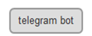Вузол конфігурації спілкується з сервером Telegram. Не створюйте декілька вузлів конфігурації з одним і тим же маркером! 

Тут обов'язково потрібно вводити тільки маркер (token), який ви отримали від `@botfather` при створенні нового бота та його ім'я. 

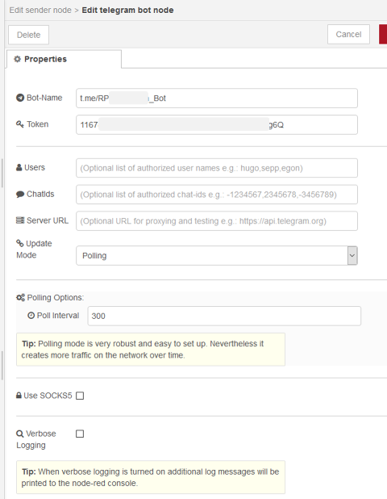

Підтримка проксі-сервера SOCKS5 є необов’язковою, вона потрібна під час роботи за проксі-сервером SOCKS5, який вимагає автентифікації. У цьому випадку у вузлі конфігурації необхідно встановити додаткові властивості конфігурації.

Прапор `Verbose Logging` повинен бути активований лише під час налагодження мережевих проблем, оскільки це створить циклічні попередження, коли мережа буде відключена.

`saveDataDir` (???)- необов'язкове значення конфігурації, яке можна встановити для автоматичного завантаження всього вмісту, як-от музика, відео, анімація, документи тощо. 

#### Читання маркеру зі змінної середовища

Замість того, щоб вводити маркер від bot father безпосередньо в поле маркера, ви також можете доручити вузлу читати його з зовнішнього розташування.

Змінні середовища вводяться в `settings.js` node-red перед запуском.

```
process.env.BOT_TOKEN = "<your bot token here>";
```

Поле маркеру у вузлі конфігурації має виглядати так

```
{env.get("BOT_TOKEN")}
```

#### Налаштування *Users* та *ChatIds*

Вузол містить дві необов’язкові властивості: `users` (користувачі) та `chatids`(ідентифікатори чатів). Ви можете ввести список імен та/або chatids, які мають право використовувати цей бот. Це корисно, якщо бот повинен приймати вхідні виклики лише від спеціалістів. Значення в полях властивостей повинні бути розділені через кому (`,`) наприклад: `User1, User2, User3` (див.рис.). Залиште поля порожніми, якщо ви не хочете використовувати цю функцію. 

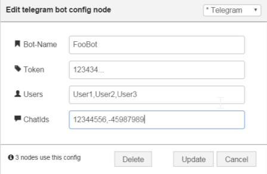

Це корисно, якщо бот повинен приймати лише вхідні виклики від спеціалізованих осіб, або відповідно чат -групи. Значення в полях властивостей повинні бути розділені комою, наприклад: Hugo, Sepp, Egon Залиште поля *Користувачі* та *ChatIds* порожніми, якщо ви не хочете використовувати цю функцію для маскування відправників.

Імена користувачів можна використовувати, лише якщо користувач телеграми встановив своє ім’я користувача в налаштуваннях Telegram. На наведеному нижче знімку екрана показано відповідне діалогове вікно налаштувань у програмі Telegram, де ви можете встановити свої особисті налаштування:

[](https://github.com/windkh/node-red-contrib-telegrambot/blob/master/images/TelegramSettingsUsername.png)

Якщо *Username* не встановлено, можна фільтрувати лише за допомогою властивості *ChatId*.


**Примітка**: chat-ids для чатів, в яких ви спілкуєтесь з ботом, один на один додатні. Від'ємний ідентифікатор чату вказує на груповий чат. Усі в цій групі можуть використовувати бот, якщо ви вводите chat-id групи у відповідному полі вузла конфігурації.

#### Конфігураційна властивість *Server URL*

Це URL-адреса сервера телеграм-сервера (https://api.telegram.org). Якщо ви використовуєте інший екземпляр сервера телеграм в іншому місці (наприклад, у приміщенні), ви можете використовувати цю властивість для підключення до цього сервера замість глобального.

Зазвичай це поле залишається порожнім.

#### Update Mode: Polling/Webhook/None

Режим оновлення можна вибрати з *Polling*а бо *Webhook*.

За замовчуванням бот опитує кожні 300 мс для читання нових повідомлень (`Update mode` = `polling`). Але ви також можете скористатися методом `webhook`, щоб уникнути опитування.

Метод *None* може бути обраний, щоб уникнути трафіку через опитування або вхідні виклики Webhook. Ви можете надсилати повідомлення лише за допомогою вузла відправника, але не можете отримувати жодних даних.

#### Динамічна авторизація 

Якщо ви хочете авторизувати та несанкціонувати користувачів або чати під час виконання, ви можете вставити скрипт у конфігурацію замість жорсткого кодованого списку. Сценарій починається з `{` і закінчується `}`. Взагалі кажучи, ви можете використовувати контекст двома способами (наприклад, у функціональному вузлі):

1. `context.global.maykey = myvalue; // = old notation`
2. `global.set(mykey, myvalue); // = new notation`

У контекстному вікні браузера можна побачити лише останнє, тоді як перше зберігається лише як змінна в пам'яті. Для використання динамічного списку, що зберігається в контексті, ви повинні додати сценарій до конфігурації (у рядку `Users` та/або `ChatIds`):

1. `{context.global.hereyourkey}` для першого підходу
2. `{gobal.get("hereyoukey")}` для другого підходу

Якщо конфігурація починається з `{` і закінчується `}`, вираження оцінюється як сценарій. Наприклад, ви можете написати щось подібне

```javascript
{context.global.username}
{context.global.chatids}
```

або

```javascript
{global.get("usernames")}
{global.get("chatids")}
```

Я б рекомендував використовувати останнє позначення.

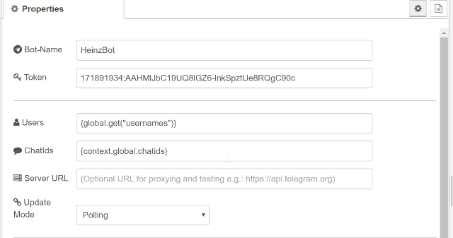

Авторизацію можна змінити за допомогою вузла зміни:

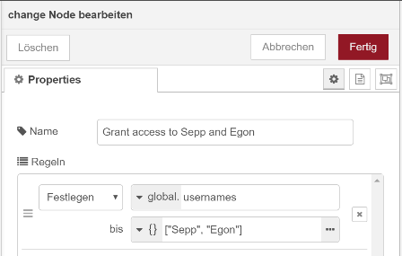

В якості альтернативи авторизацію можна змінити, використовуючи функціональний вузол:

```javascript
// classic aproach for using context.
context.global.usernames = [ "User" ];
context.global.chatids = [ 1 ];
return msg;
```

(не те, що ви також можете використовувати функціональний вузол з новою нотацією, наприклад `global.set` (ключ, значення).

 [dynamic authorization flow](https://github.com/windkh/node-red-contrib-telegrambot/tree/master/examples/dynamicauthorization.json)

#### Використання webhook замість періодичного опитування

Перед цим потрібно створити власний сертифікат, як описано [тут](https://core.telegram.org/bots/webhooks https://stackoverflow.com/questions/42713926/what-is-easy-way-to-create-and-use-a-self-signed-certification-for-a-telegram-we ) Одним із багатьох підводних каменів під час створення сертифікатів (які не працюють) є те, що значення CN, яке ви надали для `openssl`, повинно відповідати доменному імені ботів: див. "bot host" вище.

Створіть нашу пару приватних та відкритих ключів, скориставшись такою командою: Важливо: замініть `SERVER_NAME_OR_IP` на ім’я, яке ви вводите у вузлі конфігурації у розділі "Webhook Bot Host". Обидва імена повинні бути однаковими, інакше сервер телеграми не надсилатиме оновлення вашому боту. Ви також повинні замінити `YOUR_NAME_OR_COMPANY_NAME` деяким значенням. Зауважте, що термін дії сертифікату закінчується через 365 днів.

```shell
openssl req -newkey rsa:2048 -sha256 -nodes -keyout PRIVATE.key -x509 -days 365 -out PUBLIC.pem -subj "/C=NG/ST=Lagos/L=Lagos/O=YOUR_NAME_OR_COMPANY_NAME/CN=SERVER_NAME_OR_IP"
```

Webhook також можна використовувати без сертифіката, але тоді bot host повинен бути за тунелем, див. [посилання](https://github.com/windkh/node-red-contrib-telegrambot/pull/93)

Підтримка проксі-сервера SOCKS5 необов’язкова, коли працює за проксі-сервером SOCKS5, який вимагає аутентифікації.

### Receiver 

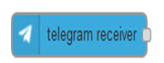Цей вузол отримує всі повідомлення з чату. Просто запросіть бота на чат. (Ви можете контролювати, чи бот отримує кожне повідомлення, викликавши `/setprivacy @botfather`) 

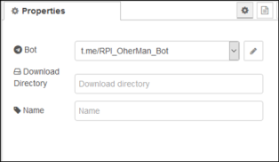

Оригінальне повідомлення з базової бібліотеки вузлів зберігається у `msg.originalMessage`. `msg.payload` містить найважливіші дані, такі як

- `chatId`, 
- `type` (тип ) 
- `content` (вміст).
- `messageID`

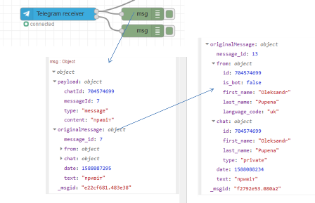

Вміст залежить від типу повідомлення. Наприклад, якщо ви отримуєте повідомлення, то вміст - це рядок. Якщо ви отримаєте місцеположення, то вміст - це об'єкт, що містить широту та довготу. Другий вихід спрацьовує, коли застосовується захист і користувач не має права доступу до бота. Дивись нижче.

Коли вузол приймача отримує такі дані, як відео, документи тощо, файл завантажується автоматично на локальний жорсткий диск, коли в вузлі конфігурації встановлено `saveDataDir`. Каталог також є частиною завантаження повідомлення: `msg.payload.path` Крім того, повідомлення містить пряме посилання для завантаження у корисному навантаженні: `msg.payload.weblink`

Можуть бути отримані повідомлення наступних типів (див output object):

- `message` - content is text
- `photo` - content is the file_id of the photo with the highest  resolution (all photos are stored in the photos property of the output  object)
- `audio` - content is the file_id of the audio file
- `document` - content is the file_id of the document
- `sticker` - content is the file_id of the sticker
- `animation` - content is the file_id of the animation file
- `video` - content is the file_id of the video file
- `video_note` - content is the file_id of the video note file
- `voice` - content is the file_id of the voice file
- `location` - content is an object with latitude and longitude
- `venue` - content is the venue object
- `contact` - content is the contact information object Note that media groups are received not as group, but as separate messages of type photo and video. 

Наступні типи вказують на зміни в самій групі або каналі.

- `new_chat_title` - content is the new chat title
- `new_chat_photo` - content is the file_id (see photo)
- `new_chat_members` - content is an array of new chat members
- `left_chat_member` - content is an object describing the chat member that left
- `delete_chat_photo` - content is true
- `pinned_message` - content is the pinned message object
- `channel_chat_created` - 
- `group_chat_created` - 
- `supergroup_chat_created` - 
- `migrate_from_chat_id` - content is the chat id. The chat property describes the chat.
- `migrate_to_chat_id` - content is the chat id. The chat property describes the chat.

### Sender 

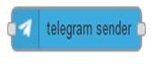Цей вузол відправляє корисне навантаження в чат.

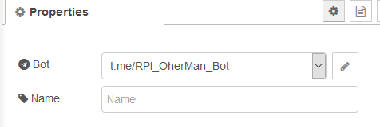

 Корисне навантаження (`payload` ) повинно містити такі поля:

- `msg.payload.chatId` - `chatId` або масив `chatIds`, якщо ви хочете надіслати те саме повідомлення багатьом чатам
- `msg.payload.type` - наприклад, `message`
- `msg.payload.content` - текст повідомлення
- `msg.error` - встановлюється, коли стався виняток
- `msg.payload.options` - додаткові необов'язкові  аргументи які передаються

Поряд з надсиланням вмісту, вузол відправника може використовуватися для видачі прямих команд до API. Тип `msg.payload.type` повинен бути встановлений на одне із наведених вище, `msg.payload.content` містить необхідні аргументи, тоді як додаткові аргументи передаються у `msg.payload.options` (див. Приклади, а також [опис API](https://core.telegram.org/bots/api#sendmessage)). 

Нижче наведена відповідна таблиця з API:

| Parameter                   | Type                                                         | Required | Description                                                  |
| --------------------------- | ------------------------------------------------------------ | -------- | ------------------------------------------------------------ |
| chat_id                     | Integer or String                                            | Yes      | Унікальний ідентифікатор цільового чату або ім’я користувача цільового каналу (у форматі `@Channelusername`) |
| text                        | String                                                       | Yes      | Текст повідомлення для надсилання, 1-4096 символів після розбору сутностей |
| parse_mode                  | String                                                       | Optional | Режим парсингу сутностей у тексті повідомлення. Докладніше див. нижче [Параметри форматування](https://core.telegram.org/bots/api#formatting-options). |
| entities                    | Array of [MessageEntity](https://core.telegram.org/bots/api#messageentity) | Optional | JSON-серіалізований список спеціальних сутностей, що з'являються в тексті повідомлення, який можна вказати замість *parse_mode* |
| disable_web_page_preview    | Boolean                                                      | Optional | Вимкнути попередній перегляд посилань для посилань у цьому повідомленні |
| disable_notification        | Boolean                                                      | Optional | Надсилає повідомлення [мовчки](https://telegram.org/blog/channels-2-0#silent-messages). Користувачі отримають сповіщення без звуку. |
| reply_to_message_id         | Integer                                                      | Optional | Якщо повідомлення є відповіддю, ідентифікатор вихідного повідомлення |
| allow_sending_without_reply | Boolean                                                      | Optional | Передайте *True*, якщо повідомлення слід надіслати, навіть якщо вказане повідомлення з відповіддю не знайдено |
| reply_markup                | [InlineKeyboardMarkup](https://core.telegram.org/bots/api#inlinekeyboardmarkup) or [ReplyKeyboardMarkup](https://core.telegram.org/bots/api#replykeyboardmarkup) or [ReplyKeyboardRemove](https://core.telegram.org/bots/api#replykeyboardremove) or [ForceReply](https://core.telegram.org/bots/api#forcereply) | Optional | Додаткові параметри інтерфейсу. Об'єкт, серіалізований JSON для [вбудованої клавіатури](https://core.telegram.org/bots#inline-keyboards-and-on-the-fly-updating), [спеціальна клавіатура відповідей](https://core.telegram.org/bots#keyboards), інструкції щодо видалення клавіатури відповідей або примусової відповіді від користувача. |

- `editMessageCaption`
- `editMessageText`
- `editMessageReplyMarkup`
- `deleteMessage`
- `editMessageLiveLocation`
- `stopMessageLiveLocation`
- `callback_query`
- `inline_query`
- `action`
- `leaveChat`
- `kickChatMember`
- `unbanChatMember`
- `restrictChatMember`
- `promoteChatMember`
- `exportChatInviteLink`
- `setChatPhoto`
- `deleteChatPhoto`
- `setChatTitle`
- `setChatDescription`
- `pinChatMessage`
- `unpinChatMessage`
- `getChatAdministrators`
- `getChatMembersCount`
- `getChat`
- `getChatMember`

Опис API для даної команди доступне [за посиланням](https://core.telegram.org/bots/api#sendmessage). 

#### Додаткові опції при відправці повідомлень.

Текстові повідомлення можуть бути у форматі розмітки для підтримки жирного та курсивного стилів. Щоб увімкнути формат розмітки, встановіть властивість параметрів `parse_mode` таким чином:

```javascript
msg.payload.options = {parse_mode : "Markdown"};
```

Telegram завжди додає попередній перегляд, коли ви надсилаєте веб-посилання. Ви можете відключити попередній перегляд, встановивши властивість параметрів таким чином:

```javascript
msg.payload.options = {disable_web_page_preview : true};
```

Відповідь на запит зворотного виклику має опцію `show_alert` для контролю видимості відповіді на клієнті. Це безпосередньо відображено у властивості параметрів.

```javascript
msg.payload.options = true;
```

#### Як дізнатися про `chat_id` групи?

Для того, щоб отримати `chat_id` групи треба бота добавити в групу і отримати з неї хоча б одне повідомлення. Там буде вказано ідентифікатор чату. Однак за замовченням, у  групах боти не отримують повідомлення, якщо вони не командні. Це так званий [privacy mode](https://core.telegram.org/bots#privacy-mode). Цей режим можна відключити за допомогою `@BootFather` зайшовши в меню редагування.   

### Типи повідомлень і  відповідний *зміст* елементів в `msg.payload`

`Msg.payload` містить кілька елементів, додаткових до *chatId*, *type* та *content*. Ці додаткові елементи залежать від вмісту `msg.payload.type`. Крім того, формат `msg.payload.content` залежить від *type*.

Наступна таблиця показує зв'язок між типом повідомлення та додатковими елементами. 

| *msg.payload.type*          | *msg.payload.content*         | *chat* | *caption* | *blob* | *photos* | *mediaGroupId* |
| --------------------------- | ----------------------------- | ------ | --------- | ------ | -------- | -------------- |
| **message**                 | text                          | -      | -         | -      | -        | -              |
| **photo**                   | photo[index].file_id          | -      | optional  | true   | +        | optional       |
| **audio**                   | audio.file_id                 | -      | optional  | true   | -        | -              |
| **sticker**                 | sticker.file_id               | -      | -         | true   | -        | -              |
| **animation**               | animation.file_id             | -      | optional  | true   | -        | optional       |
| **video**                   | video.file_id                 | -      | optional  | true   | -        | optional       |
| **video_note**              | video_note.file_id            | -      | -         | true   | -        | -              |
| **voice**                   | voice.file_id                 | -      | optional  | true   | -        | -              |
| **location**                | location                      | -      | -         | -      | -        | -              |
| **venue**                   | venue                         | -      | -         | -      | -        | -              |
| **contact**                 | contact                       | -      | -         | -      | -        | -              |
| **document**                | document.file_id              | -      | optional  | true   | -        | -              |
| **poll**                    | poll                          | -      | -         | -      | -        | -              |
| **invoice**                 | invoice                       | -      | -         | -      | -        | -              |
| **successful_payment**      | successful_payment            | -      | -         | -      | -        | -              |
| **new_chat_title**          | new_chat_title                | -      | -         | -      | -        | -              |
| **new_chat_photo**          | new_chat_photo[index].file_id | -      | -         | true   | +        | -              |
| **new_chat_members**        | new_chat_members              | -      | -         | -      | -        | -              |
| **left_chat_member**        | left_chat_members             | -      | -         | -      | -        | -              |
| **delete_chat_photo**       | delete_chat_photo             | -      | -         | -      | -        | -              |
| **pinned_message**          | pinned_message                | -      | -         | -      | -        | -              |
| **channel_chat_created**    | channel_chat_created          | -      | -         | -      | -        | -              |
| **group_chat_created**      | group_chat_created            | +      | -         | -      | -        | -              |
| **supergroup_chat_created** | supergroup_chat_created       | +      | -         | -      | -        | -              |
| **migrate_from_chat_id**    | migrate_from_chat_id          | +      | -         | -      | -        | -              |
| **migrate_to_chat_id**      | migrate_to_chat_id            | +      | -         | -      | -        | -              |

Legend:

- **-** : Element is not present in `msg.payload` structure
- **+** : Element is mandatory in `msg.payload` structure
- **optional** : Element is optional in *Sender* node and always present in *Receiver* node
- **true** : Element is mandatory and has to be set to boolean value *true*

For more details of the content types listed above also refer to the [**telegram api description**](https://core.telegram.org/bots/api#available-types) and the [**telegram bot api description**](https://core.telegram.org/bots/api). 

### Command 

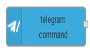Цей вузол можна використовувати для ініціювання передачі message при отриманні заданої команди: наприклад help. Він має два виходи

- перший спрацьовує при отриманні команди

- другий спрацьовує, на наступний цикл після відповіді на команду 

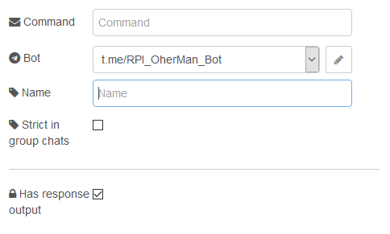


Командний вузол може бути використаний для запуску повідомлення при отриманні вказаної команди: напр. `/help`. Дивіться приклади нижче. Зауважте, що команди завжди починаються з `/`. Якщо у вас є кілька ботів в одному груповому чаті, які реалізують одну і ту ж команду, наприклад `/help`, ви повинні надсилати команди безпосередньо виділеному боту, використовуючи повну нотацію `/help@YourBot`, щоб уникнути одночасного запуску різних ботів. Це важливо, коли ви додаєте кілька різних ботів до одного групового чату. Щоб уникнути того, що бот обробляє команди, які безпосередньо йому не надсилаються, використовуючи довгу нотацію, ви можете встановити "суворий" режим в параметрах командного вузла (`strict in group chats`). У цьому випадку бот приймає лише повні позначення команд у групових чатах.

Конфігурація вузла містить такі спеціальні властивості:

- **Command**: Команда, яку слід виконати. Починається з `/`
- **Register at telegram server** flag: Для автоматичної реєстрації команди та опису на сервері телеграм.
- **Description**:  Опис використовується, коли команда повинна бути опублікована через /setMyCommands на сервері телеграм. Це необов’язково, якщо прапорець **Register at telegram server** не встановлено.
- **Language**: Двозначний код мови (див. ISO-639-1). Якщо це поле порожнє, воно відображатиметься кожною мовою, інакше - лише користувачам, які встановили мову свого клієнта для цієї мови.
- **Scope**: Область дії команди: див. Також [BotCommandScope](https://core.telegram.org/bots/api#botcommandscope).
- **Strict in group chats** flag: Щоб уникнути того, що бот обробляє команди, які не надсилаються йому безпосередньо за допомогою довгих нотацій (наприклад, /foo@YourBot), ви можете встановити "строгий" режим у параметрах командного вузла. У цьому випадку бот приймає лише повну нотацію команди в групових чатах.
- **Has response output** flag: Це дозволяє другий вихід (*Unathorized Output*). В іншому випадку у вузла є лише один вихід.
- **Use Regex** flag:  Дозволяє використовувати регулярні вирази як команду. Наприклад, `^/toggle_` дозволяє всі команди, що починаються з `/toggle_`.
- **Remove Command** flag: Цей додатковий прапор використовується, якщо встановлено прапорець **Use Regex**. Якщо цей прапорець встановлено, він видаляє відповідну команду з початку повідомлення. Якщо ваша команда містить інформацію про адресу, вам потрібно зняти цей прапорець, щоб мати можливість самостійно проаналізувати цю інформацію.

Вузол має до двох виходів (вибирається за допомогою прапорця *Has response output*):

1. Перший/верхній вихід вузла (*** Standard Output***) використовується, якщо повідомлення надходить від авторизованого користувача і містить зазначену команду на початку повідомлення.
2. Другий/нижній вихід вузла (***Unauthorized Output***) використовується у всіх інших випадках. Це може бути у випадку, коли застосовується безпека (через властивості конфігурації *Users* та *ChatIds*), і користувач не має дозволу на доступ до бота, або якщо це від авторизованого користувача, і повідомлення не містить вказаної команди.

Другий вихід корисний, коли ви хочете використовувати клавіатуру. Він використовується, тільки якщо команда була отримана раніше. Якщо тим часом була запущена інша команда, статус першої, що очікує на виконання, скидається. Стан зберігається для кожного користувача та для кожного чату.

### Event 

Вузол отримує події від бота на зразок:

- **Callback Query** зворотній зв'язок від вбудованих клавіатур. Див. Example-flow [inline keyboard flow](https://github.com/windkh/node-red-contrib-telegrambot/blob/master/examples/inlinekeyboard.json) у папці з прикладами.
- **Inline Query** of inline bots. See [Inline mode](https://core.telegram.org/bots/api#inline-mode) in the bot API.
- **Edited Message** which is triggered when someone alters an already sent message.
- **Edited Message Text** which is triggered when someone alters an already sent message text.
- **Edited Message Caption** which is triggered when someone alters an already sent caption e.g. of a photo.
- **Channel Post** which is triggered when the bot is member of a public channel (/setprivacy to disabled!).
- **Edited Channel Post** which is triggered when someone alters an already sent message in a public channel.
- **Edited Channel Post Text** which is triggered when someone alters an already sent message text in a public channel.
- **Edited Channel Post Caption** which is triggered when someone alters an already sent caption of e.g. a photo in a public channel.
- **Pre Checkout Query**  який запускається, коли хтось здійснює платіж (див. надіслати рахунок -фактуру).
- **Shipping Query**  яка спрацьовує, коли хтось надсилає доставку.
- **Chosen Inline Result** which is triggered when a user has chosen a result from an inline query.
- **Poll** який запускається при створенні опитування.
- **Poll Answer** яка спрацьовує при відповіді на опитування.

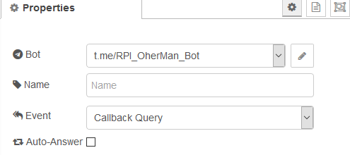

### Reply 

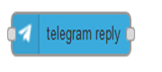Вузол відповіді чекає відповіді на вказане повідомлення. Його слід використовувати разом із вузлом `Sender`. 

Див. Приклад нижче.

Поруч із клавіатурою бот також може задати питання і чекати відповіді. Коли користувач відповідає на вказане повідомлення, може бути використаний вузол `reply` :

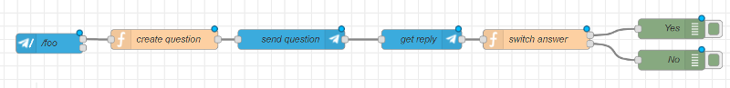 

###### Create question

```javascript
msg.payload.type = 'message';
msg.payload.content = 'Really?';
msg.payload.options = {reply_to_message_id : msg.payload.messageId}
return [ msg ];
```

Питання надсилається до чату. Цей вузол запускає вузол відповіді в очікуванні відповіді.

**Примітка**: користувач повинен явно відповісти на це повідомлення (типу з коментарем). Якщо користувач записує лише якийсь текст, вузол не буде спрацьовувати.

###### switch answer

```javascript
if (msg.payload.content === 'Yes') {return [msg, null];}
else {return [null, msg];} 
```

Остання функція показує, як оцінити відповідь за допомогою вузла функції з двома виходами.

### Control

A telegram node that control the configuration node.

Inputs

1. Standard Input: receives a control command.
Details

The msg.payload must be an object that contains a complete command, at a minimum these should contain:

- `command`: The command as string: `stop`, `start`, `restart`
- `delay`: The optional delay in milliseconds between stop and start for command restart

Outputs

1. The polling cycle info.

2. The check connection result.

### Приклади

#### Реалізація команди  `/help` 

Цей потік повертає довідкове повідомлення вашого бота. Він отримує команду і створює нове повідомлення, яке повертається:

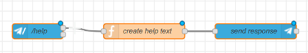

```javascript
var helpMessage = "/help - shows help\r\n";
helpMessage += "/foo - opens a dialog\r\n";

helpMessage += "\r\n";
helpMessage += "You are welcome: "+ msg.originalMessage.from.first_name + " " + msg.originalMessage.from.last_name;
helpMessage += "Your chat id is " + msg.payload.chatId;
helpMessage += "\r\n";

msg.payload.content = helpMessage;
return msg;
```

**Примітка**: Ви можете отримати доступ до даних відправника через властивість `originalMessage`.

#### Реалізація клавіатури (keyboard)

Клавіатури дуже корисні для отримання додаткових даних від відправника. Після отримання команди запускається перший вихід і відкривається діалогове вікно:

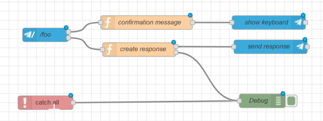 

```javascript
context.global.keyboard = {pending : true};

var opts = {
    reply_to_message_id: msg.payload.messageId,
    reply_markup: JSON.stringify({
        keyboard: [
            ['Yes'],
            ['No']],
        	'resize_keyboard' : true,
        	'one_time_keyboard' : true
    })
};
msg.payload.content = 'Really?';
msg.payload.options = opts;
return [msg];
```

Відповідь надсилається на другий вихід, запускаючи нижній потік. Тут передаються дані через глобальні властивості.

```javascript
if (context.global.keyboard.pending)
    {
        context.global.keyboard.pending = false;
        
        if(msg.payload.content === 'Yes')
            {
                msg.payload.content = 'Yes';
                return [msg, null];
            }
        else
            {
                msg.payload.content = 'No';
                return [null, msg];
            }
    }
```

Заповнення полів читайте в [описі API](https://core.telegram.org/bots/api/#replykeyboardmarkup).

#### Реалізація inline-клавіатури 

Вбудована клавіатура містить кнопки, які можуть надсилати запит зворотного виклику назад до бота, щоб викликати будь-яку функцію. Коли команда отримана, спрацьовує перший вихід і відображається вбудована клавіатура:

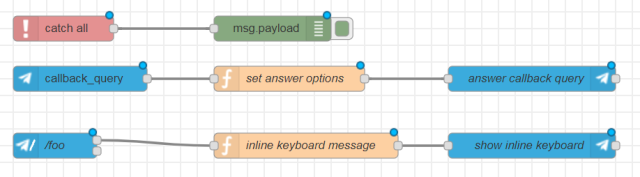

 [inlinekeyboard flow](https://github.com/windkh/node-red-contrib-telegrambot/tree/master/examples/inlinekeyboard.json)

###### inline keyboard message

```javascript
var opts = {
  reply_to_message_id: msg.payload.messageId,
  reply_markup: JSON.stringify({
    "inline_keyboard": [[
                {
                    "text": "Yes",
                    "callback_data": "FOO YES"            
                }, 
                {
                    "text": "No",
                    "callback_data": "FOO NO"            
                }]
            ]
  })
};
msg.payload.content = 'Are you sure?';
msg.payload.options = opts;
return [ msg ];
```

Запит зворотного виклику отримує вузол події (`Event`). На нього потрібно відповісти наступним чином: 

###### set  answer options

```javascript
var show_alert = false; // ви можете встановити це значення true, щоб відкрити діалогове вікно з відповіддю у клієнта.

// msg.payload.content вміщує дані callback для клавіатури
// Ви можете змінити це значення тут 
msg.payload.options = show_alert;

return [ msg ];
```

тут ви можете додати свій код, щоб запустити бажану команду бота. Відповідь містить дані запиту зворотного виклику у `msg.payload.content`.

#### Редагування в inline клавіатурі

Вбудовану клавіатуру можна змінити, використовуючи інструкцію `editMessageReplyMarkup`. Щоб мати змогу змінити існуюче повідомлення, вам потрібно знати `messageId` повідомлення клавіатури. Зразковий потік надається в папці з прикладами і може виглядати так:

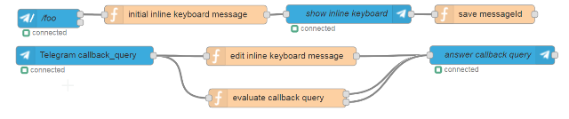 

[editinlinekeyboard flow](https://github.com/windkh/node-red-contrib-telegrambot/tree/master/examples/editinlinekeyboard.json)

###### initial inline keyboard message

```javascript
context.global.keyboard = { messageId : msg.payload.messageId };
var opts = {
  reply_to_message_id: msg.payload.messageId,
  reply_markup: JSON.stringify({
    "inline_keyboard": [[
                {
                    "text": "Yes",
                    "callback_data": "FOO YES"            
                }, 
                {
                    "text": "No",
                    "callback_data": "FOO NO"            
                }]
            ]
  })
};
msg.payload.content = 'Do you want to hide the inline keyboard?';
msg.payload.options = opts;
return [ msg ];
```

Ідентифікатор повідомлення `message id` потрібно зберегти у потоці чи глобальному контексті. Це лише демонстрація, яка припускає, що є лише один чат.

###### save messageId

```javascript
// We store the messageId to be able to edit this reply in the callback query. 
context.global.keyboard.messageId = msg.payload.sentMessageId;
return [ msg ];
```

Замініть початкову клавіатуру модифікованою, використовуючи магічну команду `editMessageReplyMarkup`.

###### edit inline keyboard message

```javascript
// This is the message id of the initial keyboard that is simply exchanged by a new one.
var messageId = context.global.keyboard.messageId;
// This is a sample of how to send a second inline keyboard with modified buttons
var reply_markup = JSON.stringify({
    "inline_keyboard": [[
                {
                    "text": "Are you really sure?",
                    "callback_data": "FOO YES REALLY"            
                }, 
                {
                    "text": "No",
                    "callback_data": "FOO NO"            
                }]
            ]
  });
var options = {
    chat_id : msg.payload.chatId,
    reply_markup : reply_markup,
    message_id : messageId
};
msg.payload.type = 'editMessageReplyMarkup';
msg.payload.content = reply_markup;
msg.payload.options = options;
return [ msg ];
```

Наступний вузол `switch` просто обробляє відповідь і приховує клавіатуру за допомогою іншої магічної команди: `deleteMessage`

```javascript
// This is a sample switch to demonstrate the handling of the user input.
if(msg.payload.content === "FOO YES REALLY")
{
    // Hide the keyboard and forget the messageId
    msg.payload.type = 'deleteMessage';
    msg.payload.content = context.global.keyboard.messageId
    context.global.keyboard.messageId = null;    
    // You could also send a editMessageReplyMarkup with an empty reply_markup here
    return [ null, msg ];
}
else
{
    var show_alert = false; // you can set this to true to open a dialog with the answer in the client.
    // msg.payload.content contains the callback data from the keyboard.
    // You may change this value here.
    msg.payload.options = show_alert;
    return [ msg, null ];
}
```

Як альтернативу `editMessageReplyMarkup` ви також можете використовувати `editMessageText` для заміни клавіатури, а також тексту наступним чином:

```javascript
// This is the message id of the initial keyboard that is simply exchanged by a new one.
var messageId = context.global.keyboard.messageId;

// This is a sample of how to send a second inline keyboard with modified buttons
var reply_markup = JSON.stringify({
    "inline_keyboard": [[
                {
                    "text": "Are you really sure?",
                    "callback_data": "FOO YES REALLY"            
                }, 
                {
                    "text": "No",
                    "callback_data": "FOO NO"            
                }]
            ]
  });


var options = {
    chat_id : msg.payload.chatId,
    reply_markup : reply_markup,
    message_id : messageId
};

msg.payload.type = 'editMessageReplyMarkup';
msg.payload.content = reply_markup;
msg.payload.options = options;

return [ msg ];

```

#### Реалізація inline_query

Ботів можна викликати з будь-якого чату через `inline_query`, коли бот встановлений на вбудований режим в botfather через `/setinline`, див. [посилання](Https://core.telegram.org/bots/api#inline-mode) Приклад потоку може виглядати так:

 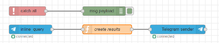 

[inlinequery flow](https://github.com/windkh/node-red-contrib-telegrambot/tree/master/examples/inlinequery.json)

На відповідь `inline_query` слід відповісти, надсилаючи масив результатів. див. [посилання](https://core.telegram.org/bots/api#inlinequeryresult)  Приклад лише повертає дві прості статті, але майже кожен тип вмісту може бути повернутий.

###### create results

```javascript
// we have to set the results propery with the answer(s)
// see https://core.telegram.org/bots/api#inlinequeryresult
var results = [
    // result 1 is InlineQueryResultArticle
    {
        type : "article",
        id : "1",
        title : "Result 1",
        
        // InputTextMessageContent see https://core.telegram.org/bots/api#inputmessagecontent
        input_message_content : {
            message_text : "The message 1",
            parse_mode : "Markdown",
            disable_web_page_preview : true
        }
    },
    
    // result 2 is InlineQueryResultArticle
    {
        type : "article",
        id : "2",
        title : "Result 2",
        
        // InputTextMessageContent see https://core.telegram.org/bots/api#inputmessagecontent
        input_message_content : {
            message_text : "The message 2",
            parse_mode : "Markdown",
            disable_web_page_preview : false
        }
    }
    ];

msg.payload.results = results;
return msg;
```

Зауважте, що запит `inline_query` також може містити місцезнаходження відправника. Щоб увімкнути цей виклик `/setinlinegeo` у `@botfather`

#### Отримання місцеположення

Місцеположення можна надіслати до чату. Бот може отримувати довготу і широту:

```javascript
if (msg.payload.type == 'loation')
    {
        var lat = msg.payload.content.latitude;
        var lng = msg.payload.content.longitude;
        
        msg.payload.type = 'message';
        msg.payload.content = 'lat=' + lat + ' lon=' + lng;
        return msg;
    }
else
    {
        return null;
    }
```

#### Відправка повідомлення до вказаного чату

Якщо у вас є `chatId`, ви можете надіслати будь-яке повідомлення без необхідності отримувати щось до цього.

```javascript
msg.payload = {chatId : -476404242, type : 'message', content : 'ping'}
return msg;
```

 [sendmessagetochat flow](https://github.com/windkh/node-red-contrib-telegrambot/tree/master/examples/sendmessagetochat.json)

#### Відправка фото, відео ...

Поряд з надсиланням текстових повідомлень ви можете надсилати майже будь-який вміст, наприклад фотографії та відео. Встановіть правильний тип та зміст. Якщо ви хочете відповісти на отримане повідомлення із зображенням, ви можете написати:

```javascript
msg.payload.content = 'foo.jpg';
msg.payload.type = 'photo';
```

**Примітка**: chatId є правильним, коли ви повторно використовуєте отриманий msg-об’єкт із вузла приймача.

Ви можете використовувати один із наступних типів, щоб надіслати файл як вміст:

- [photo](https://github.com/windkh/node-red-contrib-telegrambot/tree/master/examples/sendphoto.json)
- audio
- video
- video_note
- sticker
- animation
- voice
- document 

Зауважте, що деякі клієнти перетворюють gif-анімацію у відео. Це призведе до проблем при передачі отриманого об’єкта анімації до вузла відправника, оскільки вміст є `mp4` замість `gif`. Вміст можна автоматично завантажити в локальну папку, встановивши запис `saveDataDir` у вузлі конфігурації. Ви можете додати підпис до фотографії, аудіо, документа, відео, анімації, голосу, встановивши властивість підписів таким чином:

```javascript
msg.payload.caption = "You must have a look at this!";
```

Для таких типів потрібен спеціальний формат вмісту. Детальнішу інформацію див. у API.

- location
- contact
- venue
- mediaGroup

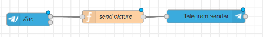 

```javascript
msg.payload.content = 'foo.jpeg';
msg.payload.type = 'photo';

/* type can be one of the following
photo
audio
video
sticker
voice
document
*/

return msg;
```

#### Відправка `mediaGroup` як альбом 

Щоб надіслати кілька фотографій як альбом, ви можете використовувати `mediaGroup`. Для типу медіагрупи потрібно встановити вміст масиву типу об’єктів [InputMediaPhoto](https://core.telegram.org/bots/api#inputmediaphoto). Перегляньте Json нижче.

```javascript
msg.payload = {
    "chatId": 123456789,
    "messageId": 1,
    "type": "mediaGroup",
    "content": [
        {
            "type": "photo",
            "media": "/pic/frame_1.jpg"
        },
        {
            "type": "photo",
            "media": "/pic/frame_2.jpg"
        },
        {
            "type": "photo",
            "media": "/pic/frame_3.jpg"
        },
        {
            "type": "photo",
            "media": "/pic/frame_4.jpg"
        }
    ]
}
```

[sendmediagroup flow](https://github.com/windkh/node-red-contrib-telegrambot/tree/master/examples/sendmediagroup.json)

#### Відправка контактів 

Надсилання контакту обмежується полями, які підтримуються базовим API, на `phone_number` та `first_name`. Але ви також можете отримати `last_name`, якщо клієнт надішле його.

```javascript
msg.payload.type = 'contact';
msg.payload.content : {  phone_number: "+49 110", first_name: "Polizei" };
```

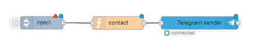 

[sendcontacttochat flow](https://github.com/windkh/node-red-contrib-telegrambot/tree/master/examples/sendcontacttochat.json)

```javascript
msg.payload = 
{
    chatId : 12345,
    type : "contact",
    content : 
    {
        phone_number: "+49 110",
        first_name: "first",
        last_name: "last"
    },
    options :
    {
        disable_notification : true
    }
}
return msg;
```

#### Відправка дій чату

Коли боту потрібен певний час для подальшої обробки, але ви хочете дати підказку користувачеві, що відбувається, ви можете надіслати чат, який з’явиться у верхній частині каналу приймача.

```javascript
msg.payload.type = 'action';
msg.payload.content = "typing";
```

Зміст може бути одним із наступних

- `typing` for text messages
- `upload_photo` for photos
- `record_video` or `upload_video` for videos
- `record_audio` or `upload_audio` for audio files
- `upload_document` for general files
- `find_location` for location data
- `record_video_note` or `upload_video_note` for video notes

Наступний приклад ілюструє, як надіслати, наприклад, `typing`("набір тексту ..."). Звичайно, справжній бот надсилає реальні дані після закінчення обробки, але це не є частиною прикладу.

[sendchataction flow](https://github.com/windkh/node-red-contrib-telegrambot/tree/master/examples/sendchataction.json)

#### Відправка місцеположення в реальному часі

Місцеположення можна надіслати в чат, як описано вище, а потім оновити: оновлення місцезнаходження в реальному часі. Щоб досягти цього, вам потрібно надати параметр `live_period` у секундах у опціях при відправці місця.

```javascript
msg.payload.type = 'location';
msg.payload.content = {
    latitude : lat,
    longitude : lng
};

msg.payload.options = {
    live_period : time
};
```

Щоб мати можливість оновити це місцеположення, вам потрібно зберегти ідентифікатор цього відправленого повідомлення. Це можна зробити, зберігаючи його десь у контексті потоку наступним чином:

```javascript
var messageId = msg.payload.sentMessageId;
flow.set("messageId", messageId);
```

Тепер ви можете редагувати місце розташування так часто, як вам потрібно з періодичністю `live_period`:

```javascript
var messageId = flow.get("messageId");
var chatId = msg.payload.chatId;

msg.payload.type = 'editMessageLiveLocation';
msg.payload.content = {
    latitude : lat,
    longitude : lng
};

msg.payload.options = {
    chat_id : chatId,
    message_id : messageId
};
```

Якщо ви хочете скасувати оновлення місця, ви можете надіслати команду `stopMessageLiveLocation`.

```javascript
var messageId = flow.get("messageId");
var chatId = msg.payload.chatId;

msg.payload.type = 'stopMessageLiveLocation';
msg.payload.options = {
    chat_id : chatId,
    message_id : messageId
};
```

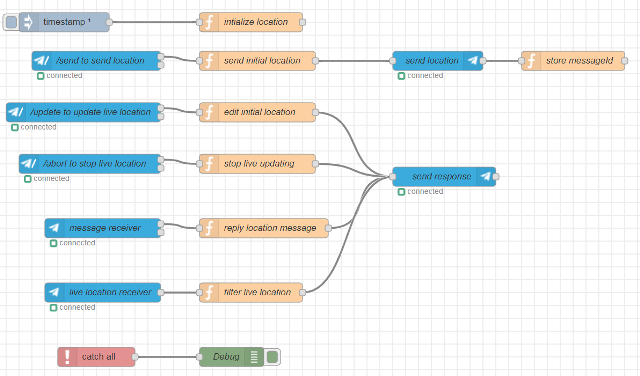 [livelocation flow](https://github.com/windkh/node-red-contrib-telegrambot/tree/master/examples/livelocation.json)

#### Receiving live location updates

When a user sends his location then it is received by the standard message receiver node. But when a live location is updated, then you will receive the same message event as one would edit an already existing message in the chat (edit_message). The example above contains an event handler node that receives those message edits, and filters for the ones that contain a location.

#### Forwarding message

All types of  messages can be forwarded to another chat (see forwardMessage). Just send a message to the sender node and add forward property to the payload. The forward object must contain the id of the chat the message should be sent to. In the following example the received message will be forwarded to the chat 1:

```javascript
msg.payload.forward = { chatId : 1 };
return msg;
```

See example-flow [forward message](https://github.com/windkh/node-red-contrib-telegrambot/tree/master/examples/forwardmessage.json) in examples folder.

The message id to forward is taken from: msg.payload.messageId.  The source chat id is taken from: msg.payload.chatId. Both properties are set by the receiver node, but you can also manually set those manually without having received anything. The following example sends message 2 from chat 1 to chat 3 (if you have sufficient permissions).

```javascript
msg.payload.chatId = 1;
msg.payload.messageId = 2;
msg.payload.forward = { chatId : 3 };
return msg;
```


#### Виявлення неавторизованого доступу

Вузол приймача має другий вихід, який спрацьовує, коли авторизація не працює. Повідомлення надсилається на цей вихід для подальшої обробки. Ви можете відповісти на це повідомлення або записати його у файл, щоб побачити, хто хотів отримати доступ до вашого бота.

 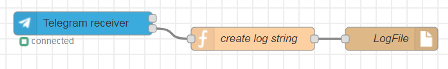

Повідомлення потрібно відформатувати до того, як можна буде запустити вузол журналу у файл. Проста функція може виглядати так:

```javascript
var chatId = msg.payload.chatId;
var username = msg.originalMessage.from.username;
msg.originalMessage.timestamp = new Date();
var message = JSON.stringify(msg.originalMessage);

msg.topic = username + ' ' + chatId;
msg.payload = [msg.topic, message];
return msg;
```

 [unauthorizedaccess flow](https://github.com/windkh/node-red-contrib-telegrambot/tree/master/examples/unauthorizedaccess.json)


#### Реалізація простого бота

Збираючи всі шматки разом, у вас буде простий бот, який реалізує деякі корисні функції.

 

All example flows can be found in the examples folder of this package.

###### confirmation message

```javascript
var opts = {
  reply_to_message_id: msg.payload.messageId,
  reply_markup: JSON.stringify({
    keyboard: [
      ['Yes'],
      ['No']],
      'resize_keyboard' : true, 
      'one_time_keyboard' : true
  })
};

msg.payload.content = 'Really?';
msg.payload.options = opts;

return [ msg ];
```

###### create response

```javascript
if(msg.payload.content === 'Yes')
{
    msg.payload.content = 'Yes';
    return [msg, null];   
}
else
{
    msg.payload.content = 'No';
    return [null, msg];   
}
```

###### create help text

```javascript
var helpMessage = "/help - shows help\r\n";
helpMessage += "/foo - opens a dialog\r\n";
helpMessage += "Your chat id is " + msg.payload.chatId;

helpMessage += "\r\n";
helpMessage += "You are welcome: "+msg.originalMessage.from.username;
helpMessage += "\r\n";

msg.payload.content = helpMessage;
return msg;
```

###### create location message

```javascript
if(msg.payload.type == 'location')
{
    var lat = msg.payload.content.latitude;
    var lng = msg.payload.content.longitude;
    
    msg.payload.type = 'message';
    msg.payload.content = 'lat=' + lat + ' lon=' + lng;
    return msg;
}
else
{
    return null;
}
```

###### send to specific chat

```javascript
msg.payload = {chatId : 138708568, type : 'message', content : 'ping'}
return msg;
```

