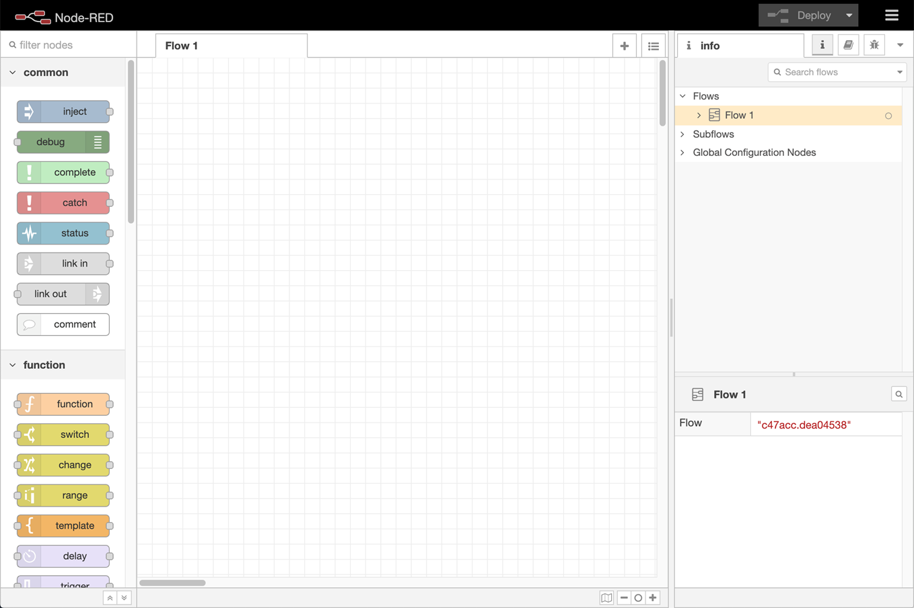
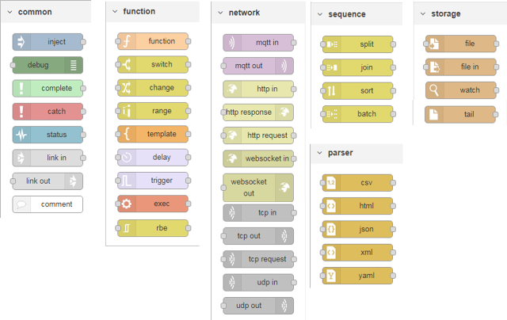

## Про NODE-RED 

**Node-RED** - це інструмент для візуального програмування потоків даних, розроблений працівниками компанії IBM для поєднання різноманітних пристроїв, API та онлайн-сервісів як складових частин Інтернету речей. Node-RED дає можливість розробляти програмне забезпечення для програмно-апаратних систем, які включають в себе різноманітні IoT пристрої, застосунки та сервіси, при цьому навіть не використовуючи текстове програмування. 

Редактор Node-RED базується на браузері. Мова дозволяє об’єднувати в потоки вузли з широкого набору палітри, які можуть бути розгорнуті для виконання лише одним клацанням миші. 

Node-RED дає змогу працювати з браузерним редактором потоків даних як окремими вузлами з різним функціоналом, що уможливлюють створення JavaScript-функцій. Причому можна використовувати як базові вузли, якими одразу забезпечений Node-RED, так і встановлювати вузли з додатковим функціоналом з репозиторію NPM або ж навіть створити свій власний вузол з унікальним функціоналом. 

Програми або ж їхні частини, розроблені за допомогою Node-RED, можуть бути збережені та поширені для вільного використання. Саме середовище побудовано на основі **Node.js**, яке буде вивчатися в одній з наступних лекцій. За ініціативою IBM у 2016 році Node-RED став відкритим програмним забезпеченням (open-source) як частина проекту JS Foundation.

Легке середовище виконання (runtime) побудоване на Node.js, в повній мірі використовуючи перевагу його подіє-орієнтованої не блокуючої моделі. Це робить його ідеальним для роботи на краю (Edge) мережі на недорогих апаратних засобах, таких як Raspberry Pi, а також у хмарі.

Діапазон вузлів палітри легко розширити додаванням великої кількості модулів (сотні тисяч) зі сховища Node  щоб отримати нові можливості.

Потоки, створені в Node-RED, зберігаються за допомогою JSON, що дозволяє легко імпортувати та експортувати їх для спільного використання з іншими.

## 2.2. Редактор

Детальний опис редактору доступний [за посиланням](https://pupenasan.github.io/NodeREDGuidUKR/base/1_2.html)

Редактор складається з таких 4 компонентів:

- у верхній частині міститься заголовок, що містить кнопку  розгортання, головне меню, і якщо користувач пройшов автентифікацію,  меню користувача.
- ліворуч знаходиться **палітра (palette),** яка містить вузли доступні для використання
- посередині знаходиться основна **робоча область(workspace)**, в якій створюються потоки
- праворуч знаходиться бічна панель (**sidebar**)



рис.2.1. Вигляд редактору Node-RED.

Уся програма складається з об’єднання вузлів – **потоків** (**flow**). Потоки розробляються в межах вкладок браузера з певною назвою. Вкладки також називаються потоками, хоч на них може бути  кілька наборів об’єднаних вузлів. 

Термін “потік” також використовується для неофіційного  опису одного набору підключених вузлів. Таким чином, потік (вкладка)  може містити кілька потоків (набори з’єднаних вузлів).

Потоки можна добавляти, видаляти, деактивувати (вони не розгортаються). До потоків можна добавляти опис у форматі MarkDown.

**Вузли** (**Nodes**) можуть бути додані до робочої області з палітри або безпосередньо по імені. 

Вузли з’єднуються один з одним за допомогою з’єднань через їхні входи та виходи, які називаються **портами**. Вузол може мати:

- не більше одного вхідного порту
- багато  вихідних портів. 

Порт може мати мітку (label), що буде показуватися при  наведенні курсору. Деякі вузли відображають статусне повідомлення або піктограми поряд з ними. Це використовується для позначення стану вузла в режимі виконання.  Якщо вузол має які-небудь зміни, що не були розгорнуті в режимі  виконання, це буде відображено синім кружком над ним. Якщо є помилки у  конфігурації, то буде відображатися червоний трикутник.  Вузли `Inject` і `Debug` є єдиними вузлами, які мають кнопки керування: вприскування (`Inject` ) та відображення повідомлення (`Debug` ).

Діалогове вікно редагування вузла має три окремих розділи: властивості  (properties), опис (Description) та зовнішній вигляд (Appearance) .

**Конфігураційні вузли** (**config Node**) -  це спеціальний тип вузла, що містить конфігурацію багаторазової  доступності, що може бути розподілена між звичайними вузлами потоку. Доступ до них відбувається через бічну панель. 

Вузли можуть бути об’єднані разом, щоб утворити **групу** (**Group**). Потім вони  можуть бути переміщені або скопійовані як єдиний об’єкт у редакторі.

**Під-потоки** (**subflow**) - це сукупність вузлів, які згортаються в  єдиний вузол у робочій області. Вони можуть бути використані для  зменшення певної візуальної складності потоку або для об’єднання групи  вузлів, що використовується в різних місцях. Після створення, під-потік  додається до палітри доступних вузлів. Потім окремі екземпляри  під-потоку можна додати до робочої області, як і будь-який інший вузол.  Під-потік не може існувати сам собою без жодних вузлів, він повинен  містити їх прямо або опосередковано. Як і в звичайних потоках у вузлах підпотоків, може бути не більше одного вводу та багато виходів, за необхідності. Кожен запис у таблиці властивостей можна розширити, щоб налаштувати його відображення під час редагування екземпляру підпотоку. 

Потоки можна імпортувати та експортувати з редактора, використовуючи  формат JSON, що дозволяє дуже легко обмінюватися потоками з іншими  редакторами.

Діалогове вікно Імпорту можна використовувати для імпорту потоку за допомогою таких методів:

- вставлення в потік JSON потоку безпосередньо,
- завантаження файлу потоку з JSON,
- вибір локальної бібліотеки потоків,
- вибір потоків прикладів, передбачених встановленими вузлами.

Палітра містить всі вузли, які встановлені та доступні для використання. Вони організовані в декілька категорій починаючи зверху з inputs,  outputs та functions. Якщо є під-потоки, вони з'являються у  категорії у верхній частині палітри.

Для встановлення нових вузлів до палітри може використовуватися **менеджер палітри** (Palette Manager). Доступ до нього можна отримати за вкладкою Palette tab в User Settings dialog. 

**Бічна панель** надає наступні можливості:

- Information -- переглянути інформацію про вузли та отримати довідкову інформацію про них
- Debug -- перегляд повідомлень, переданих вузлам Debug
- Configuration Nodes -- керування конфігураційними вузлами
- Context data -- перегляд вмісту контекстів

Деякі вузли додають власні панелі бічної панелі, наприклад **node-red-dashboard**

## 2.3. Робота з повідомленнями

Потік Node-RED працює, передаючи повідомлення між  вузлами. Повідомлення є простими об'єктами JavaScript, які можуть мати  будь-який набір властивостей. Повідомлення, як правило, мають  властивість `payload`, це властивість за умовчанням, з якою працюватиме більшість вузлів. Node-RED також додає властивість, що називається `_msgid` - це ідентифікатор для повідомлення, яке може використовуватися для відстеження його проходження потоком

```json
{
"_msgid": "12345",
    "payload": "..."
}
```

Значенням властивості може бути будь-який дійсний тип JavaScript, наприклад

- `Boolean` – true, false
- `Number` – наприклад 0, 123.4
- `String` – "hello"
- `Array` - [1,2,3,4]
- `Object` - { "a": 1, "b": 2}
- `Null`

Докладніше про типи JavaScript буде в наступних лекціях.

Найпростіший спосіб зрозуміти структуру повідомлення - передати його в вузол `Debug` і переглянути його на бічній панелі Debug. За замовчуванням на вузлі Debug відображатиметься властивість `msg.payload` , але може бути налаштована для відображення будь-яка інша властивість  або все повідомлення цілком. При відображенні масиву, або об'єкта, бічна  панель забезпечує структурований вигляд, який може використовуватися для вивчення повідомлення.


рис.2.2. Перегляд структури повідомлення на бічній панелі Debug

- в самому верху він показує ім'я властивості, яке було передано. Тут за замовчуванням використано `msg.payload` 
- поруч із назвою є назва типу властивості - Object, String, Array ін..
- потім він показує вміст властивості. Для масивів і об'єктів  властивість розкладається на рядки. Клацаючи по ньому, властивість  розгорнеться, щоб показати більш детальну інформацію.

## 2.4. Огляд основних вузлів

До вузлів, що входять до стандартної комплектації Node-RED v.1.1 відносяться:

- Загальні (common) -- найбільш загальні вузли для роботи з потоками. 
- Функціональні (function) -- функції перетворення повідомлень та керування потоком 
- Послідовності (sequence) -- розбивка на послідовності та збирання послідовностей повідомлень
- Сховища (storage) -- робота з читанням/записом файлів
- Мережні (network) -- робота з WEB та IoT протколами 
- Парсери (parser) -- функції перетворенння форматів

Мережні вузли, парсери та storage будуть розглянуті в інших лекціях.  

Довідник по всім основним вузлам доступний [за посиланням](https://pupenasan.github.io/NodeREDGuidUKR/#стандартна-комплектація).



рис.2.3.  Основні вузли Node-RED

## 2.5. Загальні вузли (Common)

Таблиця 2.1. Перелік загальних вузлів

|           Вузол            | Призначення                                                  |
| :------------------------: | ------------------------------------------------------------ |
|    | [Inject](https://pupenasan.github.io/NodeREDGuidUKR/base/1_4_1.html#inject-ініціювання-повідомлення) для ініціювання потоку (відправки повідомлення) користувачем, автоматично при запуску, періодично або за розкладом. |
|     | [Debug](https://pupenasan.github.io/NodeREDGuidUKR/base/1_4_1.html#debug-вивести-на-відлагодження) використовується для відображення повідомлень на бічній панелі Debug у редакторі. |
|  | [Complete](https://pupenasan.github.io/NodeREDGuidUKR/base/1_4_1.html#complete) запускає потік, коли інший вузол завершує оброблення повідомлення. |
|     | [Catch](https://pupenasan.github.io/NodeREDGuidUKR/base/1_4_1.html#catch-обробник-помилок) ловить помилки виконання інших вузлів у тому самому потоці (вкладці) і формує повідомлення з інформацією про них. |
|    | [Status](https://pupenasan.github.io/NodeREDGuidUKR/base/1_4_1.html#status-стан-вузлу) показує стан (status message) вказаних або усіх вузлів в потоці. |
|   | [Link in](https://pupenasan.github.io/NodeREDGuidUKR/base/1_4_1.html#link-in-та-link-out-посилання) вхідне з’єднання з іншого потоку |
|  | [Link out](https://pupenasan.github.io/NodeREDGuidUKR/base/1_4_1.html#link-in-та-link-out-посилання) вихідне з’єднання до іншого потоку |
|   | [Comment](https://pupenasan.github.io/NodeREDGuidUKR/base/1_4_1.html#comment) для добавлення коментарів в потік. |
|   | [Unknown](https://pupenasan.github.io/NodeREDGuidUKR/base/1_4_1.html#unknown-невідомий) вузол невідомого типу для встановленого Node-RED |

Вузол **[Inject](https://pupenasan.github.io/NodeREDGuidUKR/base/1_4_1.html#inject-ініціювання-повідомлення)** потрібен для ініціювання потоку (відправки повідомлення) користувачем, автоматично при запуску, періодично або за розкладом. У налаштуваннях вузла можна вказати тему повідомлення (`Topic`) та значення `Payload` . У новіших версіях можливості вузла `Inject` значно розширилися. Тепер в ньому можна задавати будь яку властивість  повідомлення а також вказувати налаштування запуску в певні дні тижня по календарю. Для payload можна встановити різні типи: відмітку часу (Timestamp), константу, значення [контекстів](https://pupenasan.github.io/NodeREDGuidUKR/base/1_7.html) потоку (`flow context`) або глобального контексту (`global context`), `$env variable` – змінну середовища Node.js, `J:expression` – [JSONata](https://pupenasan.github.io/NodeREDGuidUKR/jsonata/) перетворення.

Вузол  **[Debug](https://pupenasan.github.io/NodeREDGuidUKR/base/1_4_1.html#debug-вивести-на-відлагодження)** використовуватися для відображення повідомлень на бічній панелі Debug у редакторі, середовища виконання або зображення статусу вузла. Бічна панель забезпечує структурований перегляд повідомлень, що  надсилаються, що полегшує вивчення цього повідомлення. Поряд з кожним  повідомленням бічна панель налагодження включає в себе інформацію про  час надходження повідомлення та місце з якого вузлу воно  надіслане. Натискання на ідентифікатор вихідного вузла покаже цей вузол у робочій області. Кнопку на вузлі можна використовувати для ввімкнення або вимкнення його виходів. 

Потоки різних вкладок можна з'єднувати між собою інформаційними дротами. Це робиться за допомогою вузлів **[Link in](https://pupenasan.github.io/NodeREDGuidUKR/base/1_4_1.html#link-in-та-link-out-посилання)** (вхідне з’єднання з іншого потоку) та **[Link out](https://pupenasan.github.io/NodeREDGuidUKR/base/1_4_1.html#link-in-та-link-out-посилання)** (вихідне з’єднання до іншого потоку). Таким чином потік на одній вкладці передає повідомлення до потоку іншої вкладки.  

Вузол  [Catch](https://pupenasan.github.io/NodeREDGuidUKR/base/1_4_1.html#catch-обробник-помилок) буде розглянуто в іншій темі.