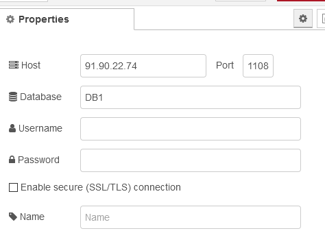
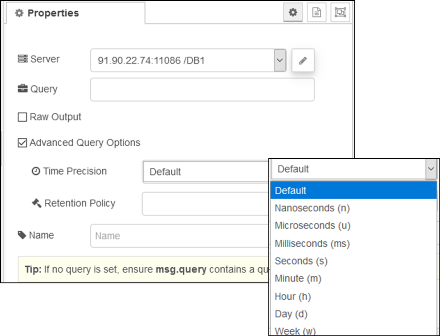
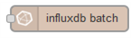
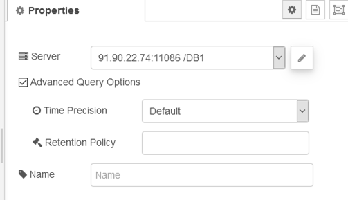

## Бібліотека node-red-contrib-influxdb

Працює з influxdb [Посилання на опис](https://flows.nodered.org/node/node-red-contrib-influxdb)

https://uk.wikipedia.org/wiki/InfluxDB

[База данных временных рядов компании InfluxData](https://waksoft.susu.ru/2019/10/07/база-данных-временных-рядов-компании-inf)

### Конфігурування підключення




### Формування запитів (influxdb in)

Дозволяє робити основні запити до бази даних часових рядів influxdb. Запит можна вказати у властивості конфігурації або за допомогою властивості **msg.query**. Результати будуть повернуті у **msg.payload**. Щоб вивести результати запиту у вихідному форматі вихідного файлу, що повертається InfluxDb, встановіть прапорець *Raw Output*. Позначте *Advanced Query Options*, щоб вказати політику точності та збереження часу для запиту. Сира вихідна конфігурація може бути замінена властивістю повідомлення **msg.rawOutput**. Розширені параметри запиту *Time Precision* та *Retention Policy* можна замінити, використовуючи властивості повідомлень **msg.precision** та **msg.retentionPolicy**.



### influxdb out

Простий вихідний вузол influxdb для запису значень і тегів до вимірювання influxdb. 


Поля та теги для запису знаходяться в **msg.payload**. 

Якщо поле *measurement* не встановлене у конфігурації вузла, користувач може надіслати дані з вказаним іменем вимірювання у **msg.measurement**, щоб замінити поле *measurement* у конфігурації вузла. Позначте *Advanced Query Options*, щоб вказати політику точності та збереження часу для вставки. Розширені параметри запиту *Time Precision* та *Retention Policy* можна замінити за допомогою властивостей повідомлень **msg.precision** та **msg.retentionPolicy**.

- Якщо **msg.payload** є рядком, числом або логічним значенням, це буде записано як одне значення до вказаного вимірювання (назване *value*). 
- Якщо **msg.payload** є об'єктом, що містить кілька властивостей, для вимірювання будуть записані як поля (fields). 
- Якщо **msg.payload** - це масив, що містить два об’єкти, перший об’єкт буде записаний як набір іменованих полів, другий - набір іменованих тегів. 
- Нарешті, якщо **msg.payload** є масивом масивів, він буде записаний як послідовність точок (point), що містять поля та теги. 

```js
msg.payload = [
    [{
        numValue: 10,
        randomValue: Math.random()*10,
        strValue: "message1",
        time: new Date("2015-12-28T19:41:13Z").getTime()
    },
    {
        tag1:"sensor1",
        tag2:"device2"
    }],
    [{
        numValue: 20,
        randomValue: Math.random()*10,
        strValue: "message2",
        time: new Date("2015-12-28T19:41:14Z").getTime()
    },
    {
        tag1:"sensor1",
        tag2:"device2"
    }]
];
return msg;
```

Зверніть увагу, як вказуються мітки часу - кількість мілісекунд з 1 січня 1970 року 00:00:00 UTC. У цьому випадку не забудьте встановити "ms" у Time Precision" (Advanced Query Options) у "Influx Out Node".

### influxdb batch

Вихідний вузол influxdb для запису декількох точок (полів і тегів) до кількох вимірювань influxdb. 

Вихідний вузол пакету надсилає список *точок* (*points* ) разом у пакеті до InfluxDB у дещо відмінному форматі від вихідного вузла, більше відповідає базовому node.js  [influx library version 5.x](https://www.npmjs.com/package/influx). У кожній точці ви повинні вказати назву вимірювання, яку потрібно записати, а також список значень тегів і полів. За бажанням ви можете вказати час позначення цієї точки, за замовчуванням поточний час.

Під капотом ми викликаємо вузол бібліотеки fluxdb 5.x **writePoints ()**, як задокументовано [тут](https://node-influx.github.io/class/src/index.js~InfluxDB.html#instance-method-writePoints).

За замовчуванням вузол пише мітки часу з використанням точності ms, оскільки саме це нам дає JavaScript. якщо ви вкажете мітку часу як об'єкт Date, ми перетворимо її в мілісекунди.

Якщо ви вказали рядок або число як позначку часу, ми передамо його прямо в Influx для синтаксичного аналізу, використовуючи вказану точність або точність за замовчуванням у наносекундах, якщо вона не вказана.

>  **Зверніть увагу**, що за замовчуванням точність становить *наносекунди*, тому, якщо ви введете число, таке як date.getTime (), і не вказали точність мілісекунд, ваша мітка часу буде неправильна.



**msg.payload** має бути масивом об’єктів *point*. 

Властивість **measurement** точки містить назву вимірювання точки. Властивість **fields** міститиме поля точки. Якщо вказано, властивість **tags** міститиме теги точки. Щоб встановити час для точки, введіть властивість **timestamp**. Позначте *Advanced Query Options*, щоб вказати політику точності та збереження часу для вставки. Розширені параметри запиту *Time Precision* та *Retention Policy* можна замінити, використовуючи властивості повідомлень **msg.precision** та **msg.retentionPolicy**.

У наступному прикладі потік записує дві точки до двох вимірювань, встановлюючи позначку часу для поточної дати.

```js
msg.payload = [
    {
        measurement: "weather_sensor",
        fields: {
            temp: 5.5,
            light: 678,
            humidity: 51
        },
        tags:{
            location:"garden"
        },
        timestamp: new Date()
    },
    {
        measurement: "alarm_sensor",
        fields: {
            proximity: 999,
            temp: 19.5
        },
        tags:{
            location:"home"
        },
        timestamp: new Date()
    }
];
return msg;
```

