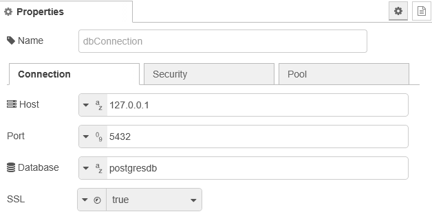
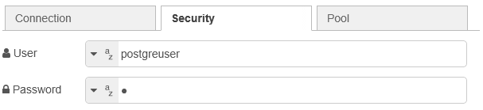
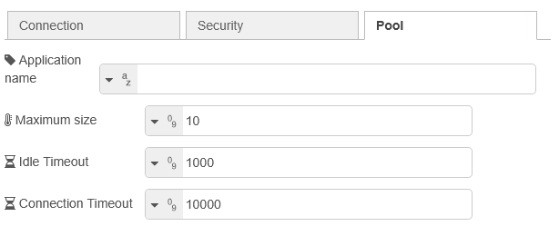
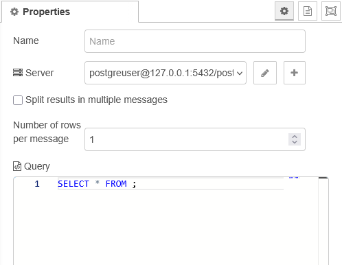

[<- На головну](../) 

# Бібліотека node-red-contrib-postgresql

https://github.com/alexandrainst/node-red-contrib-postgresql

## postgreSQLConfig









## node-red-contrib-postgresql




`node-red-contrib-postgresql` — це вузол для Node-RED, який використовується для виконання запитів до бази даних PostgreSQL 🐘. Він підтримує розбиття результатів (split) та механізм backpressure (керування потоком), що дозволяє працювати з великими наборами даних. Також підтримуються параметризовані запити та виконання кількох запитів одночасно.

Використовується шаблонізатор Mustache:

```sql
-- INTEGER id
SELECT * FROM table WHERE id = {{{ msg.id }}};

-- TEXT id
SELECT * FROM table WHERE id = '{{{ msg.id }}}';
```

Можна передати запит через `msg.query`.

Можна використовувати параметризовані запити (позиційні)

```sql
msg.params = [ msg.id ];
SELECT * FROM table WHERE id = $1;
```

Можна використовувати іменовані параметри

```sql
msg.queryParameters.id = msg.id;
SELECT * FROM table WHERE id = $id;
```

Примітка: PostgreSQL не підтримує іменовані параметри нативно — це емуляція, тому менш надійно, ніж позиційні.

Результат (рядки) передається в `msg.payload` у вигляді масиву. Виняток: якщо увімкнено опцію Split results і кількість рядків на повідомлення встановлена в 1, тоді `msg.payload` містить не масив, а один рядок.

Додаткова інформація доступна в:

- `msg.pgsql.rowCount`
- `msg.pgsql.command`

У випадку кількох запитів `msg.pgsql` буде масивом.

### Динамічні параметри підключення

Можна передати конфігурацію через `msg.pgConfig`:

```javascript
msg.pgConfig = {
  user,
  password,
  host,
  database,
  port,
  connectionString,
  ssl,
  types,
  statement_timeout,
  query_timeout,
  application_name,
  connectionTimeoutMillis,
  idle_in_transaction_session_timeout
};
```

Недолік: не використовується пул з’єднань, тому це менш ефективно. Рекомендується використовувати стандартний конфігураційний вузол.

### Backpressure (керування потоком)

Якщо увімкнено `Split results`:

- спочатку надсилається одне повідомлення
- далі вузол чекає `msg.tick = true`, щоб відправити наступне

Це запобігає перевантаженню пам’яті.

Вузол:

- `node.tickConsumer` — сигнал для downstream
- `node.tickProvider` — сигнал для upstream

Повідомлення при split

```json
{
  payload: "...",
  parts: {
    id: 0.1234,
    index: 5,
    count: 6,
    parts: {}
  },
  complete: true
}
```

- `index` — номер повідомлення
- `count` — загальна кількість (тільки в останньому)
- `complete` — true для останнього

