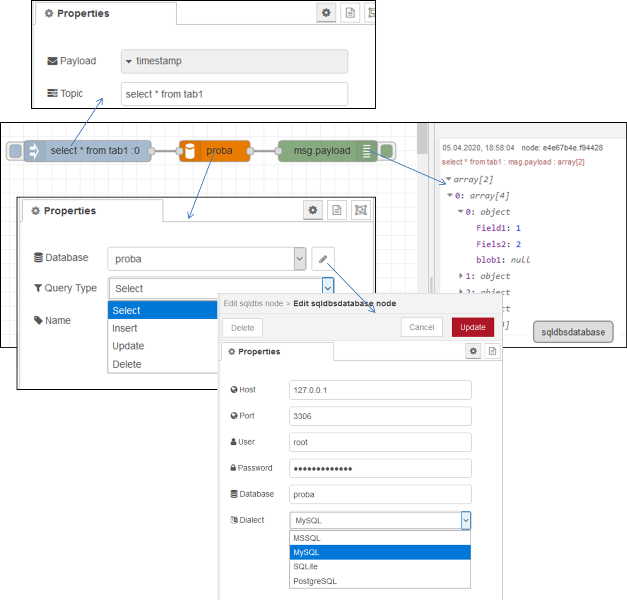

[<- На головну](../) 

# Відправка запитів до БД (sqldbs)

У вхідних повідомленнях передається запит в темі (`topic`) повідомлення, відповідь отримується у вигляді корисного навантаження `payload` вихідного повідомлення.

   

