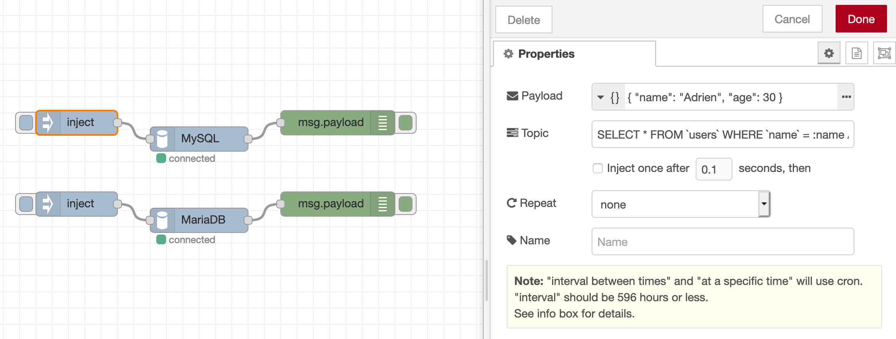

[<- На головну](../) 

## Бібліотека node-red-contrib-stackhero-mysql

https://github.com/stackhero-io/node-red-contrib-stackhero-mysql

Вузол Node-RED для читання та запису в базу даних MySQL або MariaDB. Він використовує шифрування TLS (SSL) і сумісний із методом автентифікації «Кешування пароля SHA2» (MySQL >= 8).



## Використання

Цей вузол дуже простий.

Помістіть свій запит у змінну `topic` і, якщо у вас є аргументи, помістіть їх в об’єкт у змінній `payload`. Ви отримаєте результат у вихідній змінній `payload`.

приклад:

```js
msg.topic = 'SELECT * FROM `users` WHERE `name` = :name AND `age` > :age;';
msg.payload = { name: 'Adrien', age: 30 };
return msg;
```

> Уникайте ін'єкцій SQL!!
>
> НІКОЛИ НІКОЛИ не розміщуйте вміст змінних у `темі` безпосередньо! Завжди використовуйте змінну `payload` для передачі своїх аргументів.

## Вирішення проблем

###### Error "Connections using insecure transport are prohibited while --require_secure_transport=ON"

Ви повинні підключитися за допомогою шифрування TLS. Просто поставте прапорець у цій конфігурації вузла.

###### Помилка "ER_NOT_SUPPORTED_AUTH_MODE: Client does not support authentication protocol requested by server; consider upgrading MySQL client"

Ймовірно, ви використовуєте інший вузол, ніж `node-red-contrib-stackhero-mysql`, і намагаєтесь підключитися до сервера MySQL >= 8 за допомогою методу автентифікації "Caching SHA2 password".

Щоб вирішити цю проблему, просто використовуйте цей вузол `node-red-contrib-stackhero-mysql`.