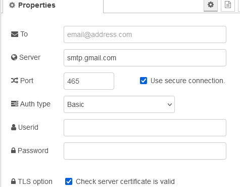
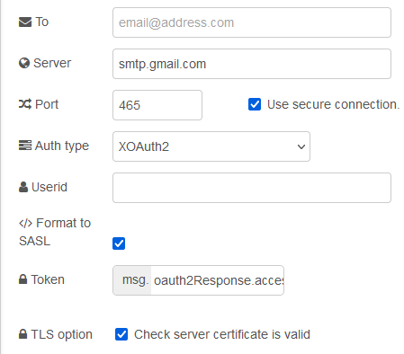

# node-red-node-email

https://flows.nodered.org/node/node-red-node-email

## Попередня умова

Вам знадобляться дійсні облікові дані електронної пошти для вашого сервера електронної пошти. Для GMail це може означати отримання пароля програми, якщо у вас увімкнено двофакторну автентифікацію.

Для Exchange і Outlook 365 потрібно використовувати OAuth2.0.

**Примітки**: для версії 2.x цього вузла потрібен **Node.js v12** або новіший. Для версії 1.x цього вузла потрібен **Node.js v8** або новіший.

## GMail users

If you are accessing GMail you may need to either enable [an application password](https://support.google.com/mail/answer/185833?hl=en), or enable [less secure access](https://support.google.com/accounts/answer/6010255?hl=en) via your Google account settings.

## Користувачі GMail

Якщо ви отримуєте доступ до GMail, вам може знадобитися або ввімкнути [пароль програми](https://support.google.com/mail/answer/185833?hl=en), або ввімкнути [менш безпечний доступ](https://support.google.com/accounts/answer/6010255?hl=en) через налаштування облікового запису Google.

## Office 365 users

If you are accessing Exchnage you will need to register an application through their platform and use OAuth2.0. [Details on how to do this can be found here.](https://learn.microsoft.com/en-us/exchange/client-developer/legacy-protocols/how-to-authenticate-an-imap-pop-smtp-application-by-using-oauth#get-an-access-token)

## Використання

Вузли для надсилання та отримання простих електронних листів.

### Вхідний вузол

Отримує електронні листи з сервера IMAP або POP3 і пересилає їх як повідомлення, якщо вони ще не переглянуті.

Тема завантажується в `msg.topic`, а `msg.payload` є основним текстом. Якщо є text/html, він повертається в `msg.html`. `msg.from` і `msg.date` також встановлюються, якщо вони вам потрібні.

Крім того, `msg.header` містить повний об’єкт заголовка, включаючи **to**, **cc** та інші потенційно корисні властивості.

Сучасна автентифікація за допомогою OAuth2.0 підтримується, але вона має бути активована вхідним маркером доступу та може бути автоматично активована лише вгорі.


### Вихідний вузол

Надсилає `msg.payload` як електронний лист із темою `msg.topic`.





Одержувача повідомлення за замовчуванням можна налаштувати у вузлі, якщо його залишити порожнім, його слід встановити за допомогою властивості `msg.to` вхідного повідомлення. Ви також можете вказати будь-який або всі: `msg.cc`, `msg.bcc`, `msg.replyTo`, `msg.inReplyTo`, `msg.references`, `msg.headers` або `msg.priority ` властивості.

Електронну адресу `from` можна встановити за допомогою `msg.from`, але не всі поштові служби дозволяють це, якщо `msg.from` також не є дійсним ідентифікатором користувача або електронною адресою, пов’язаною з паролем. Примітка: якщо `userid` або `msg.from` не містить дійсної електронної адреси ([userxx@some_domain.com](https://raw.githubusercontent.com/node-red/node-red-nodes/master//mailto :userxx@some_domain.com)), ви можете побачити *(No Sender)* в електронному листі.

Якщо ви отримуєте доступ до Gmail, вам може знадобитися ввімкнути [пароль програми](https://support.google.com/mail/answer/185833?hl=uk).

Під час підключення до SMTP-сервера доступні два типи аутентифікації: базова та XOAuth2.

- **Базовий:** вимагає введення імені користувача та пароля
- **XOAuth2:** вимагає імені користувача та властивості `msg`, щоб отримати маркер доступу

Маркери SASL XOAuth2 створюються шляхом комбінування імені користувача та маркера, кодування в base64 і передачі на поштовий сервер у такому форматі:

```
base64("user=" + userName + "^Aauth=Bearer " + accessToken + "^A^A")
```

Якщо прапорець знятий, розробники потоку можуть самостійно відформатувати маркер перед передачею його вузлу.

Корисне навантаження може мати формат html. Ви можете надати окрему версію відкритого тексту за допомогою `msg.plaintext`. Якщо ви цього не зробите, а `msg.payload` містить html, він також використовуватиметься для відкритого тексту. `msg.plaintext` буде проігноровано, якщо `msg.payload` не містить html.

Якщо корисне навантаження є двійковим буфером, воно буде перетворено на вкладення. Ім’я файлу має бути встановлено за допомогою `msg.filename`. За бажанням можна додати `msg.description` для основного тексту.

Крім того, ви можете надати `msg.attachments`, який має містити масив одного або кількох вкладень у форматі [nodemailer](https://nodemailer.com/message/attachments/).

За потреби одержувача ви також можете передати об’єкт `msg.envelope`, який зазвичай містить додаткові властивості from і to.

Якщо у вас є власні підписані сертифікати, Nodemailer може поскаржитися на це та відмовити у надсиланні повідомлення. У цьому випадку ви можете спробувати вимкнути TLS.

**Примітка**: використовує SMTP із SSL для порту 465.

Якщо ввімкнено, з’єднання використовуватиме протокол TLS під час підключення до сервера. Якщо вимкнено, TLS використовується, якщо сервер підтримує розширення STARTTLS. У більшості випадків увімкніть цей параметр, якщо ви під’єднуєтеся до порту 465. Для порту 587 або 25 тримайте його вимкненим.