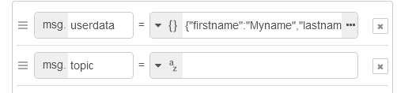
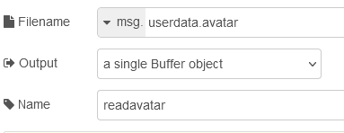
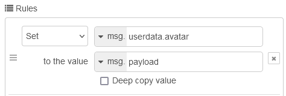
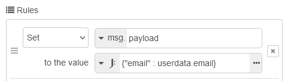
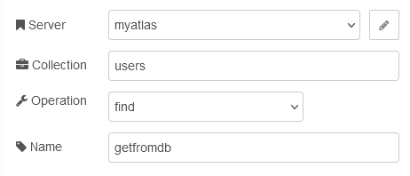
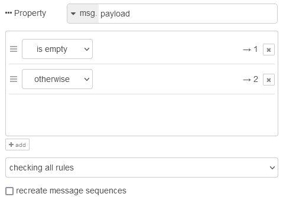
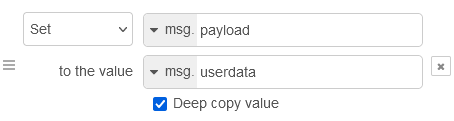
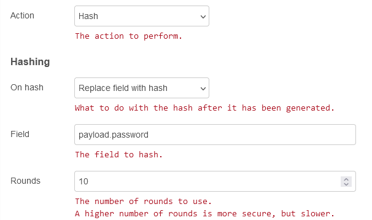
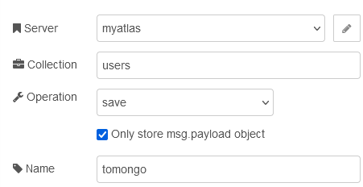

[До збірника задач](README.md)

# Створення нового користувача та занесення інформації про нього в базу даних

## Завдання

Написати фрагмент програми на Node-RED, який буде записувати документ про користувача в базу даних MongoDB на основі отриманих даних у форматі:

```js
{
    firstname: "Myname", //Імя
    lastname: "Mylastname", //Прізвище
    midlename: "Mymidlename", //По батькові
    roles:["admin","enduser"], //ролі які є у користувача
    email:"login@mail.org", //поштова адреса
    avatar: "c:/tmp/avatar.png", // розміщення файлу аватарки у локальному сховищі    
    password: "password" //пароль в незакодованому вигляді  
}
```

Повинна бути реалізована наступна функціональність:

- значення в полі `avatar` повинно бути замінено на дані з файлу зображення, яке зчитується за адресою розміщення
- перед записом даних про користувача у базу даних, повинна пройти перевірка на наявність користувача з такою ж поштовою адресою в ній, якщо користувач є  - повторний запис не проводити
- пароль, тобто поле `password` повинен бути замінений зашифрованою версією, щоб убезпечити витік паролів при компроментації серверу 

## Рішення 1

У даному рішенні використовуються:

- вузол `read file ` для читання файлів
- вузли MongoDB ([опис](https://github.com/pupenasan/NodeREDGuidUKR/blob/master/storage_mongodb/mongodb.md)) та сервіс Atlas MongoDB 
- вузол `bcrypt` ([опис](https://github.com/pupenasan/NodeREDGuidUKR/blob/master/security/bcrypt.md)) для хешування паролів

### Пререквізити

- Необхідно зареєструватися в сервісі Atlas Mognodb та створити принаймні одну базу даних, як це описано у наведеному [тут прикладі](mongoatlass.md)  
- Необхідно поставити усі необхідні додаткові бібліотеки:
  - `node-red-node-mongodb`
  - `node-red-contrib-bcrypt`

### Створення фрагменту в Node-RED

Застосунок реалізований у вигляді одного потоку, що включає три логічні частини:

- введення та доповнення даних користувача завантаженим файлом аватарки
- перевірка наявності користувача в базі даних
- шифрування та запис в базу даних


`Inject` виконує роль тестового вузлу, що реалізовувати перевірку різних сценаріїв. Він задає значення `userdata` у форматі JSON, як це описано в завданні.  



Як приклад, його зміст може бути таким:

```json
{
    "firstname": "Myname",
    "lastname": "Mylastname",
    "midlename": "Mymidlename",
    "roles": [
        "admin",
        "enduser"
    ],
    "email": "login@mail3.org",
    "avatar": "C:/tmp/imgs/1683744936871horse01-0.png",
    "password": "password"
}
```

Далі у вузлі `readavatar` зчитується файл з аватаркою, який заданий у властивості `userdata.avatar`. 



Отримані прочитані дані зберігаємо у тій же властивості змінної потоку, звідки брали адресу файлу. 



На цьому формування вхідних даних завершено і ініціюється процедура перевірки наявності користувача в базі даних по його email. Для цього у `payload` треба задати оператор запиту пошуку Mongo, що у даному випадку вказує на поле документу `email` та його значення, що міститься у `userdata.email`.     



Даний фільтр використовується вузлом `getfromdb` для пошуку усіх документів, що відповідають даній умові у колекції `users` бази даних `myatlas` (налаштування конфігураційного вузла такі самі як у [попередньому прикладі](mongoatlass.md)). 



Якщо хоч один документ що задовольняє даному прикладу знайдений, вузол поверне масив документів, що свідчить про наявність користувача в базі (по факту не має бути більше ніж одного). Якщо документ не знайдено, то вузол  `switch` перенаправить потік по першому шляху, якщо знайдено - по другому, де він закінчується вузлом з повідомленням.



Якщо документів немає починається частина шифрування та запису. Для початку дані користувача копіюються в `msg.payload`: 



Пароль користувача не варто зберігати у відкритому вигляді з міркувань безпеки. Тому його варто зашифрувати, щоб навіть при компрометації бази даних, не можна було б дізнатися паролі користувачів а тільки їх зашифровані версії, за якими практично неможливо відновити оригінальний пароль. Для шифрування використаємо вузол `bcrypt` з наступними налаштуваннями:



Далі потік направляється на вузол `tomongo`, де корисне навантаження зберігається як окремий документ в колекції `users`. Зверніть увагу, що виставлена опція зберігання  `msg.payload`. Також, враховуючи що властивість `_id` не задана, вона буде формуватися автоматично. 



Експорт потоку доступний [за посиланням](createuser.json)