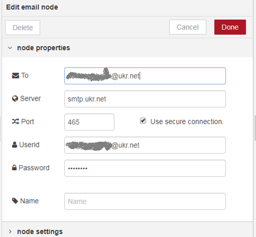
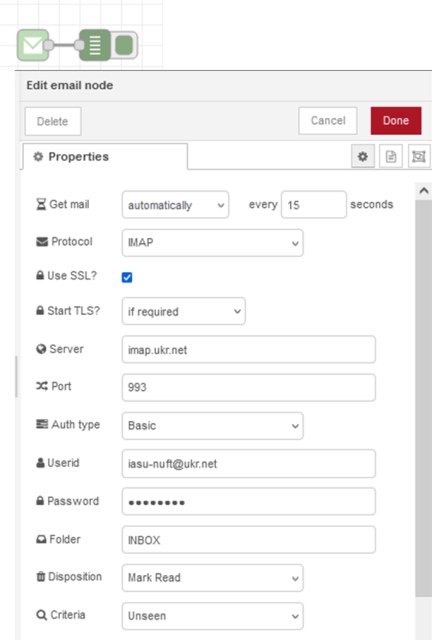

[До збірника задач](README.md)

# Відправка та отримання електронних листів

Автор: Олександр Пупена

## Завдання

Написати фрагмент програми на Node-RED, який має:

- відправляти листа на вказану електронну адресу
- зчитувати листи з вхідної скриньки і відмічати їх, як прочитані  

## Рішення 

Для рішення використовується бібліотека `node-red-node-email`.

### Визначення налаштувань поштового серверу

Для роботи з поштою необхідно дізнатися налаштування почтового сервера, який Ви будете використовувати для відправки та отримання повідомлень, і на якому є Ваш обліковий запис. За  можливості для тестування краще створити новий аккаунт на одному з поштових серверів. 

Необхідно зробити відповідні налаштування та виписати їх. Для вихідних повідомлень (відправки пошти):

- SMTP Server 
- port

Для вхідних повідомлень (отримання пошти):

- POP3 Server або IMAP Server
- port

Інформацію про налаштування поштових сервісів можна отримати в довідці по цим серверам. Нижче наведений приклад деяких із найбільш вживаних: 

| Поштовий сервіс | Для відправки  (Сервер вихідних повідомлень  ) | Для отримання  (Сервер вхідних повідомлень)   | Примітка                                                     |
| --------------- | ---------------------------------------------- | --------------------------------------------- | ------------------------------------------------------------ |
| www.ukr.net     | SMTP Server: smtp.ukr.net                      | IMAP Server: imap.ukr.net                     | В налаштуваннях треба увімкнути IMAP/SMTP                    |
| port            | port: 465 або 2525                             | port: 993                                     |                                                              |
| www.gmail.com   | SMTP Server: smtp.gmail.com                    | IMAP Server: imap.gmail.com  Вимагає SSL: так | В налаштуваннях треба увімкнути IMAP. Активувати доступ до додатків  https://myaccount.google.com/lesssecureapps |
| port            | port: 465(SSL) або  587(TLS)                   | port: 993                                     |                                                              |

У цьому рішенні ми будемо використовувати сервіс `ukr.net`. Детально про надання доступу до скриньки можна почитати за [цим посиланням](https://wiki.ukr.net/ManageIMAPAccess). 

Спочатку в налаштуванні пошти необхідно надати доступ зовнішнього застосунку з вказівкою паролю як це описано за [цим посиланням](https://wiki.ukr.net/ManageIMAPAccess).  Після створення окремого паролю, цей пароль варто вводити в налаштуваннях нижче. 

### Створення фрагменту застосунку Node-RED

Фрагмент програми Node-RED для відправки листа:

Рис.1. Фрагмент програми Node-RED з вказаним налаштуванням вузла Inject

Налаштування вузла `email out` при цьому:

    

Рис.2. Налаштування вузла MailMessage типу Social e-Mail

Фрагмент отримання повідомлення 

    

рис.3. Налаштування вузла MailMessage типу Social e-Mail-in

