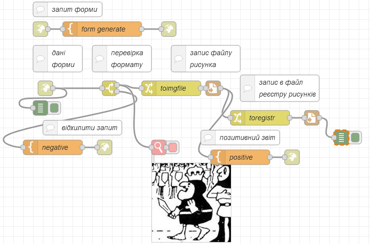
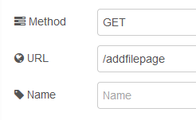
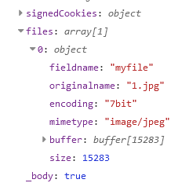
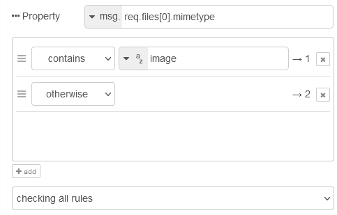
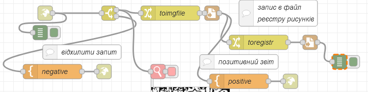
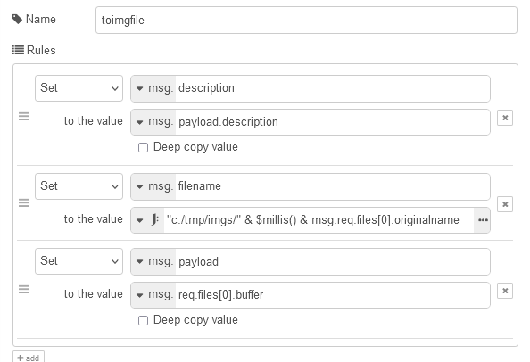
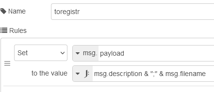
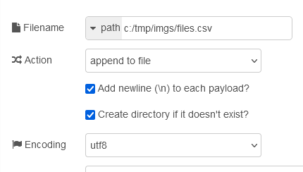

[До збірника задач](README.md)

# Віправка даних в Node-RED за допомогою форми

Автор: Олександр Пупена

## Завдання

Написати фрагмент програми на Node-RED, яка буде приймати від користувача файл зображення з описом та зберігати їх у файловій системі у вигляді:

- файлу зображення
- запису у файлі реєстру зображень у формі CSV, де перше поле - це опис файлу, а друге - посилання на файл у файловій системі

Форма повинна передбачати обов'язкове добавлення як файлу так і опису.

На боці серверу повинно бути передбачено контроль типу файлу - це має бути зображення.

## Рішення 1

У даному рішенні використовуються:

- форми HTML, які генеруються при вході на сторінку `/addfilepage` та у відповідь на успішне чи неуспішне приймання даних 
- вузли `http-in` ([опис](https://github.com/pupenasan/NodeREDGuidUKR/blob/master/http/httpin.md)) та `http-responce` ([опис](https://github.com/pupenasan/NodeREDGuidUKR/blob/master/http/httpresponse.md)) для реалізації HTTP серверу 
- вузол `template` для формування HTML ([опис](https://github.com/pupenasan/NodeREDGuidUKR/blob/master/base/1_4_1.md#template-%D1%88%D0%B0%D0%B1%D0%BB%D0%BE%D0%BD))
- вузол `viewer` із бібліотеки `node-red-contrib-image-tools` що відображає зображення в середовищі Node-RED ([опис](https://github.com/pupenasan/NodeREDGuidUKR/tree/master/image))   
- вузол `write file ` для запису файлів

### Створення форм

Про форми можна почитати за [цим посиланням](https://pupenasan.github.io/ProgIngContrSystems/%D0%94%D0%BE%D0%B2%D1%96%D0%B4%D0%BD%D0%B8%D0%BA%D0%B8/htmlcss/html_form.html). 

Форма для відправки файлу з описом для цієї задачі матиме наступний вигляд:

```html
<form action="/addfile" method = "POST" enctype="multipart/form-data" accept-charset="utf-8">
  <label for="myfile">Виберіть файл:</label>
  <input type="file" id="myfile" name="myfile" required><br>
  <label for="description">Введіть опис:</label>
  <input type="text" id="description" name="description" placeholder = "Опис рисунку" size = "50" required>
  <br><br>
  <input type="submit" value="Відправити">
</form>
```

### Створення фрагменту застосунку Node-RED

Фрагмент застосунку в Node-RED наведений нижче.



#### Запит форми

Вузол `http-in` в запиті форми має наступні налаштування:



Вузол формує потік за кінцевою точкою доступу `/addfilepage` який направляється на вузол `template` з назвою `from generate`, який у свою чергу генерує `html` з формою 


```html
<!DOCTYPE html>
<html>
<body>

<h1>Завантаження рисунку</h1>

<p>Виберіть файл рисунку та добавте до нього опис:</p>
<form action="/addfile" method = "POST" enctype="multipart/form-data" accept-charset="utf-8">
  <label for="myfile">Виберіть файл:</label>
  <input type="file" id="myfile" name="myfile" required><br>
  <label for="description">Введіть опис:</label>
  <input type="text" id="description" name="description" placeholder = "Опис рисунку" size = "50" required>
  <br><br>
  <input type="submit" value="Відправити">
</form>

</body>
</html>
```

Форма матиме вигляд:


#### Обробка форми

Вузол `http-in` в запиті форми має наступні налаштування:

 

Вузол формує потік за кінцевою точкою доступу `/addfile` який приймає дані з форми через метод `POST`. Зверніть увагу на те, що виставлена опція `Accept file uploads?` яка забезпечить передачу файлу в окремому полі `vsg.get.files`. 



Вузол `switch` який стоїть далі за потоком перенаправляє на перший вихід потік, тільки у тому випадку, коли поле `mimetype` починається зі слова `image`, у іншому випадку потік направляється на другий вихід.



Якщо потік йде по шляху відхилення запиту, то у вузлі `negative` формується наступний `html` код:

```html
<!DOCTYPE html>
<html>
<body>
	<h1>Файл не є рисунком</h1>
	<a href="/addfilepage">Добавити ще один рисунок</a>
</body>
</html>
```

При позитивному направленні потоку файл відображається в редакторі за допомогою вузла `viewer`. Далі потік перенаправляється на вузол `toimgfile`.



Вузол `toimgfile` переформатовує потік таким чином, щоб файл записувався у локальній файловій системі. По перше, значення `description` зберігається на верхньому рівні повідомлення `msg`. Це зроблено для того, щоб при заміні `payload` воно не втратилося в потоці.  



У властивості `filename` зберігається значення конкатенації шляху розміщення файлу з мілісекундами і оригінальної назви файлу. Потім зміст файлу (`files[0].buffer`) записується в `payload`. Ці властивості використовуються вузлом `payload` для запису в файл.

  

Після запису в файл формується позитивний звіт у вузлі `positiv` в форматі:

```html
<!DOCTYPE html>
<html>
<body>
	<h1>Файл завантажено і збережено як {{filename}}</h1>
	<a href="/addfilepage">Добавити ще один рисунок</a>
</body>
</html>
```

Зверніть увагу на те, що в шаблоні використовується синтаксис mustach що дозволяє передати в тексті значення імені файлу, який було збережено  `{{filename}}`.

Паралельно до виведення звіту про запис файлу, формується ще один запис в файл реєстру рисунків. Для цього у вузлі `toregistr` за допомогою JSONata виразу формується що саме треба писати, як результат конкатенації:



 Наступний вузол `write to file` має наступний вигляд. 



Зверніть увагу на опції, які дозволяють записувати текст окремими рядками, добавляючи їх у існуючий файл.

 

Експорт потоку [за посиланням](htmlform.json)

