[До збірника задач](README.md)

# Перегляд даних у вигляді HTML таблиці

Автор: Олександр Пупена

## Завдання

Написати фрагмент програми на Node-RED, який буде:

- зчитувати інформацію з CSV файлу, в якому збережена інформація про розміщення файлів з зображеннями та їх опис
- надавати цю інформацію користувачу через Веб-браузер у табличному вигляді 

## Рішення 1

У даному рішенні використовуються:

- таблиця HTML, яка генерується при вході на сторінку `/browsefile` у вузлі `template` для формування HTML ([опис](https://github.com/pupenasan/NodeREDGuidUKR/blob/master/base/1_4_1.md#template-%D1%88%D0%B0%D0%B1%D0%BB%D0%BE%D0%BD)) з використанням синтаксису [Mustache](https://github.com/pupenasan/NodeREDGuidUKR/blob/master/base/mustach.md)
- вузли `http-in` ([опис](https://github.com/pupenasan/NodeREDGuidUKR/blob/master/http/httpin.md)) та `http-responce` ([опис](https://github.com/pupenasan/NodeREDGuidUKR/blob/master/http/httpresponse.md)) для реалізації HTTP серверу 
- вузол `read file ` для читання файлів
- `csv` для перетворення змісту з формату CSV в об'єкти JS ([опис](https://github.com/pupenasan/NodeREDGuidUKR/blob/master/parsing/csv.md))

Зверніть увагу, що для простоти завдання рішення не передбачає фрагментацію списку файлів на кілька сторінок, тому при великій кількості даних буде надто перевантажувати як клієнта так і сервера. Також в задачі не передбачається формування негативних відповідей.

### Пререквізити

Для перевірки даної роботи необхідні дані що збережені в CSV файлі та посилаються на файли зображень. Для цього рекомендується виконати завдання з [відправки даних в Node-RED за допомогою форми](htmlform.md). 

### Генерування HTML-коду

Про роботу з таблицями в форматі HTML можна почитати за [цим посиланням](https://pupenasan.github.io/ProgIngContrSystems/%D0%94%D0%BE%D0%B2%D1%96%D0%B4%D0%BD%D0%B8%D0%BA%D0%B8/htmlcss/html_table.html). У загальному формат виведення має бути приблизно таким:

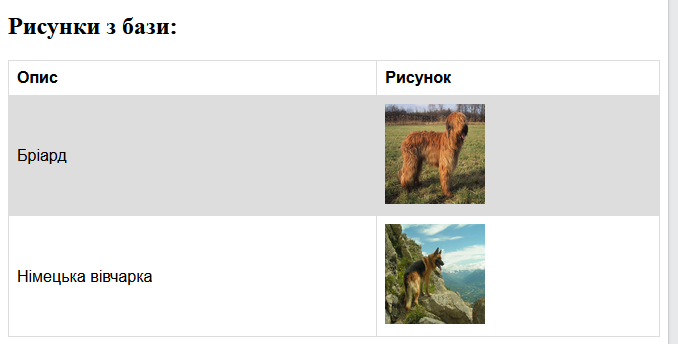

При цьому код HTML буде мати такий формат:

```html
<!DOCTYPE html>
<html>
<head>
	<style>
        table {font-family: arial, sans-serif;border-collapse: collapse;width: 100%;}
        td, th {border: 1px solid #dddddd;text-align: left; padding: 8px;}
        tr:nth-child(even) {background-color: #dddddd;}
    </style>
</head>
<body>
    <h2>Рисунки з бази:</h2>
    <table>
        <tr>
            <th>Опис</th>
            <th>Рисунок</th>
        </tr>
        <tr>
            <td>Бріард</td>
            <td></td>
        </tr>
        <tr>
            <td>Німецька вівчарка</td>
            <td></td>
        </tr>
    </table>
</body>
</html>
```

Можна спробувати цей код, замінивши його в [цьому прикладі](https://www.w3schools.com/html/tryit.asp?filename=tryhtml_table_intro).

У нашому випадку необхідно щоб кожен рядок таблиці формувався динамічно в залежності від елементів масиву, в якому буде розміщено текст та посилання на рисунок. Припустимо, що масив буде передаватися як властивість `payload`, а елементи масиву будуть об'єктами:

```
{
	"description":"Опис рисунку",
	"filename":"назваФайлу"
}
```

У цьому випадку, скористувавшись синтаксису [Mustache](https://github.com/pupenasan/NodeREDGuidUKR/blob/master/base/mustach.md) матимемо наступний шаблон:     

```html
<!DOCTYPE html>
<html>
<head>
	<style>
        table {font-family: arial, sans-serif;border-collapse: collapse;width: 100%;}
        td, th {border: 1px solid #dddddd;text-align: left; padding: 8px;}
        tr:nth-child(even) {background-color: #dddddd;}
    </style>
</head>
<body>
    <h2>Рисунки з бази:</h2>    
	<table>
        <tr>
            <th>Опис</th>
            <th>Рисунок</th>
        </tr>
        {{#payload}}
        <tr>
            <td>{{description}}</td>
            <td></td>
        </tr>
        {{/payload}}
    </table>
</body>
</html>    
```

Таким чином, через секцію `{{#payload}}` буде створено стільки рядків, скільки буде елементів масиву `payload`, а комірки будуть посилатися на відповідні властивості `payload`. 

Зверніть увагу, що `payload.filename` очікується назва файлу, до якої добавляється префікс `/img/`, для того щоб формувати відносний шлях URL до файлу зображення. Тобто якщо  `payload.filename` є рівним `1683744936871horse01-0.png` то `src="/img/1683744936871horse01-0.png"`.

### Створення фрагменту застосунку Node-RED

Програма в Node-RED включає два потоки:

- обробка запиту сторінки
- обробка запиту файлу зображення

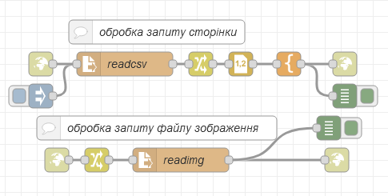

Перший потік формує HTML зміст на запит сторінки за кінцевою точкою `/imgsviev`. 

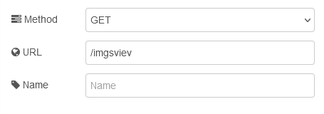

Таким чином, набравши на локальному вузлі адресу `http://127.0.0.1:1880/imgsviev` користувач отримає у відповідь те що надійде на вузол `http responce`. При надходженні запиту спочатку вузол читання файлу з іменем `readcsv` завантажує файл зі списком за вказаним в налаштуваннях вузлу шляхом: 

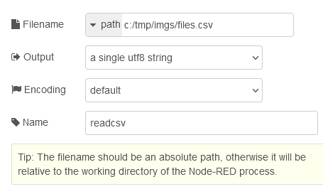

Файл який зчитується має наступну структуру: 


Як видно, назви файлу містять абсолютний шлях розміщення, задля безпеки видалимо статичну частину шляху і залишимо виключно назву файлу. Для цього скористаємося вбудованою функцією `chsnge` вузла  `change` , куди передається зміст прочитаного файлу.  

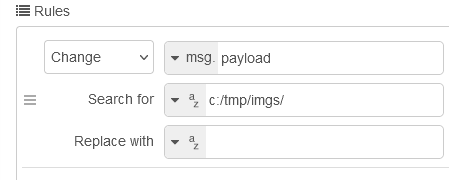

Очищений зміст файлу необхідно перетворити з форму CSV в об'єкт, для чого скористуємося вузлом `csv` з групи `parser`. У якості назв властивостей вкажемо `description` та `filename`, оскільки саме вони задані у шаблоні наступного вузлу. Зверніть увагу на наступне:

- в якості  розділювача вказано `semikolon` (крапка з комою), але в переліку колонок завжди вказуємо назви через кому
- на вихід подається масив

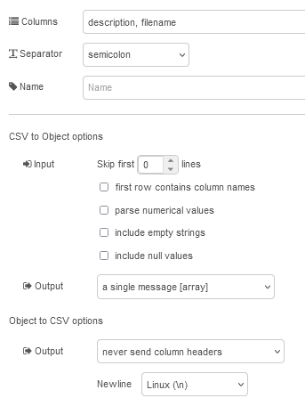

Наступний в потоці стоїть вузол `template`, який наповнений шаблоном, який наведений в пункті вище:

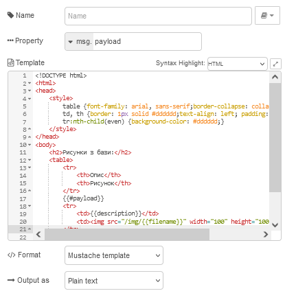

 На виході буде формуватися готова сторінка HTML.

 При завантаженні сторінки рендер браузера знаде посилання на файли зображень, на кшталт `/img/1683744936871horse01-0.png`. Тому він буде формувати запит за цим шляхом, який обробляє другий потік. 


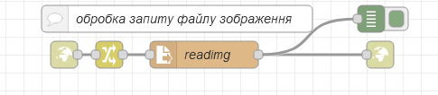

Для цього означена кінцева точка в форматі `/img/*`, що значить приймати усі запити що починаються з `/img/`: 

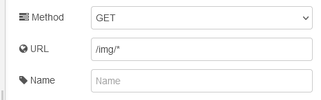

Далі у вузлі `change` назва шляху записується в `msg.filename`, щоб прочитати цей файл. Друга частина URL (після `/img/`) вказуватиме не назву файлу розміщення, а першу частину, тобто`/img/` треба замінити на дійсний шлях розміщення файлів.  

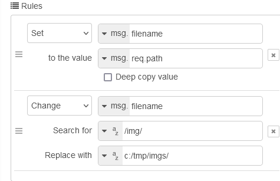

Після чого вузол `readimg` читає запитуваний файл та передає у відповіді.

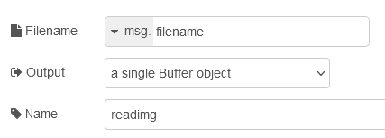

Експорт потоку доступний [за посиланням](htmltable.json)