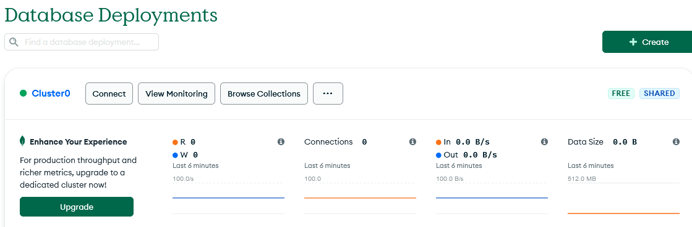
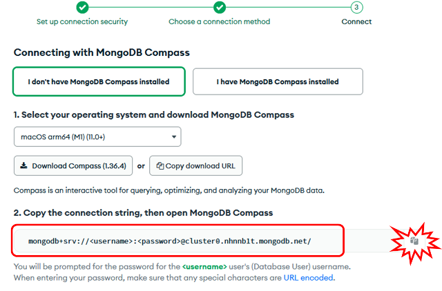
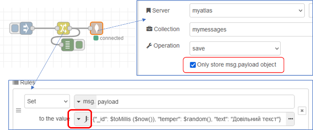
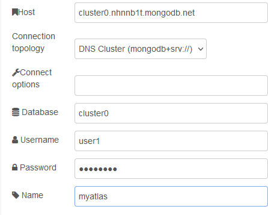
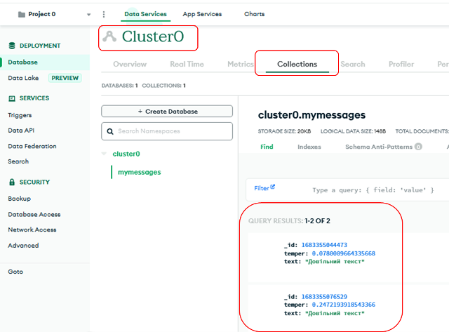

[До збірника задач](README.md)

# Збереження повідомлень в No-SQL базу даних MongoDB хмарного сервісу Atlas

Автор: Олександр Пупена

## Завдання

Написати фрагмент програми на Node-RED, який має записувати корисне навантаження повідомлення в MongoDB (Вступну інформацію про MongoDB можна почитати за [цим посиланням](https://github.com/pupenasan/ProgIngContrSystems/tree/master/Довідники/mongodb )) хмарного сервісу Atlas.

## Рішення

### Реєстрація та конфігурування хмарного сервісу Atlas 

Спочатку необхідно зареєструватися на хмарному сервісі Atlas. Для цього можна скористатися  безкоштовною обмеженою ліценізією. Послідовність реєстрації можна подивитися за [цим посиланням](https://github.com/pupenasan/ProgIngContrSystems/tree/master/Довідники/mongodb).

- створити кластер (базу даних), якщо ще не створили, наприклад з іменем `Cluster0`
- зробити автентифікацію за користувачем, що буде до доступатися до кластера, ввести його ім'я та пароль, наприклад `user1` 
- надати доступ за IP адресою (IP адресою де розгорнутий Node-RED)

 Далі необхідно дізнатися адресу доступу. Для цього натиснути кнопку `Connect` біля імені кластеру. 



Можна вибрати спосіб підключення `Compass tool` та скопіювати в буфер обміну рядок підключення.



У даному випадку він матиме шаблон 

```
mongodb+srv://<username>:<password>@cluster0.nhnnb1t.mongodb.net
```

### Створення фрагменту в Node-RED 

Для підключення в Node-RED можна скористатися бібліотекою `node-red-node-mongodb` опис якої можна подивитися за [цим посиланням](https://github.com/pupenasan/NodeREDGuidUKR/blob/master/storage_mongodb/mongodb.md)

Фрагмент програми написаний нижче.



Налаштування конфігураційного вузла наступні властивості:

- у `connection topology` треба вибрати `mongodb + srv`
- `host` - береться та частина url, яка йде після `@` в скопійованому з Atlas
- у `database` вказується ім'я БД (кластеру)
- у `username` та `password` треба вказати ім'я користувача та паролю які були задані в Atlas



В правилах вузла `change` використовується вираз `JSONata`, який формує `payload`:

```json
{"_id": $toMillis ($now()), "temper": $random(), "text": "Довільний текст"}
```

У даному виразі явно вказується `_id`, який є унікальним ідентифікатором документу в колекції. Якщо його не задавати, MongoDB буде формувати його самостійно. У налаштуваннях вузла `mongodb out` вказується що записується тільки  `payload` а не все повідомлення цілком. Операція `save` записує новий документ в колекцію `mymessages`. 

Після запуску програми, необхідно зробити кілька ініціювань `inject`, помилок ніяких не повинно бути а у вікні  `debug` повинні з'явитися повідомлення.  

### Перевірка в сервісі Atlas  

Для перевірки у сервісі Atlas, треба зайти у відповідний кластер і колекцію.  

