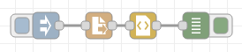
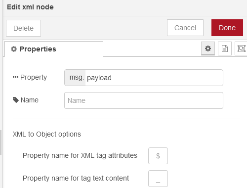
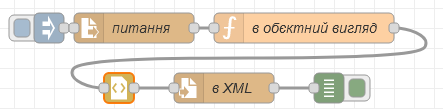
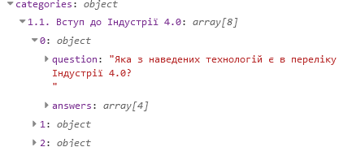
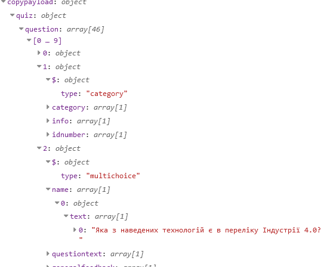

[До збірника задач](README.md)

# Створення банку питань для Moodle в форматі XML

Автор: Олександр Пупена

## Завдання

Написати фрагмент програми на Node-RED, який буде:

- зчитувати інформацію з текстового файлу з тестами, в якому збережені тести типу "один з кількох" у форматі наведеному нижче
- створювати файл експорту у форматі XML для Moodle

```
Категорія 1

1) Скільки буде 2+2?
- 4
- 5
- 6
- в залежності від того хто питає

2) Крим є частиною ...
- України
- не все так однозначно
- Кримської народної республіки
- рфії
```

Описаний формат включає:

- категорію, яка пишеться окремим рядком, після якого йдуть питання в категорії
- питання, яке завжди починається з номеру (або будь якої одно чи двомірної послідовності) та круглої дужки що закриває `)`; 
- відповідей, які йдуть після питання окремими рядками, і починаються з послідовності `- `; перша відповідь на питання вважається правильною, інші - неправильними  

Таким чином в прикладі наведені два питання, 2 категорії "Категорія 1". 

## Рішення 1

Це рішення базується на типових вузлах Node-RED. Спочатку файл з тестами зчитується, перетворюється в об'єкт, після чого з нього створюється необхідний XML-файл.  

### Пререквізити

Необхідно мати доступ до платформи Moodle з правами менеджера.

### Аналіз змісту експортного файлу XML та перетворення його в об'єкт

Рішення пропонується робити з дослідження. Спочатку треба створити в Moodle банк питань, з кількома категоріями і питаннями. Далі перейти у розділ експорт вибрати потрібну категорію і формат "Moodle XML". 

Експортний варіант матиме вигляд подібний до наведеного нижче:

```xml
<?xml version="1.0" encoding="UTF-8"?>
<quiz>
<!-- question: 0  -->
  <question type="category">
    <category>
      <text>$course$/top/Стратегія цифровізації підприємств</text>
    </category>
    <info format="html">
      <text></text>
    </info>
    <idnumber></idnumber>
  </question>

<!-- question: 0  -->
  <question type="category">
    <category>
      <text>$course$/top/Стратегія цифровізації підприємств/1.1. Вступ до Індустрії 4.0</text>
    </category>
    <info format="html">
      <text></text>
    </info>
    <idnumber></idnumber>
  </question>

<!-- question: 2934279  -->
  <question type="multichoice">
    <name>
      <text>Які особливості виробництва з наведених характерні для Індустрії 4.0?</text>
    </name>
    <questiontext format="html">
      <text><![CDATA[<p>Які особливості виробництва з наведених характерні для Індустрії 4.0?</p>]]></text>
    </questiontext>
    <generalfeedback format="html">
      <text></text>
    </generalfeedback>
    <defaultgrade>1.0000000</defaultgrade>
    <penalty>0.3333333</penalty>
    <hidden>0</hidden>
    <idnumber></idnumber>
    <single>true</single>
    <shuffleanswers>true</shuffleanswers>
    <answernumbering>abc</answernumbering>
    <correctfeedback format="html">
      <text><![CDATA[<p>Ваша відповідь правильна.</p>]]></text>
    </correctfeedback>
    <partiallycorrectfeedback format="html">
      <text><![CDATA[<p>Ваша відповідь частково правильна.</p>]]></text>
    </partiallycorrectfeedback>
    <incorrectfeedback format="html">
      <text><![CDATA[<p>Ваша відповідь неправильна</p>]]></text>
    </incorrectfeedback>
    <shownumcorrect/>
    <answer fraction="100" format="html">
      <text><![CDATA[<p>Гіперперсоналізація продуктів/сервісів на основі вимог клієнтів</p>]]></text>
      <feedback format="html">
        <text></text>
      </feedback>
    </answer>
    <answer fraction="0" format="html">
      <text><![CDATA[<p>Масове виробництво</p>]]></text>
      <feedback format="html">
        <text></text>
      </feedback>
    </answer>
    <answer fraction="0" format="html">
      <text><![CDATA[<p>Чіткий розподіл праці без зміни ролей</p>]]></text>
      <feedback format="html">
        <text></text>
      </feedback>
    </answer>
    <answer fraction="0" format="html">
      <text><![CDATA[<p>Великі заводи</p>]]></text>
      <feedback format="html">
        <text></text>
      </feedback>
    </answer>
  </question>

</quiz>
```

Отриманий файл зчитується як текст, передається на вузол XML



рис.1.

У XML можна залишити усі налаштування за замовченням



рис.2.

Запустивши потік, результат отриманого об'єкту матиме вигляд: 


рис.3.

### Створення програми для генерування XML

Маючи об'єкт, отриманий з експортного варіанту XML Moodle досить легко згенерувати подібний, після чого перетворити його в XML.

На рис.4 показаний фрагмент програми, який перетворює текстовий файл з питаннями в XML формат Moodle.



рис.4. Фрагмент програми перетворення текстового файлу з питаннями в XML формат Moodle

Спочатку зчитується текстовий файл, потім він перетворюється в потрібне об'єктне представлення, потім в XML і записується на диск. Функція має наступний вигляд;

```js
//верхня категорія
let topcategoryname = "$course$/top/Стратегія цифровізації підприємств";
let rows = msg.payload.split('\n');//рядки тексту
msg.rows = rows;//для налагодження
let categoryname = '';
let currentqestion = {};
let categories = {};
//перебираємо кожен рядок і формує об'єкт categories з категоріями, питаннями і відповідями
for (let row of rows) {
    //аналізуємо перші шість літер
    let firstletters = row.substring(0,5);
    if (firstletters.split(') ').length>1) { //якщо це питання
        // плинне запитання
        currentqestion = {
            // вичищаємо номер запитання
            question: row.replace(firstletters.split(') ')[0] + ') ', ''),
            answers:[] // тут будуть відповіді
        };
        // записуємо обєкт в плинну категорію
        categories[categoryname].push (currentqestion); 
    } else if (firstletters[0]=='-') { //якщо це варіант відповіді
        // записуємо відповідь, але вичищаємо лишній символ 
        currentqestion.answers.push (row.replace('- ',''));
    } else if (firstletters.length>4) { //якщо інший текст, то це категорія
        categoryname = row; //назва плинної категорії
        // нова категорія - новий перелік питань
        if (!categories[categoryname]) {
            categories[categoryname] = [];
        }
    }
}
msg.categories = categories; //для налагодження
msg.copypayload = //для налагодження
msg.payload = { //обєктний вигляд
    quiz:{
        question: [{
        $:{type:"category"},
        category: [ {text : topcategoryname}],
        info: [{"$":{"format":"html"},"text":[""]}],
        idnumber: [""]
    }
        ]
    }
}
let qestion = msg.payload.quiz.question;
// усі поля за прикладом аналізу отриманого еспортного формату
for (let catname in categories) {
    let category = categories[catname];
    fullecatname = topcategoryname + '/' + catname; 
    // категорія
    qestion.push ({
        $:{type:"category"},
        category: [ {text : fullecatname}],
        info: [{"$":{"format":"html"},"text":[""]}],
        idnumber: [""]
    })
    // питання
    for (let q of category) {
        let qrec = {
            $:{"type":"multichoice"},
            name:[{"text":[q.question]}],
            questiontext: [{"$":{"format":"html"},"text":[`<p>${q.question}</p>`]}],
            generalfeedback:[{"$":{"format":"html"},"text":[""]}],
            defaultgrade:["1.0000000"],
            penalty:["0.3333333"],
            hidden:["0"],
            idnumber:[""],
            single:["true"],
            shuffleanswers:["true"],
            answernumbering:["abc"],
            correctfeedback:[{"$":{"format":"html"},"text":["<p>Ваша відповідь правильна.</p>"]}],
            partiallycorrectfeedback:[{"$":{"format":"html"},"text":["<p>Ваша відповідь частково правильна.</p>"]}],
            incorrectfeedback:[{"$":{"format":"html"},"text":["<p>Ваша відповідь неправильна</p>"]}],
            shownumcorrect:[""],
            answer: []
        };
        let fraction = "100"; // перший варіант правильний 
        for (let answer of q.answers){
            qrec.answer.push({
               "$":{"fraction":fraction, "format":"html"},
                "text":[`<p>${answer}</p>`],
                "feedback":[{"$":{"format":"html"},"text":[""]}]
            })
            fraction = "0" //усі ніші варіанти неправильні
        }
        qestion.push (qrec)
    }
}

msg.options = {cdata:true}; // добавляти до text CDATA https://github.com/Leonidas-from-XIV/node-xml2js/blob/master/README.md#options
return msg;
```

Для розуміння програми варто подивитися проміжні результати:

  

рис.5. Виведення питань в форматі categories->questions->answers



 рис.6. Виведення об'єктного представлення для XML

Обидва фрагменти можна завантажити [за посиланням](moodlequestionbank.json).

### Імпорт XML в Moodle

Створений файл можна імпортувати в банк питань Moodle. Зверніть увагу, що старі питання не будуть видалятися, проконтролюйте щоб не було повторень. 