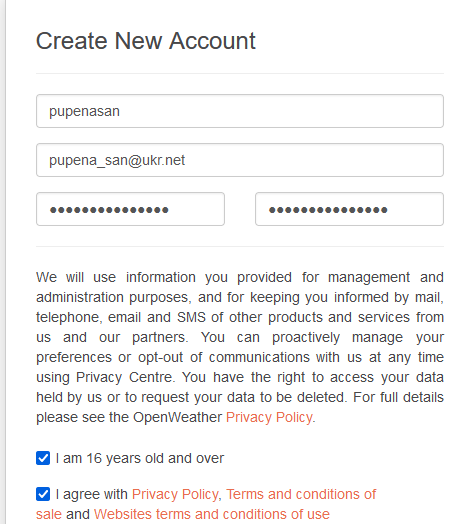
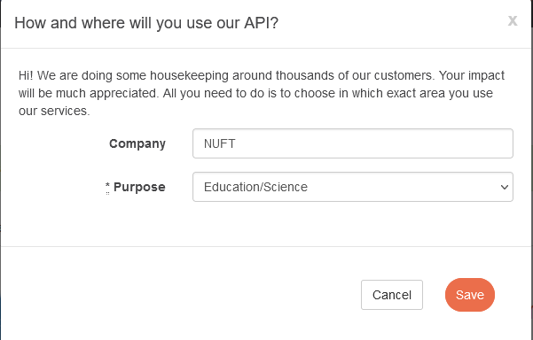
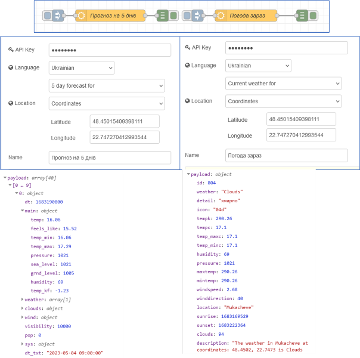
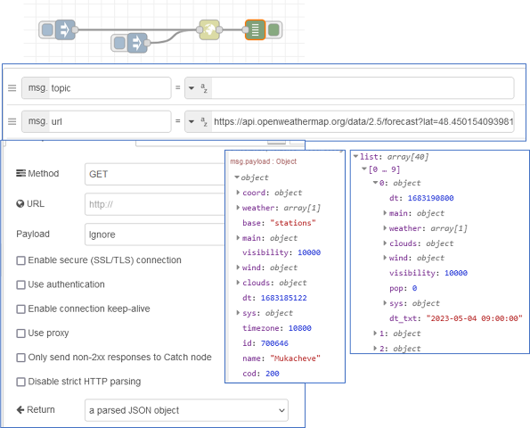

[До збірника задач](README.md)

# Отримання даних по плинній та прогнозній погоді за вказаним регіоном

Автор: Олександр Пупена

## Завдання

Написати фрагмент програми на Node-RED, який має:

- отримувати погоду на даний час
- отримувати прогноз погоди на найближчі 5 днів 

## Рішення 

### Варіант 1. Через сервіс openweathermap та спеціальні вузли

Для даного рішення використовується сервіс https://openweathermap.org який в тому числі має обмежену безкоштовну підписку. Тому для початку необхідна реєстрація на openweathermap.

#### Робота з сервісом openweathermap

1) Необхідно зайти на https://home.openweathermap.org/users/sign_up і зареєструватися. При реєстрації необхідно поставити дві опції і придумати пароль: 




У вікні вказати компанію і область застосування.



2) На пошту прийде повідомлення про необхідність верифікації. Треба буде зайти по лінку і підтвердити особу. 
3) Після цього на пошту знову прийде лист, в якому буде вказано API-key для доступу до ресурсу. 

Зверніть увагу на обмеження безкоштовного використання сервісу https://openweathermap.org/price  . Ключі доступу завжди доступні у кабінеті https://home.openweathermap.org/api_keys

#### Реалізація в Node-RED

Для даного рішення можна використати вже існуючий пакунок `node-red-node-openweathermap`. Його опис українською можна знайти за [даним посиланням](https://pupenasan.github.io/NodeREDGuidUKR/weather/openweathermap.html). 

У даному випадку використовуються геодані, які можна скопіювати наприклад з Google Maps, припустимо `48.45015409398111`, `22.747270412993544`.

Реалізація через окремі два потоки, які наведені нижче:




### Варіант 2. Через сервіс openweathermap та HTTP request

Для даного рішення використовується той самий сервіс https://openweathermap.org , але в якості вузлу використовується HTTP request, і відповідно самостійна реалізація через клієнтський API.

#### Робота з сервісом openweathermap

1) Аналогічно попередньому варіанту необхідно зареєструватися на сервісі https://openweathermap.org  якщо цього ще не зроблено.
2) Необхідно познайомитися з 2-ма запитами:
   - для погоди на зараз [тут](https://openweathermap.org/current)
   - для прогнозу на 5 днів [тут](https://openweathermap.org/forecast5)

Запит на погоду на зараз має вигляд:

```http
https://api.openweathermap.org/data/2.5/weather?lat={lat}&lon={lon}&appid={API key}&lang={lang} 
```

Запит на прогноз на 5 днів має вигляд:

```http
api.openweathermap.org/data/2.5/forecast?lat={lat}&lon={lon}&appid={API key}&lang={lang}
```

де `lat`, `lon` - відповідно ширина та довгота, `API key` - ключ, який отриманий при підписці, `lang` - мова

Можна перевірити чи приходять відповіді набравши в полі браузера наступні url (підставивши туди свій API key). Для погоди зараз: 

```http
https://api.openweathermap.org/data/2.5/weather?lat=48.45015409398111&lon=22.747270412993544&appid=123456789&lang=uk 
```

Для погоди на 5 днів:

```http
https://api.openweathermap.org/data/2.5/forecast?lat=48.45015409398111&lon=22.747270412993544&appid=123456789&lang=uk 
```

#### Реалізація в Node-RED

Можна використати вузол http request, налаштований на запит `GET` та з перетворенням в JSON, куди передавати відповідні `msg.url`


