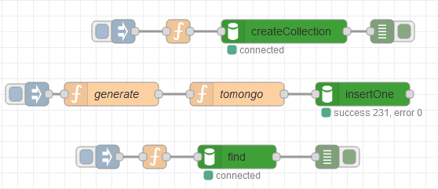
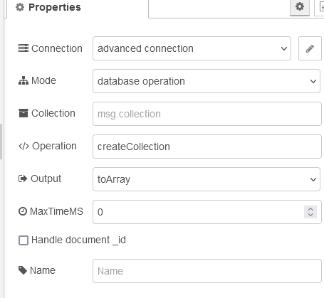
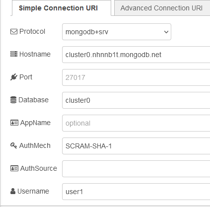
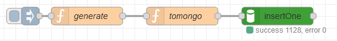
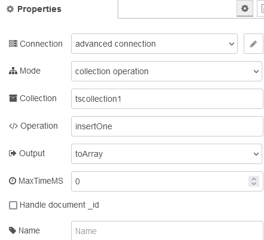
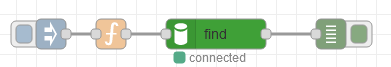
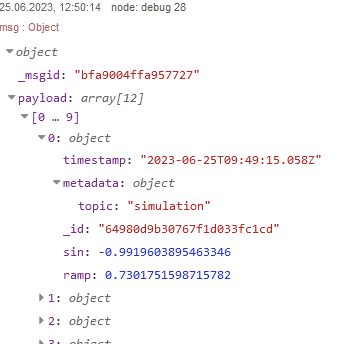

[До збірника задач](README.md)

# Періодичний запис значень змінних у базу даних часових рядів 

## Завдання

Написати фрагмент програми на Node-RED, який буде записувати значення згенерованих змінних у базу даних часових рядів в базі даних MongoDB та перевірити її функціональність.  

Повинна бути реалізована наступна функціональність:

- створення в MongoDB колекції `tscollection1` з типом `timeseries` 
- з періодичністю 5 секунд генерування змінних `ramp` - рампа з періодом 6.28 та `sin` - синусоїда, що розраховується за `ramp`
- записування згенерованих змінних в базу даних
- вибірка даних з колекції за вказаний діапазон часу

## Рішення 1

У даному рішенні використовуються:

- вузли MongoDB4 ([опис](https://github.com/pupenasan/NodeREDGuidUKR/blob/master/storage_mongodb/mongodb4.md)) та сервіс Atlas MongoDB 

### Пререквізити

- Необхідно зареєструватися в сервісі Atlas Mognodb та створити принаймні одну базу даних, як це описано у наведеному [тут прикладі](mongoatlass.md)  
- Необхідно поставити усі необхідні додаткові бібліотеки:
  - `node-red-contrib-mongodb4`

### Створення фрагменту в Node-RED

Застосунок реалізований у вигляді одного потоку-вкладки, що включає три логічні частини, що реалізовані окремими потоками:

- створення в MongoDB колекції `tscollection1` з типом `timeseries` 
- генерування змінних та записування їх в базу даних
- вибірка даних з колекції за вказаний діапазон часу



Створення  в MongoDB колекції `tscollection1` з типом `timeseries`  відбувається вручну через ініціювання потоку кнопкою на Inject. Вузол `createCollection` має наступні налаштування:



У даному випадку використовується метод `createCollection` об'єкту `database`. Самі аргументи передаються через масив в `msg.payload`. Про принципи роботи з вузлами MongoDB4 можна почитати в цьому [описі](https://github.com/pupenasan/NodeREDGuidUKR/blob/master/storage_mongodb/mongodb4.md). При цьому налаштування конфігураційного вузла `advanced coonection` має наступний вигляд для прикладу:



Функція що формує повідомлення для вузла створення колекції має наступний вигляд:

```js
msg.payload = ["tscollection1",
    {
       timeseries: {
          timeField: "timestamp",
          metaField: "metadata",
          granularity: "seconds"
       }
    }]
return msg;
```

Це параметри функції `createCollection` про яку можна почитати за [цим посиланням](https://github.com/pupenasan/ProgIngContrSystems/blob/master/Довідники/mongodb/timeseries_article.md). Першим параметром є назва колекції `"tscollection1"` а другим є `options`, в якому вказується що це буде колекція типу `timeseries`, в якій задаються назви полів для відмітки часу та метаданих, та грнулярність запису. Додатково про використання TSDB в MongoDB можна почитати [тут](https://github.com/pupenasan/ProgIngContrSystems/blob/master/Довідники/mongodb/timeseries.md) і [тут](https://github.com/pupenasan/ProgIngContrSystems/blob/master/Довідники/mongodb/timeseries_article.md)



Потік генерування змінних та записування їх в базу даних починається з вузла Inject, який налаштований на записування кожні 5 секунд. Вузол-функція `generate` має наступний вигляд:

```js
let now = new Date ();
let ramp = msg.payload/62800 - Math.trunc(msg.payload/62800);
let grad = ramp * 6.28;  
let sin = Math.sin(grad); 
msg.topic = "simulation";
msg.ts = now;
msg.payload = {ramp:ramp, sin:sin};
return msg
```

Цей вузол генерує `msg.payload` зі значенням генерованих змінних та `msg.ts` зі значенням відмітки часу.

Вузол `InsertOne` використовує метод `insertOne` вказаного об'єкта-колекції `tscollection1` для вставлення нового документу. Для всіх операцій крім створення колекції можна б було скористатися вузлами класичної бібліотеки [node-red-node-mongodb](https://github.com/pupenasan/NodeREDGuidUKR/blob/master/storage_mongodb/mongodb.md) тут бібліотека mongodb4 використана для уніфікації.  



Вузол-функція `tomomgo` формує аргументи для методу `insertOne`, який включає лиш зміст документу:

```js
let msg1 = {};
msg1.payload = [{
      "metadata": { "topic": msg.topic },
      "timestamp": new Date(msg.ts),
      "ramp": msg.payload.ramp,
      "sin": msg.payload.sin
   }]
return msg1;
```

Як видно зміст документу включає два обов'язкові поля `metadata` та `timestamp`, які були означені при створенні, та два поля з плинними значеннями. За змістом метаданих можна робити фільтрацію документів.

Наступний потік потрібен для перевірки вибірки даних за часовими діапазонами:



Вузол [`find`](https://github.com/pupenasan/ProgIngContrSystems/blob/master/Довідники/mongodb/collection_find.md) реалізує однойменний метод колекції: 


Вузол-функція перед ним формує аргументи, які задають вираз, що формує правило, яким повинні задовольняти документи, які повертаються:

```js
msg.payload = [{
  $expr:{
    $gt:[
      "$timestamp",
      {$dateAdd: 
      {
        startDate: new Date(),
        unit: 'second',
        amount: -60
      }}
      ]
  }
}]
return msg;
```

[`$expr`](https://www.mongodb.com/docs/manual/reference/operator/query/expr/) - забезпечує виконання виразів порівняння полів в тому самому документі. [`$gt`](https://www.mongodb.com/docs/manual/reference/operator/aggregation/gt/)  - порівнює два значення, що вказані в якості аргументу. Перше значення це поле `timestamp`, тоді як друге розраховується як сума плинної дати та часу та -60 секунд. Тобто це по факту час, що на 60 секунд менше за теперішній.

Зробивши ручне ініціювання потоку ми отримаємо приблизно таке повідомлення:



Експорт потоку доступний [за посиланням](tsmongodb.json)

