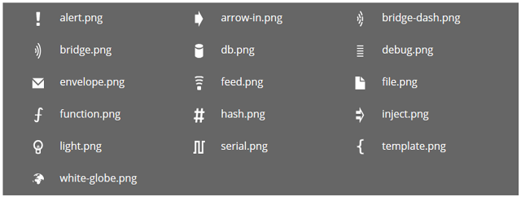
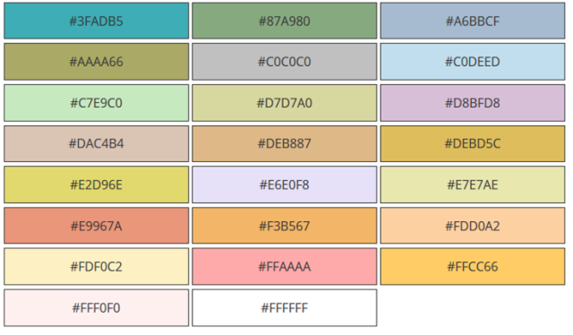

# Створення власних вузлів 

## [Зовнішній вигляд вузлу](https://nodered.org/docs/creating-nodes/appearance)

Є три аспекти зовнішнього вигляду вузла, які можна налаштувати; значок, колір тла та його мітка.

### Значок (Icon)

Піктограма вузла означується властивістю `icon` у його означенні.

Значення властивості може бути або рядком, або функцією.

Якщо значення - це рядок(string), тоді воно використовується як значок.

Якщо значення є функцією, воно буде оцінено під час першого завантаження вузла або після його редагування. Очікується, що функція поверне значення, яке використовуватиме як значок.

Функція буде викликана як для вузлів у робочій області, де `this` посилається на екземпляр вузла, так і для запису вузла в палітрі. В останньому випадку `this` не посилатиметься на певний екземпляр вузла, а функція мусить повертати дійсне значення.

```html
...
icon: "file.png",
...
```

Значок може бути будь-яким:

- назва значка stock, наданого Node-RED,
- ім'я користувацької іконки, наданої модулем,
- значок  Font Awesome 4.7

#### Значки Stock

 

**Примітка**: У Node-RED 1.0 усі ці значки були замінені на SVG-альтернативи для кращого вигляду. Для забезпечення зворотної сумісності редактор автоматично замінить будь-який запит на версію png для версії SVG, якщо вона доступна.

#### Користувацька іконка 

Вузол може надати власну піктограму в каталозі, який називається `icons`  поряд з файлами` .js` та `.html`. Ці каталоги додаються до шляху пошуку, коли редактор шукає задане ім'я файлу значків. Через це ім'я файлу значку має бути унікальним.

Значок повинен бути білим на прозорому фоні розміром 40 х 60.

#### Значки Font Awesome 

Node-RED включає повний набір [значків Font Awesome 4.7](https://fontawesome.com/v4.7.0/icons/).

Щоб вказати значок FA, властивість має мати форму:

```html
...
icon: "font-awesome/fa-automobile",
...
```

#### Значки, означені користувачем

Користувач може налаштувати значки для кожного вузлу у редакторі на вкладці "appearance" діалогового вікна редагування вузла.

**Примітка**: Якщо вузол має властивість `icon` у своєму об'єкті `defaults` , його значок неможливо налаштувати. Наприклад, вузол `ui_button` на ` node-red-dashboard`.

### Background Colour

The node background colour is one of the main ways to quickly distinguish different node types. It is specified by the `color` property in the node definition.

```html
...
color: "#a6bbcf",
...
```

We have used a muted palette of colours. New nodes should try to find a colour that fits with this palette.

Here are some of the commonly used colours:



### Labels

There are four label properties of a node; `label`, `paletteLabel`, `outputLabel` and `inputLabel`.

#### Node label

The `label` of a node in the workspace can either be a static piece of text, or it can be set dynamically on a per-node basis according to the nodes properties.

The value of the property can be either a string or a function.

If the value is a string, that is used as the label.

If the value is a function, it will get evaluated when the node is first loaded, or after it has been edited. The function is expected to return the value to use as the label.

As mentioned in a previous section, there is a convention for nodes to have a `name` property to help distinguish between them. The following example shows how the `label` can be set to pick up the value of this property or default to something sensible.

```javascript
...
label: function() {
    return this.name||"lower-case";
},
...
```

Note that it is not possible to use [credential](https://nodered.org/docs/creating-nodes/credentials) properties in the label function.

#### Palette label

By default, the node’s type is used as its label within the palette. The `paletteLabel` property can be used to override this.

As with `label`, this property can be either a string or a function. If it is a function, it is evaluated once when the node is added to the palette.

#### Label style

The css style of the label can also be set dynamically, using the `labelStyle` property. Currently, this property must identify the css class to apply. If not specified, it will use the default `node_label` class. The only other predefined class is `node_label_italic`.

​    

The following example shows how `labelStyle` can be set to `node_label_italic` if the `name` property has been set:

```javascript
...
labelStyle: function() {
    return this.name?"node_label_italic":"";
},
...
```

#### Alignment

By default, the icon and label are left-aligned in the node. For nodes that sit at the end of a flow, the convention is to right-align the content. This is done by setting the `align` property in the node definition to `right`:

```
...
align: 'right',
...
```

​    

#### Port labels

Nodes can provide labels on their input and output ports that can be seen by hovering the mouse over the port.

​    

These can either be set statically by the node’s html file

```javascript
...
inputLabels: "parameter for input",
outputLabels: ["stdout","stderr","rc"],
...
```

or generated by a function, that is passed an index to indicate the output pin (starting from 0).

```javascript
...
outputLabels: function(index) {
    return "my port number "+index;
}
...
```

In both cases they can be overwritten by the user using the `node settings` section of the configuration editor.

​    

​    

**Note**: Labels are not generated dynamically, and cannot be set by `msg` properties.

### Buttons

A node can have a button on its left or right hand edge, as seen with the core Inject and Debug nodes.

A key principle is the editor is not a dashboard for controlling your flows. So in general, nodes should not have buttons on them. The Inject and Debug nodes are special cases as the buttons play a role in the development of flows.

The `button` property in its definition is used to describe the behaviour of the button. It must provide, as a minimum, an `onclick` function that will be called when the button is clicked.

```javascript
...
button: {
    onclick: function() {
        // Called when the button is clicked
    }
},
...
```

The property can also define an `enabled` function to dynamically enable and disable the button based on the node’s current configuration. Similarly, it can define a `visible` function to determine whether the button should be shown at all.

```javascript
...
button: {
    enabled: function() {
        // return whether or not the button is enabled, based on the current
        // configuration of the node
        return !this.changed
    },
    visible: function() {
        // return whether or not the button is visible, based on the current
        // configuration of the node
        return this.hasButton
    },
    onclick: function() { }
},
...
```

The `button` can also be configured as a toggle button - as seen with the Debug node. This is done by added a property called `toggle` that identifies a property in the node’s `defaults` object that should be used to store a boolean value whose value is toggled whenever the button is pressed.

```javascript
...
defaults: {
    ...
    buttonState: {value: true}
    ...
},
button: {
    toggle: "buttonState",
    onclick: function() { }
}
...
```