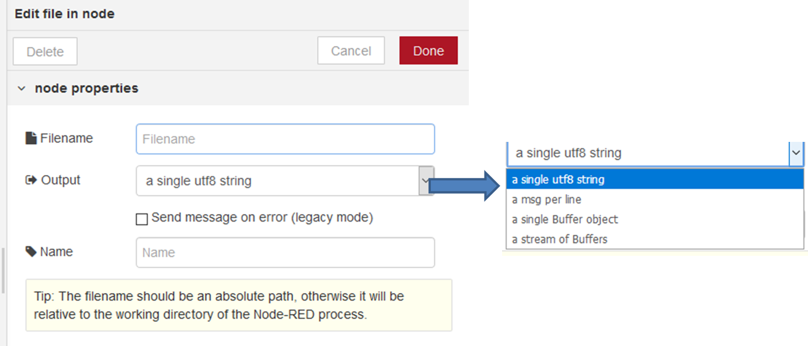

[<- На головну](../)  

## File in (читання з файлу)

Читає вміст файлу у вигляді рядку або бінарного буферу. 

На вхід подається ім’я файлу (filename з типом string) для читання (рис.4.1). Ім’я файлу також може бути вказано у конфігурації вузла

рис.4.1. Конфігурування вузла File in. 

На вихід посилаються наступні властивості повідомлення:

- `payload` (string або buffer) -– вміст файлу як string або як binary buffer
- `filename` (string) -– якщо не сконфігуровано у властивостях вузлу, ця властивість вказує на     файл, що считувався

- `error` (object) –- застаріле, якщо в налаштуваннях вузла активована опція «Send message on error (legacy mode)», коли вузол виявляє помилку при читанні файлу, то відправить повідомлення без `payload`, і в цій властивості `error` буде встановлені деталі помилки. Цей режим поведінки застарілий і не включений за умовчанням для нових екземплярів вузла. До версії Node-RED 0.17, якщо в цьому вузлі виникала помилка під час читання файлу, він відправляв повідомлення без `msg.payload` та формував `msg.error` для деталізації помилки. Це застарілий режим поведінки для вузла, який в нових версіях не використовуються. Якщо потрібно, цей режим може бути явно включений в конфігурації вузла.  Наразі помилки слід сприймати та обробляти за допомогою вузла Catch.

Ім'я файлу має бути абсолютним шляхом, інакше він буде вважатися відносно робочого каталогу процесу Node-RED. У Windows може знадобитися вилучення сепараторів шляхів, наприклад:

 `\\Users\\myUser`.

За бажанням, вихід з вузла для текстового файлу можна розділити на рядки (a msg per line), виводячи одне повідомлення на рядок. Зчитування з бінарного файлу можна розділений на менші буферні фрагменти (stream of Buffers), розмір фрагменту залежить від операційної системи, але зазвичай 64k (Linux / Mac) або 41k (Windows).
Якщо зчитаний файл розбивається на кілька частин-повідомлень, кожне з них матиме властивість `parts`, утворюючи цілісну послідовність повідомлень.