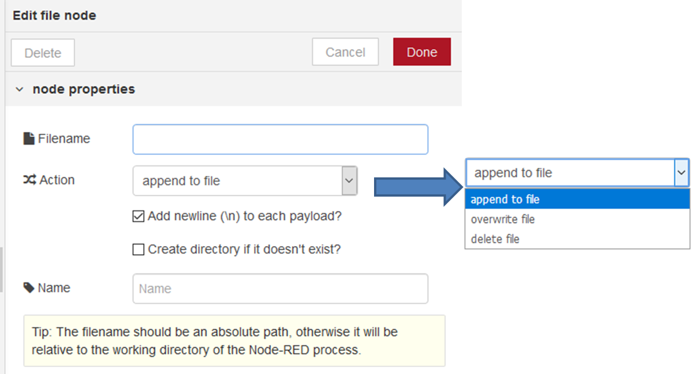

[<- На головну](../)  

## File out (запис в файл)

 Записує `msg.payload` у файл, додавши його до кінця або замінюючи існуючий вміст (рис.4.2). Крім того, вузол може видалити файл.

рис.4.2. Конфігурування вузла File out

На вхід можна подати значення імені файлу (filename з типом string) який необхідно змінити. Після завершення запису, вхідне повідомлення надсилається на вихідний порт.

Кожне payload з повідомлення буде додано до кінця файлу. За необхідності можна додавати в кінець кожного повідомленнями символ нового рядку (`\n`). Якщо використовується  `msg.filename`, файл буде закрито після кожного запису. Для кращої продуктивності використовуйте фіксоване ім'я файлу. Вузол може бути налаштований на перезапис всього файлу, а не на додавання до нього. Наприклад, при складанні бінарних даних у файл, таких як зображення, слід використовувати параметр `overwrite file`. Крім того, цей вузол може бути налаштований на видалення файлу (параметр `delete file`).

Можна також налаштувати кодування файлу. 

