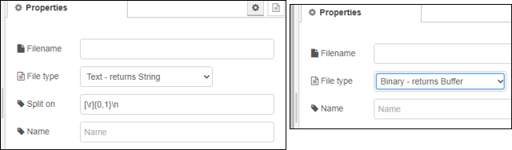

[<- На головну](../)  

## Tail (контроль змін у файлі)

 стежить за тим, що було додано у вказаний файл.

Примітка. У Windows вам може знадобитися закрити файл між записами для реєстрації будь-яких оновлень.

На вхід можна подати `filename` (*string*), де вказати ім'я файлу, яке повинно бути  якщо він не сконфігурований у вузлі.  Якщо файл не вказано, відстеження буде припинено. 

Вузол повертає значення: 

- для файлів Text (UTF-8) зміни як strings.
- для файлів Binary буде повертатися об'єкт Buffer.