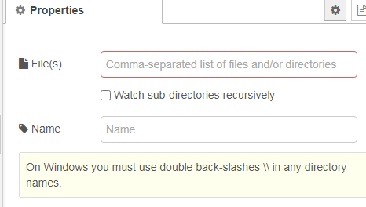

[<- На головну](../)  

## Watch (пошук змін у файловій системі)

 Відслідковує зміни в каталозі або у файлі.

Ви можете ввести список каталогів та/або файлів, розділених комами. Вам потрібно буде включити назви в лапки "..." для будь-яких шляхів, у яких є пробіли.

У Windows ви повинні використовувати подвійні зворотні косі риски `\\` у будь-яких назвах каталогу.

Повне ім'я файлу, який фактично змінився, вводиться у `msg.payload` та `msg.filename`, тоді як у `msg.topic` повертається строфікована версія списку перегляду.

`msg.file` містить лише коротку назву файлу, який змінився. `msg.type` включає тип що змінилося, як правило, `file` `directory`, тоді як ` msg.size` містить розмір файлу в байтах.

Звичайно, в Linux *everything*  - це файли, і таким чином їх можна відслідковувати...

**Примітка** Каталог або файл повинні існувати перед тим, як їх переглядали. Якщо файл або каталог буде видалено, він більше не може контролюватися, навіть якщо він буде створений заново.