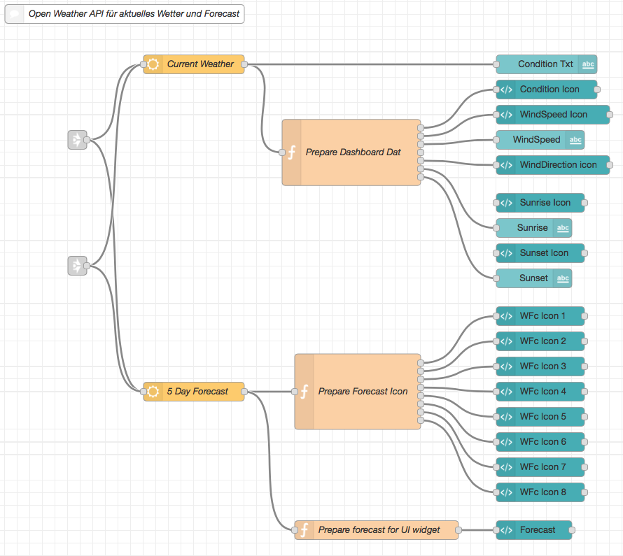
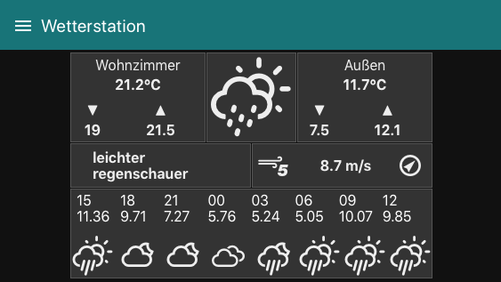

httpsflows.nodered.orgnodenode-red-node-openweathermap

# Node-red Flow що показує стан і прогноз на основі OpenweatherMap інтерфейсу Node-red

Оригінальна стаття від [djiwondee](https://flows.nodered.org/user/djiwondee) [за посиланням](https://flows.nodered.org/flow/b5b7d5da14d24e71de447e6aa290937e/in/rekJJdGYekDB). 

Я шукав приклади впровадження для [вузлів Openweathermap](https://flows.nodered.org/node/node-red-node-openweathermap) разом із гарним набором [значків](https://erikflowers.github.io/weather-icons/), створений [Еріком Флауерсом](http://www.twitter.com/erik_flowers). У цій вправі я визнав, що доступних прикладів не так багато. Тож дозвольте мені поділитися своєю поточною реалізацією.



**Примітка.** Я використовую Node-red на RaspberryPi. Тож мій потік реалізовано та перевірено на цій платформі.

## Передумови

### Іконки та CSS

Вам потрібно встановити необхідну бібліотеку з більш ніж 200 піктограмами та відповідним вмістом CSS. Перейдіть на [GitHub](https://github.com/Paul-Reed/weather-icons) і дотримуйтесь інструкцій із налаштування *Пола Рідса*.

**Примітка.** Оскільки [невелика підмножина](https://github.com/Paul-Reed/weather-icons-lite/blob/master/css_mappings.md) значків погоди вже вбудовано в node-red, вам потрібно лише дотримуватися цієї інструкції, якщо ви хочете додати більше з [понад 200 доступних значків](https://erikflowers.github.io/weather-icons/). В іншому випадку просто додайте `<i class="wi wi-forecast-io-rain">` до вузла шаблону інформаційної панелі, щоб відображати значки так само, як e. g. [Шрифт Awsome](https://fontawesome.com/v4.7.0/icons/).

### Створіть безкоштовний обліковий запис OpenWeather і отримайте ключ API

Для доступу до безкоштовних даних OpenweatherMap потрібен ключ API. Щоб отримати ключ API, перейдіть на [OpenWeatherMap](http://openweathermap.org/appid), увійдіть [сюди](https://home.openweathermap.org/users/sign_up) і подайте запит на ключ.

**Примітка.** Може минути кілька годин, поки ви не отримаєте електронний лист від OpenWeather із ключем API.

### Встановіть node-red-nodes для openweathermap

Я отримав дуже хороші враження від [node-red-node-openweathermap](https://flows.nodered.org/node/node-red-node-openweathermap).

## Коментарі

Я не стверджую, що написав найефективніший код, особливо у функціональних вузлах. Моєю основною темою було знайти хороший спосіб зіставити код піктограми OpenweatherMap із [значками Еріка Флауерза](https://erikflowers.github.io/weather-icons/). [Mapping](https://erikflowers.github.io/weather-icons/api-list.html), наданий там, здається, не зовсім відповідає [коду, наданому API OpenWeatherMap](https://openweathermap.org/weather-conditions). Для самого відображення я вирішив використати об’єкт map у JavaScript, наприклад:

```js
const owIconMap = new Map();

owIconMap.set('01d', 'wi-day-sunny'); // clear sky
owIconMap.set('02d', 'wi-day-cloudy'); // few clouds
owIconMap.set('03d', 'wi-cloud'); // scattered clouds
owIconMap.set('04d', 'wi-cloudy'); // broken clouds
owIconMap.set('09d', 'wi-day-showers'); // shower rain
owIconMap.set('10d', 'wi-day-rain'); // rain
owIconMap.set('11d', 'wi-thunderstorm'); // thunderstorm
owIconMap.set('13d', 'wi-snow'); // snow
owIconMap.set('50d', 'wi-fog'); // mist
...
// assign WeatherIcon name based on OpenWeather API response icon 
conditionIcon.payload = owIconMap.get(msg.payload.icon);
```

Другим пунктом було те, як створити гарний стиль для відображення прогнозу. Відповідь API для прогнозу – це вкладений масив із прогнозом на 5 днів, який містить дані про погоду кожні 3 години. У моєму прикладі показано лише 10 інтервалів протягом наступних 30 годин. Я використовую другий маленький RaspberryPI з 3,5-дюймовим дисплеєм у моїй вітальні, який показує лише інформаційну панель інтерфейсу користувача з даними про погоду. З цієї причини я вирішив налаштувати для цього невелику сторінку інтерфейсу користувача.



Мій прогноз зараз може виглядати не дуже добре. Але я вибрав це налаштування через обмеження розміру дисплея.

**Примітка.** Залежно від вашої місцевості та бажаної мови вам може знадобитися змінити код країни в розділі параметрів вузла openweather на додачу до ключа API та місцезнаходження.

Код потоку доступний на [сторінці ориігальної статті](https://flows.nodered.org/flow/b5b7d5da14d24e71de447e6aa290937e/in/rekJJdGYekDB) 

## Коментарі перекладача

Окрім того що необхідно вставити необхідний API ключ, треба ще інсталювати бібліотеки, про які писалося. Як зробити описано [тут](https://gist.github.com/djiwondee/b5b7d5da14d24e71de447e6aa290937e?permalink_comment_id=2943633#gistcomment-2943633) 

