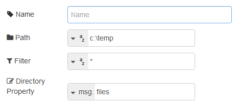

[<- На головну](../)  [Розділ](README.md)

## dir (перегляд директорії)

Показує список файлів в каталозі файлової системи хоста. 

В якості конфігураційних параметрів вказується наступне (див.рис.5.1):

source path (string) – шлях директорії 

filter (string) – фільтр імені файлу

directory (property) - властивість, в якій будуть записані імена файлів

рис.5.1.Налаштування вузлу dir

На вихід подаються імена файлів, що зберігаються в масиві в заданій властивості. 