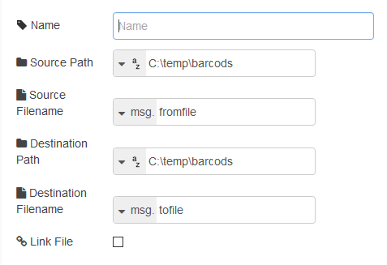

[<- На головну](../)  [Розділ](README.md)

## move (переміщення/перейменування файлів)

 Переміщує або перейменовує файли в локальній файловій системі (рис.5.2). 

В якості конфігураційних параметрів вказується:

name (string) – ім’я вузла що відображається в редакторі

source path (string) – шлях директорії, що вміщує файл для переміщення/перейменування 

source filename (string) – ім’я файлу що необхідно перемістити/перейменувати 

destination path (string) – шлях директорії куди буде переміщено/перейменовано файл

destination filename (string) – нове ім’я файлу 

link file (Boolean) – посилання до файлу призначення 

рис.5.2. Налаштування вузлу move

**Увага:** цей вузол буде завжди переписувати файл призначення.

Якщо встановлено опція *Link Files*, файл призначення буде символічним посиланням на вихідний файл. - Застаріле: Замість цього використовуйте вузол File Copy.

Повідомлення виконується і передається без змін, якщо переміщення/перейменування є успішним.