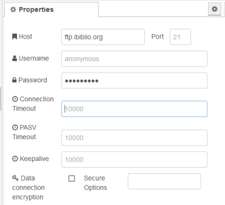
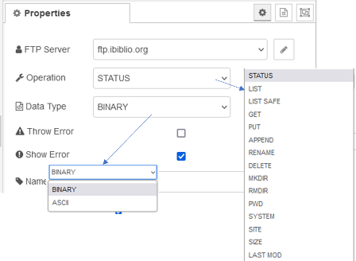
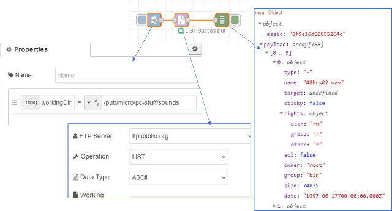
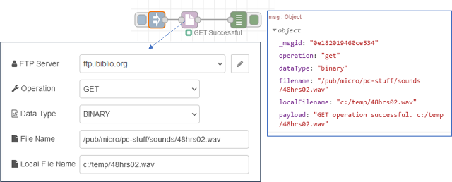

# node-red-contrib-advanced-ftp

https://flows.nodered.org/node/node-red-contrib-advanced-ftp

## advanced-ftp-config

Конфігурація підключення до віддаленого FTP-сервера.

- `Host` - це адреса FTP-сервера, URL-адреса або IP-адреса. Типове значення: `localhost`
-  `Port` вказує, на якому порту FTP-сервер прослуховує нові керуючі підключення. Типове значення: `21`

-   `User` визначає ім'я користувача облікового запису, який буде використовуватися під час входу на сервер FTP. За замовчуванням: `anonymous`

- `Password` визначає пароль облікового запису, який буде використовуватися під час входу на сервер FTP. Обов'язково вводити.
-  `Connection Timeout` - це час у мілісекундах, протягом якого клієнт FTP намагатиметься підключитися до сервера. Типове значення: `10000`

- `PASV Timeout` – це час у мілісекундах для очікування встановлення з’єднання даних PASV. Типове значення: `10000`
-  `Keepalive` — це час у мілісекундах для надсилання фіктивної команди (NOOP), щоб підтримувати з’єднання. Типове значення: `10000`

-  `Data connection encryption` має значення true як для керування, так і для шифрування підключення до даних. Типове значення: `false`

- `Secure Options` — це додаткові параметри, які передаються в `tls.connect()`. За замовчуванням: (none)

## Advanced FTP

Дозволяє виконувати кілька команд на віддаленому FTP-сервері. Вхідні параметри мають пріоритет над параметрами, які можна встановити у вузлі.

### Inputs

`operation`  (string) - це команда, яка надсилається на FTP-сервер, може мати значення:

- `STATUS`: Retrieves human-readable information about the server's status
- `LIST`: Отримує список указаного каталогу, який вказується `msg.workingDir`
- `LIST SAFE`: Similar to LIST, except the directory is temporarily changed to msg.workingDir to retrieve the directory listing.
  - `msg.workingDir`
- `GET`: Отримує файл із сервера, який вказується `msg.filename` та записує його в локальну файлову систему як `msg.localFilename`
- `PUT`: Sends a file to the server.
  - msg.filename
  - msg.localFilename
- `APPEND`: Same as put, except if msg.filename already exists, it will be appended to instead of overwritten.
  - msg.filename
  - msg.localFilename
- `RENAME`: Renames msg.oldPath to msg.newPath on the server.
  - msg.oldPath
  - msg.newPath
- `DELETE`: Deletes a file on the server.
  - msg.filename
- `MKDIR`: Creates a new directory on the server.
  - msg.path or msg.newPath
- `RMDIR`: Removes a directory on the server.
  - msg.path or msg.oldPath
- `PWD`: Retrieves the current working directory
- `SYSTEM`: Retrieves the server's operating system
- `SITE`: Sends msg.command using SITE.
  - msg.command
- `SIZE`: Retrieves the size of msg.path or msg.oldPath.
  - msg.path or msg.oldPath
- `LASTMOD`: Retrieves the last modified date and time of msg.path or msg.oldPath.
  - msg.path or msg.oldPath

`dataType` (string) - sets the transfer data type:

- `BINARY`: Sets the transfer data type to binary (default at time of connection).
- `ASCII`: Sets the transfer data type to ASCII.

`command` (string) - the SITE command.

`abort` (boolean) - aborts the current data transfer.

`workingDir` (string) - the path of the working directory on the remote FTP.

`filename` (string) - the path/name of the file on the remote FTP server.

`localFilename` (string) - the path/name of the file on the local machine.

`oldPath` (string) - the path of the file/directory on the remote FTP server to be removed/replaced.

`newPath` (string) - the path of the file/directory on the remote FTP server to be created/replaced.

`path` (string) - the path of the directory on the remote FTP server to be created/removed.

`showError` (boolean) - determines whether errors are to be handled by the status node.

`throwError` (boolean) - determines whether errors are to be handled by the catch node.

### Outputs

- `LIST` and `LIST SAFE` Output:

  - payload (array) - Array of the file/folders in the msg.workingDir folder.

  - operation (string) - Command sent to the FTP server.

- `STATUS`, `PWD` and `SYSTEM` Output:

  - payload (string) - Message from the server.

  - operation (string) - Command sent to the FTP server.

- `GET`, `PUT`, `APPEND` and `DELETE` Output:

  - payload (string) - Message that processing is complete.

  - filename (string) - The path/name of the file on the remote FTP server.

  - localFilename (string) - The path/name of the file on the local machine.

  - operation (string) - Command sent to the FTP server.

- `MKDIR` Output:

  - payload (string) - Message from the server.

  - path (string) - Path of the directory created on the FTP server.

  - operation (string) - Command sent to the FTP server.

- `RMDIR` Output:

  - payload (string) - Message from the server.

  - path (string) - Path of the directory removed on the FTP server.

  - operation (string) - Command sent to the FTP server.

- `RENAME` Output:

  - payload (string) - Message from the server.

  - oldPath (string) - Old path/name of the file/directory on the FTP Server.

  - newPath (string) - New path/name of the file/directory on the FTP Server.

  - operation (string) - Command sent to the FTP server.

- `SITE` Output:

  - payload (string) - Message from the server.

  - responseCode (integer) - Response Code.

  - operation (string) - Command sent to the FTP server.

- `SIZE` Output:

  - payload (integer) - The size of msg.path in bytes.

  - path (string) - Path/name of the file/directory on the FTP Server.

  - operation (string) - Command sent to the FTP server.

- `LAST MOD` Output:

  - payload (date) - Last modify of msg.path.

  - path (string) - Path/name of the file/directory on the FTP Server.

  - operation (string) - Command sent to the FTP server.

## Приклади

Наступний приклад отримує список указаного каталогу, який вказується `msg.workingDir`

Наступний приклад отримує файл із сервера, який вказується `msg.filename` та записує його в локальну файлову систему як `msg.localFilename`

