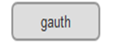
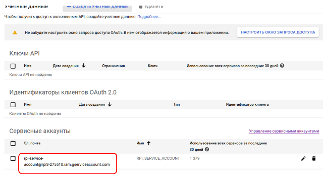
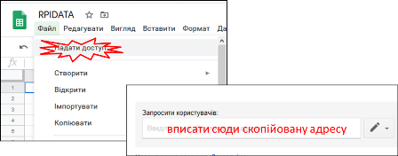
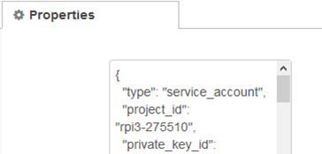
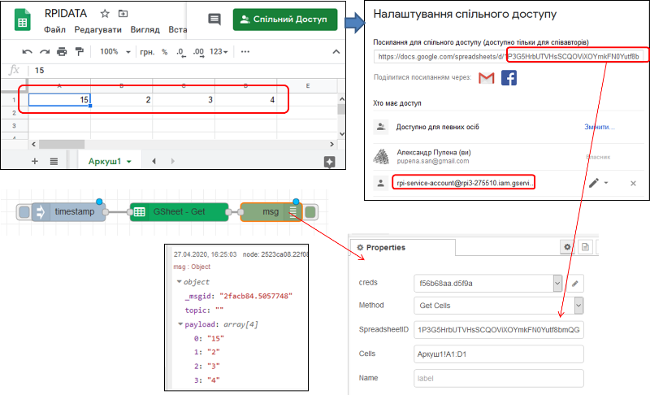
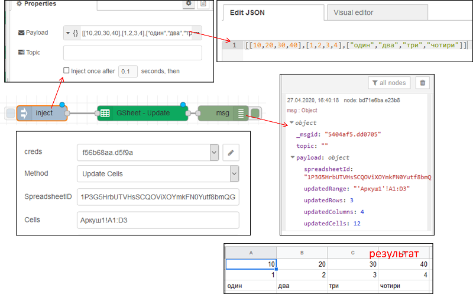

| [На головну](../) | [ < Розділ > ](README.md) |
| ----------------- | ------------------------- |
|                   |                           |

# Робота з базовими функціями читання та запису Google Sheet ([node-red-contrib-google-sheets](https://flows.nodered.org/node/node-red-contrib-google-sheets)) 

## Auth

Використовується для налаштування доступу до Google sheets. 

Для налаштування аутентифікації цього вузла використовується обліковий запис служби Google:

- Створіть новий сервісний обліковий запис, якщо його ще немає та завантажте об’єкт облікових даних JSON для нього. Надайте цьому обліковому запису доступ до API Google sheets. Детальніше можете ознайомитися за [цим посиланням](https://pupenasan.github.io/ProgIngContrSystems/%D0%94%D0%BE%D0%B2%D1%96%D0%B4%D0%BD%D0%B8%D0%BA%D0%B8/googleauth.html?fbclid=IwAR0nyEx86eXOWj1xzy8Ddt0KcDc5XC4zw50yGmg8JXoplGPurO4W_6XtZ6A) 
- Поділіться своїм аркушем з електронною адресою облікового запису послуги, для цього зайдіть перелік свої сервісних облікових записів [за цим посиланням](https://console.cloud.google.com/apis/credentials)  та скопіюйте псевдоелектронну адресу.  



- відкрийте електронну таблицю, та добавте до редакторів дану поштову адресу, при цьому зніміть опцію "Повідомляти користувача", щоб сервіс не намагався відправити запрошення (якщо опція залишиться то Вам на пошту прийде повідомлення, що така поштова адреса не існує)



-   Вміст отриманого файлу JSON скопіюйте в налаштування вузла конфігурації. 



## Таблиці (Sheets)

Ідентифікатор аркуша можна знайти в URL-адресі вашого листа в Google, наприклад, у

```http
https://docs.google.com/spreadsheets/d/1UuVIH2O38XK0TfPMGHk0HG_ixGLtLk6WoBKh4YSrDm4/edit#gid=0
```

ID буде `1UuVIH2O38XK0TfPMGHk0HG_ixGLtLk6WoBKh4YSrDm4`

## Комірки (Cells)

Гугл таблиці (Google sheets) використовує наступний синтаксис для доступу до листів та комірок Таблиці (worksheet)

```
Sheet1!A1:C3
```

де `Sheet1` це ім'я Аркушу (Sheet) що завершується знаком оклику `!` тоді вказуються комірки починаючи з першої, наприклад `A1` тоді двокрапка `:` і кінцева комірка, наприклад  `C3`

Діапазон комірок може бути:

- Рядком (Row) як `A1:A5`, 
- Колонкою (Column) `A1:E1` 
- або блоком  `A1:C3`

Може бути використана нотаці RC, наприклад  `B4` - це `R4C2`.

Якщо в налаштуваннях вузлу `SpreadSheetID` не вказаний, ви можете вказати ідентифікатор у `msg.sheet` Якщо клітинки (`Cells`) не вказані, ви можете вказати їх у `msg.topic`     

Якщо запитується одна комірка, `msg.payload` буде містити значення цієї комірки, Якщо запитується один рядок або стовпець `msg.payload` буде містити масив значень для цього рядка/стовпця Якщо запит і рядків, і стовпців `msg.payload` міститиме вкладені масиви як стовпці, наприклад для `A1:C3`:

```json
[["A1","B1","C1"],
 ["A2","B2","C2"],
 ["A3","B3","C3"]]
```

Вузол GSheet підтримує 4-ри методи:

- `get` - отримання значень з вказаних комірок
- `append` - вставлення рядку зі значеннями
- `update` - запис значень у вказані комірки 
- `clear` - видалення вказаних комірок

## Метод `Get Cells` 



## Метод `Update Cells`

 


Додатково [Довідник Google Sheets API](https://developers.google.com/sheets/api/reference/rest)

