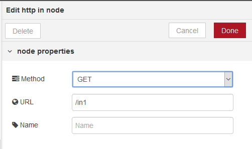
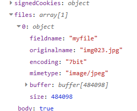

[<- На головну](../)  [Розділ](README.md)

## Http in (HTTP-сервер - обробка вхідного повідомлення)

 Створює точку для з`єднання  [HTTP](https://uk.wikipedia.org/wiki/HTTP) для створення веб-служб (рис.8.2). На виході формує:

- `Payload` (object) - Для запиту GET містить об'єкт з параметрами рядка     запиту. В іншому випадку, містить тіло запиту HTTP.
- `req` (object) - Об'єкт запиту HTTP. Цей об'єкт містить кілька властивостей, які надають інформацію про запит. 
- `_readableState` – 
  - `readable`
  - `domain`
  - `_events`
  - `_eventsCount` – 
  - `socket` –
  - `connection` – 
  - `httpVersionMajor` –
  - `httpVersionMinor` – 
  - `httpVersion` –
  - `complete` –
  - `headers` – об’єкт, що вміщує заголовок запиту HTTP .
  - `rawHeaders` – 
  - `trailers` – 
  - `rawTrailers` – 
  - `aborted`
  - `upgrade`
  - `url` –
  - `method` – 
  - `statusCode` – 
  - `statusMessage` – 
  - `client` – 
  - `_consuming` –
  - `_dumped` –
  - `next` –
  - `baseUrl` –
  - `originalUrl` – 
  - `_parsedUrl` –
  - `params` – об’єкт, що вміщує будь-які маршрутні параметри. 
  - `query` – об’єкт, що вміщує любі строкові параметри запиту .
  - `res` - 
  - `body` – тіло вхідного запиту. Формат залежить від запиту. 
  - `_passport` –
  - `_parsedOriginalUrl` – 
  - `route` - 
  - `cookies` – об’єкт, що вміщує cookies для запиту.
  - `signedCookies` - 
  - `files` - якщо активовано у вузлі опцію "Accept file uploads?", об’єкт містить будь-які файли завантажені з запитом POST.
  
- `res` (object) - HTTP об’єкт відповіді. Ця властивість не повинна     використовуватися безпосередньо; ознайомтеся з документами на вузол `HTTP Response` для формування правильної відповіді на запит. Це властивість має залишатися прикріпленим до повідомлення, переданого вузлу відповіді.

рис.8.2. Налаштування Http in

Вузол прослуховує конфігурований шлях для запитів певного типу. Шлях може бути повністю означений, наприклад `/user`, або включати іменовані параметри, які приймають будь-яке значення, наприклад `/user/:name`. Коли використовуються іменовані параметри, їх фактичне значення в запиті може бути доступне за посиланнями `msg.req.params`.
 Для запитів, які включають тіло, наприклад POST або PUT, вміст запиту доступний як `msg.payload`.

Якщо тип вмісту запиту може бути визначений, тіло буде проаналізовано до будь-якого відповідного типу. Наприклад, `application/json` буде парсений до його представлення в об'єкти JavaScript.

Примітка: цей вузол не надсилає відповіді на запит. Потік повинен містити вузол `HTTP Response` для завершення запиту.

### Завантаження файлів через метод POST

При виборі методу POST можна вказати що очікується завантаження файлу ("Accept file uploads?"). У цьому випадку, наприклад, якщо через форму буде завантажуватися файл, то він зявиться у властивості `req.files`

