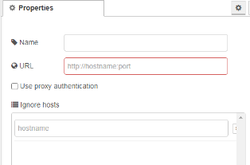

[<- На головну](../)  [Розділ](README.md)

## Http proxy 

Параметри конфігурації для HTTP-проксі.  

Під час доступу до хосту зі списку проігнорованих хостів (ignore hosts) жоден проксі не використовуватиметься.

Про проксі-сервери можна прочитати [тут](https://uk.wikipedia.org/wiki/%D0%9F%D1%80%D0%BE%D0%BA%D1%81%D1%96-%D1%81%D0%B5%D1%80%D0%B2%D0%B5%D1%80) а про веб-проксі [тут](https://ru.wikipedia.org/wiki/%D0%92%D0%B5%D0%B1-%D0%BF%D1%80%D0%BE%D0%BA%D1%81%D0%B8).