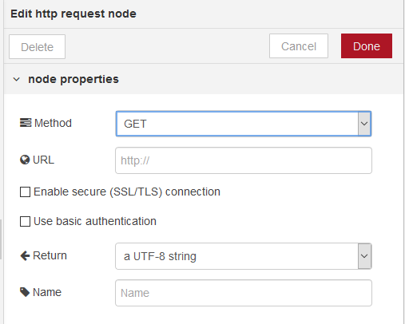

[<- На головну](../)  [Розділ](README.md)

## HTTP requests (робота з клієнтськими запитами)

 Відправляє запити HTTP і повертає відповідь на нього (рис.8.1). В якості вхідного значення приймає наступні властивості повідомлень:

- url (string) – якщо не  сконфігуроване в вузлі, ця опціональна властивість виставляє url для запиту.
- method (string) - якщо не     сконфігуроване в вузлі, ця опціональна властивість виставляє метод HTTP для запиту. Повинно     бути `GET`,     `PUT`,     `POST`,     `PATCH`     бо `DELETE`.
- headers (object) – виставляє HTTP заголовки в запиті 
- cookies (object) – якщо вказані,     можуть бути використані для відправки куків з запитом
- payload – виставляє тіло для запиту
- rejectUnauthorized – якщо     виставлено в `false` дозволяє робити запити на сайти https, які     використовують сертифікати, які підписуються самостійно 
- followRedirects – якщо виставлено в` false`     запобігає наступним перенаправленням (HTTP 301).` true` за замовчуванням



рис.8.1. Налаштування вузлу HTTP requests

На виході формує:

- payload (string | object | buffer)     – тіло відповіді. Вузол може бути     налаштований так, щоб повернути тіло у вигляді string,     спробувати розпарсити його як рядок JSON або залишити його у вигляді     двійкового буфера. 
- statusCode (number)     - код стану відповіді або код     помилки, якщо запит не може бути завершений.
- headers (object) – об’єкт, що     містить заголовки відповідей 
- responseUrl (string)     - у випадку, якщо під час обробки запиту відбулися будь-які     перенаправлення, це властивість є останньою адресою, що переадресовується.     В іншому випадку це URL оригінального запиту.
- responseCookies (object)     - якщо відповідь включає файли cookie, ця властивість є об'єктом пар     імені/значення для кожного cookie.

Якщо сконфігуровано у вузлі, властивість URL може містити теги [mustache-style](http://mustache.github.io/mustache.5.html). Вони дозволяють створювати URL, використовуючи значення вхідного повідомлення. Наприклад, якщо URL-адресу встановлено `example.com/{{{topic}}}` в це місце буде автоматично додано` msg.topic`. Використання {{{...}}} запобігає вилученню mustache із символів на зразок /&  і т.д.

Примітка: Якщо запускається за проксі-сервері, необхідно встановити стандартну змінну середовища `http_proxy=...` і перезапустити Node-RED.

Для того щоб використовувати більше одного з таких вузлів в тому самому потоці, необхідно дотримуватися властивості `msg.headers`. Перший вузол встановить цю властивість з заголовками відповіді. Тоді наступний вузол буде використовувати ці заголовки для свого запиту - це звичайно не правильно. Якщо властивість `msg.headers` залишається незмінною між вузлами, вона буде ігноруватися другим вузлом. Щоб встановити користувальницькі заголовки, `msg.headers` слід спочатку видалити або скинути порожнім об'єктом: `{}`.

Властивість `cookies`, передана вузлу, повинна бути об'єктом з парої імя/значення. Значення для встановлення значення cookie може бути string, або об'єктом з єдиною властивістю `value`.

Будь-які файли cookie, повернені запитом, передаються назад у властивості `responseCookies`.

Якщо `msg.payload` є Object, вузол буде автоматично встановлювати тип контенту запиту в `application/json` і кодувати тіло відповідним чином.

Для кодування запиту як форму даних `msg.headers["content-type"]` буде встановлюватися як `application/x-www-form-urlencoded`.

### File Upload   

To perform a file upload, `msg.headers["content-type"]` should be set to `multipart/form-data`        and the `msg.payload` passed to the node must be an object with the following structure: 

```json
{    "KEY": {        "value": FILE_CONTENTS,        "options": {            "filename": "FILENAME"        }    } }
```

   The values of `KEY`, `FILE_CONTENTS` and `FILENAME`    should be set to the appropriate values.