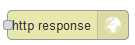
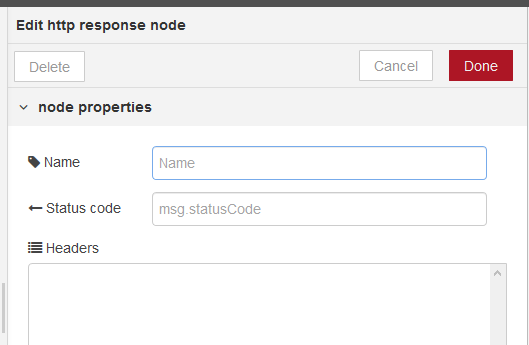

[<- На головну](../)  [Розділ](README.md)

## Http response (HTTP-сервер - формування вихідного повідомлення)

 Надсилає відповіді на запити, отримані від вузла HTTP Input (рис.8.3). 



рис.8.3. Налаштування Http response

В якості вхідного значення приймає наступні властивості повідомлень:

- payload (string) – тіло     відповіді 
- statusCode (number)     – якщо встановлений,використовується в якості статусного коду відповіді.     За замовченням 200
- headers (object) – заголовки,     якщо встановлений забезпечує HTTP заголовки, які     включаються у відповідь  
- cookies (object) – якщо     встановлений, може бути використаний для встановлення або видалення куків     (cookies)

`statusCode` і `headers` також можуть бути встановлені в налаштуваннях самого вузла. У цьому випадку їх не можна перевизначити відповідними властивостями повідомлення.

Властивість `cookies` повинна бути об'єктом пар імен/значень. Значення може бути або рядком для встановлення значення куки з параметрами за замовчуванням, або це може бути об'єктом опцій.

Наступний приклад встановлює два файли cookies - один з них називається `name` зі значенням `nick`, інший називається `session` зі значенням `1234` з терміном дії 15 хвилин.

```javascript
msg.cookies = {
    name: 'nick',
    session: {
        value: '1234',
        maxAge: 900000
    }
}
```

Допустимі опції:

- `domain` - (String) ім’я домену     для куки 
- `expires` - (Date)  expiry date in GMT. If not specified or     set to 0, creates a session cookie
- `maxAge` - (String) термін дії відносно поточного часу в мілісекундах
- `path` - (String) шлях куки,     за замовченням «/»
- `value` - (String) значення для     куки 

Для видалення куки встановлюється в `null```