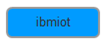
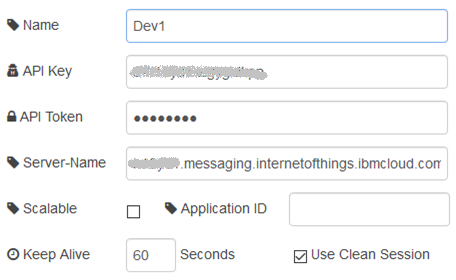

## ibmiot config (точка доступу до API)

У даному вузлі вказується точка доступу до API, означеного в IBM Watson IoT Platform в розділі APPs (рис.15.1). 

рис.15.1. Налаштування вузла ibmiot config

У полі API Key вказується відповідне значення Key (див. Browse API Keys в IoT Platform), а в полі API Token – маркер, що був отриманий при створенні. Слід зазначити, що маркер при створенні точки доступу API треба зберегти, бо він не буде видимий пізніше.

У полі Server-Name необхідно вказати:

*org_id*.messaging.internetofthings.ibmcloud.com

де *org_id* – це Ваш ORG ID IBM Watson IoT. Його можна побачити в правому верхньому кутку консолі налаштування сервісу IBM Watson IoT або у відповідному полі вкладки Settings.

рис.15.2.Визначення ORG ID в IBM Watson IoT

Application ID – необов’язковий ідентифікатор застосунку, від імені якого відбувається з’єднання. Якщо він не вказаний, то генерується автоматично.  