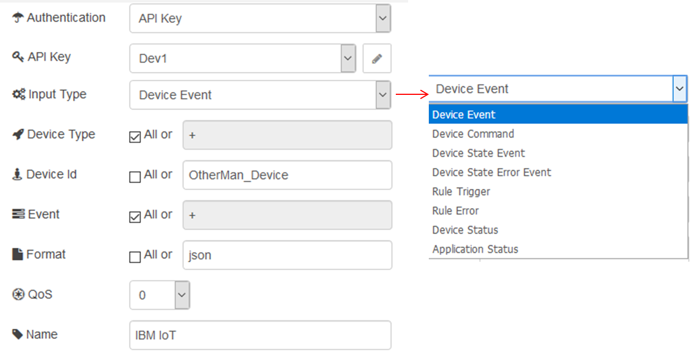
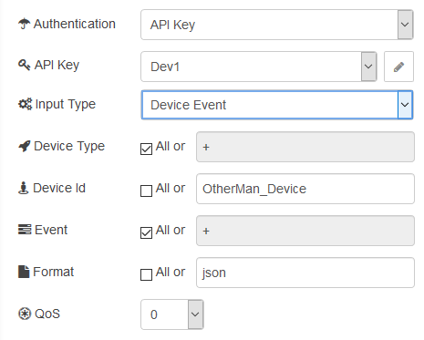
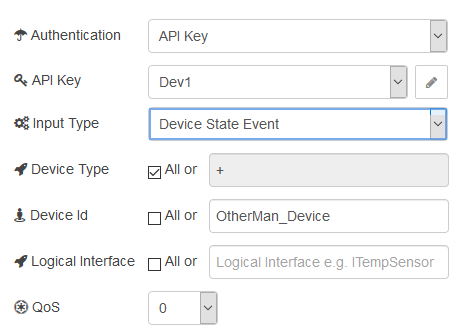
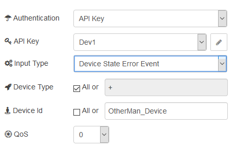
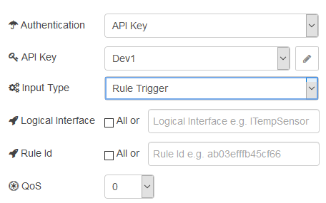
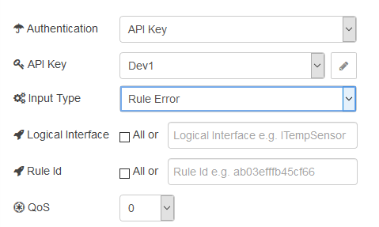
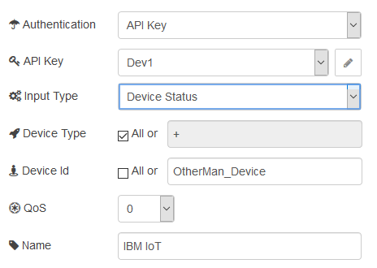
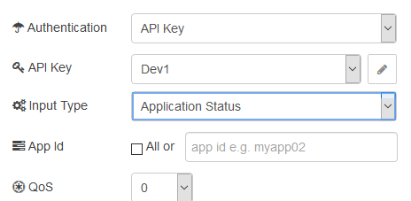

[<- На головну](../)  [Розділ](README.md)

## ibmiot in (отримання подій від Watson IoT Platform)

Вхідний вузол, який можна використовувати з Watson IoT Platform для отримання подій, надісланих пристроями, прийому команд, надісланих на пристрої, або отримання оновлень статусу щодо пристроїв або застосунків (рис.15.3). 

Вузол реалізує API MQTT, який детально описаний за наступним посиланням [MQTT connectivity for applications](https://console.bluemix.net/docs/services/IoT/applications/mqtt.html#mqtt)

Він створює об'єкт msg, і встановлює **msg.payload** як рядок, що містить корисне навантаження вхідного повідомлення.

рис.15.3. Налаштування вузла ibmiot in

Поле Authentication вказується тип серверу для з’єднання. Вузол може підключатися як по вказаному «API Key» так і до наперед визначеного текстового «Quickstart». При підключенні в режимі Quickstart з'єднання буде проводитися для тестування з існуючим тестовим сервером, використовувати тип пристрою `node-red-wiotp` і вказаний ідентифікатор пристрою. Події з вузла можуть бути переглянуті на панелі інструментів тестового серверу [Quickstart dashboard](https://quickstart.internetofthings.ibmcloud.com/). У випадку API Key вказується наперед сконфігурований API Key. 

Поле Input Type може приймати кілька значень.

1) Значення Device Event (рис.15.4) вказує на необхідність отримання подій, які означені типом пристрою Device Type, його ідентифікатором Device ID, та типом події Event. У випадку, якщо необхідно виділити поля будь-якого типу, необхідно виставити опцію «All» (відповідник «+»). 

Значення "Формат" зберігається в **msg.format**. Цей вузол підтримує формати json, buffer та інші типи. Коли формат встановлено в json, цей вузол аналізує вхідні дані за допомогою JSON.parse () і і формує результат на вихід. Якщо цим вузлом отриманий об'єкт buffer, він виводить вміст без будь-якого перетворення. А для інших типів цей вузол виводить повідомлення в форматі String.

рис.15.4. Налаштування Device Event 

2) Значення типу Device Command (рис.15.5) вказує на необхідність отримання усіх команд, визначених полем «Command» для вказаних пристроїв.

рис.15.5. Налаштування Device Command

3) Значення типу Device State Event (рис.15.6) вказує на необхідність отримання стану усіх пристроїв через їх означені логічні інтерфейси, визначених полем «Logical Interface» для вказаних пристроїв.

рис.15.6. Налаштування Device State Event

4) Значення типу Device State Error Event (рис.15.7) вказує на необхідність отримання стану усіх помилок для вказаних пристроїв.

рис.15.7. Налаштування Device State Error Event

5) Значення типу Rule Trigger (рис.15.8) вказує на необхідність отримання подій означених вказаними правилами (Rule ID) для логічного інтерфейсу пристрою.

рис.15.8. Налаштування Rule Trigger

6) Значення типу Rule Error (рис.15.9) вказує на необхідність отримання помилок означених вказаними правилами (Rule ID) для логічного інтерфейсу пристрою.

рис.15.9. Налаштування Rule Error

7) Значення типу Device Status (рис.15.10) вказує на необхідність отримання статусу вказаного пристрою.

рис.15.10. Налаштування Device Status

8) Значення типу Application Status (рис.15.11) вказує на необхідність отримання статусу вказаного застосунку.

рис.15.11. Налаштування Application Status

Ряд значень можна задавати через поля повідомлень: 

- `Device Id` зберігається в **msg.deviceId**
- `Application Id` зберігається в **msg.applicationId**
- `Device Type` зберігається в **msg.deviceType**
- `Event Type` зберігається в **msg.eventType**
- `Command Type` зберігається в **msg.commandType**

 