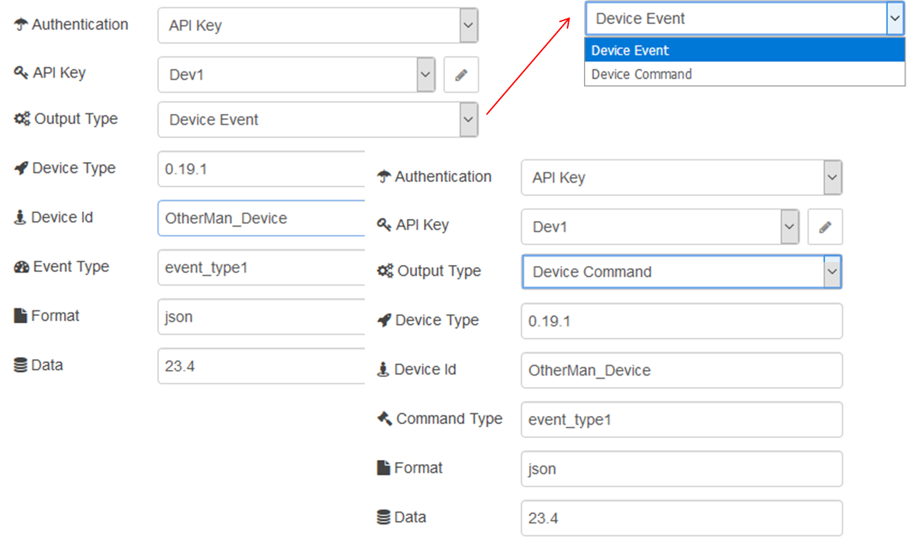

## ibmiot out (надислання команд на Watson IoT Platform)

Вихідний вузол, який можна використовувати з Watson IoT Platform для надсилання команд на пристрій або надсилання події від імені пристрою (рис.15.12). Вузол реалізує API MQTT, який детально описаний за наступним посиланням [MQTT connectivity for applications](https://console.bluemix.net/docs/services/IoT/applications/mqtt.html#mqtt)

Тип команди (Output type = Device Command) чи події (Output type = Device Event) вказується відповідно в полях Command Type та Device Type. 

рис.15.12. Налаштування вузлу ibmiot out

Наступні властивості повідомлення мають пріоритет і замінюють значення, налаштовані в налаштуваннях вузлу:

- **msg.deviceId** замінює значення " Device Id "
- **msg.deviceType** замінює значення " Device Type "
- **msg.eventOrCommandType** замінює значення " Event Type " або "Command Type"
- **msg.format** замінює значення "Format". 

Цей вузол підтримує json, buffer та інші типи. Якщо формат встановлений в json, цей вузол очікує тип object, або версію Stringify об'єкта json. Для того, щоб відправити buffer або інші типи, просто надішліть вміст без будь-яких перетворень і встановіть відповідний формат.

•     **msg.payload** перевизначає значення "Дані"