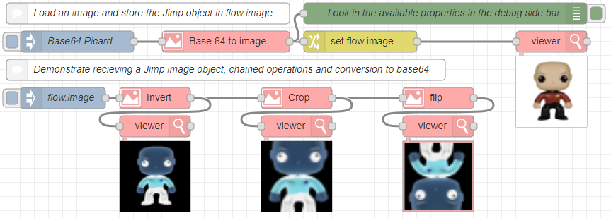
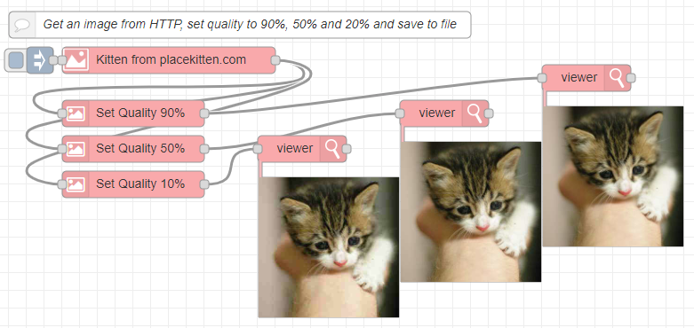
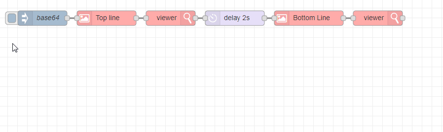
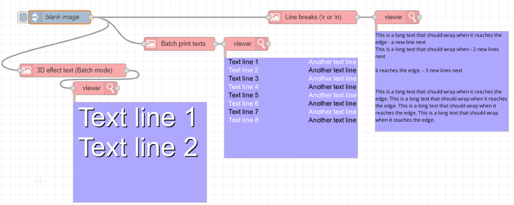
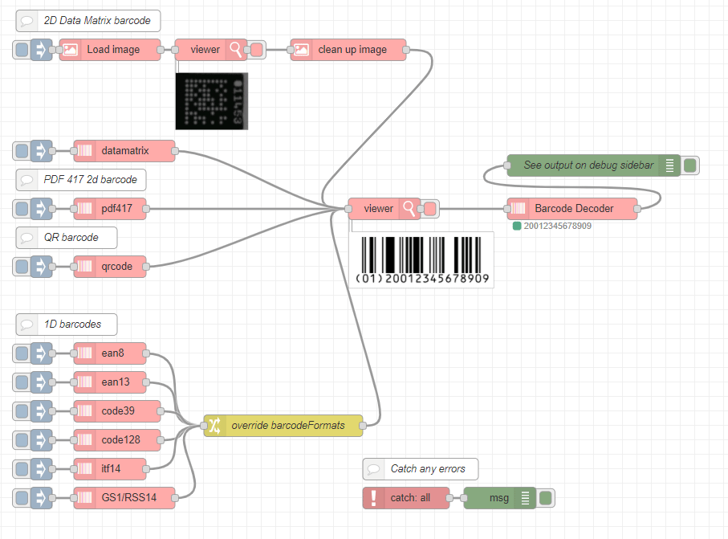
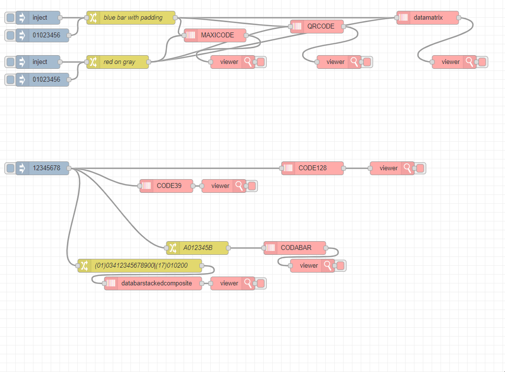

# Робота з відео та зображеннями

## node-red-contrib-image-tools

https://github.com/Steve-Mcl/node-red-contrib-image-tools

Вузли Node-RED для виконання функцій із зображеннями, створення та декодування штрих-кодів.

#### Image processing...

#### Get image from internet...

#### Printing text...

       

### 

#### Barcode decoding...

      

### 

#### Barcode generating...

      

## 

- Вбудовані демонстрації.
   - **У Node-RED перегляньте hamburger menu → import → examples → node-red-contrib-image-tools**
- Вузол `Image` 
   - Читання зображення з файлу, http, рядка base64 або буфера
   - Друкувати одно- чи багаторядковий текст на зображенні
   - Понад 40 вбудованих функцій для зображень і багато інших можливих за допомогою [ядра згортки](https://en.wikipedia.org/wiki/Kernel_(image_processing))
   - Виконайте 1 або декілька (пакетних) процесів зображень у кожному вузлі
     - ПОРАДА: ви можете конвертувати функцію в пакетний JSON, натиснувши кнопку поруч із полем спадного меню функції. Потім просто відредагуйте пакет JSON у масив `[{...},{...},{...}]`, щоб виконати стільки операцій, скільки потрібно за один раз.
   - Створіть порожнє зображення, встановивши для поля зображення об’єкт `{"w":100,"h":100,"background":0}`
   - Усі параметри функції можуть бути фіксованими або переданими через `msg/flow/global`
   - Може виводити дані зображення як зображення Jimp, буфер або рядок base64.
   - Усі функції та параметри самодокументуються - підказка під кожним пунктом у редакторі вузлів допомагає користувачеві
   - Підтримка часткового (не анімованого) завантаження та обробки GIF (експериментальна)
- Вузол `Image viewer`
   - Переглядайте зображення в редакторі node-red (для попереднього перегляду / налагодження)
   - **Повна заслуга** [rikukissa](https://github.com/rikukissa) і [dceejay](https://github.com/dceejay) за чудовий [node-red-contrib-image-output ](https://github.com/rikukissa/node-red-contrib-image-output), на якому значною мірою базується «вузол перегляду зображень». (Копія ліцензії MIT включена у файли src відповідно до запиту)
   - Можливості включають можливість відображення JIMP-зображення, буфера, імені файлу, рядка base64, URL-адреси даних, URL-адреси зображень.
   - Працює в Internet Explorer (перевірено IE11)
- Вузол `Barcode Decode`
   - Можливість декодування штрих-кодів 1D, QR і Data Matrix. Перегляньте [підтримувані формати](https://www.npmjs.com/package/@zxing/library#supported-formats).
- Вузол `Barcode Generator`
   - Можливість створення понад 100 типів штрих-кодів...

#### Simple

The easiest wat to install is to use the Pallet Manager in node-red.