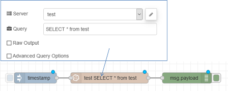
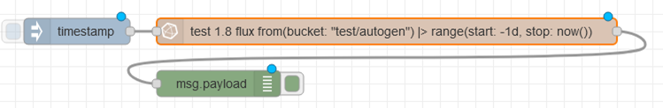
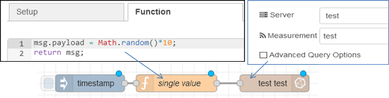
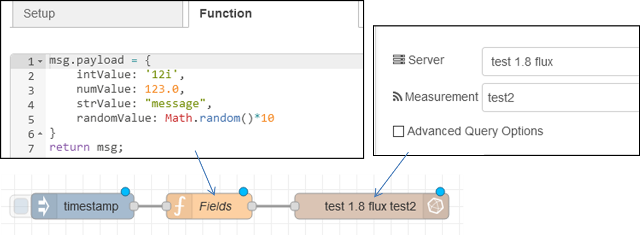
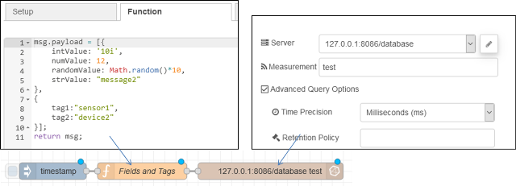
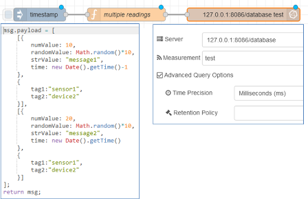
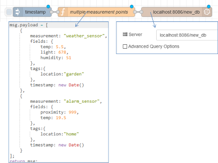

# node-red-contrib-influxdb

https://flows.nodered.org/node/node-red-contrib-influxdb

Node-RED вузли для збереження та запиту даних із бази даних часових рядів influxdb.

Ці вузли підтримують бази даних InfluxDB 1.x та InfluxDb 2.0, вибрані за допомогою комбінованого вікна **Версія** у вузлі конфігурації. Перегляньте документацію різних вузлів, щоб зрозуміти варіанти, надані різними версіями. В даний час вузол використовує дві клієнтські бібліотеки.

Коли вибрана версія **1.x**, ці вузли використовують [influxDB 1.x client](https://www.npmjs.com/package/influx)  для node.js, зокрема викликаючи **writePoints ()** та **query ()**. В даний час вони можуть спілкуватися лише з одним хостом influxdb. Ці вузли використовуються для запису та запиту даних у InfluxDB 1.x до 1.8+.

Коли обрана версія **1.8-flux**, вузли використовують[ influxDB 2.0 API compatibility endpoints](https://docs.influxdata.com/influxdb/v1.8/tools/api/#influxdb-2-0-api-compatibility-endpoints) , доступних у [InfluxDB 2.0 client libraries](https://github.com/influxdata/influxdb-client-js) для node.js. Ці вузли використовуються для запису та запиту даних за допомогою Flux у InfluxDB 1.8+.

Коли обрана версія **2.0**, вузли використовують  [InfluxDB 2.0 client libraries](https://github.com/influxdata/influxdb-client-js) для запису та запиту даних за допомогою Flux у InfluxDB 2.0. 

Вузли для запису та запиту даних із бази даних часових рядів influxdb. Підтримує InfluxDb версії 1.x до 2.0.

### Input Node (InfluxDb 1.x and 2.0)

Запитує одне або кілька вимірювань у базі даних influxdb. Запит вказується у конфігурації вузла або у властивості ***msg.query***. Встановивши його у вузлі, буде замінено ***msg.query***. Результат повертається через ***msg.payload***.

У конфігурації v1.x InfluxDb використовуйте файл [InfluxQL query syntax](https://docs.influxdata.com/influxdb/v1.8/query_language/). У конфігурації v1.8-Flux або 2.0 використовуйте [Flux query syntax](https://docs.influxdata.com/influxdb/v2.0/query-data/get-started/). 

Наприклад, ось простий потік запиту всіх точок у вимірі `test` бази даних ` test`. Запит знаходиться у конфігурації вхідного вузла influxdb . Тут ми використовуємо v1.x InfluxDb, тому використовується запит InfluxQL.



У цьому прикладі ми запитуємо ту саму базу даних для всіх точок дня тому, використовуючи конфігурацію **1,8-потоку**, використовуючи мову запитів Flux:



Цей потік виконує те ж саме, але використовуючи властивість ***msg.query***:


Вузол функції в цьому потоці встановлює властивість `msg.query` наступним чином:

```js
msg.query = 'from(bucket: "test/autogen") |> range(start: -1d, stop: now())'
return msg;
```

### Output Node (InfluxDb 1.x and 2.0)

Записує одну або кілька точок (fields and tags) (полів і тегів) у вимірювання (measurement).

Поля та теги для запису знаходяться в ***msg.payload***. Якщо повідомлення є рядком, числом або логічним значенням, воно буде записане як одне поле до вказаного виміру, яке називається *value*.

> Примітка: Числа Javascript *завжди* записуються як float. Використовуючи конфігурацію 1.8-flux або 2.0, ви можете явно записати ціле число, використовуючи число в рядку із суфіксом 'i', наприклад, щоб записати ціле число  `1234` , використовуйте рядок `'1234i'`. Це *не* підтримується за допомогою конфігурацій 1.x; всі числа записуються як плаваючі значення.

Наприклад, наступний потік вводить одне випадкове поле, що називається `value` , у `test`  вимірювання в базі даних `test`  із поточною позначкою часу.



Вузол функції складається з наступного:

```js
msg.payload = Math.random()*10;
return msg;
```

Якщо ***msg.payload*** є об'єктом, що містить декілька властивостей, усі поля будуть записані для вимірювання.

Наприклад, наступний потік вводить чотири поля, `intValue`, ` numValue`, `randomValue` і ` strValue` у вимірювання `test2` з поточною позначкою часу, використовуючи конфігурацію 1.8-Flux.



Вузол функції у потоці вище складається з наступного:

```js
msg.payload = {
    intValue: '10i',
    numValue: 123.0,
    strValue: "message",
    randomValue: Math.random()*10
}
return msg;
```

Якщо ***msg.payload*** - це масив, що містить два об'єкти, перший об'єкт буде записаний як набір іменованих полів, другий - набір іменованих тегів.

Наприклад, наступний простий потік використовує базу даних InfluxDb 2.0 і вводить чотири поля, як зазначено вище, разом із двома тегами `tag1` і ` tag2`:



Вузол функції складається з такого коду:

```js
msg.payload = [{
    intValue: '10i',
    numValue: 12,
    randomValue: Math.random()*10,
    strValue: "message2"
},
{
    tag1:"sensor1",
    tag2:"device2"
}];
return msg;
```

Нарешті, якщо ***msg.payload*** є масивом масивів, він буде записаний як серія точок, що містять поля та теги.

Наприклад, наступний потік вводить дві точки в базу даних InfluxDb 2.0 із зазначеними мітками часу.



Вузол функції у наведеному вище потоці виглядає так:

```js
msg.payload = [
    [{
        intValue: '9i',
        numValue: 10,
        randomValue: Math.random()*10,
        strValue: "message1",
        time: new Date().getTime()-1
    },
    {
        tag1:"sensor1",
        tag2:"device2"
    }],
    [{
        intValue: '11i',
        numValue: 20,
        randomValue: Math.random()*10,
        strValue: "message2",
        time: new Date().getTime()
    },
    {
        tag1:"sensor1",
        tag2:"device2"
    }]
];
return msg;
```

Зверніть увагу, як тут вказуються мітки часу - кількість мілісекунд з 1 січня 1970 року 00:00:00 UTC. У цьому випадку не забудьте встановити для точності значення "ms" у "Time Precision" "Influx Out Node". Ми переконуємось, що мітки часу відрізняються, щоб перший елемент не перезаписувався другим.

### The Batch Output Node (InfluxDb 1.x Only)

Вихідний вузол batch (influx batch) надсилає список *points* разом у пакеті до InfluxDB у дещо відмінному від вихідного вузла форматі, більше відповідає базовому node.js [influx library version 5.x](https://www.npmjs.com/package/influx). У кожній точці ви повинні вказати назву вимірювання, яку потрібно записати, а також список значень тегів і полів. За бажанням ви можете вказати час позначення цієї точки, за замовчуванням поточний час.

Під капотом ми викликаємо вузол biblioteka fluxdb 5.x  **writePoints()**, як задокументовано [тут](https://node-influx.github.io/class/src/index.js~InfluxDB.html#instance-method-writePoints).

За замовчуванням вузол записує мітки часу з використанням точності ms, оскільки саме це нам дає JavaScript. якщо ви вкажете мітку часу як об'єкт Date, ми перетворимо її в мілісекунди.

Якщо ви вказали рядок або число як позначку часу, ми передамо його прямо в Influx для синтаксичного аналізу, використовуючи вказану точність або точність за замовчуванням у наносекундах, якщо вона не вказана.

> **Зверніть увагу**, що за замовчуванням точність становить *наносекунди*, тому, якщо ви введете число, таке як date.getTime (), і не вказали точність мілісекунд, ваша мітка часу буде на порядок неправильна.

У наступному прикладі потік записує дві точки до двох вимірювань, встановлюючи позначку часу для поточної дати.



Вузол функції генерує точки вибірки наступним чином:

```js
msg.payload = [
    {
        measurement: "weather_sensor",
        fields: {
            temp: 5.5,
            light: 678,
            humidity: 51
        },
        tags:{
            location:"garden"
        },
        timestamp: new Date()
    },
    {
        measurement: "alarm_sensor",
        fields: {
            proximity: 999,
            temp: 19.5
        },
        tags:{
            location:"home"
        },
        timestamp: new Date()
    }
];
return msg;
```

### Catching Failed Reads and Writes

Errors in reads and writes can be caught using the node-red `catch` node as usual. Standard error information is availlable in the default `msg.error` field; additional information about the underlying error is in the `msg.influx_error` field. Currently, this includes the HTTP status code returned from the influxdb server. The `influx-read` node will always throw a `503`, whereas the write nodes will include other status codes as detailed in the  [Influx API documentation](https://docs.influxdata.com/influxdb/v1.8/tools/api/#status-codes-and-responses-2).

Помилки при читанні та записі можна виявити, використовуючи вузол node-red `catch`, як зазвичай. Інформація про стандартну помилку доступна у типовому полі `msg.error`; додаткова інформація про основну помилку знаходиться в полі `msg.influx_error`. Наразі сюди входить код стану HTTP, повернутий із сервера influxdb. Вузол `influx-read` завжди видає` 503`, тоді як вузли запису включатимуть інші коди стану, як описано в  [Influx API documentation](https://docs.influxdata.com/influxdb/v1.8/tools/api/#status-codes-and-responses-2).

### Support for Complete Node

All of the nodes make the required `done()` call to support the `complete` node as described in the [related blog post](https://nodered.org/blog/2019/09/20/node-done). When an error is logged, `catch` nodes will receive a message, but an associated `complete` node will not.