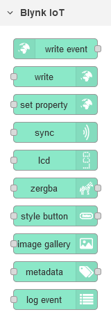
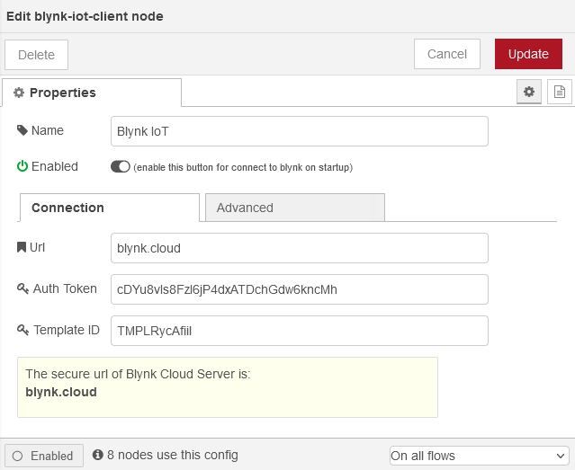
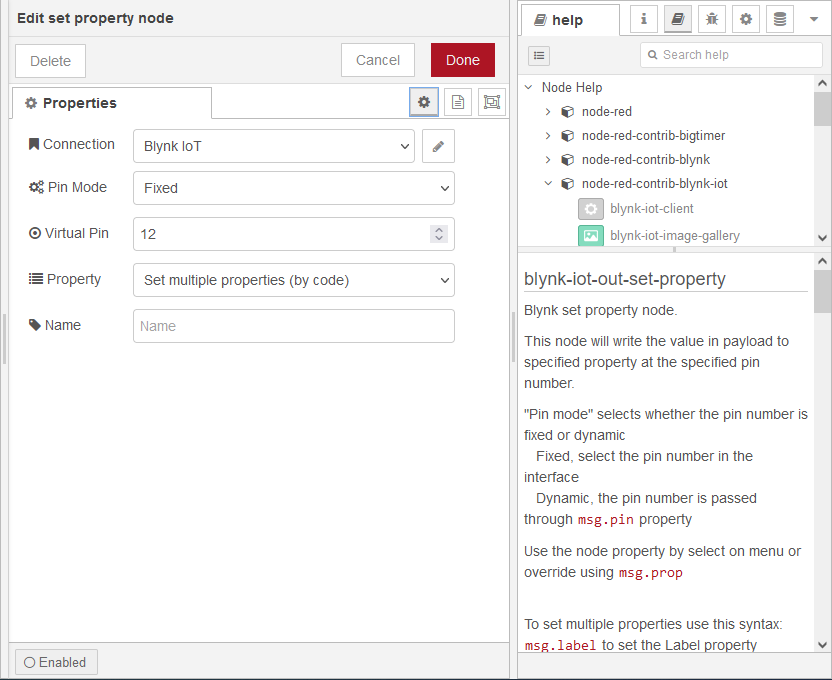
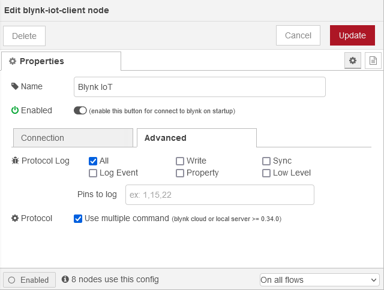

# node-red-contrib-blynk-iot   

https://github.com/gablau/node-red-contrib-blynk-iot

## Node-RED <-> Blynk IoT Platform

This library supports secure TLS connection to new Blynk IoT Platform cloud server. For Blynk cloud server, you can use **blynk.cloud** as the server url. Local server is not yet supported. Do not work on old Blynk 0.1 legacy platform. If you installed Node Red globally use this command to install `npm install --global node-red-contrib-blynk-iot`

### Supported events, commands and widgets

**Events:** write
 **Commands:** write, sync (virtual/all), set property, metadata (get/set), log event
 **Widgets:** LCD, zeRGBa, styled button, image gallery

### Changelog

See the [changelog](https://github.com/gablau/node-red-contrib-blynk-iot/blob/master/CHANGELOG.md) for all the details of each releases

### Node-RED palette

[](https://github.com/gablau/node-red-contrib-blynk-iot/blob/master/docs/img/blynk-palette.png)

### Blynk App Settings

Use Raspberry PI as hardware to access 256 virtual pins or Generic Board for 32.

### How to use

Встановіть URL-адресу сервера blynk, маркер автентифікації та ідентифікатор шаблону у вузлі конфігурації

[](https://github.com/gablau/node-red-contrib-blynk-iot/blob/master/docs/img/readme-config-connection.png)

See **help** panel on every nodes

[](https://github.com/gablau/node-red-contrib-blynk-iot/blob/master/docs/img/readme-info-panel.png)

### Debug

Використовуйте прапорець `-v` під час запуску Node-RED, щоб отримати більше інформації, або використовуйте `node-red-log` і увімкніть вхід у вузол конфігурації за потреби

[](https://github.com/gablau/node-red-contrib-blynk-iot/blob/master/docs/img/readme-config-advanced.png)

## set property

Blynk встановити вузол властивостей. Цей вузол записуватиме значення в корисне навантаження до вказаної властивості за вказаним номером PIN.

«Режим PIN» вибирає, чи буде PIN фіксованим чи динамічним

- Виправлено, виберіть пін в інтерфейсі

- Динамічний, пін передається через властивість ` msg.pin`

Використовуйте властивість вузла, вибравши її в меню, або замініть за допомогою `msg.prop`

Щоб встановити кілька властивостей, використовуйте цей синтаксис:
    `msg.label` to set the Label property
    `msg.color` to set the color property
    `msg.onlabel` to set the onLabel property (only Button and Styled Button widget)
    `msg.offlabel` to set the offLabel property (only Button and Styled Button widget)
    `msg.onColor` to set the onColor property (only Styled Button widget)
    `msg.offColor` to set the offColor property (only Styled Button widget)
    `msg.onBackColor` to set the onBackColor property (only Styled Button widget)
    `msg.offBackColor` to set the offBackColor property (only Styled Button widget)
    `msg.labels` to set the Labels property (only Menu widget)
    `msg.isonplay` to set the isOnPlay property (only Media Player widget)
    `msg.url` to set the url property (only Video Straming widget)
    `msg.step` to set the step property (only Step Control widget)
    `msg.maximumFractionDigits` to set the maximumFractionDigits property (only Slider widget)
    `msg.opacity` to set opacity in range 0-100% (only Image Gallery widget)
    `msg.scale` to set scale in range 0-100% (only Image Gallery widget)
    `msg.rotation` to set rotation in range 0-360 degree (only Image Gallery widget)
    `msg.url` and `msg.imgid` to load url to specific image index (only Image Gallery widget)
    `msg.urls` (array of string) to load images on gallery widget (only Image Gallery widget)

### ALL WIDGETS

Two widget properties are supported - `color`, `label` for all widgets : 

`label` is string for label of all widgets.

`color` is string in [HEX](http://www.w3schools.com/html/html_colors.asp) format (in the form: #RRGGBB,     where RR (red), GG (green) and BB (blue) are hexadecimal values between 00 and FF). For example :

```
    #define BLYNK_GREEN     "#23C48E"
    #define BLYNK_BLUE      "#04C0F8"
    #define BLYNK_YELLOW    "#ED9D00"
    #define BLYNK_RED       "#D3435C"
    #define BLYNK_DARK_BLUE "#5F7CD8"
```

### Widget specific

Widget specific properties: 

**Button and Styled Button**

`onLabel` is string for ON label of button;

`offLabel` is string for OFF label of button;

**Styled Button**

`onColor` is the color of label for ON state of styled button;

`offColor`is the color of label for OFF state of styled button;

`onBackColor` is the background color for ON state of styled button;

`offBackColor`is the background color for OFF state of styled button;

**Menu**

`labels` is list of strings for Menu widget selections (array expected: `["Labels 1","Labels 2","Labels 3"]`);

```
Blynk.setProperty(V0, "labels", "label 1", "label 2", "label 3");
```

**Music Player**

`isOnPlay` is boolean accepts true/false.

```
Blynk.setProperty(V0, "isOnPlay", "true");
```

**Video Straming**

`url` is a string URL of streaming.

```
Blynk.setProperty(V0, "url", "http://my_new_video_url");
```

**Step Control**

`step` is a integer value of step.

```
Blynk.setProperty(V0, "step", "5");
```

**Slider**

`maximumFractionDigits` is a integer value of decimals digits.

**Image Gallery**

`opacity` to set opacity in range 0-100%

`scale` to set scale in range 0-100%

`rotation` to set rotation in range 0-360 degree