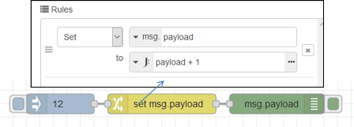
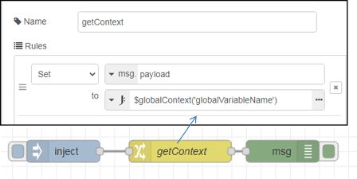
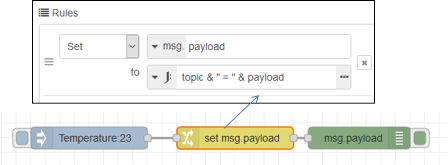
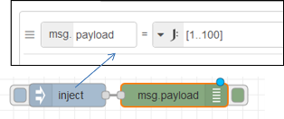

[<- На головну](../)

# 11. Робота з JSONata 

## Вступ до JSONata 

[JSONata](https://jsonata.org/) — це мова запитів і перетворення даних JSON, яка була розроблена за натхнення семантики XPath в XML. JSONata дозволяє виражати складні запити на вибірку в компактній та інтуїтивно зрозумілій нотації. Основна ідея в тому щоб з вихідних даних JSON отримати необхідні дані, перетворити їх у потрібну форму (об'єднати, скомпонувати) і видати результат. Для підтримки вилучення значень зі структури JSON означений синтаксис шляху розташування. Це дозволяє вибрати всі можливі значення в документі, які відповідають вказаному шляху розташування (location path). 

Для розуміння роботи JSONata можна перевірити наведені приклади, перейшовши на сайт http://try.jsonata.org/ . У вікні ліворуч можна вибрати приклад вихідного документу зі списку, або вписати свій. У якості типового прикладу в лекції буде використовуватися Address.

### Прості запити на вибірку

У якості прикладу розглянемо наступний вихідний документ (вибирається на  http://try.jsonata.org/ як Address):

```json
{
  "FirstName": "Fred",
  "Surname": "Smith",
  "Age": 28,
  "Address": {"Street": "Hursley Park", "City": "Winchester", "Postcode": "SO21 2JN"},
  "Phone": [
    {"type": "home", "number": "0203 544 1234"},
    {"type": "office", "number": "01962 001234"},
    {"type": "office","number": "01962 001235"},
    {"type": "mobile","number": "077 7700 1234"}
  ],
  "Email": [
    {"type": "work", "address": ["fred.smith@my-work.com", "fsmith@my-work.com"]},
    {"type": "home", "address": ["freddy@my-social.com", "frederic.smith@very-serious.com"]}
  ],
  "Other": { "Over 18 ?": true, "Misc": null, "Alternative.Address": { "Street": "Brick Lane", "City": "London", "Postcode": "E1 6RF"}
  }
}
```

Для вказівки шляху розташування необхідно використовувати синтаксис пошуку об'єктів, їх властивостей, масивів та їх елементів. Пошук починається з кореневого об'єкту, до якого за необхідності можна звернутися через `$$`. Тому, якщо в шляху вказати якесь слово, буде шукатися властивість в кореневому об'єкті. Якщо потрібно знайти щось у включеному об'єкті, то необхідно прописати шлях доступу до нього. Якщо потрібно вказати елемент масиву, до нього йде звернення аналогічно як в JS, наприклад `Phone[0]`. Якщо звернення йде до назви масиву, або не вказується індекс, повертаються усі елементи масиву. Негативне значення індексу в масиві шукає значення відраховане з кінця, наприклад `arr[-1]` бере останній елемент, а `arr[-2] ` - бере передостанній.  При пошуку полів з пробілами вони вказуються в спеціальних лапках ` `` `.    

У таблиці 1 показні прості приклади задавання пошуку в ``JSONata``. 

Таблиця 1.

| **JSONata**       | **Result**                                       |
| ----------------- | ------------------------------------------------ |
| `Surname`         | `"Smith"`                                        |
| `Age`             | `28`                                             |
| `Age[0]`          | `28`                                             |
| `Address.City`    | `"Winchester"`                                   |
| `Other.Misc`      | `null`                                           |
| `Other.Over 18 ?` | `true`                                           |
| `Phone[0]`        | `{ "type": "home", "number": "0203 544 1234" }`  |
| `Phone[-2]`       | `{ "type": "office", "number": "01962 001235" }` |
| `Phone[8]`        | *undefined*                                      |
| `Phone[0].number` | `"0203 544 1234"`                                |

Слід зазначити, що пошук відбувається рекурсивно. Тобто, якщо задати в пошуку назву масиву об'єктів, і при цьому звертатися до властивості цих об'єктів, то результатом буде масив властивостей усіх елементів масиву. Це можна представляти так: спочатку пошук поверне масив усіх об'єктів, а потім зробить пошук у кожному елементі потрібних властивостей і поверне їх в цьому масиві замість всього об'єкту. У таблиці 2 показаний приклад такого звернення `Phone.number`.

За цією ж ідеєю можна звернутися до елементу з поверненого результату. У таблиці 2 показаний приклад такого звернення `(Phone.number)[0]`, який можна пояснити так:

- вибираємо усі елементи `Phone` -> масив об'єктів `Phone` 
- вибираємо з кожного елементу `Phone` властивість `number` -> масив `Phone.number` 
- вибираємо 0-й елемент з `Phone.number` 

Але зверніть увагу, що в даному прикладі `Phone.number` треба поставити в дужки `()` для пріоритизації послідовності пошуку. Інакше, якщо звернутися як `Phone.number[0]`, то алгоритм буде наступний:

- вибираємо усі елементи `Phone` -> масив об'єктів `Phone` 
- вибираємо з кожного елементу `Phone` властивість `number[0]` -> масив `Phone.number` 

Хоч `number` в `Phone` не є формально масивом, звернення до 0-го елементу аналогічно зверненню до самого елементу. Тобто у виразі або підвиразі JSONata будь-яке значення яке не є масивом і масив, що містить тільки це значення, вважаються еквівалентними. Це дозволяє складати композицію таким чином, щоб шляхи розташування, які витягують одне значення з об'єктів і шляхи розташування, які витягують декілька значень з масивів, можуть бути використані як вхідні дані для інших виразів без використання іншого синтаксису для двох форм. 

Таблиця 2.

| **JSONata**         | **Result**                                                   |
| ------------------- | ------------------------------------------------------------ |
| `Phone.number`      | `[ "0203 544 1234", "01962 001234", "01962 001235", "077 7700 1234" ]` |
| `(Phone.number)[0]` | `"0203 544 1234"`                                            |
| `Phone.number[0]`   | `[ "0203 544 1234", "01962 001234", "01962 001235", "077 7700 1234" ]` |

На кожному рівні такого пошуку ми маємо певний результат, який називається контекстом і позначається як `$` . На самому початку контекстом є весь документ, і як вже зазначалося, він має також спеціальне позначення `$$`. Це легко перевірити, вписавши ці символи в  http://try.jsonata.org/ . Обидві ці системні змінні можна використовувати для організації складніших запитів. Однак, коли кореневим елементом є масив, звернутися до його елементу можна тільки через них.   

Візьмемо приклад:

```json
[{ "ref": [ 1,2 ] },{ "ref": [ 3,4 ] }]
```

Якщо ми хочемо вибрати перший (0-й) об'єкт у цьому масиві, то необхідно вказати назву об’єкту верхнього рівня, до якого треба додати [0]. Ми не можемо використовувати [0] самостійно, тому що стикаємося з синтаксисом конструктора масиву. Однак, ми можемо використовувати посилання контексту `$` для посилання на початок документа наступним чином (таблиця 3)

Таблиця 3.

| **JSONata**     | **Result**           | **Коментар**                                                 |
| --------------- | -------------------- | ------------------------------------------------------------ |
| `$[0]`          | `{ "ref": [ 1,2 ] }` | `$` на початку виразу відноситься до всього вхідного документа |
| `$[0].ref`  ` ` | `[ 1,2 ] `  ` `      | `.ref` тут повертає  весь внутрішній масив                   |
| `$[0].ref[0]`   | `1`                  | повертає елемент на  першу позицію внутрішнього масиву       |
| `$.ref`         | `[ 1, 2, 3, 4 ]`     | Незважаючи на  структуру вкладеного масиву, результуючий вибір сплющується в один плоский  масив. Початкова вкладена структура вхідних масивів втрачається. |

### Предикативні запити 

На будь-якому кроці шляху розташування виділені елементи можуть бути відфільтровані за допомогою **предиката** - `[expr]`, де `expr` аналізується як вираз, що повертає булеве значення. Кожен елемент у виділенні перевіряється як вираз, якщо він дорівнює `true`, то елемент залишається у виділенні, якщо `false`, він видаляється з виділення. Вираз оцінюється відносно поточного (контекстного) елемента, що перевіряється, тому, якщо вираз предиката виконує навігацію, то вона проводиться відносно цього контексту. У таблиці 11.4 показні приклади предикатів. Можна перевірити ці приклади, перейшовши на сайт `http://try.jsonata.org/ (виберіть приклад Address).

Приклад:

```json
{"Phone": [
    {"type": "home", "number": "0203 544 1234"},
    {"type": "office","number": "01962 001234"},
    {"type": "office","number": "01962 001235"},
    {"type": "mobile","number": "077 7700 1234"}]
}
```

Таблиця 4.

| **JSONata**                      | **Result**                                        |
| -------------------------------- | ------------------------------------------------- |
| `Phone[type='mobile'] `          | `{"type": "mobile", "number": "077 7700 1234" } ` |
| `Phone[type='mobile'].number`    | `"077 7700 1234"`                                 |
| `Phone[type='office'].number`` ` | `["01962 001234", "01962 001235"] `               |

Як вже зазначалося у виразі або підвиразі JSONata будь-яке значення (яке не є масивом) і масив, що містить тільки це значення, вважаються еквівалентними.  Наприклад (див вихідний текс JSON вище):

- `Address.City` повертає `"Winchester"`
- `Phone[0].number`  повертає `"0203 544 1234"`
- `Phone[type='home'].number`  повертає `"0203 544 1234"`
- `Phone[type='office'].number` повертає`["01962 001234", "01962 001235"]`

При наступній обробці поверненого з вираження JSONata значення, може бути бажаним мати результати в узгодженому форматі, незалежно від того, скільки співпадінь було і відповідно який формат поверненого значення (масив або одне значення). У перших двох виразах вище, очевидно, що кожен вираз звертається до одного значення в структурі і має сенс повернути саме це значення. В останніх двох виразах, однак, не є очевидним, скільки значень буде повернено, тому при наступній обробці прийдеться враховувати різні формати, що не є зручним. Для таких випадків вираз можна змінити таким чином, щоб повернути масив, навіть якщо збігається лише одне значення. Це робиться шляхом додавання порожніх квадратних дужок `[]` до кроку в шляху розташування. Наведені вище приклади можуть бути переписані так, щоб завжди повертати масив, це виглядає наступним чином:

- `Address[].City` повертає `[ "Winchester"]`
- `Phone[0][].number` повертає `[ "0203 544 1234" ]`
- `Phone[][type='home'].number` повертає `[ "0203 544 1234" ]`
- `Phone[type='office'].number[] `повертає `[ "01962 001234", "01962 001235" ]`

Зауважимо, що `[]` можна розмістити у будь-якому місці предикатів і на будь-якому кроці вираження шляху

Для вибору всіх полів в об'єкті можна використовувати `*` замість імені поля. У таблиці 5 показні приклади предикату `*`. Можна перевірити ці приклади, перейшовши на сайт http://try.jsonata.org/ (виберіть приклад Address). Приклад:

```json
{
  "FirstName": "Fred",
  "Surname": "Smith",
  "Age": 28,
  "Address": {
    "Street": "Hursley Park",
    "City": "Winchester",
    "Postcode": "SO21 2JN"
  }
}
```

 Таблиця 5.

| **JSONata**   | **Result**                                      |
| ------------- | ----------------------------------------------- |
| `Address.*`   | `[ "Hursley Park", "Winchester", "SO21 2JN" ] ` |
| `*.Postcode ` | `"SO21 2JN" `                                   |

Шаблон нащадка `**` замість `*` буде відбирати всіх нащадків (багаторівневий шаблон). Для прикладу з таблиці 1 

`**.Postcode` поверне `[ "SO21 2JN", "E1 6RF" ]`

### Вирази та оператори

У виразах шляху можна використовувати літеральні константи, помістивши символи в лапки: подвійні `"` або одинарні `'` (як і рядки JSON). Рядки можна комбінувати за допомогою оператора конкатенації `&`, цей оператор поєднує два рядки, які повертаються виразами. Це єдиний оператор, який намагатиметься збирати операнди разом до очікуваного рядкового типу. У таблиці 6 показні приклади оператору `&`. Можна перевірити ці приклади, перейшовши на сайт http://try.jsonata.org/ (виберіть приклад Address).  Приклад:

```json
{
  "FirstName": "Fred",
  "Surname": "Smith",
  "Age": 28,
  "Address": {
    "Street": "Hursley Park",
    "City": "Winchester",
    "Postcode": "SO21 2JN"
  }
}
```

Таблиця 11.6.

| **JSONata**                       | **Result**                    |
| --------------------------------- | ----------------------------- |
| `FirstName & ' ' & Surname`       | `"Fred Smith" `               |
| `Address.(Street & ', ' & City) ` | `"Hursley Park, Winchester" ` |
| `5&0&true `                       | `"50true"`                    |

Вирази шляхів, які вказують на числове значення, повернуть це значення як числовий тип. JSONata також може використовувати числові контстанти за тими ж правилами, що і для JSON-чисел. Числові літетерали та вирази можуть бути використані в розрахунках результатів з використанням звичайних математичних операторів. Підтримувані оператори:

- `+` додавання
- `-` віднімання
- `*` множення
- `/` ділення
- `%` остача від ділення 

У таблиці 11.7 показні приклади арифметичних операторів. Можна перевірити ці приклади, перейшовши на сайт `http://try.jsonata.org/ (скопіюйте приклад в поле Exerciser).   Приклад:

  ```json
{ "Numbers": [1, 2.4, 3.5, 10, 20.9, 30] }
  ```

Таблиця 11.7.

| **JSONata**                 | **Result**       | **Коментар**       |
| --------------------------- | ---------------- | ------------------ |
| `Numbers[0] + Numbers[1]`   | `3.4`            | додати 2 числа     |
| `Numbers[0] - Numbers[4]`   | `-19.9`          | віднімання         |
| `Numbers[0] * Numbers[5]`   | `30`             | множення           |
| `Numbers``[0] / Numbers[4]` | 0.04784688995215 | ділення            |
| `Numbers``[2] % Numbers[5]` | 3.5              | остача від ділення |

В предикатах можна використоувати оператори порівняння двох значень, які повертають логічні значення `true` або `false`. Підтримувані оператори:

- `=` дорівнює
- `!=` не дорівнює
- `<` менше ніж
- `<=` менше ніж чи дорівнює
- `>` більше ніж
- `>=` більше або дорівнює ніж
- `in` значення міститься в масиві

Для об'єднання булевих результатів для підтримки більш складних предикатних виразів можна використати булеві оператори:

- `and`
- `or`

Зверніть увагу, що `not` підтримується як функція ([$not](http://docs.jsonata.org/boolean-functions#not)), а не оператор. У таблиці 11.8 показні приклади булевих виразів. Можна перевірити ці приклади, перейшовши на сайт `http://try.jsonata.org/ (скопіюйте приклад в поле Exerciser). Таблиця 11.8.

```json
{"Numbers": [1, 2.4, 3.5, 10, 20.9, 30]}
```

| **JSONata**                                         | **Result** |
| --------------------------------------------------- | ---------- |
| `(Numbers[2]  != 0) and (Numbers[5] != Numbers[1])` | *false*    |
| `(Numbers[2]  != 0) or (Numbers[5] = Numbers[1])`   | *true*     |

### Структурування результату 

Окрім вибірки значень JSONata дає можливість компонування кількох результатів в один масив або об'єкт.

Як зазначалося раніше, якщо шлях розташування у вхідному документі відповідає декільком значенням, ці значення повертаються як масив. Значення у документі можуть бути як об'єктами так і масивами, але значення що повертаються знаходяться на верхньому рівні у вигляді масиву.

Можна побудувати додаткову структуру в результуючому масиві, вказавши у виразі шляху розташування конструктор масивів (або об'єктів). У будь-якій точці шляху розташування, де очікується посилання на поле, можна вставити пару квадратних дужок `[]`, щоб вказати, що результати вираження в цих дужках повинні міститися в новому масиві на виході. Коми використовуються для розділення декількох виразів у конструкторі масиву. У таблиці 11.9 показні приклади конструкторів масивів. Можна перевірити ці приклади, перейшовши на сайт `http://try.jsonata.org/ (виберіть приклад Address).   

```json
{
  "FirstName": "Fred",
  "Surname": "Smith",
  "Age": 28,
  "Address": {"Street": "Hursley Park", "City": "Winchester", "Postcode": "SO21 2JN"},
  "Email": [
    {"type": "work","address": ["fred.smith@my-work.com", "fsmith@my-work.com"]},
    {"type": "home","address": ["freddy@my-social.com", "frederic.smith@very-serious.com"]}
  ],
  "Other": {"Over 18 ?": true,"Misc": null, "Alternative.Address": {"Street": "Brick Lane","City": "London", "Postcode": "E1 6RF"}}
}
```

Таблиця 11.9.

| **JSONata**                                                  | **Result**                                                   | **Коментар**                                                 |
| ------------------------------------------------------------ | ------------------------------------------------------------ | ------------------------------------------------------------ |
| `Email.address `                                             | `[   "fred.smith@my-work.com",   "fsmith@my-work.com",   "freddy@my-social.com", "frederic.smith@very-serious.com"  ]` | Чотири адреси електронної пошти повертаються в плоскому масиві |
| `Email.[address]`                                            | `[  [ "fred.smith@my-work.com", "fsmith@my-work.com" ],  [ "freddy@my-social.com", "frederic.smith@very-serious.com" ]  ]` | Кожен об'єкт  електронної пошти генерує масив адрес          |
| `[Address, Other.Alternative.Address].City` ` | `[ "Winchester", "London" ]`                                 | Вибирає значення `City`   як з об’єкту `Address`  так і з `Alternative.Address`. |                                                              |                                                              |

Подібно до того, як можна побудувати масиви, так само можуть бути побудовані на виході об'єкти JSON. У будь-якій точці шляху розташування, де очікується посилання на поле, можна використати пару фігурних дужок `{}`, що містять пари ключ/значення, розділені комами, з кожним ключем і значенням, розділеними двокрапкою: `{key1: value2, key2: value2}`. Ключі та значення можуть бути літералами або можуть бути виразами. Ключ повинен бути або рядком, або виразом, який оцінюється до рядка.               

Коли за виразом, що вибирає кілька значень, йде конструктор об'єктів, той створить єдиний об'єкт з парою ключ/значення для кожного з цих значень контексту. Якщо потрібний масив об'єктів (один для кожного значення контексту), то конструктор об'єкта повинен  слідувати за точкою `.` . У таблиці 10 показні приклади конструкторів об’єктів. Можна перевірити ці приклади, перейшовши на сайт `http://try.jsonata.org/ (виберіть приклад Address).

```json
{"Phone": [
    {"type": "home", "number": "0203 544 1234"},
    {"type": "office","number": "01962 001234"},
    {"type": "office","number": "01962 001235"},
    {"type": "mobile", "number": "077 7700 1234"}]
}
```

Таблиця 11.10.

| **JSONata**                | **Result**                                                   | **Коментар**                                                 |
| -------------------------- | ------------------------------------------------------------ | ------------------------------------------------------------ |
| `Phone.{type: number} `    | `[   { "home": "0203 544 1234" },    { "office": "01962 001234" },    { "office": "01962 001235" },    { "mobile": "077 7700 1234" }   ]` | Створює масив об'єктів (по одному для кожного телефону).     |
| `Phone{type: number}`  ` ` | `{   "home": "0203 544 1234",   "office": [    "01962 001234",    "01962 001235"   ],   "mobile": "077 7700 1234"  }`  ` ` | Об'єднує пари ключ/значення  в один об'єкт. Докладніше див.` [Grouping using object key expression](http://docs.jsonata.org/sorting-grouping) |
| `Phone{type: number[]} `   | `{   "home": [    "0203 544 1234"   ],   "office": [    "01962 001234",    "01962 001235"   ],   "mobile": [    "077 7700 1234"   ]  }`  ` ` | Об'єднує пари ключ/значення  в один об'єкт. У цьому випадку для узгодженості всі числа групуються в  масиви. Див. [Singleton array and value   equivalence](http://docs.jsonata.org/predicate#singleton-array-and-value-equivalence). |

### Інші можливості

JSONata дуже багата мова. Тут оглядово наведемо деякі інші її можливості. 

У JSONata все є виразами (*expression*). Вираз містить значення (*values*), функції (*functions*) та оператори (*operators*), які при оцінюванні (*evaluated*) виробляють результуюче значення. Функції та оператори застосовуються до тих значень, які в свою чергу самі можуть бути результатами оцінювання під-виразів. Таким чином, мова передбачає складені (ієрархічні) вирази. У виразах JSONata можуть бути використані коментарі з використанням синтаксису стилю мови «C».

JSONata підтримує умовні конструкції подібно до JS:

```json
predicate ? expr1 : expr2
```

Будь які назви, що починаються з знаку `$` є змінними. Змінна – це поіменоване посилання на значення. Значення може бути одним із будь-яких типів серед системних типів. Є також вбудовані в JSONata змінні:

- `$` - змінна без імені посилається на значення контексту у будь якій точці вхідної ієрархії JSON.
- `$$` - корінь входу JSON. Тільки потребується у випадках для виходу з теперішнього контексту для     тимчасового переходу вниз в інший шлях. Наприклад для перехресного посилання     або об’єднання даних.  

Окрім операторів JSONata має багато різноманітних вбудованих функцій, які як і змінні також починаються з символу `$`. Зокрема доступні функції для роботи з рядками, числами, об'єктами, масивами, датою/часом, агрегування та іншими. Можна створювати власні функції, які можуть бути збережені в змінних подібно іншим типам.  Підтримуються регулярні вирази.

Ось приклад програми на JSONata яка навіть не потребує вхідних даних. Можна спробувати його на https://try.jsonata.org/

```json
/* Довгі вирази можуть потребувати певного пояснення */
(
  $pi := 3.1415926535897932384626;
  /* JSONata не відомий своєю підтримкою графіки! */
  $plot := function($x) {(
    $floor := $string ~> $substringBefore(?, '.') ~> $number;
    $index := $floor(($x + 1) * 20 + 0.5);
    $join([0..$index].('.')) & 'O' & $join([$index..40].('.'))
  )};
  /* Факторіал — це добуток цілих чисел 1..n */
  $product := function($a, $b) { $a * $b };
  $factorial := function($n) { $n = 0 ? 1 : $reduce([1..$n], $product) };
  $sin := function($x){ /* визначає синус через косинус */
    $cos($x - $pi/2)
  };
  $cos := function($x){ /* Виводить косинус шляхом розкладання в ряд Тейлора */
    $x > $pi ? $cos($x - 2 * $pi) : $x < -$pi ? $cos($x + 2 * $pi) :
      $sum([0..12].($power(-1, $) * $power($x, 2*$) / $factorial(2*$)))
  };
  [0..24].$sin($*$pi/12).$plot($)
)
```

## Доступ до об'єктів `Node-RED`

JSONata використовується в багатьох вузлах Node-RED. У якості вхідних даних для JSONata є змінна повідомлення `msg`, яка розглядається як вхідний документ JSON. Тому до властивостей об'єкта `msg` доступаються безпосередньо через імена, наприклад `msg.payload` доступний просто як `payload`. Наприклад, у наступному прикладі у вихідний `msg.payload` записується значення вхідного `msg.payload` збільшеного на 1. 



JSONata проводить послідовні розрахунки відповідно до вказаного виразу. Після кожного розрахунку результат знаходиться в певній контекстній змінній (називатимо розрахунковий контекст), який можна використовувати в наступних розрахунках. Як вже зазначалося вище звернутися до контексту можна через знак  `$`. Перед початком розрахунків в контексті знаходиться вхідний документ, тобто `msg`, тому звертатись до нього можна через  `$`. Тобто, якщо потрібно отримати доступ до всього об'єкту `msg` на верхньому рівні виразу, можна використовувати змінну `$` . Наприклад `$._msgid` поверне унікальний ідентифікатор повідомлення. Якщо звертання йде всередині розрахунку, то розрахунковий контекст буде містити проміжні результати, тому при необхідності оцінювання вхідного документу до нього звертаються через подвійний "долар" `$$` 

З символу  `$` починаються також усі функції JSONata та змінні користувача. Останні використовуються тоді, коли є необхідність писати не просто вирази а підпрограми на мові JSONata. Див. [Програмні конструкції](program.md).    

У розрахунках можна також використовувати літеральні константи у форматі JavaScript, значення глобального контексту та контексту потоку, значення змінної середовища та комбінацію всього перерахованого. 

Аналогічно як Java Script через крапку можна доступатися до полів властивостей будь якого рівня вкладеності, а через `[]` до індексу масиву. Однак в JSONata квадратні дужки використовуються також для позначення умови пошуку (**предикату**). 

Якщо результат треба перетворити в інший вигляд, використовуються конструктори масивів (`[]`)  та об'єктів (`{}`). Так наступне повідомлення сформує обєкт з двома полями, в одне запише `payload` вхідного повідомлення, а в інше - `topic`.

```json
{"value" : payload , "name" : topic }
```

 А у цьому прикладі сформується масив:

```json
[payload , topic]
```

Доступ до контекстів потоку та глобального контексту можна робити через відповідні функції. Доступ до глобального контексту відбувається через вбудовану у Node-RED JSONata функцію `$globalContext()` в якій вказується назва змінної та за необхідності сховище (другим аргументом). Наприклад, наступний приклад доступається до змінної глобального контексту з іменем  'globalVariableName'.



Аналогічно попередній, функція `$flowContext()` доступається до контексту потоку.

## Вирази (огляд)

Для рядків у JSONata можна використовувати оператор конкатенації  `&`. Наприклад у наступному прикладі якщо вхідний  `msg.payload=23` а `msg.topic='Temperature'` то вихідний `msg.payload` дорівнюватиме `Temperature = 23`.   



Числові літетерали та вирази можуть бути використані в розрахунках результатів з використанням звичайних математичних операторів:

- `+` додавання
- `-` віднімання
- `*` множення
- `/` ділення
- `%` остача від ділення 
- `..` (Range) означення діпазону

На наступному прикладі на виході `msg.payload` формується масив елементів зі значеннями від 1 до 100.  




Можна використовувати оператори порівняння двох значень, які повертають логічні значення `true` або `false`: 

- `=` дорівнює
- `!=` не дорівнює
- `<` менше ніж
- `<=` менше ніж чи дорівнює
- `>` більше ніж
- `>=` більше або дорівнює ніж
- `in` значення міститься в масиві

Для логічного об'єднання булевих результатів використовуються оператори `and` та `or`. Зверніть увагу, що булеве `not` підтримується як окрема функція ([$not](http://docs.jsonata.org/boolean-functions#not)), а не як оператор.

Ось ще кілька прикладів:

```json
[1..3, 7..9] => [1, 2, 3, 7, 8, 9] 
[1..$count(Items)].("Item " & $) => ["Item 1","Item 2","Item 3"]
[1..5].($*$) => [1, 4, 9, 16, 25]
```

## Оператори шляху

[Джерело](https://docs.jsonata.org/path-operators)

| Оператор                                                     | Пояснення                                                    | Приклад |
| ------------------------------------------------------------ | ------------------------------------------------------------ | ------- |
| [`.` (Map)](https://docs.jsonata.org/path-operators#-map)    | Вираз оцінюється для отримання масиву значень. Якщо це буде одне значення, воно трактується як еквівалент масиву, що містить це єдине значення. Якщо порожній масив, то результат вираження оператора - це nothing<br />For each value in the LHS array in turn: The value is known as the *context* and is used as the basis for any relative path expression on the RHS.  It is also accessible in the RHS expression using the `$` symbol. The RHS expression is evaluated to produce a value or array of  values (or nothing).  These values are appended to a combined array of  results for the operator as a whole.<br /><br />Для кожного значення в розрахованому масиві: Значення відоме як *контекст* і використовується як основа для будь-якого відносного вираження контуру на RHS. Він також доступний у виразі RHS, використовуючи символ `$`. Експресія RHS оцінюється для отримання значення або масиву значень (або нічого). Ці значення додаються до комбінованого масиву результатів для оператора в ціломуThe combined result of the operator is returned. |         |
| [`[` ... `]` (Filter)](https://docs.jsonata.org/path-operators#---filter) |                                                              |         |
| [`^(` ... `)` (Order-by)](https://docs.jsonata.org/path-operators#---order-by) |                                                              |         |
| [`{` ... `}` (Reduce)](https://docs.jsonata.org/path-operators#---reduce) |                                                              |         |
| [`*` (Wildcard)](https://docs.jsonata.org/path-operators#-wildcard) |                                                              |         |
| [`**` (Descendants)](https://docs.jsonata.org/path-operators#-descendants) |                                                              |         |
| [`%` (Parent)](https://docs.jsonata.org/path-operators#-parent) |                                                              |         |
| [`#` (Positional variable binding)](https://docs.jsonata.org/path-operators#-positional-variable-binding) |                                                              |         |
| [`@` (Context variable binding)](https://docs.jsonata.org/path-operators#-context-variable-binding) |                                                              |         |

## Перелік функцій

Опис функцій українською доступний в окремому [розділі](functions.md) тут наведений тільки перелік та короткий опис.

#### Додаткові функції Node-RED

- [`$env`]() - зчитує змінну середовища з вказаним іменем
- [`$flowContext`](recipes.md#доступ-до-глобального-контексту) - доступається до контексту потоку
- [`$globalContext`](recipes.md#доступ-до-контексту-потоку) - доступається до глобального контексту
- [`$clone`](recipes.md#відтворення-повідомлення-в-msg-payload) - клонує об'єкт  

#### String functions

- [`$string()`](http://docs.jsonata.org/string-functions#string)

- [`$length()`](http://docs.jsonata.org/string-functions#length)

- [`$substring()`](http://docs.jsonata.org/string-functions#substring)

- [`$substringBefore()`](http://docs.jsonata.org/string-functions#substringbefore)

- [`$substringAfter()`](http://docs.jsonata.org/string-functions#substringafter)

- [`$uppercase()`](http://docs.jsonata.org/string-functions#uppercase)

- [`$lowercase()`](http://docs.jsonata.org/string-functions#lowercase)

- [`$trim()`](http://docs.jsonata.org/string-functions#trim)

- [`$pad()`](http://docs.jsonata.org/string-functions#pad)

- [`$contains()`](http://docs.jsonata.org/string-functions#contains)

- [`$split()`](http://docs.jsonata.org/string-functions#split)

- [`$join()`](http://docs.jsonata.org/string-functions#join)

- [`$match()`](http://docs.jsonata.org/string-functions#match)

- [`$replace()`](http://docs.jsonata.org/string-functions#replace)

- [`$eval()`](http://docs.jsonata.org/string-functions#eval)

- [`$base64encode()`](http://docs.jsonata.org/string-functions#base64encode)

- [`$base64decode()`](http://docs.jsonata.org/string-functions#base64decode)

- [`$decodeURL`](https://docs.jsonata.org/string-functions#decodeurl)

- [`$decodeURLComponent`](https://docs.jsonata.org/string-functions#decodeurlcomponent)

- [`$encodeURL`](https://docs.jsonata.org/string-functions#encodeurl)

- [`$encodeURLComponent`](https://docs.jsonata.org/string-functions#encodeurlcomponent)

#### Numeric functions

- [`$number()`](http://docs.jsonata.org/numeric-functions#number)
- [`$abs()`](http://docs.jsonata.org/numeric-functions#abs)
- [`$floor()`](http://docs.jsonata.org/numeric-functions#floor)
- [`$ceil()`](http://docs.jsonata.org/numeric-functions#ceil)
- [`$round()`](http://docs.jsonata.org/numeric-functions#round)
- [`$power()`](http://docs.jsonata.org/numeric-functions#power)
- [`$sqrt()`](http://docs.jsonata.org/numeric-functions#sqrt)
- [`$random()`](http://docs.jsonata.org/numeric-functions#random)
- [`$formatNumber()`](http://docs.jsonata.org/numeric-functions#formatnumber)
- [`$formatBase()`](http://docs.jsonata.org/numeric-functions#formatbase)
- [`$formatInteger()`](http://docs.jsonata.org/numeric-functions#formatinteger)
- [`$parseInteger()`](http://docs.jsonata.org/numeric-functions#parseinteger)

#### Numeric aggregation functions

- [`$sum()`](http://docs.jsonata.org/aggregation-functions#sum)
- [`$max()`](http://docs.jsonata.org/aggregation-functions#max)
- [`$min()`](http://docs.jsonata.org/aggregation-functions#min)
- [`$average()`](http://docs.jsonata.org/aggregation-functions#average)

#### Boolean functions

- [`$boolean()`](http://docs.jsonata.org/boolean-functions#boolean)
- [`$not()`](http://docs.jsonata.org/boolean-functions#not)
- [`$exists()`](http://docs.jsonata.org/boolean-functions#exists)

#### Array Functions

- [`$count()`](http://docs.jsonata.org/array-functions#count)
- [`$append()`](http://docs.jsonata.org/array-functions#append)
- [`$sort()`](http://docs.jsonata.org/array-functions#sort)
- [`$reverse()`](http://docs.jsonata.org/array-functions#reverse)
- [`$shuffle()`](http://docs.jsonata.org/array-functions#shuffle)
- [`$zip()`](http://docs.jsonata.org/array-functions#zip)
- [`$distinct`](https://docs.jsonata.org/array-functions#distinct)

#### Object functions

- [`$keys()`](http://docs.jsonata.org/object-functions#keys)
- [`$lookup()`](http://docs.jsonata.org/object-functions#lookup)
- [`$spread()`](http://docs.jsonata.org/object-functions#spread)
- [`$merge()`](http://docs.jsonata.org/object-functions#merge)
- [`$sift()`](http://docs.jsonata.org/object-functions#sift)
- [`$each()`](http://docs.jsonata.org/object-functions#each)
- [`$type()`](https://docs.jsonata.org/object-functions.html#type)
- [`$error()`](https://docs.jsonata.org/object-functions.html#error)

#### Date/Time functions

1. [`$now()`](http://docs.jsonata.org/date-time-functions#now)
2. [`$millis()`](http://docs.jsonata.org/date-time-functions#millis)
3. [`$fromMillis()`](http://docs.jsonata.org/date-time-functions#frommillis)
4. [`$toMillis()`](http://docs.jsonata.org/date-time-functions#tomillis)
5. [`$single`](https://docs.jsonata.org/higher-order-functions#single)

#### Higher order functions

- [`$map()`](http://docs.jsonata.org/higher-order-functions#map)
- [`$filter()`](http://docs.jsonata.org/higher-order-functions#filter)
- [`$reduce()`](http://docs.jsonata.org/higher-order-functions#reduce)
- [`$sift()`](http://docs.jsonata.org/higher-order-functions#sift)
- [`$single()`](https://docs.jsonata.org/higher-order-functions#single)

## Інші можливості

- [Приклад використання в застосунках Node-RED](examples.md)<span class="load"> </span>
- [Прості запити](simple.md)<span class="load"> </span>
- [Предикативні запити (Predicate Queries)](predicate.md) <span class="load"> </span>
- [Вирази](expression.md) <span class="load"> </span>
- [Структурування результату](structureresult.md) <span class="load"> </span>
- [Запити композиції (Query composition)](composition.md) <span class="load"> </span>
- [Сортування, групування і агрегація](sort.md)<span class="load"> </span> 
- [Програмні конструкції](program.md) 
- [Рецепти](recipes.md)


